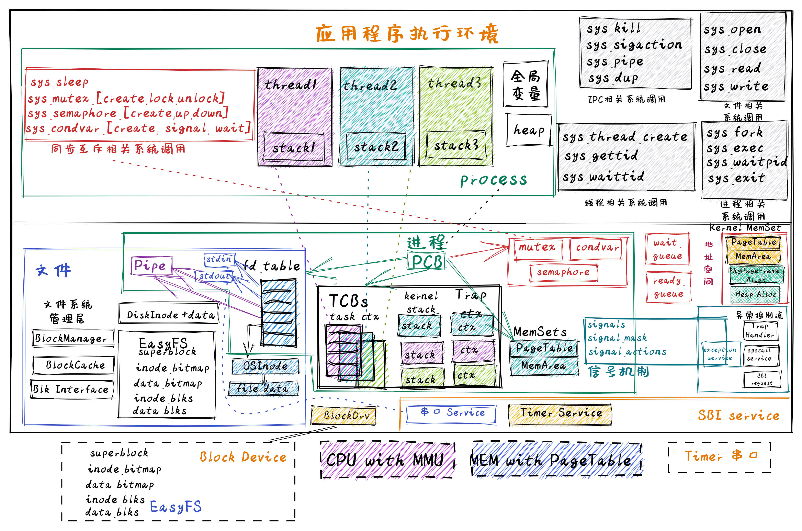

<!-- theme: gaia -->
<!-- _class: lead -->

# 操作系统课程-2022春
## 实践与实验介绍

<br>

向勇 陈渝 李国良 任炬

<br>

2022年春季

---
### 目标
让学生通过OS实践来深入地理解OS原理
- 硬件简单
- 软件简洁
- 循序渐进
- 理技结合
- 应用驱动
- 生物进化


---
### 策略
让学生通过OS实践来深入地理解OS原理
- 支持应用  -- OS功能扩展全来自于应用的需求
- 硬件简单  --  RISC-V 64 支持OS的最小硬件子集
- 软件简洁  --  采用Rust语言的抽象能力和高安全设计
- 循序渐进  --  随着知识点扩展来扩展OS实践
- 理技结合  --  原理的知识点与OS实践内容对应
- 生物进化  -- 实践逐步形成的多个OS类似生命进化中形成的各种生物
  
---
### 基本思路
    - 理解式学习：编写应用，并通过分析应用与OS的执行过程，掌握OS原理
    - 构造式学习：深入OS内部实现，参考/基于这些OS，扩展某些相对完整的OS功能
- 原理与实践结合
    - 提供十几个由简单到相对复杂功能进化的OS实例
    - 提供OS的详细设计实现文档、多种测试用例、自动测试环境
   -  课程上讲的OS原理和概念在实践或实验中基本上有对应
   -  分析原理和实践有共同点和差异点
   -  通过原理和实践来深化对操作系统全局与细节的理解

---
### 基本思路
**设计实现满足应用APP逐步递增需求的逐步进化的OS**
    1 LibOS: 让APP与HW隔离，简化应用访问硬件的难度和复杂性
    2 BatchOS： 让APP与OS隔离，加强系统安全，提高执行效率
    3 multiprog&time-sharing OS: 让APP共享CPU资源
    4 Address Space OS: 隔离APP访问的内存地址空间，加强APP间的安全
    5 Process OS: 支持APP动态创建新进程，增强进程管理和资源管理能力
    6 Filesystem OS：支持APP对数据的持久保存
    7 IPC OS：支持多个APP进程间数据交互与事件通知 
    8 Tread&Coroutine OS：支持线程和协程APP，简化切换与数据共享  
    9 SyncMutex OS：在多线程APP中支持对共享资源的同步互斥访问
    10 Device OS：提高APP的I/O效率和人机交互能力，支持基于外设中断的串口/块设备/键盘/鼠标/显示设备


---
### 基本思路
**30个系统调用**
```rust
const SYSCALL_DUP: usize = 24;
const SYSCALL_OPEN: usize = 56;
const SYSCALL_CLOSE: usize = 57;
const SYSCALL_PIPE: usize = 59;
const SYSCALL_READ: usize = 63;
const SYSCALL_WRITE: usize = 64;
const SYSCALL_EXIT: usize = 93;
const SYSCALL_SLEEP: usize = 101;
const SYSCALL_YIELD: usize = 124;
```
---
### 基本思路
**30个系统调用**
```rust
const SYSCALL_KILL: usize = 129;
const SYSCALL_SIGACTION: usize = 134;
const SYSCALL_SIGPROCMASK: usize = 135;
const SYSCALL_SIGRETURN: usize = 139;
const SYSCALL_GET_TIME: usize = 169;
const SYSCALL_GETPID: usize = 172;
const SYSCALL_FORK: usize = 220;
const SYSCALL_EXEC: usize = 221;
const SYSCALL_WAITPID: usize = 260;
```

---
### 基本思路
**30个系统调用**
```rust
const SYSCALL_KILL: usize = 129;
const SYSCALL_SIGACTION: usize = 134;
const SYSCALL_SIGPROCMASK: usize = 135;
const SYSCALL_SIGRETURN: usize = 139;
const SYSCALL_GET_TIME: usize = 169;
const SYSCALL_GETPID: usize = 172;
const SYSCALL_FORK: usize = 220;
const SYSCALL_EXEC: usize = 221;
const SYSCALL_WAITPID: usize = 260;
const SYSCALL_THREAD_CREATE: usize = 1000;
const SYSCALL_GETTID: usize = 1001;
const SYSCALL_WAITTID: usize = 1002;
```
---
### 基本思路
**设计实现满足应用APP逐步递增需求的逐步进化的OS**
```rust
const SYSCALL_MUTEX_CREATE: usize = 1010;
const SYSCALL_MUTEX_LOCK: usize = 1011;
const SYSCALL_MUTEX_UNLOCK: usize = 1012;
const SYSCALL_SEMAPHORE_CREATE: usize = 1020;
const SYSCALL_SEMAPHORE_UP: usize = 1021;
const SYSCALL_SEMAPHORE_DOWN: usize = 1022;
const SYSCALL_CONDVAR_CREATE: usize = 1030;
const SYSCALL_CONDVAR_SIGNAL: usize = 1031;
const SYSCALL_CONDVAR_WAIT: usize = 1032;
```


---
### 在线信息
#### 课程实践内容 -- rCore Tutorial Book v3
-  [课程实践参考书](https://learningos.github.io/rCore-Tutorial-Book-v3/)，[课程实践代码](https://github.com/rcore-os/rCore-Tutorial-v3)，[课程实践代码的API文档](https://learningos.github.io/rCore-Tutorial-v3/)

#### 课程实验内容 -- rCore Tutorial Guide 2022 Spring
- [实验文档](https://github.com/LearningOS/rCore-Tutorial-Guide-2022S/)  , [API文档](https://github.com/LearningOS/rCore-Tutorial-Guide-2022S/) , [实验代码](https://github.com/LearningOS/rCore-Tutorial-Code-2022S)，[测试用例](https://github.com/LearningOS/rCore-Tutorial-Test-2022S) 

#### 课程参考文档 --教材/课件
- [课程在线Slides](http://learningos.github.io/os-lectures/)，[Operating Systems: Three Easy Pieces](https://pages.cs.wisc.edu/~remzi/OSTEP/)
- [深入了解计算机系统](https://hansimov.gitbook.io/csapp/)，[RISC-V Reader中文版](http://riscvbook.com/chinese/RISC-V-Reader-Chinese-v2p1.pdf)


---
### 课程设计
- 课程内容
  - 48学时，16次课 
- 实践内容
  - 20~30学时，5次实验


---
#### 第一讲 操作系统概述
<div class="grid grid-cols-2 gap-4">
<div>

- [第一节 课程概述 & 教学安排](./lec1/p1-intro.html)
- [第二节 什么是操作系统](./lec1/p2-whatisos.html)
- [第三节 操作系统历史演化](./lec1/p3-oshistory.html)
- [第四节 操作系统结构](./lec1/p4-osarchitecture.html)
- [第五节 实践：试试UNIX/Linux](./lec1/p5-tryunix.html)

</div>
<div>

知识点
- 操作系统定义
- 操作系统抽象
- 操作系统特征
- 操作系统历史
- 操作系统的架构
- 硬件与操作系统的关系与接口
- 应用与操作系统的关系与接口

</div>
</div>

---
#### 第二讲 实践与实验介绍
<div class="grid grid-cols-2 gap-4">
<div>

- [第一节 实践与实验简要分析](./lec2/p1-labintro.html)
- [第二节 Compiler与OS](./lec2/p2-compiling.html)
- [第三节 硬件启动与软件启动](./lec2/p3-boot.html)
- [第四节 实践：裸机程序 -- LibOS](./lec2/p4-lab1.html)

</div>
<div>

知识点
- 函数调用、栈帧与参数
- 编译器/硬件与OS的共识
- 加电后硬件/软件启动过程
- 程序执行过程、Linux应用编程
- RISC-V的SBI
- 开发环境与执行环境、裸机编程
- LibOS的设计与执行
</div>
</div>

---
#### 第三讲 基于特权级的隔离与批处理
<div class="grid grid-cols-2 gap-4">
<div>

- [第一节 从 OS 角度看计算机系统](./lec3/p1-osviewarch.html)
- [第二节 从 OS 角度看RISC-V](./lec3/p2-osviewrv.html)
- [第三节 实践：批处理操作系统](./lec3/p3-batchos.html)

</div>
<div>

知识点
- 特权级与特权级切换
- 系统调用、外设中断、软件异常
- 系统调用设计与实现、执行过程
- 批处理操作系统的设计与执行
</div>
<div>

---

#### 第四讲 多道程序与分时多任务
<div class="grid grid-cols-2 gap-4">
<div>

- [第一节 相关背景与基本概念](./lec4/p1-multiprog.html)
- [第二节 实践：多道程序与分时多任务操作系统](./lec4/p2-labs.html)

</div>
<div>

知识点
- 上下文、中断、任务、任务/中断上下文、任务/中断上下文切换、任务/中断上下文切换的时机
- 任务生命周期、任务执行过程
- 协作式调度、抢占式调度
- 多道程序操作系统与分时多任务操作系统的设计与执行

</div>
<div>

---

#### 第五讲 地址空间-物理内存管理
<div class="grid grid-cols-2 gap-4">
<div>

- [第一节 地址空间](./lec5/p1-memintro.html)
- [第二节 内存分配](./lec5/p2-memalloc.html)
- [第三节 实践：建立地址空间的操作系统](./lec5/p3-labs.html)

</div>
<div>

知识点

- 地址空间、内存管理、连续物理内存分配、非连续物理内存分配
- 物理内存的管理
- 多级页表的设计与实现
- 访存异常及其软硬件协同处理过程
- 基于地址空间的分时多任务操作系统的设计与执行

</div>
<div>

---
#### 第六讲  地址空间-虚拟存储管理
<div class="grid grid-cols-2 gap-4">
<div>

- [第一节  虚拟存储的基本概念](./lec6/p1-vmoverview.html)
- [第二节 页面置换算法 -- 局部页面置换算法](./lec6/p2-pagereplace-1.html)
- [第三节 页面置换算法 -- 全局页面置换算法](./lec6/p2-pagereplace-2.html)

</div>
<div>

知识点
- 局部性原理、虚拟存储基本概念、Page Fault异常、局部页面置换算法、全局页面置换算法、Belady异常
- 按需分页、Copy On Write、基于页的内存换入换出机制
- 支持虚存的分时多任务操作系统的设计与执行


</div>
<div>

---
#### 第七讲  进程管理与单处理器调度
<div class="grid grid-cols-2 gap-4">
<div>

- [第一节 进程管理](./lec7/p1-process-overview.html)
- [第二节 单处理器调度](./lec7/p2-sched.html)
- [第三节 实时管理与调度](./lec7/p3-realtime.html)
- [第四节 实践：支持进程的操作系统](./lec7/p4-labs.html)

</div>
<div>

知识点
- 进程概念、进程运行状态、进程的管理、基本调度策略/算法
- 实时任务、实时调度算法、优先级反置问题与解决方法
- 进程控制块和fork, exec, waitpid, exit系统调用的设计与执行
- 支持进程的操作系统的设计与执行

</div>
<div>


---
#### 第八讲  多处理器调度
<div class="grid grid-cols-2 gap-4">
<div>

- [第一节 对称多处理与多核架构](./lec8/p1-multiprocessor-overview.html)
- [第二节 多处理器调度概述](./lec8/p2-multiprocessor-sched-overview.html)
- [第三节 Linux O(1) 调度](./lec8/p3-linux-O1-sched.html)
- [第四节 Linux CFS（Completely Fair Schduler） 调度](./lec8/p4-linux-cfs-sched.html)
- [第五节 Linux/FreeBSD BFS 调度](./lec8/p5-linux-bfs-sched.html)

</div>
<div>

知识点
- 多核/SMP/NUMA架构的特征
- 多处理器调度算法
- 负载迁移技术


</div>
<div>

---
#### 第九讲  文件系统
<div class="grid grid-cols-2 gap-4">
<div>

- [第一节 文件系统概述](./lec9/p1-fsoverview.html)
- [第二节 文件系统的设计与实现](./lec9/p2-fsimplement.html)
- [第三节 支持崩溃一致性的文件系统](./lec9/p3-fsjournal.html)
- [第四节 支持文件的操作系统](./lec9/p4-fs-lab.html)

</div>
<div>

知识点
- 文件系统基本概念：文件/目录/文件描述符/目录项, 软/硬链接
- 文件/文件系统设计与实现
- open/close/read/write系统调用的设计与执行
- 链式/索引文件结构设计、空闲磁盘块空间管理、缓冲区管理
- 支持文件的操作系统的设计与执行

</div>
<div>

---
#### 第十讲  进程间通信
<div class="grid grid-cols-2 gap-4">
<div>

- [第一节 进程间通信(IPC)概述](./lec10/p1-ipcoverview.html)
- [第二节 支持IPC的OS](./lec10/p2-ipclabs.html)


</div>
<div>

知识点
- 无名/有名管道、消息队列、共享内存、信号的应用编程与设计实现
- 支持管道与信号的操作系统的设计与执行


</div>
<div>

---
#### 第十一讲  线程与协程
<div class="grid grid-cols-2 gap-4">
<div>

- [第一节 线程](./lec11/p1-thread.html)
- [第二节 协程](./lec11/p2-coroutine.html)
- [第三节 支持线程/协程的OS(TCOS)](./lec11/p3-labs.html)

</div>
<div>

知识点
- 线程、协程的起因与特征
- 用户态管理的线程设计与实现
- 内核态管理的线程设计与实现
- 支持内核态管理的线程的操作系统的设计与执行

</div>
<div>

---
#### 第十二讲 同步互斥
<div class="grid grid-cols-2 gap-4">
<div>

- [第一节 概述](./lec12/p1-syncmutex.html)
- [第二节 信号量](./lec12/p2-semaphore.html)
- [第三节 管程与条件变量](./lec12/p3-monitor-cond.html)
- [第四节 同步互斥实例问题](./lec12/p4-instances.html)
- [第五节 死锁](./lec12/p5-deadlock.html)
- [第六节 支持同步互斥的OS(SMOS)](./lec12/p6-labs.html)

</div>
<div>

知识点
- 软件实现的互斥、基于中断的互斥、基于原子指令的互斥
- 忙等方式与休眠方式的同步互斥
- 信号量的设计与实现
- 管程与条件变量的设计与实现
- 死锁必要条件、死锁安全、银行家算法、死锁检测算法等
- 支持用户态多线程同步互斥的操作系统的设计与执行

</div>
<div>

---
#### 第十三讲 设备管理
<div class="grid grid-cols-2 gap-4">
<div>

- [第一节 设备接口](./lec13/p1-devinterface.html)
- [第二节 磁盘子系统](./lec13/p2-disk.html)
- [第三节 第三节 支持device的OS（DOS）](./lec13/p3-Labs.html)


</div>
<div>

知识点
- I/O设备分类、I/O传输方式、I/O设备抽象
- I/O执行模型
- 串口驱动、块设备驱动
- 内核态响应中断
- 支持外设中断的操作系统的设计与执行

</div>
<div>

---
### 实践 1: UNIX/Linux APP 

  - "系统调用"
  - 例子，用C语言，来自UNIX（例如Linux、macOS、FreeBSD）

            fd = open("out", 1);
            write(fd, "hello\n", 6);
            pid = fork()
- 能理解和编写包含操作系统进程/文件等相关的简单命令行Linux程序

---
### 实践 2: 裸机程序：LibOS             
  - 软硬件启动，栈的建立、函数调用，SBI调用

- 理解RISC-V的特权模式，理解SBI访问，编写裸机程序


---
### 实践 3: Batch OS  
  - 特权级: U-Mode, S-Mode
  - 特权级切换
  - 陷入上下文
  - 编译多应用+OS的镜像
  - 加载并执行应用


---
### 实践 4-1: MultiProg OS  
   - 任务的概念
   - 任务的设计实现
   - 协作/抢占式调度
   -  任务上下文 
   -  陷入上下文
   - 切换任务
   - 切换特权级
 

--- 
### 实践 4-2: TimeSharing OS  
   - 中断
   - 中断响应
   - 协作/抢占式调度
   -  陷入上下文
   -  任务上下文 
   - 切换任务
   - 切换特权级
 


---
### 实践 5： AddrSpace OS   
App/OS内存布局
- .text: 数据段
- .data：可修改的全局数据。
- 未初始化数据段 .bss
- 堆 （heap）向高地址增长
- 栈 （stack）向低地址增长


---
### 实践 5： AddrSpace OS  
- 地址空间
- 物理地址
- 页表
-  陷入上下文
-  任务上下文 
-  中断响应

 


---
### 实践 5： AddrSpace OS  
- 应用地址空间
- 内核地址空间
- 切换任务
- 切换特权级
- 切换页表
  


---
### 实践 6：Process OS  
  - Process
    - Trap
    - Task
    - Address Space
    - state
    - relations
    - exit code
 

---
### 实践 6：Process OS  
  - fork
  - exec
  - exit
  - wait

 

---
### 实践 6：Process OS   
   - PCB 


---
### 实践 7: Filesystem OS  
- 文件系统层次结构
- 块设备驱动
- 块缓冲区
- EasyFS
- Virtual FS
- 进程的文件描述符表
- 文件相关系统调用


---
### 实践 7: Filesystem OS  
- 文件系统在操作系统中的位置


---
### 实践 7: Filesystem OS  
- 进程的文件描述符表
- 文件相关系统调用


---
### 实践 8: IPC OS
支持进程间通信和异步消息机制
- 管道（PIPE）
- 信号（Signal）


---
### 实践 8: IPC OS
对进程控制块的扩展
- 管道也是一种文件
- 支持I/O重定向


---
### 实践 9: Thread OS
- 用户态管理的用户态运行的线程
- 内核态管理的用户态运行的线程


---
### 实践 9: Thread OS
- 协程结构
- 线程结构
- 进程结构


---
### 实践 10: SyncMutex OS
对进程控制块扩展，支持线程同步互斥访问共享变量
- Mutex
- Semphore
- Condvar



---
### 实践 10: SyncMutex OS
对进程控制块扩展，支持线程同步互斥访问共享变量
- Mutex
- Semphore
- Condvar


---
### 实践 11: Device OS
支持块设备/串口等外设
- 内核态中断响应
- DMA
- 轮询
- 设备<-->内存间数据传输
- 同步互斥保护


---
### 实验 1 ：获取任务信息

- 预先学习完成 实践 1--4

#### 内容

我们的系统已经能够支持多个任务分时轮流运行，我们希望引入一个新的系统调用 sys_task_info 以获取当前任务的信息


---
### 实验 2 ：完成mmap和munmap系统调用功能

- 预先学习完成 实践 1--5

#### 内容

- 引入虚存机制后，原来内核的 sys_get_time 和 sys_task_info 函数实现就无效了。请你重写这个函数，恢复其正常功能。
- mmap 在 Linux 中主要用于在内存中映射文件， 本次实验简化它的功能，仅用于申请内存。请实现 mmap 和 munmap 系统调用


---
### 实验 3 ：完成spawn系统调用功能

- 预先学习完成 实践 1--6
- 
#### 内容

实现一个完全 DIY 的系统调用 spawn，用以创建一个新进程。


---
### 实验 4 ：实现文件的硬链接功能

- 预先学习完成 实践 1--7

#### 内容

硬链接要求两个不同的目录项指向同一个文件，在我们的文件系统中也就是两个不同名称目录项指向同一个磁盘块。要求实现三个系统调用 sys_linkat、sys_unlinkat、sys_stat 。

---
### 实验 5 ：实现文件的硬链接功能

- 预先学习完成 实践 1--10

内容

完成对基于信号量/条件变量的同步互斥多线程程序的死锁检测

---
<!-- theme: gaia -->
<!-- _class: lead -->

# 谢谢！