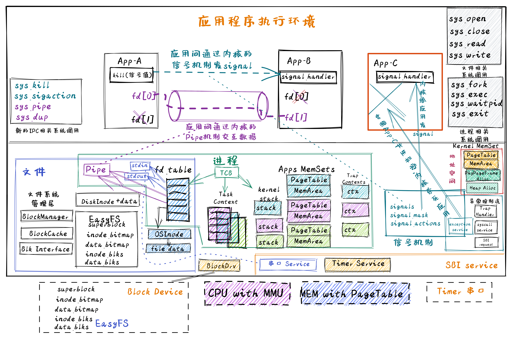
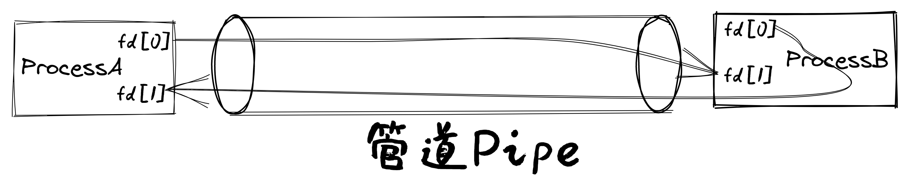
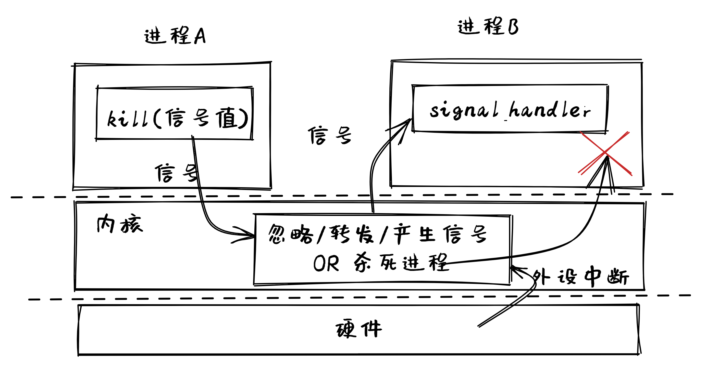
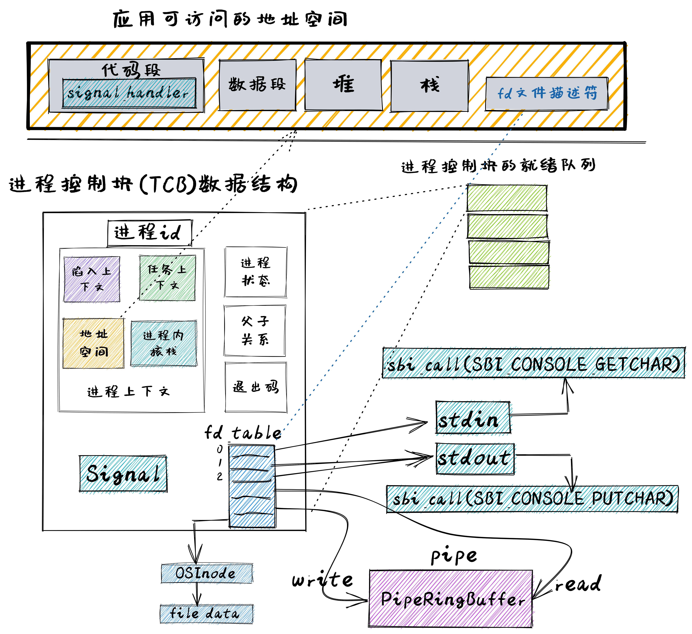
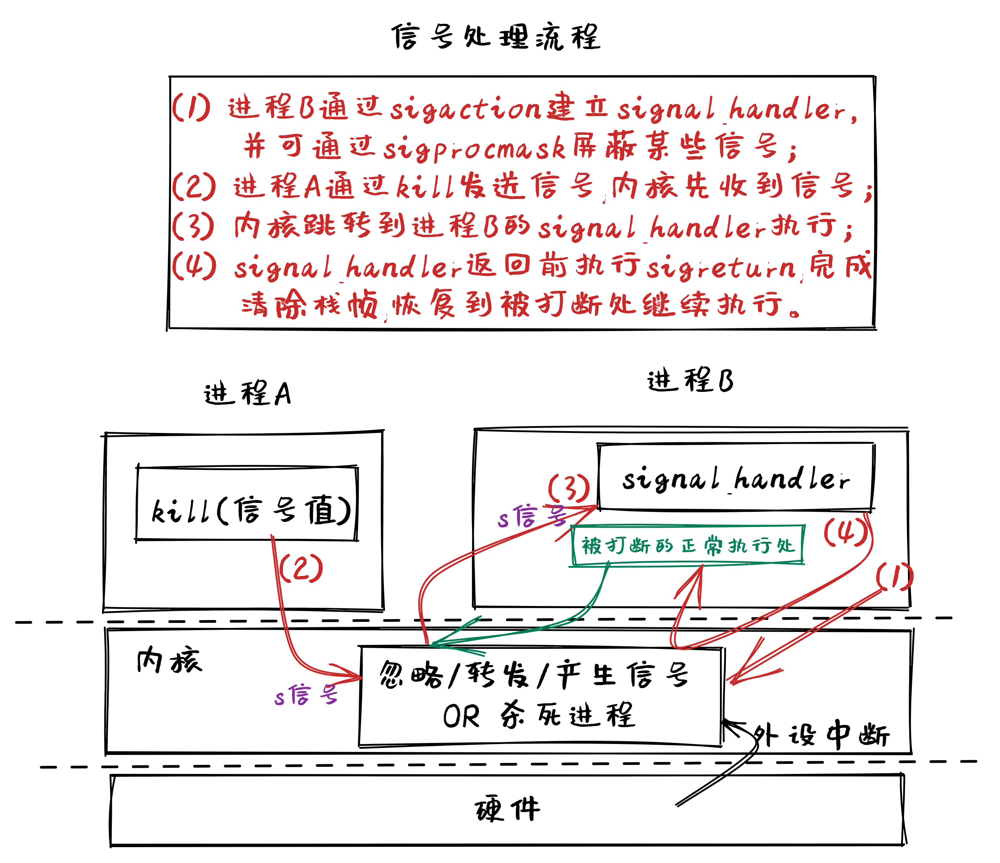

<!-- theme: gaia -->
<!-- _class: lead -->

# 第十讲 进程间通信

## 第二节 支持IPC的OS
IPC OS (IOS)

<br>
<br>

向勇 陈渝 李国良 

2022年秋季

---

**提纲**

### 1. 实验安排
- 实验目标
- 总体思路
- 历史背景
- 实践步骤
2. 代码结构
3. 管道的设计实现
4. 信号的设计实现



---

#### 以往实验目标

提高性能、简化开发、加强安全、支持数据持久保存
- Filesystem OS：支持数据持久保存
- Process OS: 增强进程管理和资源管理
- Address Space OS: 隔离APP访问的内存地址空间
- multiprog & time-sharing OS: 让APP共享CPU资源
- BatchOS: 让APP与OS隔离，加强系统安全，提高执行效率
- LibOS: 让APP与HW隔离，简化应用访问硬件的难度和复杂性

---
#### 实验目标
支持应用的灵活性，支持进程间交互
- 扩展文件抽象：Pipe，Stdout, Stdin
- 以文件形式进行进程间数据交换
- 以文件形式进行串口输入输出  
- 信号实现进程间异步通知机制
- 系统调用数量：11个 --> 17个
  - 管道：2 个、用于传数据
  - 信号：4 个、用于发通知


---

#### 实验要求

- 理解文件抽象
- 理解IPC机制的设计与实现
  - pipe
  - signal
- 会写支持IPC的OS

<!-- 迅猛龙Velociraptor具有匿踪能力和狡诈本领。迅猛龙比较聪明具有团队协作能力、擅长团队合作 操作系统  -->


---

**提纲**

1. 实验安排
- 实验目标
### 总体思路
- 历史背景
- 实践步骤
2. 代码结构
3. 管道的设计实现
4. 信号的设计实现


---

#### 管道实现需要考虑的问题

- 管道是啥？
- 如何访问管道？
- 如何管理管道？



---

#### 理解管道

**管道是内核中的一块内存**
-  顺序写入/读出字节流

**管道可抽象为文件**
- 进程中包含管道文件描述符
  - 管道的`File`Trait的接口
  - read/write
- 应用创建管道的系统调用
  - `sys_pipe`


---

#### 管道示例程序 (用户态)
```rust
...// usr/src/bin/pipetest.rs
static STR: &str = "Hello, world!"  //字符串全局变量
pub fn main() -> i32 {
    let mut pipe_fd = [0usize; 2]; //包含两个元素的fd数组
    pipe(&mut pipe_fd); // create pipe
    if fork() == 0 { // child process, read from parent
        close(pipe_fd[1]); // close write_end
        let mut buffer = [0u8; 32]; //包含32个字节的字节数组
        let len_read = read(pipe_fd[0], &mut buffer) as usize; //读pipe
    } else { // parent process, write to child
        close(pipe_fd[0]); // close read end
        write(pipe_fd[1], STR.as_bytes()); //写pipe
        let mut child_exit_code: i32 = 0;
        wait(&mut child_exit_code); //父进程等子进程结束
    }
...
```
---

#### 管道与进程的关系
- `pipe`是进程控制块的资源之一


---

#### 信号实现需要考虑的问题
- 信号是啥？
- 如何使用信号？
- 如何管理信号？



<!-- linux signal那些事儿 http://blog.chinaunix.net/uid-24774106-id-4061386.html -->

---

#### 理解信号
`signal`是内核通知应用的软件中断

**准备阶段**
- 设定`signal`的整数编号值
- 建立应对某`signal`编号值的例程`signal_handler`

**执行阶段**
- 向某进程发出signal，打断进程的当前执行，转到`signal_handler`执行


---

#### 信号示例程序（用户态）
```rust
...// usr/src/bin/sig_simple.rs
fn func() { //signal_handler
    println!("user_sig_test succsess");
    sigreturn(); //回到信号处理前的位置继续执行
}
pub fn main() -> i32 {
    let mut new = SignalAction::default();  //新信号配置
    let old = SignalAction::default();      //老信号配置
    new.handler = func as usize;            //设置新的信号处理例程
    if sigaction(SIGUSR1, &new, &old) < 0 { //setup signal_handler
        panic!("Sigaction failed!");
    }
    if kill(getpid() as usize, SIGUSR1) <0{ //send SIGUSR1 to itself
      ...
    }
...
```

---

#### 信号与进程的关系
- `signal`是进程控制块的资源之一


---

**提纲**

1. 实验安排
- 实验目标
- 总体思路
### 历史背景
- 实践步骤
2. 代码结构
3. 管道的设计实现
4. 信号的设计实现


---

#### 管道：Unix 中最引人注目的发明

- 管道的概念来自贝尔实验室的Douglas McIlroy，他在1964年写的一份内部文件中，提出了把多个程序“像花园水管一样”串连并拧在一起的想法，这样数据就可以在不同程序中流动。
- 大约在1972年下半年，Ken Thompson在听了Douglas McIlroy关于管道的唠叨后，灵机一动，迅速把管道机制实现在UNIX中。
 


<!-- 道格拉斯McIlroy (生于 1932年)是数学家,工程师和程序员. 自2007年他是附属教授电脑科学在麻省理工学院获得博士。
McIlroy为原始被开发是最响誉 Unix管道实施, 软件元件部分 并且数 Unix 用工具加工，例如电脑病毒， diff, 排序, 加入图表，讲话，和 tr. -->


---
#### 信号：Unix 中容易出错的软件中断

信号从Unix的第一个版本就已存在，只是与我们今天所知道的有点不同，需要通过不同的系统调用来捕获不同类型的信号。在版本4之后，改进为通过一个系统调用来捕获所有信号。


<!-- https://venam.nixers.net/blog/unix/2016/10/21/unix-signals.html
https://unix.org/what_is_unix/history_timeline.html
https://en.wikipedia.org/wiki/Signal_(IPC) -->

---

**提纲**

1. 实验安排
- 实验目标
- 总体思路
- 历史背景
### 实践步骤
2. 代码结构
3. 管道的设计实现
4. 信号的设计实现


---

#### 实践步骤 
```
git clone https://github.com/rcore-os/rCore-Tutorial-v3.git
cd rCore-Tutorial-v3
git checkout ch7
cd os
make run
```


---
#### 参考输出
```
[RustSBI output]
...
filetest_simple
fantastic_text
**************/
Rust user shell
>>
```
操作系统启动``shell``后，用户可以在``shell``中通过敲入应用名字来执行应用。

---
#### 测例 pipetest 
在这里我们运行一下本章的测例 pipetest ：
```
>> pipetest
Read OK, child process exited!
pipetest passed!
>>
```
此应用的父子进程通过pipe完成字符串`"Hello, world!"`的传递。

---
#### 测例 sig_simple

在这里我们运行一下本章的测例 sig_simple ：

```
>> sig_simple 
signal_simple: sigaction
signal_simple: kill
user_sig_test succsess
signal_simple: Done
>>
```
此应用建立了针对`SIGUSR1`信号的信号处理例程`func`，然后再通过`kill`给自己发信号`SIGUSR1`，最终`func`会被调用。


---

**提纲**

1. 实验安排
### 2. 代码结构
3. 管道的设计实现
4. 信号的设计实现


---

#### 用户代码结构
```
└── user
    └── src
        ├── bin
        │   ├── pipe_large_test.rs(新增：大数据量管道传输)
        │   ├── pipetest.rs(新增：父子进程管道传输)
        │   ├── run_pipe_test.rs(新增：管道测试)
        │   ├── sig_tests.rs(新增：多方位测试信号机制)
        │   ├── sig_simple.rs(新增：给自己发信号)
        │   ├── sig_simple2.rs(新增：父进程给子进程发信号)
        ├── lib.rs(新增两个系统调用：sys_close/sys_pipe/sys_sigaction/sys_kill...)
        └── syscall.rs(新增两个系统调用：sys_close/sys_pipe/sys_sigaction/sys_kill...)
```

---
#### 内核代码结构
```
├── fs(新增：文件系统子模块 fs)
│   ├── mod.rs(包含已经打开且可以被进程读写的文件的抽象 File Trait)
│   ├── pipe.rs(实现了 File Trait 的第一个分支——可用来进程间通信的管道)
│   └── stdio.rs(实现了 File Trait 的第二个分支——标准输入/输出)
├── mm
│   └── page_table.rs(新增：应用地址空间的缓冲区抽象 UserBuffer 及其迭代器实现)
├── syscall
│   ├── fs.rs(修改：调整 sys_read/write 的实现，新增 sys_close/pipe)
│   ├── mod.rs(修改：调整 syscall 分发)
├── task
│   ├── action.rs(信号处理SignalAction的定义与缺省行为)
│   ├── mod.rs（信号处理相关函数）
│   ├── signal.rs（信号处理的信号值定义等）
│   └── task.rs(修改：在任务控制块中加入信号相关内容)
└── trap
├── mod.rs（进入/退出内核时的信号处理）
```        


---

**提纲**

1. 实验安排
2. 代码结构
### 3. 管道的设计实现
4. 信号的设计实现


---
#### 管道的设计实现
基于文件抽象，支持I/O重定向
1. [K] 实现基于文件的标准输入/输出
2. [K] 实现基于文件的实现管道
3. [U]  支持命令行参数
4. [U]  支持 “|"  符号



---
#### 标准文件

1.  实现基于文件的标准输入/输出
 - FD：0 --  Stdin  ; 1/2 -- Stdout
 - 实现File 接口
   - read -> call(SBI_CONSOLE_GETCHAR)
   - write -> call(SBI_CONSOLE_PUTCHAR)


---
#### 标准文件初始化

2. 创建TCB时初始化`fd_table`

```rust
TaskControlBlock::fork(...)->... {
  ...
  let task_control_block = Self {
      ...
          fd_table: vec![
              // 0 -> stdin
              Some(Arc::new(Stdin)),
              // 1 -> stdout
              Some(Arc::new(Stdout)),
              // 2 -> stderr
              Some(Arc::new(Stdout)),
          ],
...
```


---
#### fork实现中的标准文件创建

3. `fork`时复制`fd_table`

```rust
TaskControlBlock::new(elf_data: &[u8]) -> Self{
  ...
    // copy fd table
    let mut new_fd_table = Vec::new();
    for fd in parent_inner.fd_table.iter() {
        if let Some(file) = fd {
            new_fd_table.push(Some(file.clone()));
        } else {
            new_fd_table.push(None);
        }
    }
```


---
#### 管道文件

1. 管道的系统调用

```rust
/// 功能：为当前进程打开一个管道。
/// 参数：pipe 表示应用地址空间中
/// 的一个长度为 2 的 usize 数组的
/// 起始地址，内核需要按顺序将管道读端
/// 和写端的文件描述符写入到数组中。
/// 返回值：如果出现了错误则返回 -1，
/// 否则返回 0 。
/// 可能的错误原因是：传入的地址不合法。
/// syscall ID：59
pub fn sys_pipe(pipe: *mut usize) -> isize;
```


---
#### 管道文件

2. 创建管道中的Buffer

```rust
pub struct PipeRingBuffer {
    arr: [u8; RING_BUFFER_SIZE],
    head: usize,
    tail: usize,
    status: RingBufferStatus,
    write_end: Option<Weak<Pipe>>,
}

make_pipe() -> (Arc<Pipe>, Arc<Pipe>) {
    let buffer = PipeRingBuffer::new();
    let read_end = Pipe::read_end_with_buffer();
    let write_end = Pipe::write_end_with_buffer();
    ...
    (read_end, write_end)  
```


---
#### 管道文件

3.  实现基于文件的输入/输出
 - 实现File 接口
```rust
    fn read(&self, buf: UserBuffer) -> usize {
       *byte_ref = ring_buffer.read_byte();
    }
    fn write(&self, buf: UserBuffer) -> usize {  
      ring_buffer.write_byte( *byte_ref );
    }
```


---
#### exec系统调用的命令行参数
- sys_exec 的系统调用接口需要发生变化
```rust
// 增加了args参数
pub fn sys_exec(path: &str, args: &[*const u8]) -> isize;
```
- shell程序的命令行参数分割
```rust
// 从一行字符串中获取参数
let args: Vec<_> = line.as_str().split(' ').collect();
// 用应用名和参数地址来执行sys_exec系统调用
exec(args_copy[0].as_str(), args_addr.as_slice())
```


---

#### exec系统调用的命令行参数

- 将获取到的参数字符串压入到用户栈上
```rust
impl TaskControlBlock {
 pub fn exec(&self, elf_data: &[u8], args: Vec<String>) {
   ...
   // push arguments on user stack
 }
```
- Trap 上下文中的 a0/a1 寄存器，让 a0 表示命令行参数的个数，而 a1 则表示图中 argv_base 即蓝色区域的起始地址。


---

#### exec系统调用的命令行参数

```rust
pub extern "C" fn _start(argc: usize, argv: usize) -> ! {
   //获取应用的命令行个数 argc, 获取应用的命令行参数到v中
   //执行应用的main函数
   exit(main(argc, v.as_slice()));
} 
```


---
#### 重定向
- 复制文件描述符系统调用
```rust
/// 功能：将进程中一个已经打开的文件复制
/// 一份并分配到一个新的文件描述符中。
/// 参数：fd 表示进程中一个已经打开的文件的文件描述符。
/// 返回值：如果出现了错误则返回 -1，否则能够访问已打
/// 开文件的新文件描述符。
/// 可能的错误原因是：传入的 fd 并不对应一个合法的已打
/// 开文件。
/// syscall ID：24
pub fn sys_dup(fd: usize) -> isize;
```
<!--  -->


---
#### 重定向
- 复制文件描述符系统调用
```rust
pub fn sys_dup(fd: usize) -> isize {
  ...
  let new_fd = inner.alloc_fd();
  inner.fd_table[new_fd] = inner.fd_table[fd];
  newfd
} 
```
<!--  -->


---
#### shell重定向 "$ A | B"
```rust
// user/src/bin/user_shell.rs
{
  let pid = fork();
    if pid == 0 {  
        let input_fd = open(input, ...); //输入重定向 -- B 子进程
        close(0);                        //关闭文件描述符0
        dup(input_fd); //文件描述符0与文件描述符input_fd指向同一文件
        close(input_fd); //关闭文件描述符input_fd
        //或者
        let output_fd = open(output, ...);//输出重定向 -- A子进程
        close(1);                         //关闭文件描述符1
        dup(output_fd);//文件描述符1与文件描述符output_fd指向同一文件
        close(output_fd);//关闭文件描述符output_fd
    //I/O重定向后执行新程序
     exec(args_copy[0].as_str(), args_addr.as_slice()); 
    }...
```

<!--  -->


---

**提纲**

1. 实验安排
2. 代码结构
3. 管道的设计实现
### 4. 信号的设计实现
- signal的系统调用
- signal核心数据结构
- 建立signal_handler
- 支持kill系统调用


---

#### 与信号处理相关的系统调用

<!-- https://www.onitroad.com/jc/linux/man-pages/linux/man2/sigreturn.2.html -->
- sigaction: 设置信号处理例程
- sigprocmask: 设置要阻止的信号
- kill: 将某信号发送给某进程
- sigreturn: 清除堆栈帧，从信号处理例程返回



---
#### 与信号处理相关的系统调用
<!-- https://www.onitroad.com/jc/linux/man-pages/linux/man2/sigreturn.2.html -->
```rust
// 设置信号处理例程
// signum：指定信号
// action：新的信号处理配置
// old_action：老的的信号处理配置
sys_sigaction(signum: i32, 
   action: *const SignalAction,
   old_action: *const SignalAction) 
   -> isize

pub struct SignalAction {
    // 信号处理例程的地址
    pub handler: usize, 
    // 信号掩码
    pub mask: SignalFlags
}   
```


---
#### 与信号处理相关的系统调用
<!-- https://www.onitroad.com/jc/linux/man-pages/linux/man2/sigreturn.2.html -->
```rust
// 设置要阻止的信号
// mask：信号掩码
sys_sigprocmask(mask: u32) -> isize 
```
```rust
// 清除堆栈帧，从信号处理例程返回
 sys_sigreturn() -> isize
```
```rust
// 将某信号发送给某进程
// pid：进程pid
// signal：信号的整数码
sys_kill(pid: usize, signal: i32) -> isize
```


---
#### 信号的核心数据结构
进程控制块中的信号核心数据结构
```rust
pub struct TaskControlBlockInner {
    ...
    pub signals: SignalFlags,     // 要响应的信号
    pub signal_mask: SignalFlags, // 要屏蔽的信号
    pub handling_sig: isize,      // 正在处理的信号
    pub signal_actions: SignalActions,       // 信号处理例程表
    pub killed: bool,             // 任务是否已经被杀死了
    pub frozen: bool,             // 任务是否已经被暂停了
    pub trap_ctx_backup: Option<TrapContext> //被打断的trap上下文
}
```
<!-- 
killed的作用是标志当前进程是否已经被杀死。因为进程收到杀死信号的时候并不会立刻结束，而是会在适当的时候退出。这个时候需要killed作为标记，退出不必要的信号处理循环。

frozen的标志与SIGSTOP和SIGCONT两个信号有关。SIGSTOP会暂停进程的执行，即将frozen置为true。此时当前进程会阻塞等待SIGCONT（即解冻的信号）。当信号收到SIGCONT的时候，frozen置为false，退出等待信号的循环，返回用户态继续执行。 -->

---
#### 建立signal_handler

```rust
fn sys_sigaction(signum: i32, action: *const SignalAction, 
                          old_action: *mut SignalAction) -> isize {
  //保存老的signal_handler地址到old_action中
  let old_kernel_action = inner.signal_actions.table[signum as usize];
  *translated_refmut(token, old_action) = old_kernel_action;
 //设置新的signal_handler地址到TCB的signal_actions中
  let ref_action = translated_ref(token, action);
  inner.signal_actions.table[signum as usize] = *ref_action;
```
对于需要修改的信号编号signum：
1. 保存老的signal_handler地址到`old_action`
2. 设置`action`为新的signal_handler地址


---
#### 通过kill发出信号

```rust
fn sys_kill(pid: usize, signum: i32) -> isize {
      let Some(task) = pid2task(pid);
      // insert the signal if legal
      let mut task_ref = task.inner_exclusive_access();
      task_ref.signals.insert(flag);
     ...
```
对进程号为`pid`的进程发送值为`signum`的信号：
1. 根据`pid`找到TCB
2. 在TCB中的signals插入`signum`信号值


---
#### 通过kill发出和处理信号的过程
当`pid`进程进入内核后，直到从内核返回用户态前的执行过程：
```
执行APP --> __alltraps 
         --> trap_handler 
            --> handle_signals 
                --> check_pending_signals 
                    --> call_kernel_signal_handler
                    --> call_user_signal_handler
                       -->  // backup trap Context
                            // modify trap Context
                            trap_ctx.sepc = handler; //设置回到中断处理例程的入口
                            trap_ctx.x[10] = sig;   //把信号值放到Reg[10]
            --> trap_return //找到并跳转到位于跳板页的`__restore`汇编函数
       -->  __restore //恢复被修改过的trap Context，执行sret
执行APP的signal_handler函数
 ```                               

 
---
#### APP恢复正常执行
当进程号为pid的进程执行完signal_handler函数主体后，会发出`sys_sigreturn`系统调用:
```rust
fn sys_sigreturn() -> isize {
  ...
  // 恢复之前备份的trap上下文
  let trap_ctx = inner.get_trap_cx();
  *trap_ctx = inner.trap_ctx_backup.unwrap();
  ...
执行APP --> __alltraps 
       --> trap_handler 
            --> 处理 sys_sigreturn系统调用
            --> trap_return //找到并跳转到位于跳板页的`__restore`汇编函数
    -->  __restore //恢复被修改过的trap Context，执行sret
执行APP被打断的地方
```       


---
#### 屏蔽信号
```rust
fn sys_sigprocmask(mask: u32) -> isize {
    ...
    inner.signal_mask = flag;
    old_mask.bits() as isize
    ...
```
把要屏蔽的信号直接记录到TCB的signal_mask数据中

---
### 小结
- 管道的概念与实现
- 信号的概念与实现
- 能写迅猛龙操作系统


---

### 课程实验四 文件系统与进程间通信

* 第六章：文件系统与I/O重定向 -> chapter6练习 -> 
    * [rCore](https://learningos.github.io/rCore-Tutorial-Guide-2022A/chapter6/4exercise.html#id1)
    * [uCore](https://learningos.github.io/uCore-Tutorial-Guide-2022A/chapter6/5exercise.html#id3)
* 实验任务
    * 硬链接
* 实验提交要求
    * 任务布置后的第11天（2022年12月04日）；