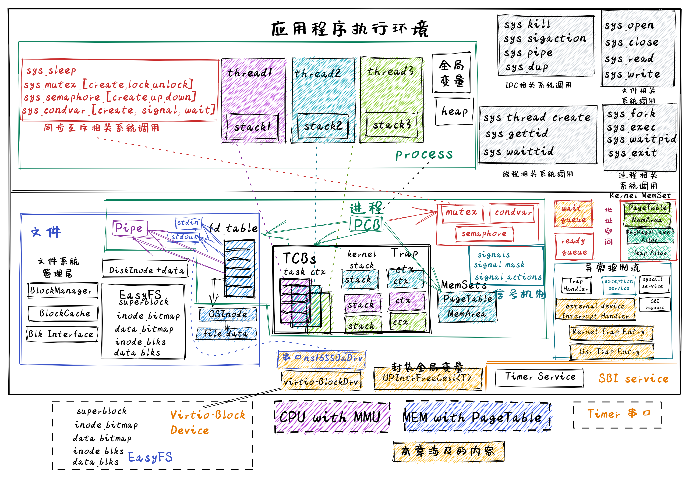

<!-- theme: gaia -->
<!-- _class: lead -->

# 第十三讲 设备管理
## 第三节 支持device的OS（DOS）
---
### 实践：DOS
- **进化目标**
- 历史背景
- 相关硬件
- 总体思路
- 实践步骤
- 软件架构
- 程序设计




---
### 实践：DOS -- 以往目标
- SMOS：在多线程中支持对共享资源的同步互斥访
- TCOS：支持线程和协程 
- IPC OS：进程间交互
- Filesystem OS：支持数据持久保存
- Process OS: 增强进程管理和资源管理
- Address Space OS: 隔离APP访问的内存地址空间
- multiprog & time-sharing OS: 让APP共享CPU资源
- BatchOS： 让APP与OS隔离，加强系统安全，提高执行效率
- LibOS: 让APP与HW隔离，简化应用访问硬件的难度和复杂性

---
### 实践：DOS -- 进化目标
支持对多种外设的高效访问
- 支持在内核中响应外设中断
- 支持在内核中保证对全局变量的互斥访问
- 基于中断机制的串口设备驱动
- 基于中断机制的Virtio-Block设备驱动

---
### 实践：DOS 
### 同学的进化目标
- 理解如何在内核中响应中断
- 理解外设驱动的基本管理过程
- 会写支持多种外设的OS

<!-- 侏罗猎龙的属名（Juravenator）来自拉丁语中的“Jura”（意为“侏罗纪”）及“Venator”（意为“猎人”），意思是“侏罗纪的猎人”。 -->


---
### 实践：DOS
- 进化目标
- 历史背景
- **相关硬件**
- 总体思路
- 实践步骤
- 软件架构
- 程序设计


---
### 实践：DOS
<!-- https://blog.csdn.net/weixin_40604731/article/details/109279426 2020.10.25 RISC-V --PLIC平台级中断控制器 -->
**PLIC中断源**
PLIC支持多个中断源，每个中断源可以是不同触发类型，电平触发或者边沿触发、PLIC为每个中断源分配
- 闸口（Gateway）和IP
- 编号（ID）
- 优先级（priority）
- 使能（Enable）


---
### 实践：DOS
<!-- https://blog.csdn.net/weixin_40604731/article/details/109279426 2020.10.25 RISC-V --PLIC平台级中断控制器 -->
**PLIC中断源**
- 闸口（Gateway）将不同类型的外部中断传换成统一的内部中断请求
- 闸口保证只发送一个中断请求，中断请求经过闸口发送后，硬件自动将对应的IP寄存器置高
- 闸口发送一个中断请求后则启动屏蔽，如果此中断没有被处理完成，则后续的中断将会被闸口屏蔽

---
### 实践：DOS
<!-- https://blog.csdn.net/weixin_40604731/article/details/109279426 2020.10.25 RISC-V --PLIC平台级中断控制器 -->
**PLIC中断源**
- PLIC为每个中断源分配编号（ID）。ID编号0被预留，作为表示“不存在的中断”，因此有效的中断ID从1开始
- 每个中断源的优先级寄存器应该是存储器地址映射的可读可写寄存器，从而使得软件可以对其编程配置不同的优先级
- PLIC支持多个优先级，优先级的数字越大，表示优先级越高
- 优先级0意味着“不可能中断”，相当于中断源屏蔽

---
### 实践：DOS
<!-- https://blog.csdn.net/weixin_40604731/article/details/109279426 2020.10.25 RISC-V --PLIC平台级中断控制器 -->
**PLIC中断源**
每个中断目标的中断源均分配了一个中断使能（IE）寄存器，IE寄存器是可读写寄存器，从而使得软件对其编程
- 如果IE寄存器被配置为0，则意味着此中断源对应中断目标被屏蔽
- 如果IE寄存器被配置为1，则意味着此中断源对应中断目标被打开
---
### 实践：DOS
- 进化目标
- 历史背景
- 相关硬件
- **总体思路**
    - **外设中断**
- 实践步骤
- 软件架构
- 程序设计

---
### 实践：DOS  -- **总体思路**
  
- 为何支持外设中断
   -  提高系统的整体执行效率
- 为何在内核态响应外设中断
   - 提高OS对外设IO请求的响应速度 
- 潜在的问题
  - 内核态能响应中断后，不能保证对全局变量的互斥访问
  - 原因：中断会打断当前执行，并切换到另一控制流访问全局变量
- 解决方案
  - 在访问全局变量起始前屏蔽中断，结束后使能中断 

---
### 实践：DOS
- 进化目标
- 历史背景
- 相关硬件
- **实践步骤**
- 软件架构
- 程序设计


---
### 实践：DOS  -- **实践步骤**
```
git clone https://github.com/rcore-os/rCore-Tutorial-v3.git
cd rCore-Tutorial-v3
git checkout ch9
```
应用程序没有改变，但在串口输入输出、块设备读写的IO操作上是基于中断方式实现的。

---
### 实践：DOS
- 进化目标
- 历史背景
- 相关硬件
- 实践步骤
- **软件架构**
- 程序设计

---
### 实践：DOS  -- **软件架构**
内核的主要修改
```
os/src/
├── boards
│   └── qemu.rs  // UART、VIRTIO、PLIC的MMIO地址
├── console.rs  //基于UART的STDIO
├── drivers
│   ├── block
│   │   └── virtio_blk.rs //基于中断/DMA方式的VIRTIO-BLK驱动
│   ├── chardev
│   │   └── ns16550a.rs //基于中断方式的串口驱动
│   └── plic.rs //PLIC驱动
├── main.rs  //外设中断相关初始化
└── trap
    ├── mod.rs //支持处理外设中断
    └── trap.S //支持内核态响应外设中断
```

---
### 实践：DOS
- 进化目标
- 历史背景
- 相关硬件
- 实践步骤
- 软件架构
- **程序设计**


---
###  程序设计

1. 外设初始化
2. 外设中断处理
3. 外设I/O读写操作


---
###  程序设计
- 外设初始化
   - PLIC初始化
   - 串口设备初始化
   - virtio-blk设备初始化 


---
###  程序设计
-  外设中断处理

---
###  程序设计
-  外设I/O读写操作
   - 串口设备读写
   - virtio-blk设备读写  