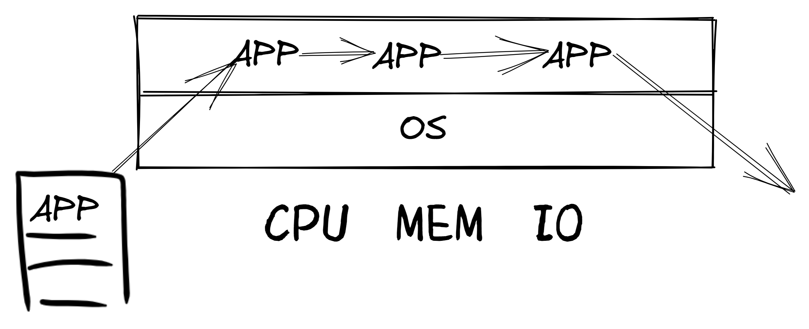
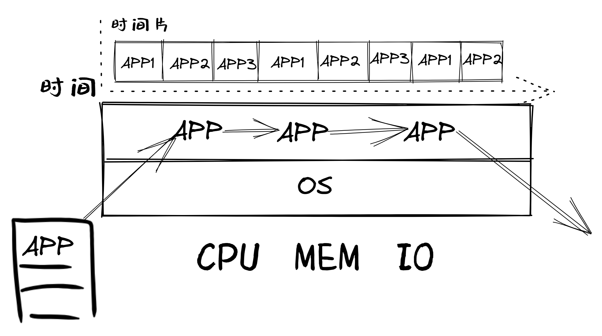
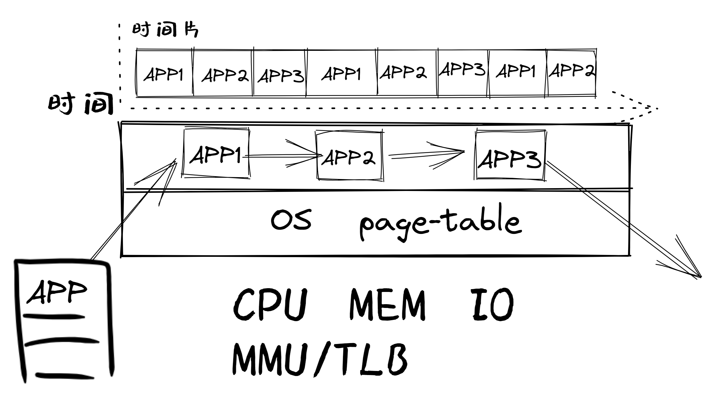
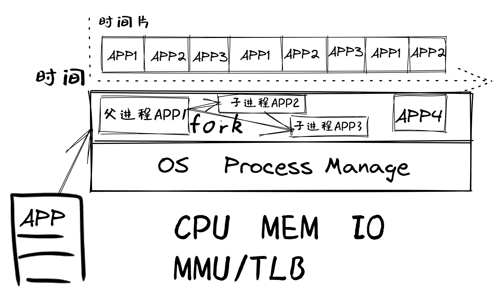
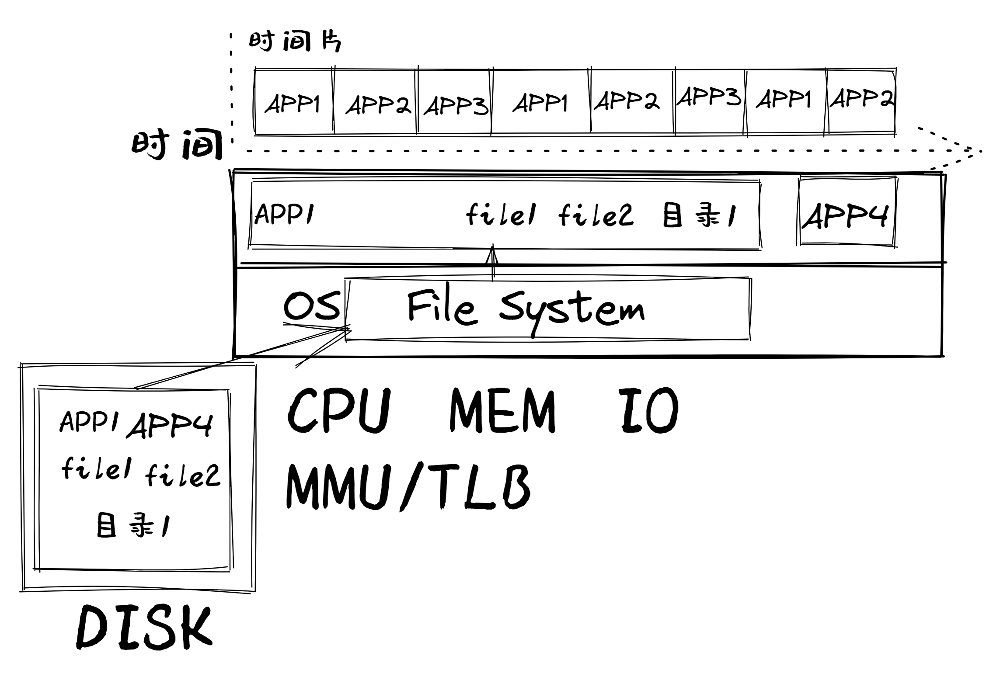
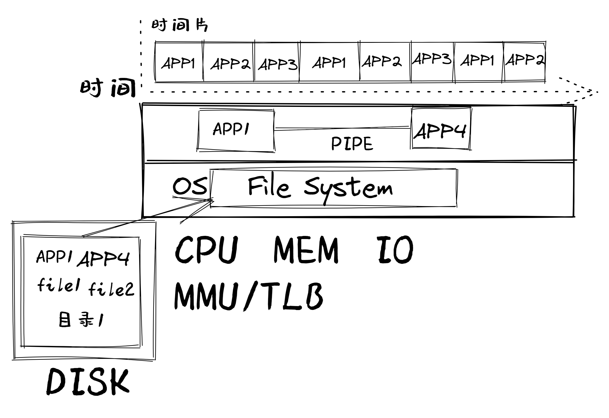
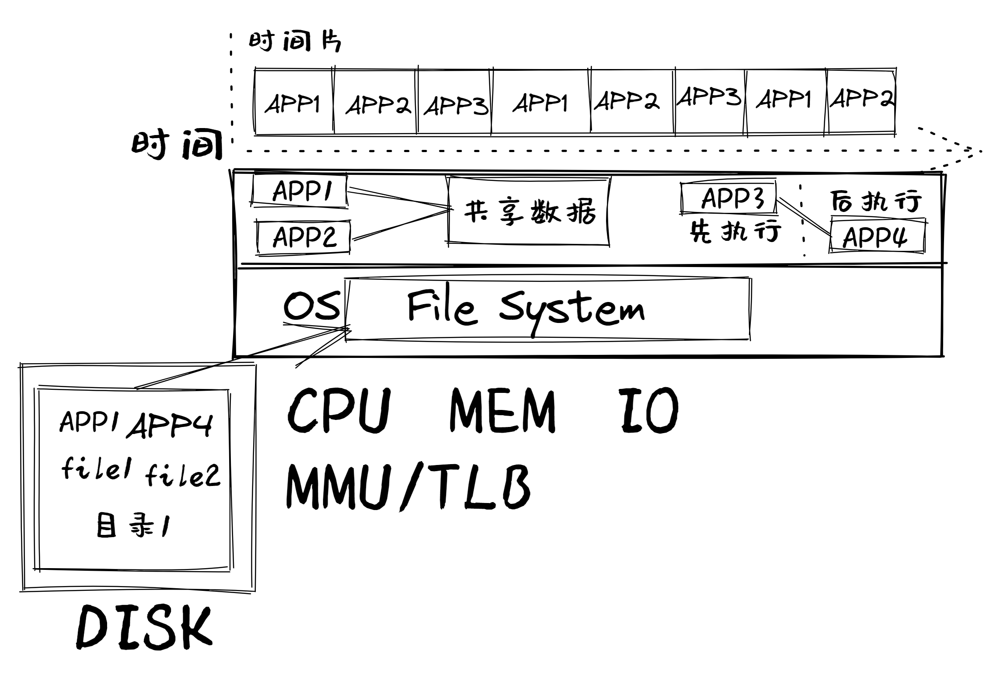
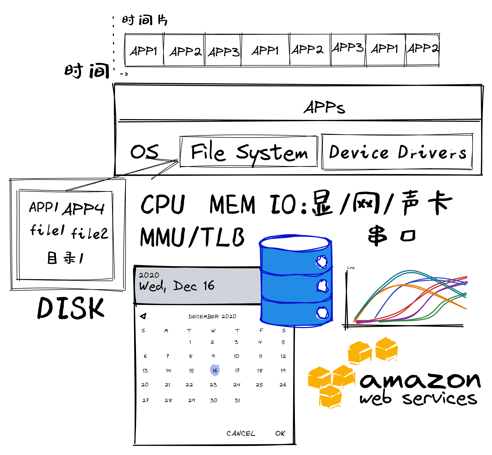

<!-- theme: gaia -->
<!-- _class: lead -->

# 第二讲 实践与实验介绍
## 第一节 实践与实验简要分析

 
 

向勇 陈渝 李国良 

 
 

2022年秋季

---
提纲

### 1. 原理、实践与实验介绍
2. 循续渐进的操作系统实验
3. 实验安排

---

##### 满足应用逐渐增加的需求
* LibOS
* 批处理OS
* 多道程序与分时多任务OS

---

##### 逐步体现操作系统的概念抽象

* 地址空间抽象的OS
* 进程抽象的OS
* 文件抽象的OS
---

##### 逐步体现操作系统的关键能力

* 可进程间通信的OS
* 可并发的OS
* 管理I/O设备的OS
---
提纲

1. 原理、实践与实验介绍
### 2. 循续渐进的操作系统实验
3. 实验安排

---

#### LibOS

- 远古操作系统雏形
- 现代简单嵌入式操作系统

##### 相关知识点
- 函数调用: 编译器与操作系统的配合
- 硬件启动和软件启动
- 编写/调试裸机程序

裸机程序(Bare Metal Program)：与操作系统无关的OS类型的程序

--- 

#### 批处理OS
- 支持系统调用

##### 相关知识点

- 特权级/特权操作
- RISC-V特权级/特权操作
- 系统调用/异常
- 加载&执行&切换应用程序
- 特权级切换

--- 

#### 多道程序OS
- 支持多个程序**同时驻留内存**
- 支持多个程序**依次执行**
##### 相关知识点
- 内存空间划分与管理
- 协作式调度

--- 

#### 分时多任务OS
- 支持多个程序**轮流执行**

##### 相关知识点
- **中断处理**
- 上下文切换
- 抢占式调度

--- 
#### OS的地址空间抽象
- 支持程序间**内存空间隔离**

##### 相关知识点
- 地址空间抽象
- 静态内存分配
- 动态内存分配
- 页式存储管理

--- 
#### OS的地址空间抽象
- **超越物理内存**的虚拟存储
##### 相关知识点
- 局部性原理
- 缺页异常
- 虚拟页式存储
- 置换算法

--- 

#### OS的进程抽象

- 支持**动态创建**程序执行

##### 相关知识点

- 进程抽象
- 进程管理
- 调度机制
  

--- 

#### OS的进程抽象

- 支持多处理器**并行**

##### 相关知识点
- 多处理器/多核架构
- 多处理器调度
- 实际OS调度
  

--- 
#### OS的文件抽象
- 处理数据的**便捷持久存储**

##### 相关知识点
- 文件抽象
- 文件组织结构
- 文件系统设计与实现

--- 
#### 可进程间通信的OS
- 进程间可显式/隐式**交互**信息
##### 相关知识点
- 信号、管道
- 消息队列、共享内存
- I/O重定向

--- 
#### 可并发的OS
- 提升CPU的**利用率**
##### 相关知识点
- 线程：用户/内核线程
- 协程
- 进程、线程和协程的关系

--- 
#### 可并发的OS
- 合理**共享资源**
- 同步与互斥
##### 相关知识点
- 同步互斥的机制
- 同步互斥解决并发问题
- 死锁等问题

--- 
#### 管理I/O设备的OS
- 支持各种外设
##### 相关知识点
- 设备抽象
- 设备执行模型
- 同步/异步 I/O
- I/O设备管理

---
提纲

1. 原理、实践与实验介绍
2. 循续渐进的操作系统实验
### 3. 实验安排

---

#### 实验一：操作系统的基本支持
##### 覆盖内容
* LibOS、 批处理OS、 多道程序与分时多任务OS
##### 知识点：特权级和切换
- 计算机/OS启动
- 特权级切换、系统调用、特权级相关异常、任务切换
- 应用程序/库/内核的关系

---

#### 实验二：地址空间
##### 覆盖内容
* 地址空间抽象的OS
##### 知识点：页表
- 地址空间
- 应用与内核之间在不同地址空间的数据交互/控制交互
- 内存/地址相关异常（如缺页异常）

---

#### 实验三：进程管理与调度
##### 覆盖内容
* 进程抽象的OS
##### 知识点：进程控制块PCB
- 进程管理
- 调度算法

---

#### 实验四：文件系统与进程间通信
##### 覆盖内容
* 文件抽象的OS、可进程间通信的OS
##### 知识点：文件
- 文件系统实现
- 进程间通信机制

---
#### 实验五：同步互斥
##### 覆盖内容
* 可并发的OS
##### 知识点
- 线程
- 同步互斥的机制、解决同步互斥问题、死锁问题
- 优先级反转问题

---

#### 教学实验的参考实现

* 参考实现
    * [uCore](https://github.com/uCore-RV-64/uCore-RV-64-answer)
    * [rCore](https://github.com/zflcs/rCore)
    * [Modular rCore](https://github.com/YdrMaster/rCore-Tutorial-in-single-workspace/)
* 实验报告内容建议
    * 实验开始时间、完成时间和代码提交次数
    * 你在实验中遇到的主要问题和解决方法
    * 你的回答与参考实现有什么不同？

---

#### 扩展实验（即大实验，课程设计）

4周内完成基础实验1~5后，与老师协商：选择完成扩展实验来代替考试

**早完成基础实验，可早开展扩展实验**

实现新feature（多核、新外设、新处理器、新功能）的支持

如支持游戏、树莓派/SiFive、网络、USB、AI等

参加全国大学生OS比赛