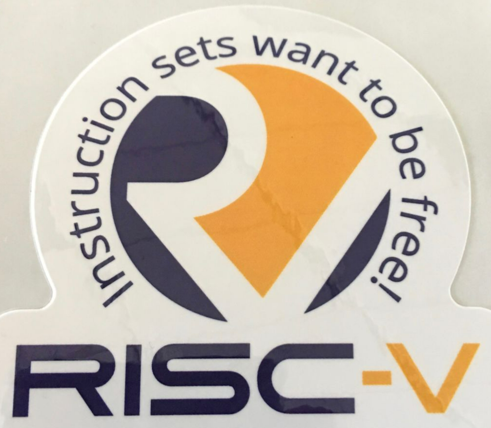
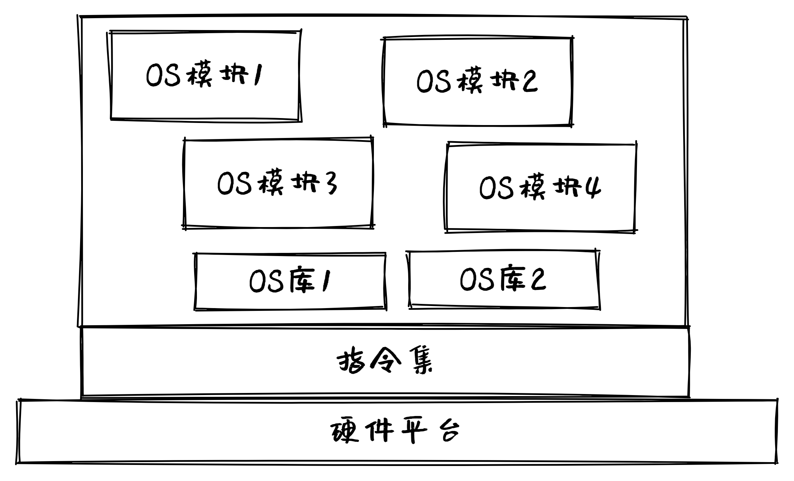
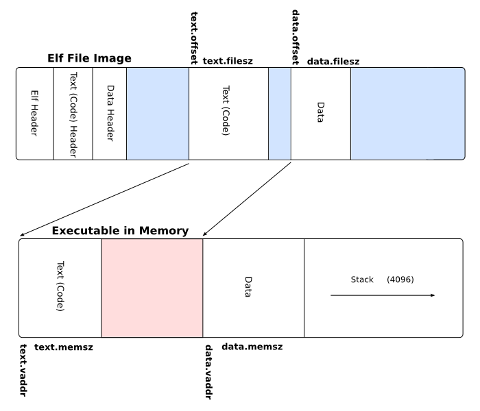

<!-- theme: gaia -->
<!-- _class: lead -->

# 第二讲 实践与实验介绍
## 第二节 Compiler与OS

<br>
<br>

向勇 陈渝 李国良 

<br>
<br>

2022年秋季

---
提纲

### 1. 硬件环境
2. 应用程序执行环境
3. 操作系统执行环境

---

#### 开发的硬件环境


---

#### 目标硬件环境


---
提纲

1. 硬件环境
### 2. 应用程序执行环境
3. 操作系统执行环境

---

#### 编译器工作
- 源码-->汇编码

---

#### Assembler工作
- 汇编码 --> 机器码

---
#### linker（链接器）工作
- 多个机器码目标文件 --> 单个机器码执行文件


---

#### OS工作
- 加载/执行/管理机器码执行文件


---
提纲

1. 硬件环境
2. 应用程序执行环境
### 3. 操作系统执行环境

---

#### 编译器/汇编器/链接器工作
- 源码 ---> 汇编码 ---> 机器码 --->执行程序
- Bootloader加载OS执行




---

#### 可执行文件格式
三元组
* CPU 架构/厂商/操作系统
```
rustc --print target-list | grep riscv
riscv32gc-unknown-linux-gnu
...
riscv64gc-unknown-linux-gnu
riscv64imac-unknown-none-elf
```
* ELF: Executable and Linkable Format


---

#### 链接和执行


---
#### 函数库
- 标准库：依赖操作系统
  - Rust: std 标准库
  - C：glibc, musl libc 
- 核心库：与操作系统无关
  - Rust: core 库
  - C: Linux/BSD kernel libc


---
#### 裸机程序
与操作系统无关的OS类型的程序（Bare Metal program, 裸机程序）
```
// os/src/main.rs
#![no_std]
#![no_main]

mod lang_items;

// os/src/lang_items.rs
use core::panic::PanicInfo;

#[panic_handler]
fn panic(_info: &PanicInfo) -> ! {
    loop {}
}
```

---
#### ELF文件格式

文件格式
```
file target/riscv64gc-unknown-none-elf/debug/os
target/riscv64gc-unknown-none-elf/debug/os: ELF 64-bit LSB executable, UCB RISC-V, ......
```
[ELF文件格式](https://wiki.osdev.org/ELF) Executable and Linkable Format

---
#### ELF文件格式



---
#### 文件头信息

文件头信息
```
rust-readobj -h target/riscv64gc-unknown-none-elf/debug/os
   File: target/riscv64gc-unknown-none-elf/debug/os
   Format: elf64-littleriscv
   Arch: riscv64
   AddressSize: 64bit
   ......
   Type: Executable (0x2)
   Machine: EM_RISCV (0xF3)
   Version: 1
   Entry: 0x0
   ......
   }
```

---
#### 导出汇编程序


反汇编导出汇编程序
```
rust-objdump -S target/riscv64gc-unknown-none-elf/debug/os
   target/riscv64gc-unknown-none-elf/debug/os:       file format elf64-littleriscv
```
代码中移除了 main 函数并将项目设置为 #![no_main] 
 - 没有一个传统意义上的入口点（即程序首条被执行的指令所在的位置）
 - Rust 编译器会生成一个空程序
 - 这是一个**面向操作系统开发**的程序

---
#### App/OS内存布局
- .text: 数据段
- .rodata：已初始化数据段，只读的全局数据（常数或者是常量字符串）
- .data：可修改的全局数据
- .bss：未初始化数据段
- 堆 （heap）向高地址增长
- 栈 （stack）向低地址增长

