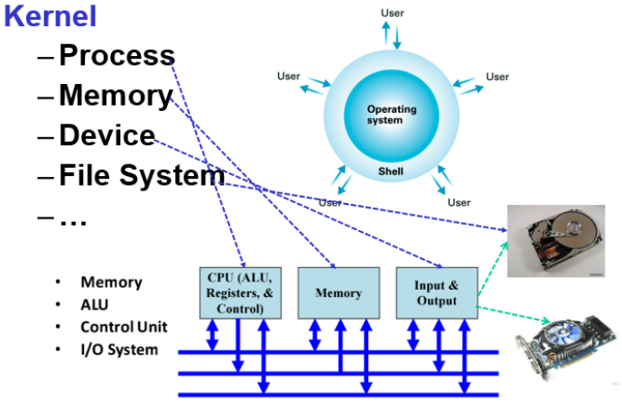
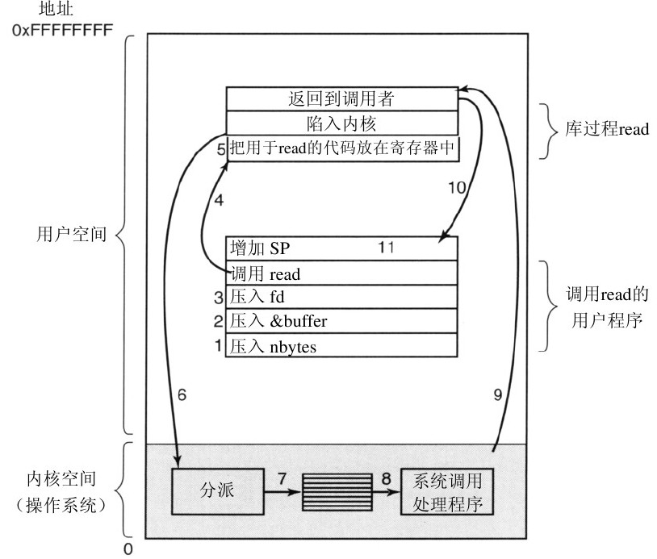
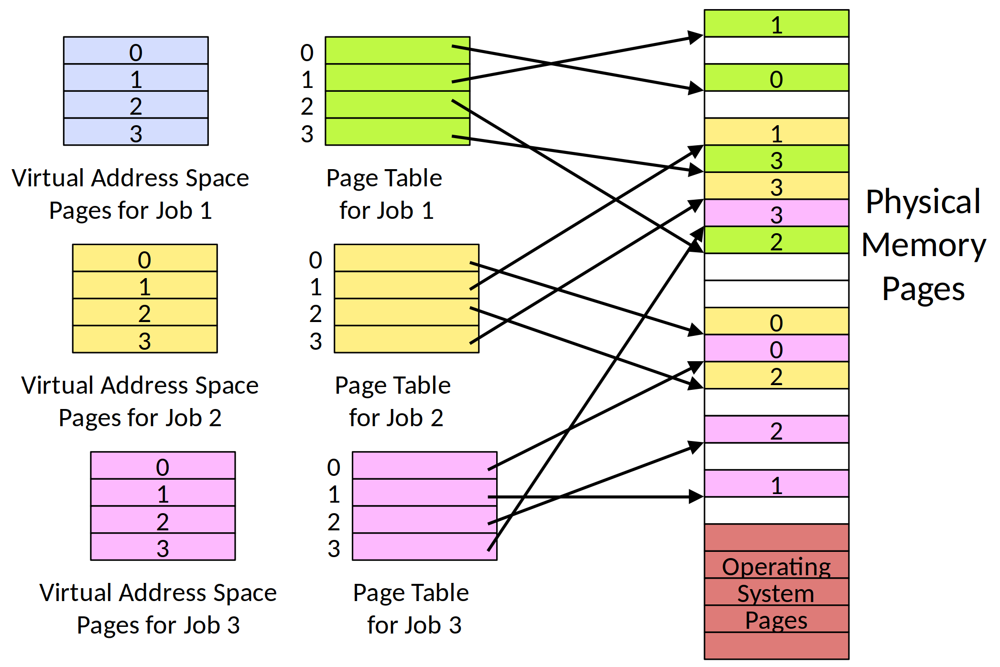
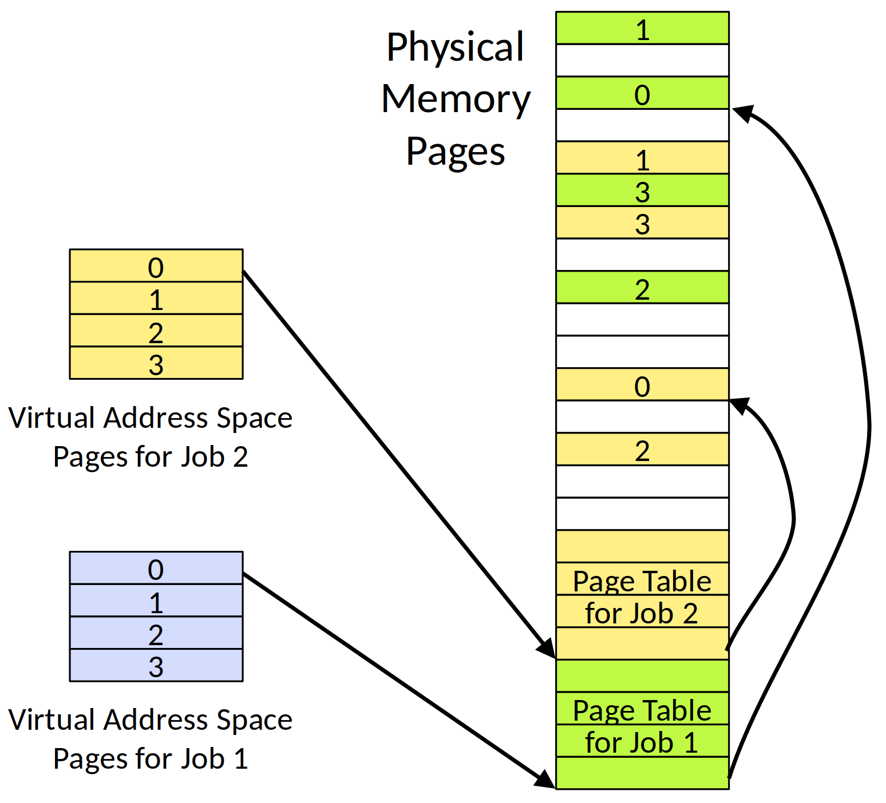
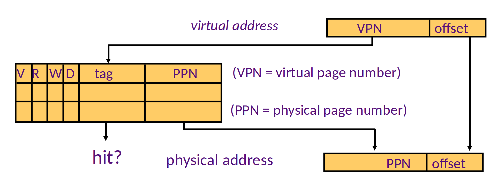
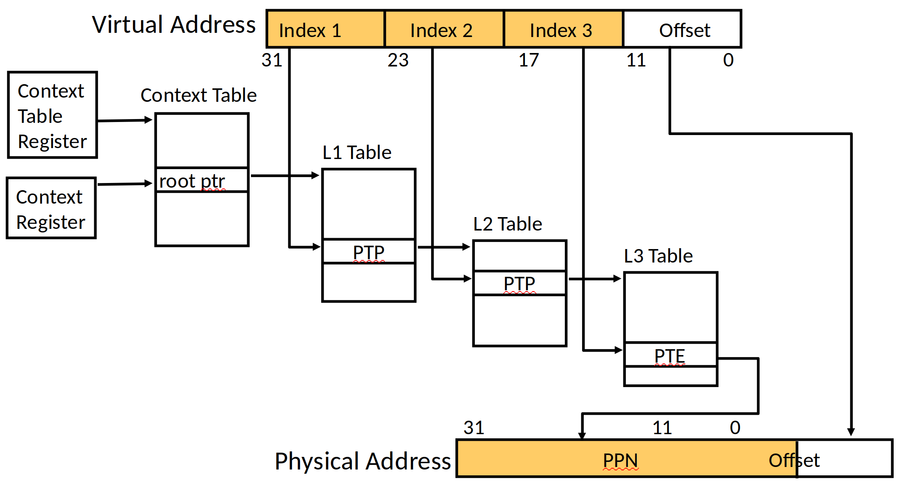
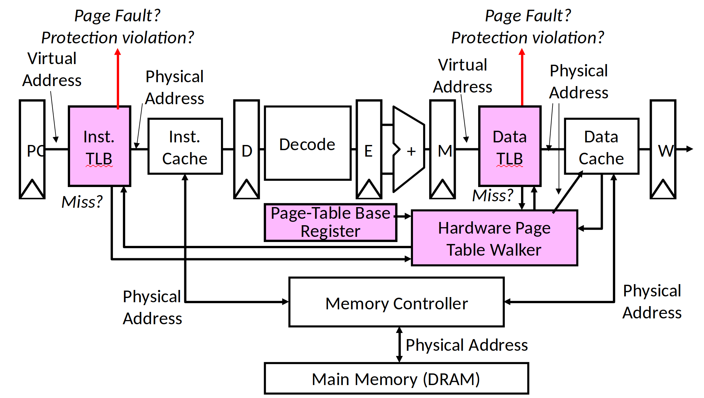

<!-- theme: gaia -->
<!-- _class: lead -->

# 第三讲 基于特权级的隔离与批处理
## 第一节 从OS角度看计算机系统

 
 

向勇 陈渝 李国良 

 
 

2022年秋季

---
**提纲**

### 1. OS与硬件的关系
2. OS与应用程序的关系
3. 隔离机制

---

#### 计算机系统

计算机系统（computer architecture）是一种**抽象层次**的**设计**，用于实现可有效使用**现有制造技术**的**信息处理**应用。
-- cs-152 berkeley 
 
---
#### 计算机系统抽象层次

**硬件** 支持 **OS** 支持 **应用**

* 操作系统位于硬件（HW）和应用（APP）之间
* 只有理解OS与HW/APP的关系，才能更好掌握OS

---
#### 指令集：软硬件接口
**硬件** 与 **OS** 的 **边界** ：指令集+寄存器

---
#### OS是对硬件的虚拟与抽象

---
#### RISC-V处理器架构
 

---
u/rCore的框架结构

---
**提纲**

1. OS与硬件的关系
### 2. OS与应用程序的关系
3. 隔离机制

---
#### OS对应用程序执行的支持
- 提供服务
- 系统调用
- 地址空间布局
---
#### OS为应用程序提供服务
* 通过**系统调用**来提供服务 
* **系统调用**：OS/APP的接口（边界之一）

---
#### 系统调用如何实现？
- 调用`ssize_t read(int fd, void *buf, size_t count);`会发生什么？
- 可以在应用程序中直接调用内核的函数吗？
- 可以在内核中使用应用程序普通的函数调用吗？

---
#### 引入系统调用的目的是增强安全性和可靠性

- 函数调用的特征
  - 好处：执行很快；
  - 好处：灵活-易于传递和返回复杂数据类型；
  - 好处：程序员熟悉的机制,...
  - 坏处：应用程序不可靠，可能有恶意，有崩溃的风险

<!--
---
 ## OS与应用程序的关系 -- syscall

---
## OS与应用程序的关系 -- syscall

 -->

---
#### 进程的地址空间
进程的地址空间（memory layout）是界定了OS/APP的**边界**。
 

---
#### OS内核与应用进程的地址空间划分

进程的地址空间（memory layout）是界定了OS/APP的**边界**。

#### 内核页表隔离(KPTI, kernel page-table isolation)

---
**提纲**

1. OS与硬件的关系
2. OS与应用程序的关系
### 3. 隔离机制
* 为什么隔离
* 隔离要解决的问题
* 隔离的方法 

---
#### 隔离要解决的问题
- 防止程序 X 破坏或监视程序 Y
  - 读/写内存，使用 100％的 CPU，更改文件描述符
- 防止进程干扰操作系统
- 防止恶意程序、病毒、木马和 bug
  - 错误的过程可能会试图欺骗硬件或内核

---
#### 什么是隔离？
- 隔离的**定义**
  - 操作系统中的应用程序不会**影响**（或破坏）其他应用或操作系统的正常**执行**或信息**泄露**
- 隔离的**本质**
  - 在需要交换信息或共享资源的情况下才出现
- 隔离并不意味着不要共享

---
#### 隔离边界
隔离需要建立边界（boundary）
- 边界决定了各自的势力范围
  - 跨界即有**风险**的共享资源
- 强制隔离
  - 避免有问题的单元对整个系统的安全影响
- 隔离的单位
  - 通常是运行的程序

<!-- https://blog.csdn.net/ceshi986745/article/details/51787424
猿学~程序员必知的六种隔离技术 -->

---
#### 隔离方法

- 隔离的方法分类
  - 基于**软件**的隔离
  - 基于**硬件**的隔离
  - 基于**网络**的隔离  
---

#### OS隔离APP的分类
* 对**控制**的隔离：特权级机制
  * 用户态 vs 内核态 
* 对**数据**的隔离：地址空间
  * 用户地址空间 vs 内核地址空间
* 对**时间**的隔离：中断处理
  * 随时打断正在执行的用户态App 
* 对破坏隔离的处理：**异常处理**
  * OS在内核态及时处理用户态App的异常行为

---

#### 数据隔离：虚拟内存

- 虚拟内存
  - 读写内存的安全性问题
  - 进程间的安全问题
  - 内存空间利用率的问题
  - 内存读写的效率问题
- 地址空间 address spaces
  - 一个程序仅寻址其自己的内存
  - 若无许可，则**每个程序无法访问不属于自己的内存**

---
#### 虚拟内存的工作原理
 

<!-- ---
---
## 隔离机制 -- 主要的隔离方法 -- 虚拟内存
 

## 隔离机制 -- 主要的隔离方法 -- 虚拟内存
 

---
## 隔离机制 -- 主要的隔离方法 -- 虚拟内存
 

---
##  隔离机制 -- 主要的隔离方法 -- 虚拟内存
  -->

---
#### 控制隔离：特权模式
- CPU 硬件中的特权模式
  - 防止应用程序访问设备和敏感的 CPU 寄存器
    - 地址空间配置寄存器
    - 关机相关的指令或寄存器
    - ......

---
#### 特权模式

- CPU 硬件支持不同的特权模式
  - Kernel Mode（内核态） vs User Mode（用户态）
  - 内核态可以执行用户态无法执行的特权操作
    - 访问**外设**
    - **配置**地址空间（虚拟内存）
    - 读/写特殊**系统级寄存器**
- OS内核运行在内核态
- 应用程序运行在用户态
- 每个微处理器都有类似的用户/内核模式标志

---
#### 时间隔离：中断/异常机制
- CPU **硬件支持**中断/异常的处理
- 及时响应和处理应用的**异常行为**
- 打断一直占用 CPU 的应用程序
- 中断是**异步**发生，是来自处理器外部的 I/O 设备的信号的结果。
  - 异步是指，硬件中断不是由任何一条专门的 CPU 指令造成。

---
#### 中断处理例程

- 中断处理例程（interrupt handle）：硬件中断/异常的处理程序
  1. I/O 设备通过向处理器芯片的一个引脚发信号，并将异常号放到系统总线上，以触发中断；
  2. 在当前指令执行完后，处理器从系统总线读取异常号，保存现场，切换到**内核态**；
  3. 调用中断处理例程，当中断处理程序完成后，它将控制返回给下一条本来要执行的指令。

---
#### 时钟中断
- Timer 可以稳定定时地产生中断
  - 防止应用程序死占着 CPU 不放
  - 让OS内核能周期性地进行资源管理

---
### 小结

- 了解计算机硬件与操作系统的关系：接口/边界
- 了解操作系统与应用程序的关系：接口/边界
- 了解操作系统如何隔离与限制应用程序