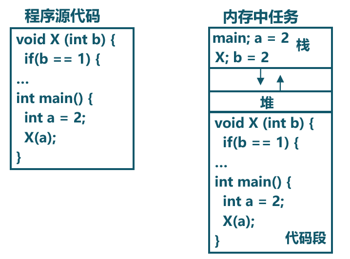
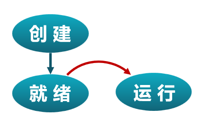
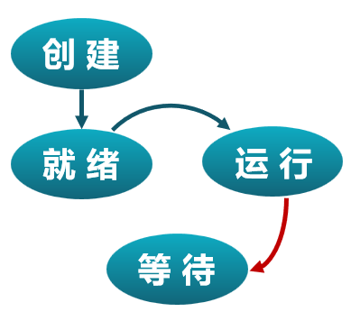
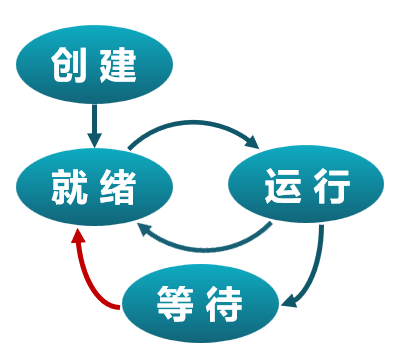
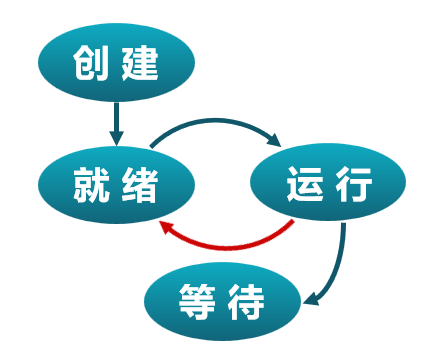
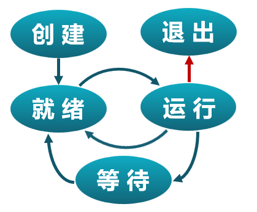
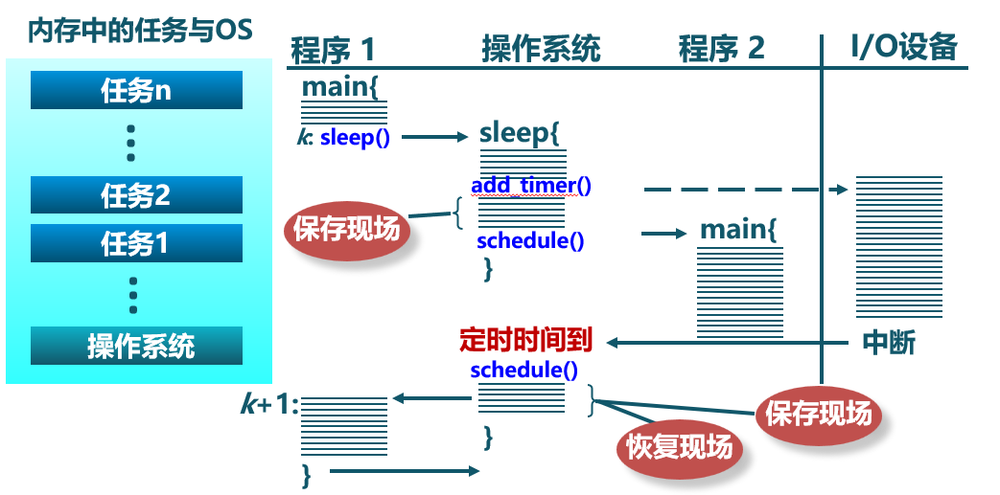

<!-- theme: gaia -->
<!-- _class: lead -->

# 第四讲 多道程序与分时多任务
## 第一节 进程和进程模型
 
 

向勇 陈渝 李国良 

 
 

2022年秋季

---
**提纲**

### 1. 多道程序与协作式调度
2. 分时多任务与抢占式调度
3. 进程的概念
4. 进程模型

---

#### 历史

操作系统的被广泛使用是从大型机向小型机（minicomputer）过渡的时期开始的。

- OS/360是大型机（System/360）时代的多道批处理操作系统
- 数字设备公司（DEC）的PDP系列小型计算机
- 一个工作单位内的一群人可能拥有自己的计算机
- 多道程序（multiprogramming）变得很普遍

---

#### 多道程序（Multiprogramming）

- 在内存中存在多个可执行程序
- 各个可执行程序共享处理器

作业(Job)
- 应用的一次**执行过程**

历史上出现过的术语：Job、Multiprogramming 
- Job和Multiprogramming是IBM用于多道程序设计的概念。

---

#### 协作式调度（Cooperative scheduling）

- 可执行程序主动放弃处理器使用 
- 操作系统不会打断正在执行的程序
- 操作系统选择下一个执行程序使用处理器

---
**提纲**

1. 多道程序与协作式调度
### 2. 分时多任务与抢占式调度
3. 进程的概念
4. 进程模型

---
#### 历史

小型机（minicomputer）的普及和广泛使用推动了分时多任务的需求，形成了支持多用户的分时操作系统。

- DEC公司的PDP、VAX小型机逐渐侵蚀大型机市场
- DEC公司的VMX操作系统
- MIT的CTSS操作系统
- AT&T的UNIX操作系统

---
#### 从用户的视角看分时多任务

分时多任务（Time sharing multitask）：从用户的视角看

- 在内存中存在多个可执行程序
- 各个可执行程序分时共享处理器
- 操作系统按时间片来给各个可执行程序分配CPU使用时间
- **进程(Process)** ：应用的一次执行过程

---
#### 从OS的视角看分时多任务（Time sharing multitask）

- **进程(Process)** ：一个具有一定**独立功能**的程序在一个**数据集合**上的一次动态**执行过程**。也称为**任务(Task)**。
- 从一个应用程序对应的进程切换到另外一个应用程序对应的进程，称为**进程切换**。

---
#### 作业（Job）、任务（Task）和进程（Process）

历史上出现过的术语：Job、Task、Process
- Task、Process是Multics和UNIX等用于分时多任务提出的概念
- 进程是一个应用程序的一次执行过程。在操作系统语境下，任务和进程是同义词
- 作业（目标）是围绕一个共同目标由一组相互关联的程序执行过程（进程、任务）形成的一个整体

参考：[Difference between Job, Task and Process](https://www.geeksforgeeks.org/difference-between-job-task-and-process/)

---
#### 抢占式调度（Preemptive scheduling）

- 进程被动地放弃处理器使用
- 进程按时间片轮流使用处理器，是一种“暂停-继续”组合的执行过程
- 基于时钟硬件中断机制，操作系统可随时打断正在执行的程序
- 操作系统选择下一个执行程序使用处理器

---
**提纲**

1. 多道程序与协作式调度
2. 分时多任务与抢占式调度
### 3. 进程的概念
4. 进程模型

---

#### 进程切换

---
#### 进程的特点
- 动态性
  - 开始执行-->暂停-->继续-->结束执行的过程
- 并发性
  - 一段时间内多个进程在执行
- 有限度的独立性
  - 进程之间不用感知对方的存在

目前还没具备更强大的特点
- 隔离更彻底、任务间协同工作、任务创建任务...... 

---
#### 进程与程序的组成

---
#### 进程与程序的组成

---
#### 进程与程序的对应关系

- 任务是操作系统处于执行状态程序的抽象
  - 程序 = 文件 (静态的可执行文件)
  - 任务 = 执行中的程序 = 程序 + 执行状态
 
- 同一个程序的多次执行过程对应为不同任务
  - 如命令“ls”的多次执行对应多个任务
 
- 任务执行需要的资源
  - 内存：保存代码和数据
  - CPU：执行指令

---
#### 任务与程序的区别

- 任务是动态的，程序是静态的
  - 程序是有序代码的集合
  - 任务是程序的执行
- 任务是暂时的，程序是永久的
  - 任务是一个状态变化的过程
  - 任务可长久保存
- 任务与程序的组成不同
  - 任务的组成包括程序、数据和进程控制块

---
#### 进程状态
进程包含了运行程序的所有状态信息
- 任务执行的**控制流**
  - 代码内容与代码的执行位置（代码段）
- 任务访问的**数据**
  - 被任务读写的内存（堆、栈、数据段）
  - 被任务读写的寄存器
    - 通用寄存器

---
#### 进程状态
进程包含了运行程序的所有状态信息
- 操作系统管理任务的相关数据（任务的**上下文**）
    - 任务切换所需的通用寄存器
    - 任务切换所需的状态寄存器(PC等)
    - 其他信息：任务的栈地址等
    - 其他资源：...... 

---
#### 任务控制块（TCB, Task Control Block）
操作系统管理任务的核心数据结构，也称为进程控制块（PCB, Process Control Block）
- 操作系统**管理控制进程运行**所用的信息集合
- 操作系统用TCB来描述进程的基本情况以及运行变化的过程
- TCB是进程存在的唯一标志
- 每个任务都在操作系统中有一个对应的TCB

---
#### 操作系统管理的进程控制块

---
**提纲**

1. 多道程序与协作式调度
2. 分时多任务与抢占式调度
3. 进程的概念
### 4. 进程模型

---
#### 进程状态：创建和就绪
- 创建 --> 就绪 
  - 何时创建？
  - 如何创建？

---
#### 进程状态：运行
- 创建-->就绪-->执行
  - 内核选择一个就绪的任务
  - 如何执行？

---
#### 进程状态：等待
- 创建-->就绪-->执行-->等待
  - 任务进入等待的原因?
    - 自身
    - 外界  

---
#### 进程状态变迁：唤醒
- 创建-->就绪-->执行--> 等待 -->唤醒
  - 唤醒任务的原因？
    - 自身：自然醒？
    - 外界：被叫醒？
       

---
#### 进程状态变迁：抢占
- 创建-->就绪-->执行--> 抢占
  - 任务被抢占的原因？
  

---
#### 进程状态：退出
- 创建--> 就绪 --> 执行 --> ...... -->结束
  - 任务退出的原因？
    - 自愿？
    - 被迫？

---
#### 三状态进程模型

---
#### 进程状态变迁与系统调用

- 创建--> 就绪 --> 执行 --> ...... -->结束
- 抢占 等待  唤醒

涉及哪些系统调用？
- exit
- sleep
- ......

---
#### 进程状态变迁与进程切换

- 创建--> 就绪 --> 执行 --> ...... -->结束
- 抢占 等待  唤醒

在任务的生命周期中，何时会进行任务切换？

---
#### 进程切换

