<!-- theme: gaia -->
<!-- _class: lead -->

# 第五讲 物理内存管理
## 第二节 内存分配
<br>
<br>

向勇 陈渝 李国良 

<br>
<br>

2022年秋季

---
**提纲**

### 1. 内存分配
2. 连续内存分配
3. 非连续内存分配

---

#### 内存分配方式
运行应用所占内存按存储数据特征划分成多个**段(Segment)**
* 内存分配方式
  - 静态内存分配
  - 动态内存分配
      - 连续内存分配
      - 非连续内存分配
* 内存管理的目的
  - 让应用方便/灵活/高效地使用有限的内存

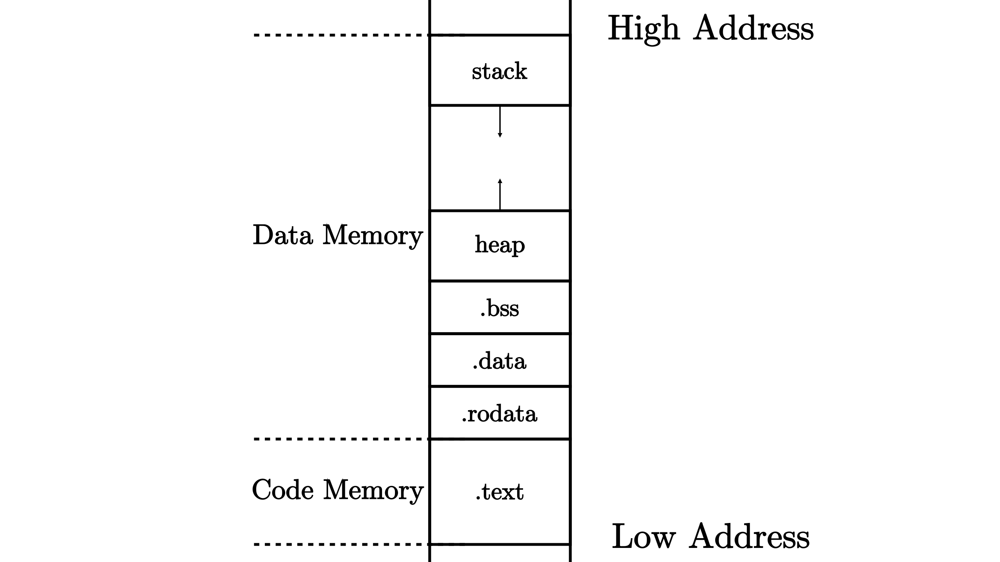

---

#### 动态内存分配接口

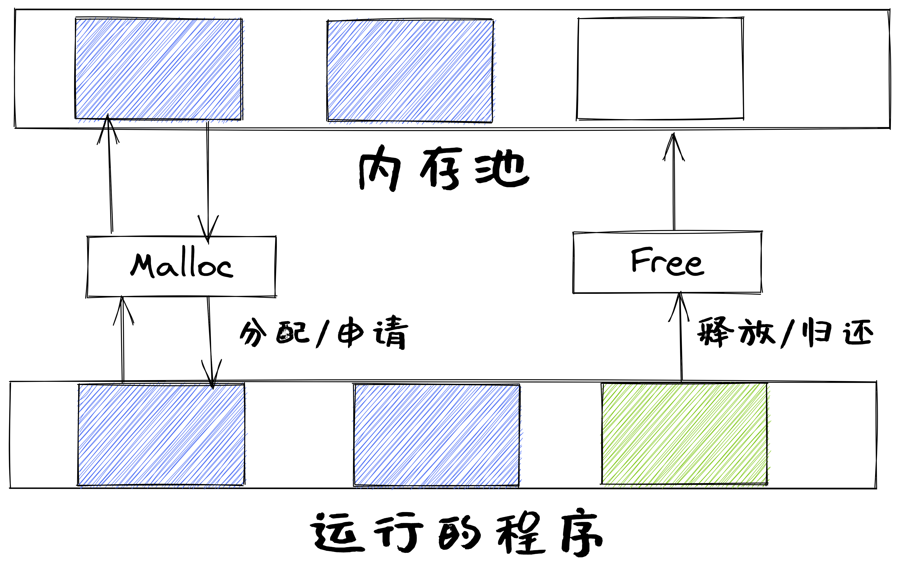

---

#### 静态内存分配

静态内存分配是指**编译时**的内存分配
 - 包括全局、静态变量和代码
 - 位于全局/静态数据段、常量数据段、代码段


---

#### 动态内存分配
动态内存分配是指**运行时**的内存分配
- 栈(stack)
  - 局部变量
- 堆(heap) 
  - `malloc()`函数分配内存
  - `free()`函数释放内存


---
#### 使用动态内存分配的原因
**无法事先确定**程序运行所需要的内存大小。
- 经常直到程序实际运行时，才知道某些数据结构的大小
- 在大型软件代码中硬编码数据大小会是一种噩梦


---
#### 动态内存分配方式的分类

- **显式分配**(explicit allocation)
  - 应用显式地释放任何已分配的块
- **隐式分配**(implicit allocation)
  - 编译器/运行时库自动释放未使用的已分配的块


---
#### 堆和栈的内存分配

分配方式：动态内存分配
- 栈由**编译器**管理：隐式分配
- 堆的分配和释放由**程序员**管理：显式分配

分配大小
- 栈是由高地址向低地址生长的数据结构，是一块连续的内存，能从栈中获得的内存**较小**，编译期间确定大小；
- 堆是由低地址向高地址生长的数据结构，是一个不连续的储存空间，内存获取比较灵活，也**较大**。


---
#### 动态内存分配函数`malloc()`

- `malloc()`函数: `void * malloc (size_ t size);`
  - 申请一块size大小的连续堆内存
  - 函数返回值是一个指针，指向刚分配的内存首地址
  - 如果申请内存失败， 返回一个空指针，即返回值为NULL

- 动态内存的分配和释放必须**成对使用**
  - 如果`malloc()`比`free()`多，会造成**内存泄漏**
  - 如果`malloc()`比`free()`少，会造成二次删除，**破坏内存**，导致程序崩溃
---

#### 动态内存回收函数`free()`
  
- `free()`函数：``void free (void *ptr)``
  - 释放指针变量在堆区上的内存空间
  - 不能释放栈上的内存空间
  - `free()`要与`malloc()`成对使用
---
**提纲**

1. 内存分配
### 2. 连续内存分配
- 动态分区分配
- 伙伴系统(Buddy System)
3. 非连续内存分配

---

#### 连续内存分配

**连续内存分配**是指给应用分配一块**不小于指定大小**的**连续**的内存区域
- **内存碎片**：不能被利用的空闲内存
  - **外碎片**：分配单元间未被使用内存
  - **内碎片**：分配单元内部未被使用内存 


---
#### 动态分区分配

动态分区分配是指，当程序被加载执行时或运行中数据存储时，分配一个进程指定**大小可变**的分区(内存块)
- 分区的地址是连续的
- 用户库/操作系统需要维护的**数据结构**
  - 已分配分区：已分配给应用的分区
  - 空闲分区(Empty-blocks)


---
#### 动态分区分配的设计要解决的问题
-  **空闲块组织**：如何记录空闲块？
-  **放置位置**：如何选择合适的空闲块来分配？
-  **分割**：如何处理没分配完的空闲块中的剩余部分？
-  **合并**：如何处理一个刚刚被释放的块？


---
#### 动态分区分配策略
  - 最先匹配(First-fit)
  - 最佳匹配(Best-fit)
  - 最差匹配(Worst-fit)


---
#### 最先匹配(First Fit)分配策略
- 优点：简单，在高地址空间有**大块的空闲分区**
- 缺点：**外碎片**，分配大块时较慢
- 示例：分配400字节， 使用第1个空闲块


---
#### 最佳匹配(Best Fit)分配策略
- **分配n字节分区**时， 查找并使用不小于n的最小空闲分区
- **释放分区**时，检查是否可与临近的空闲分区合并

- 示例：分配400字节， 使用第3个空闲块(最小)


---
#### 最佳匹配(Best Fit)分配策略
- 优点：多数申请分配的**尺寸较小**时，效果很好
- 缺点：**外碎片**，释放分区较慢，容易产生很多无用的小碎片


---
#### 最差匹配(Worst Fit)分配策略
- **分配n字节**时，使用尺寸大于n的**最大空闲分区**
- **释放分区**时，检查是否可与临近的空闲分区**合并**

- 示例：分配400字节，使用第2个空闲块（最大）


---

#### 最差匹配(Worst Fit)分配策略

- 优点：**中等大小**的分配较多时，效果最好
- 缺点：**外碎片**，**释放分区较慢**，容易破坏大的空闲分区


---
**提纲**

1. 内存分配
2. 连续内存分配
- 动态分区分配
### 伙伴系统(Buddy System)
3. 非连续内存分配

---

#### 伙伴系统(Buddy System)的需求背景

- 观察&分析
  - 基本的分配策略很简单和通用，但性能差，外碎片多 
  - 内核和应用的内存**需求特征**
    - 内核经常以$2^U$个4KB大小来分配和释放连续地址的内存块
    - 需要能**快速**地分配和释放，且不会产生**外碎片**
- 需要新的连续内存分配策略

---

#### 伙伴系统的工作原理


---
#### 分区大小
- 可分配分区的大小 $2^U$
- 待分配分区的大小为$2^{(U-1)} < s ≤ 2^U$
  - 把整块分配给应用；
- 待分配分区的大小为$s ≤2^{(i－1)}$
  - 将大小为$2^i$ 的当前空闲分区**划分成两个**大小为$2^{(i－1)}$空闲分区
  - **重复划分**过程，直到$2^{(i-1)} < s ≤ 2^i$,把一个空闲分区分配出去

<!--

-->

---
#### 分配过程
- 数据结构
  - 空闲块按大小和起始地址组织成二维数组
  - 初始状态：只有一个大小为$2^U$的空闲块
- 分配过程
  - 由小到大在空闲块中找最小可用块
  - 如空闲块过大，对可用空闲块进行二等分，直到得到合适可用空闲块

<!--

-->

---
#### 释放过程

- 释放过程
  - 把块放入空闲块数组
  - 合并满足条件的空闲块
- 合并条件
  - 大小相同$2^i$
  - 地址相邻
  - 低地址空闲块起始地址为$2^{(i＋1)}$的位数

<!--


http://en.wikipedia.org/wiki/Buddy_memory_allocation -->

---

#### 伙伴系统工作过程示例


---
#### 伙伴系统工作过程示例


---
#### 伙伴系统工作过程示例


---
#### 伙伴系统工作过程示例
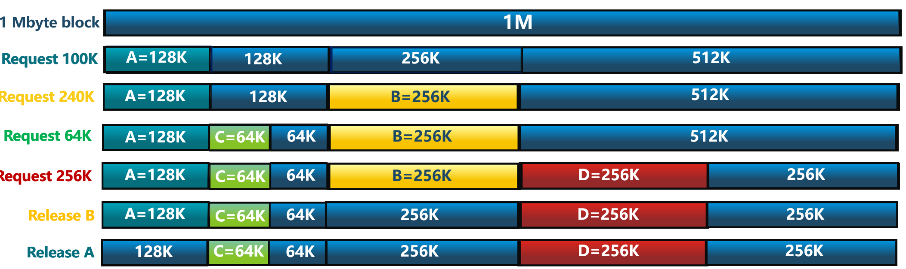


---
#### 伙伴系统工作过程示例


---
#### 伙伴系统的参考实现

* [buddy_system_allocator](https://crates.io/crates/buddy_system_allocator)：用Rust写的伙伴系统算法
* [buddy-system-in-ucore-test](https://github.com/ucore-test/buddy-system-in-ucore-test#buddy-system-in-ucore-test)：能够在c语言程序中调用buddy-system的接口

---
**提纲**

1. 内存分配
2. 连续内存分配
### 3. 非连续内存分配
- 非连续内存分配的概念
- 页式存储管理
- 内存分配示例

---

#### 非连续内存分配的需求背景：碎片问题
- 内核通过页表能够**把多个地址不连续的物理页转换为地址连续的多个虚拟页**
- 提供给应用程序和内核自身使用地址连续的虚拟内存块，这样可以比较轻松地解决**内存分配的碎片问题**


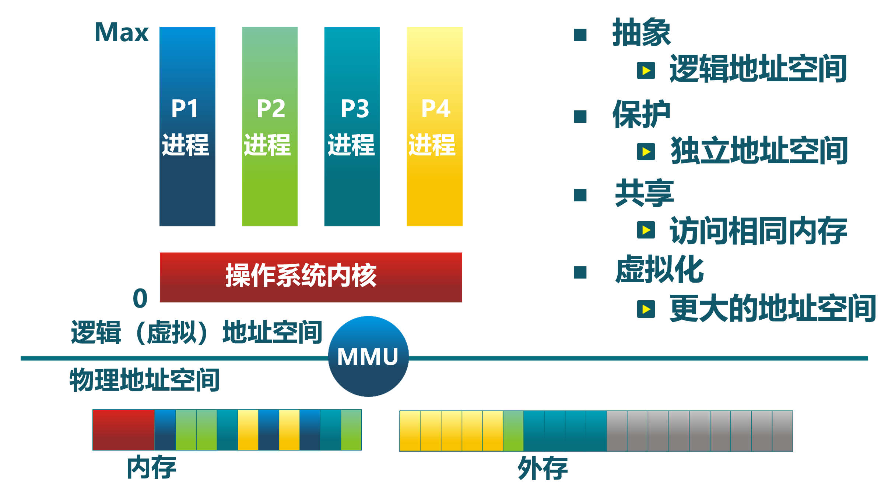

---

#### 非连续内存分配的需求背景：较大的内存空间
- 创建运行的程序时需要分配让其正常运行所需的**比较大的内存空间**
- 程序运行时会需要动态申请和释放比较大的内存空间
   - 通常用用户库发出请求
   - 减少系统调用次数
   - 一次申请$2^U$MB大小(如:64MB)的内存 

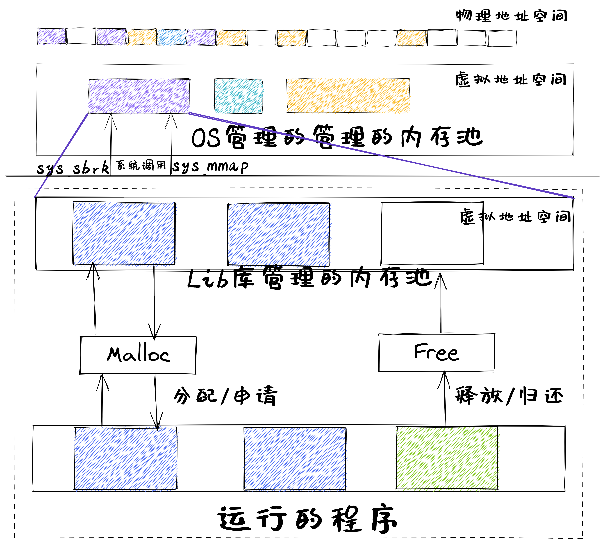

---

#### 非连续内存分配的设计目标

提高内存利用效率和管理灵活性
 - 允许一个程序使用**非连续**的物理地址空间
 - 允许**共享**代码与数据
 - 支持**动态**加载和动态链接


---

#### 非连续分配需要解决的问题
- 虚拟地址到物理地址的**地址转换**
    - 软件实现 （灵活，开销大）
    - 硬件实现 （够用，开销小）
- 非连续分配的**硬件辅助**机制
  - 如何选择非连续分配中内存块大小
    - 段式存储管理(segmentation)
    - 页式存储管理(paging)


---

#### 段式存储管理

程序运行的段地址空间由多个段组成
- 主代码段、子模块代码段、公共库代码段、栈段、堆数据(heap)...

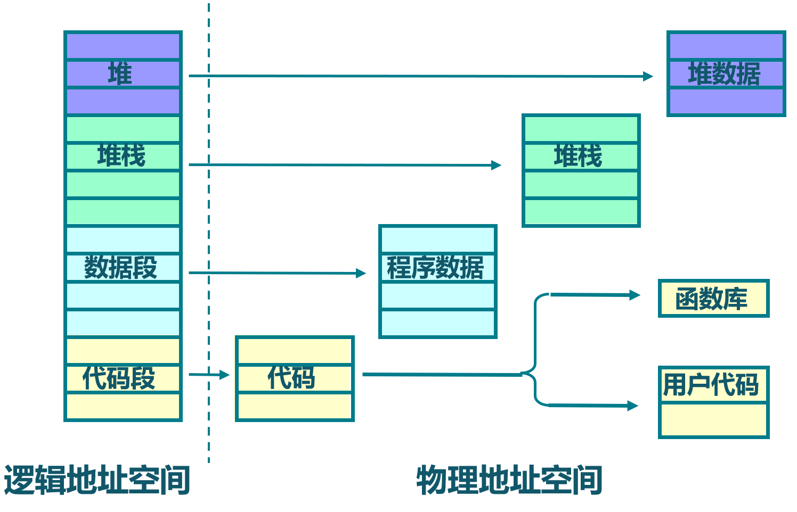

---

#### 段表

- 位于内存中
- 由内核管理
- 与任务/进程对应


---

**提纲**

1. 内存分配
2. 连续内存分配
3. 非连续内存分配
- 非连续内存分配的概念
### 页式存储管理
- 内存分配示例

---

#### 物理页面和逻辑页面
- 物理页面（页帧、帧, Frame, Page Frame）
  - 把物理地址空间划分为大小相同(2^n)的基本分配单位
- 逻辑页面（页面、页, Page) 
  - 把逻辑地址空间也划分为相同大小的基本分配单位
  - **物理页面和逻辑页面的基本单位大小是相同的**
- 逻辑页面到物理页面的对应
  - 逻辑地址到物理地址的地址转换
  - 硬件机制：页表/MMU/TLB

---

#### 页表

- 位于内存中
- 由内核管理
- 与任务/进程对应


---

#### 页式存储管理面临的性能挑战

- 内存访问性能
  - 访问一个内存单元需要2次内存访问
    - 第一次访问：获取页表项
    - 第二次访问：访问数据
- 页表大小
  - 页表可能非常大
  - 64位计算机系统中，如果每页1024字节，那么一个页表的大小会是多少？


---

#### 提高页式存储管理性能的方法

- 缓存（Caching）
- 间接（Indirection）访问
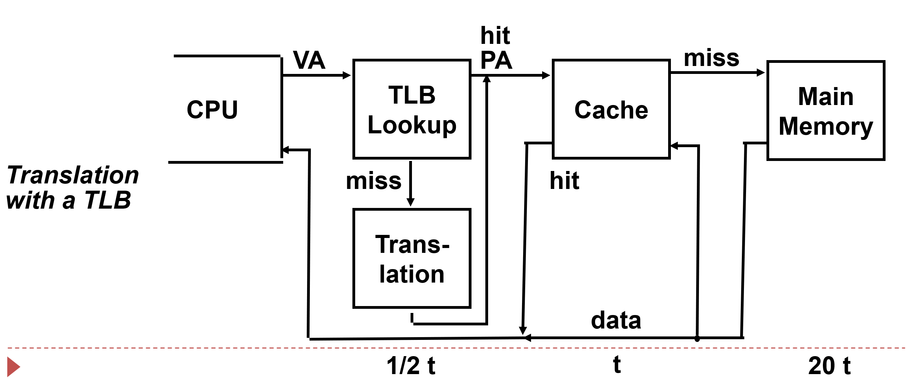

---

#### 多级页表

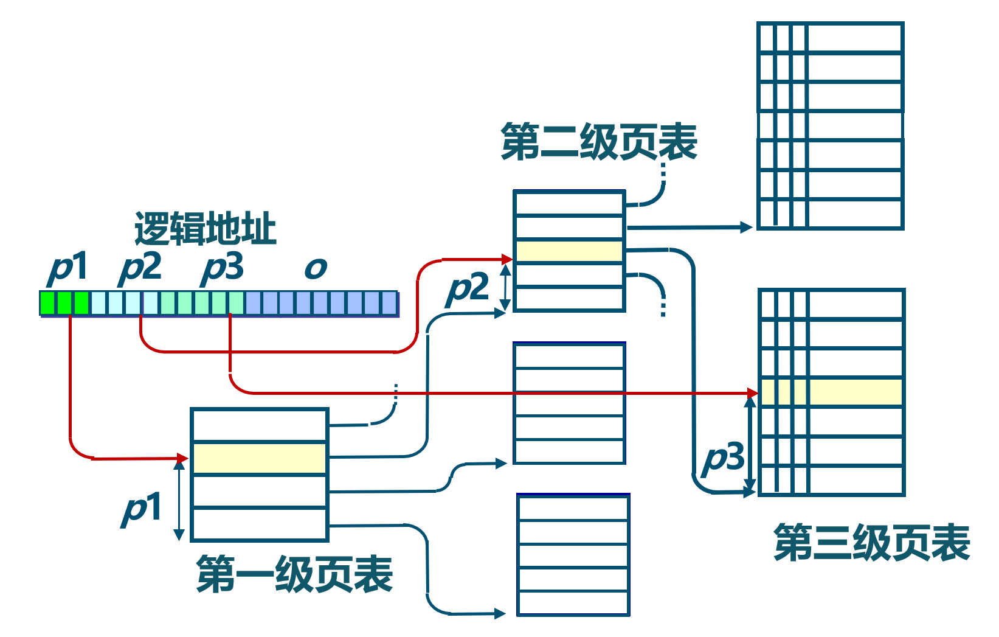


---

#### 多级页表的地址转换


---

#### 反置页表

基于Hash映射值查找对应页表项中的物理页号
- 任务/进程id与页号的Hash值可能有*冲突*
- 页表项中包括保护位、修改位、访问位和存在位等标识

---

#### 反置页表的地址转换


---

#### 反置页表的hash冲突
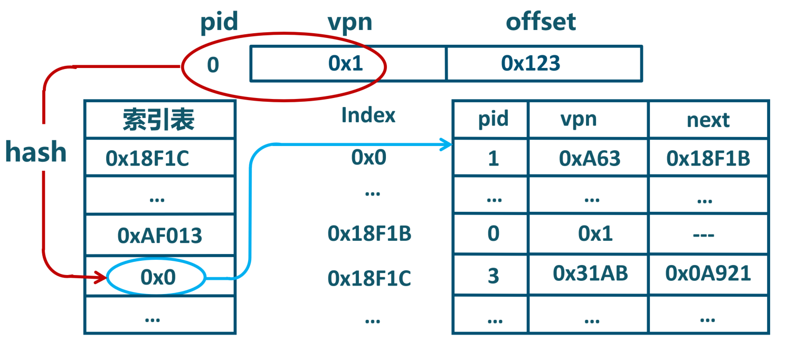


---

#### 反置页表的hash冲突


---

#### 反置页表的hash冲突
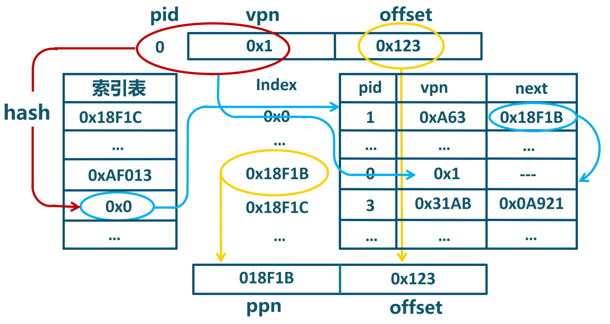


---

#### 段页式存储管理
- 段式存储在内存保护方面有优势，页式存储在内存利用和优化转移到后备存储方面有优势。
- 段式存储、页式存储能否结合？


---

#### 段页式存储管理


<!-- 2017ppt -->

---
**提纲**

1. 内存分配
2. 连续内存分配
3. 非连续内存分配
- 非连续内存分配的概念
- 页式存储管理
### 内存分配示例

---

#### 一个app调用malloc的例子
```C
#include <stdlib.h>
int main(){
int *ptr;
ptr = malloc(15 * sizeof(*ptr)); /* a block of 15 integers */
    if (ptr != NULL) {
      *(ptr + 5) = 480; /* assign 480 to sixth integer */
      printf("Value of the 6th integer is %d",*(ptr + 5));
    }
}
```


---

#### app的地址空间


---
#### 加载程序运行

第一步：OS加载程序运行


---

#### malloc函数调用

第二步：程序发出malloc函数调用，且Lib库**有空闲空间**
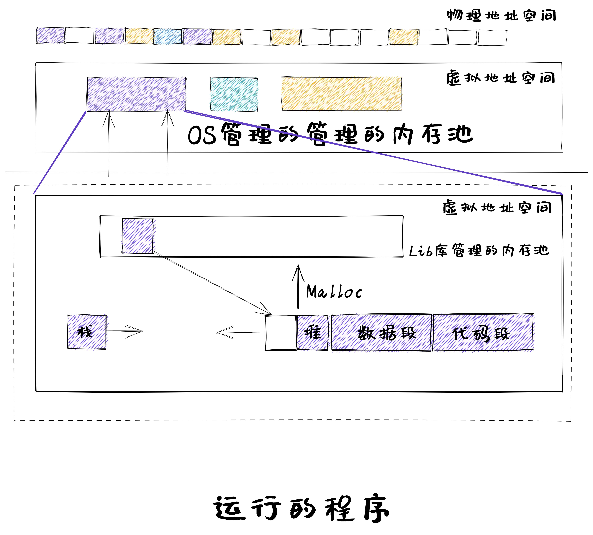


---
#### 内核分配内存空间
第二步：程序发出malloc函数调用，且Lib库**无空闲空间**
