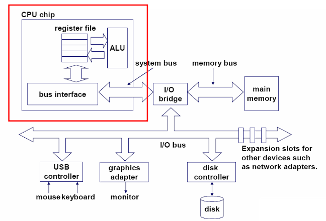
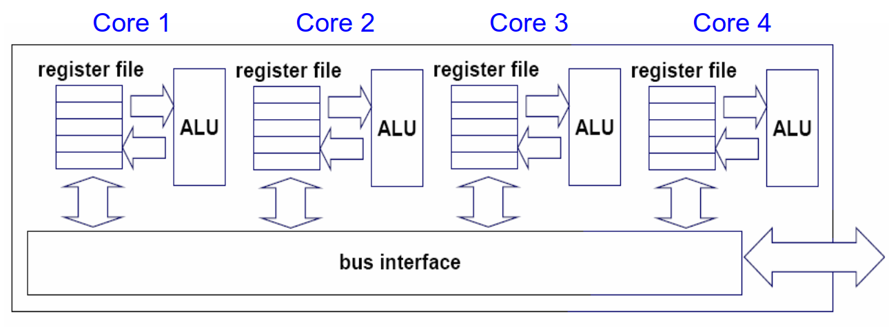
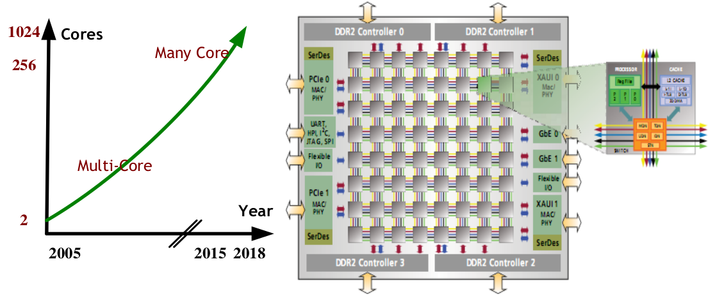
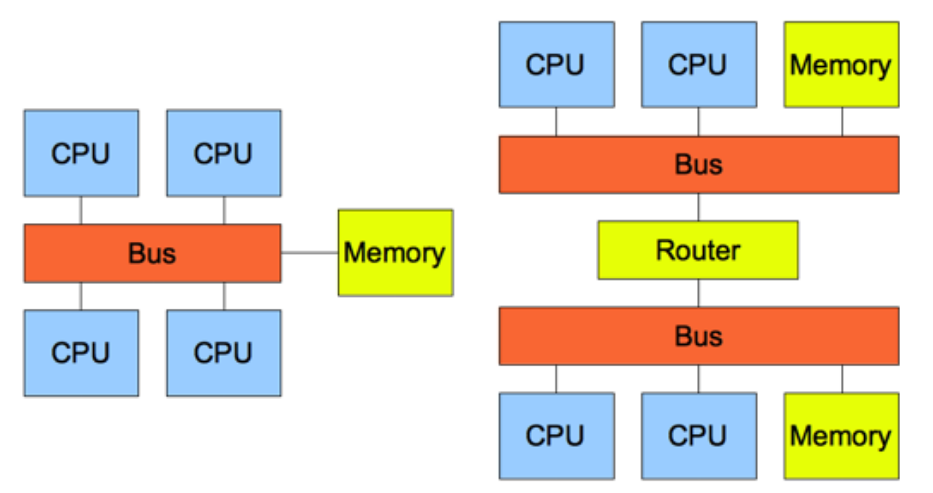
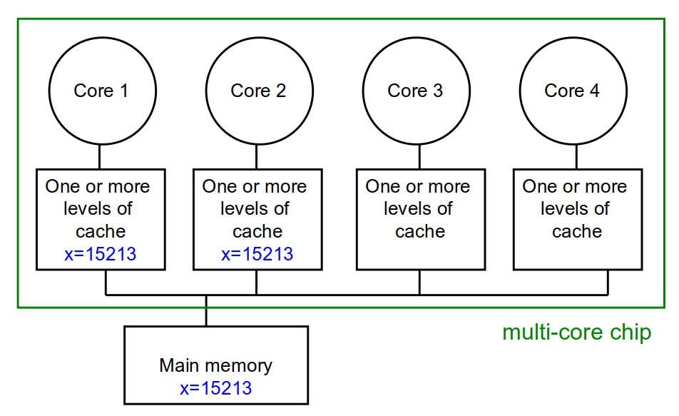

<!-- theme: gaia -->
<!-- _class: lead -->

# 第八讲 多处理器调度

## 第一节 对称多处理与多核架构

 
 

向勇 陈渝 李国良 

2022年秋季

---

**提纲**

### 1. 多处理机器
2. Cache一致性(Cache Coherence)

---

#### 单核处理器
 

---
#### 超线程(Hyperthread, Simultaneous multithreading)处理器
 

---
#### 多核(multi-core)处理器
 

---
#### 众核(many-core)处理器
 

---

**提纲**

1. 多处理机器
### 2. Cache一致性(Cache Coherence)

---

#### 对称多处理器(SMP)与非一致内存访问系统(NUMA)
 

---
#### Cache 一致性 (Cache Coherence)
 

---

#### Cache 一致性问题
