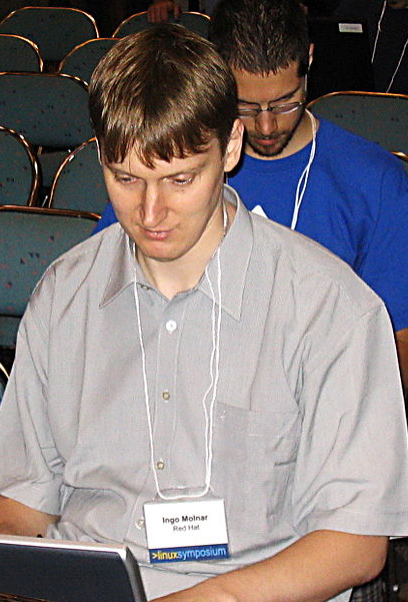
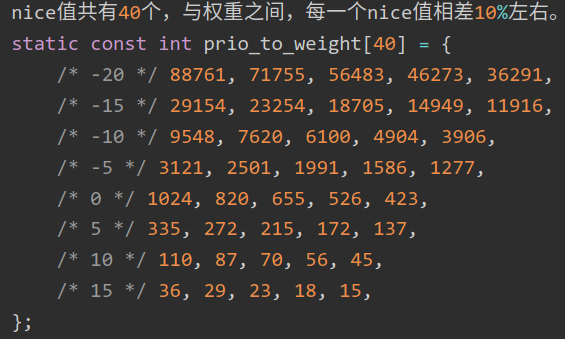
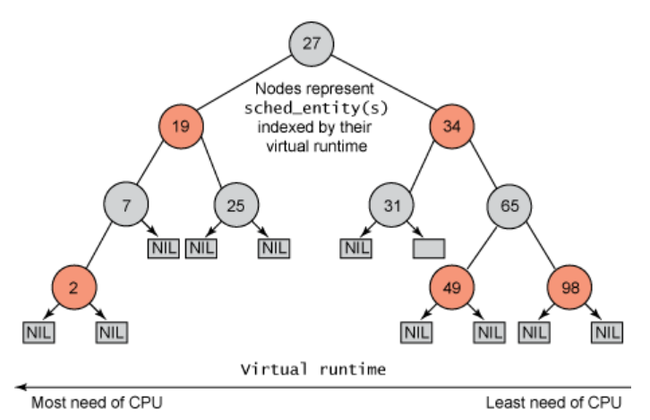

<!-- theme: gaia -->
<!-- _class: lead -->

# 第八讲 多处理器调度

## 第四节 Linux CFS 调度
完全公平调度(CFS, Completely Fair Scheduler)

<br>
<br>

向勇 陈渝 李国良 

2022年秋季

---

**提纲**

### 1. CFS的原理
2. CFS 的实现

---

#### CFS的背景
<!-- 万字长文，锤它！揭秘Linux进程调度器 https://www.eet-china.com/mp/a111242.html -->
- O(1)和O(n)都将CPU资源划分为时间片
    - 采用固定额度分配机制，每个调度周期的进程可用时间片是确定的
    - 调度周期结束被重新分配
- O(1)调度器本质上是MLFQ算法的思想
    - 不足：O(1)调度器对进程交互性的响应不及时
- 需求
    - 根据进程的运行状况判断它属于IO密集型还是CPU密集型，再做优先级奖励和惩罚
    - 这种推测本身存在误差，场景越复杂判断难度越大


---
#### CFS的背景

匈牙利人Ingo Molnar所提出和实现CFS调度算法
- 他也是O(1)调度算法的提出者

 

---
#### CFS 的思路
<!-- - CFS 不计算优先级，而是通过计算进程消耗的 CPU 时间（标准化以后的虚拟 CPU 时间）来确定谁来调度。从而到达所谓的公平性。 -->
- 摒弃固定时间片分配，采用**动态时间片分配**
- 每次调度中进程可占用的时间与进程总数、总CPU时间、进程权重等均有关系，每个调度周期的值都可能会不一样
- 每个进程都有一个nice值, 表示其静态优先级

 

---
#### CFS 的思路
- **把 CPU 视为资源**，并记录下每一个进程对该资源使用的情况
    - 在调度时，调度器总是选择消耗资源最少的进程来运行（**公平分配**）
- 由于一些进程的工作会比其他进程更重要，这种绝对的公平有时也是一种不公平
    - **按照权重来分配 CPU 资源**
 

---
#### CFS 的进程运行时间动态分配
- 根据各个进程的优先级权重分配运行时间
    - 进程权重越大, 分到的运行时间越多
`分配给进程的运行时间 = 调度周期 * 进程权重 / 所有进程权重总和`
- 调度周期
    - 将所处于 TASK_RUNNING 态进程都调度一遍的时间

<!--   -->


---
<!-- CFS（Completely Fair Scheduler） https://www.jianshu.com/p/1da5cfd5cee4 -->
#### CFS 的相对公平性
- 系统中两个进程 A，B，权重分别为 1， 2，调度周期设为 30ms，
- A 的 CPU 时间为：30ms * (1/(1+2)) = 10ms
- B 的 CPU 时间为：30ms * (2/(1+2)) = 20ms
- 在这 30ms 中 A 将运行 10ms，B 将运行 20ms

它们的运行时间并不一样。 公平怎么体现呢？

<!--   -->


---

#### CFS 的虚拟时间vruntime

* virtual runtime(vruntime)：记录着进程已经运行的时间
    * vruntime是根据进程的权重将运行时间放大或者缩小一个比例。
`vruntime = 实际运行时间 * 1024 / 进程权重`
    * 1024是nice为0的进程的权重，代码中是NICE_0_LOAD
    * 所有进程都以nice为0的进程的权重1024作为基准，计算自己的vruntime增加速度

---

#### CFS 的虚拟时间vruntime

以上面A和B两个进程为例，B的权重是A的2倍，那么B的vruntime增加速度只有A的一半。
```
vruntime = (调度周期 * 进程权重 / 所有进程总权重) * 1024 / 进程权重
         = 调度周期 * 1024 / 所有进程总权重
```
虽然进程的权重不同，但是它们的 vruntime增长速度应该是一样的 ，与权重无关。

<!-- O(n)、O(1)和CFS调度器  http://www.wowotech.net/process_management/scheduler-history.html 

Virtual runtime ＝ （physical runtime） X （nice value 0的权重）/进程的权重

通过上面的公式，我们构造了一个虚拟的世界。二维的（load weight，physical runtime）物理世界变成了一维的virtual runtime的虚拟世界。在这个虚拟的世界中，各个进程的vruntime可以比较大小，以便确定其在红黑树中的位置，而CFS调度器的公平也就是维护虚拟世界vruntime的公平，即各个进程的vruntime是相等的。

-->

---
#### CFS 的虚拟时间计算

所有进程的vruntime增长速度宏观上看应该是同时推进的，就可以用这个vruntime来选择运行的进程。

* 进程的vruntime值较小说明它以前占用cpu的时间较短，受到了“不公平”对待，因此下一个运行进程就是它。
* 这样既能公平选择进程，又能保证高优先级进程获得较多的运行时间。


---
#### CFS 的虚拟时间计算示例

CFS让每个调度实体（进程或进程组）的vruntime互相追赶，而每个调度实体的vruntime增加速度不同，权重越大的增加的越慢，这样就能获得更多的cpu执行时间。

     A每周期6时间片，B每周期3时间片，C每周期2时间片
     vruntime：
     A:   0  6  6  6  6  6  6  12 12 12 12 12 12
     B:   0  0  3  3  3  6  6  6  9  9  9  12 12
     C:   0  0  0  2  4  4  6  6  6  8  10 10 12
     调度：   A  B  C  C  B  C  A  B  C  C   B  C


<!--   -->


---

**提纲**

1. CFS的原理
### 2. CFS 的实现

---

#### 红黑树：CFS中进程vruntime数据结构
- Linux 采用了红黑树记录下每一个进程的 vruntime
    - 在多核系统中，每个核一棵红黑树
    - 调度时，从红黑树中选取vruntime最小的进程出来运行
 

---

#### CFS 的进程权重
- 权重由 nice 值确定，权重跟进程 nice 值一一对应
    - nice值越大，权重越低
- 通过全局数组 prio_to_weight 来转换
 


---

#### CFS中新创建进程的 vruntime如何设置？

- 如果新进程的 vruntime 初值为 0 的话，比老进程的值小很多，那么它在相当长的时间内都会保持抢占 CPU 的优势，老进程就要饿死了，这显然是不公平的。
 

---

#### CFS中新创建进程的 vruntime设置

- 每个 CPU 的运行队列 cfs_rq 都维护一个**min_vruntime 字段**
    - 记录该运行队列中所有进程的 vruntime 最小值
- 新进程的初始vruntime 值设置为它所在运行队列的min_vruntime
    - 与老进程保持在合理的差距范围内
 

---

#### CFS中休眠进程的 vruntime 一直保持不变吗？

如果休眠进程的 vruntime 保持不变，而其他运行进程的 vruntime 一直在推进，那么等到休眠进程终于唤醒的时候，它的 vruntime 比别人小很多，会使它获得长时间抢占 CPU 的优势，其他进程就要饿死了。
 


---

#### CFS中休眠进程的vruntime

- 在休眠进程被唤醒时重新设置 vruntime 值，以 min_vruntime 值为基础，给予一定的补偿，但不能补偿太多。
 


---

#### CFS中休眠进程在唤醒时会立刻抢占 CPU 吗？

- 休眠进程在醒来的时候有能力**抢占** CPU 是大概率事件，这也是 CFS 调度算法的本意，即保证交互式进程的响应速度，**交互式进程**等待用户输入会频繁休眠。
 

---

#### CFS中休眠进程在唤醒时会立刻抢占 CPU 吗？

- **主动休眠的进程**同样也会在唤醒时获得补偿，这类进程往往并不要求快速响应，它们同样也会在每次唤醒并抢占，这有可能会导致其它更重要的应用进程被抢占，有损整体性能。
- sched_features 的 WAKEUP_PREEMPT 位表示禁用唤醒抢占特性，刚唤醒的进程**不立即抢占**运行中的进程，而是要等到运行进程用完时间片之后

 


---

#### CFS中的进程在 CPU 间迁移时 vruntime 会不会变？
- 在多 CPU 的系统上，不同的 CPU 的负载不一样，有的 CPU 更忙一些，而每个 CPU 都有自己的运行队列，每个队列中的进程的vruntime 也走得**有快有慢**，每个CPU运行队列的 min_vruntime 值，都会有不同
 


---

#### CFS中的进程迁移

- 当进程从一个 CPU 的运行队列中**出来时**，它的 vruntime 要**减去**队列的 min_vruntime 值；
- 当进程**加入**另一个 CPU 的运行队列时，它的vruntime 要**加上**该队列的 min_vruntime 值。

 

---
#### CFS的vruntime 溢出问题

- vruntime 的类型 usigned long
- 进程的虚拟时间是一个递增的正值，因此它不会是负数，但是它有它的上限，就是unsigned long 所能表示的最大值
- 如果溢出了，那么它就会从 0 开始回滚，如果这样的话，结果会怎样？

 

---

#### CFS 的vruntime 溢出示例
```C
unsigned char a = 251;
unsigned char b = 254;
b += 5;
//b溢出，导致a > b，应该b = a + 8
//怎么做到真正的结果呢？改为以下：
unsigned char a = 251;
unsigned char b = 254;
b += 5;
signed char c = a - 250, 
signed char d = b - 250;
//到此判断 c 和 d 的大小
```
 

---

#### Linux调度器的[模块化](http://www.wowotech.net/process_management/scheduler-history.html)


---
### 参考文献
-  https://www.eet-china.com/mp/a111242.html
-  https://www.jianshu.com/p/1da5cfd5cee4
-  https://developer.ibm.com/tutorials/l-completely-fair-scheduler/
-  http://www.wowotech.net/process_management/scheduler-history.html

---

### 课程实验三 进程及进程管理

* 第五章：进程及进程管理 -> chapter5练习 -> 
    * [rCore](https://learningos.github.io/rCore-Tutorial-Guide-2022A/chapter5/4exercise.html)
    * [uCore](https://learningos.github.io/uCore-Tutorial-Guide-2022A/chapter5/4exercise.html)
* 实验任务
    * spawn 系统调用
    * stride 调度算法
* 实验提交要求
    * 任务布置后的第11天（2022年11月13日）；
