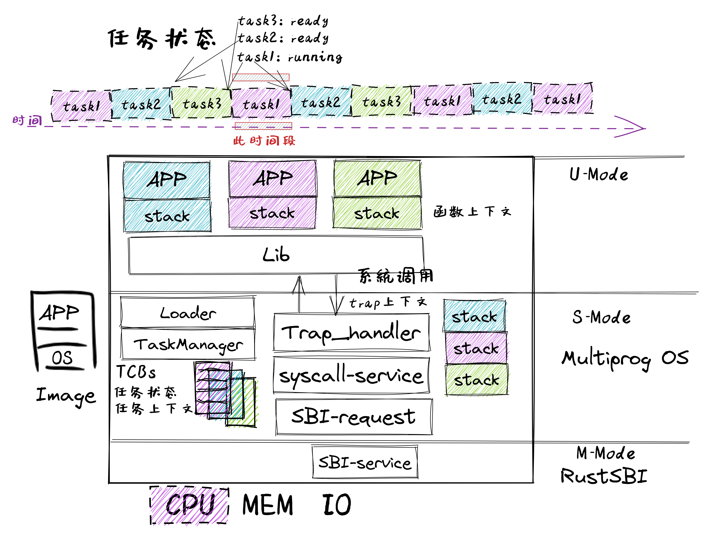

<!-- theme: gaia -->
<!-- _class: lead -->

# 操作系统课程-2002春
## 实践与实验介绍

 

向勇 陈渝 李国良 

 

2022年春季

---
### 目标
让学生通过OS实践来深入地理解OS原理
- 硬件简单
- 软件简洁
- 循序渐进
- 理技结合
- 应用驱动
- 生物进化

---
### 策略
让学生通过OS实践来深入地理解OS原理
- 硬件简单  --  RISC-V 64 支持OS的最小硬件子集
- 软件简洁  --  采用Rust语言的抽象能力和高安全设计
- 循序渐进  --  随着知识点扩展来扩展OS实践
- 理技结合  --  原理的知识点与OS实践内容对应
- 应用驱动  -- OS功能扩展全来自于应用的需求
- 生物进化  -- 实践逐步形成的多个OS类似生命进化中形成的各种生物
  
---
### 基本思路
    - 理解式学习：编写应用，并通过分析应用与OS的执行过程，掌握OS原理
    - 构造式学习：深入OS内部实现，参考/基于这些OS，扩展某些相对完整的OS功能
- 强调实践
    - 提供十几个由简单到相对复杂的渐进式OS实例
    - 提供OS的详细设计实现文档、多种测试用例、自动测试环境
- 原理与实践结合
   -  课程上讲的OS原理和概念在实践或实验中基本上有对应
   -  原理和实践有共同点和差异点
   -  原理和实践相互补充和支持
      
---
### 在线信息
#### 课程实践内容 -- rCore Tutorial Book v3
-  [课程实践参考书](https://learningos.github.io/rCore-Tutorial-Book-v3/)，[课程实践代码](https://github.com/rcore-os/rCore-Tutorial-v3)，[课程实践代码的API文档](https://learningos.github.io/rCore-Tutorial-v3/)

#### 课程实验内容 -- rCore Tutorial Guide 2022 Spring
- [实验文档](https://github.com/LearningOS/rCore-Tutorial-Guide-2022S/)  , [API文档](https://github.com/LearningOS/rCore-Tutorial-Guide-2022S/) , [实验代码](https://github.com/LearningOS/rCore-Tutorial-Code-2022S)，[测试用例](https://github.com/LearningOS/rCore-Tutorial-Test-2022S) 

#### 课程参考文档 --教材/课件
- [课程在线Slides](http://learningos.github.io/os-lectures/)，[Operating Systems: Three Easy Pieces](https://pages.cs.wisc.edu/~remzi/OSTEP/)
- [深入了解计算机系统](https://hansimov.gitbook.io/csapp/)，[RISC-V Reader中文版](http://riscvbook.com/chinese/RISC-V-Reader-Chinese-v2p1.pdf)

---
### 课程设计
- 课程内容
  - 48学时，16次课 
- 实践内容
  - 32学时，5次实验

---
### 课程设计
- 课程内容

---
### 实践 1: UNIX/Linux APP 

  - "系统调用"
  - 例子，用C语言，来自UNIX（例如Linux、macOS、FreeBSD）

            fd = open("out", 1);
            write(fd, "hello\n", 6);
            pid = fork()
- 能理解和编写包含操作系统进程/文件等相关的简单命令行Linux程序

---
### 实践 2: 裸机程序：LibOS             
  - 软硬件启动，函数调用，SBI调用

- 能编写裸机程序

---
### 实践 3: Batch OS  
  - 特权级: U-Mode, S-Mode
  - **特权级切换**
  - **陷入上下文**
  - 编译多应用+OS的镜像
  - 加载并执行应用
  - 能编写批处理操作系统

---
### 实践 4-1: MultiProg OS  
   - 任务的概念
   - 任务的设计实现
   - **协作**/抢占式调度
   -  **任务上下文** 
   -  **陷入上下文**
   - **切换任务**
   - **切换特权级**
 

--- 
### 实践 4-2: TimeSharing OS  
   - **中断**
   - **中断响应**
   - 协作/**抢占式**调度
   -  **陷入上下文**
   -  **任务上下文** 
   - **切换任务**
   - **切换特权级**
 

---
### 实践 5： AddrSpace OS   
App/OS内存布局
- .text: 数据段
- .data：可修改的全局数据。
- 未初始化数据段 .bss
- 堆 （heap）向高地址增长
- 栈 （stack）向低地址增长

---
### 实践 5： AddrSpace OS  
- 地址空间
- 物理地址
- 页表
-  **陷入上下文**
-  **任务上下文** 
-  **中断响应**

 

---
### 实践 5： AddrSpace OS  
- 应用地址空间
- 内核地址空间
- **切换任务**
- **切换特权级**
- **切换页表**
  

---
### 实践 6：Process OS  
  - Process
    - Trap
    - Task
    - Address Space
    - state
    - relations
    - exit code
 

---
### 实践 6：Process OS  
  - fork
  - exec
  - exit
  - wait

 

---
### 实践 6：Process OS   
   - PCB 

---
### 实践 7: Filesystem OS  
- 文件系统层次结构
- 块设备驱动
- 块缓冲区
- EasyFS
- Virtual FS
- 进程的文件描述符表
- 文件相关系统调用

---
### 实践 7: Filesystem OS  
- 文件系统在操作系统中的位置

---
### 实践 7: Filesystem OS  
- 进程的文件描述符表
- 文件相关系统调用

---
### 实践 8: IPC OS
支持进程间通信和异步消息机制
- 管道（PIPE）
- 信号（Signal）

---
### 实践 8: IPC OS
对进程控制块的扩展
- 管道也是一种文件
- 支持I/O重定向

---
### 实践 9: Thread OS
- 用户态管理的用户态运行的线程
- 内核态管理的用户态运行的线程

---
### 实践 9: Thread OS
- 协程结构
- 线程结构
- 进程结构

---
### 实践 10: SyncMutex OS
对进程控制块扩展，支持线程同步互斥访问共享变量
- Mutex
- Semphore
- Condvar

---
### 实践 10: SyncMutex OS
对进程控制块扩展，支持线程同步互斥访问共享变量
- Mutex
- Semphore
- Condvar

---
### 实践 11: Device OS
支持块设备/串口等外设
- 内核态中断响应
- DMA
- 轮询
- 设备<-->内存间数据传输
- 同步互斥保护

---
实验 1 ：获取任务信息

- 预先学习完成 实践 1--4

内容

我们的系统已经能够支持多个任务分时轮流运行，我们希望引入一个新的系统调用 sys_task_info 以获取当前任务的信息

---
实验 2 ：完成mmap和munmap系统调用功能

- 预先学习完成 实践 1--5

内容

- 引入虚存机制后，原来内核的 sys_get_time 和 sys_task_info 函数实现就无效了。请你重写这个函数，恢复其正常功能。
- mmap 在 Linux 中主要用于在内存中映射文件， 本次实验简化它的功能，仅用于申请内存。请实现 mmap 和 munmap 系统调用

---
实验 3 ：完成spawn系统调用功能

- 预先学习完成 实践 1--6
- 
内容

实现一个完全 DIY 的系统调用 spawn，用以创建一个新进程。

---
实验 4 ：实现文件的硬链接功能

- 预先学习完成 实践 1--7

内容

硬链接要求两个不同的目录项指向同一个文件，在我们的文件系统中也就是两个不同名称目录项指向同一个磁盘块。要求实现三个系统调用 sys_linkat、sys_unlinkat、sys_stat 。

---
实验 5 ：实现文件的硬链接功能

- 预先学习完成 实践 1--10

内容

完成对基于信号量/条件变量的同步互斥多线程程序的死锁检测

---
<!-- theme: gaia -->
<!-- _class: lead -->

# 谢谢！