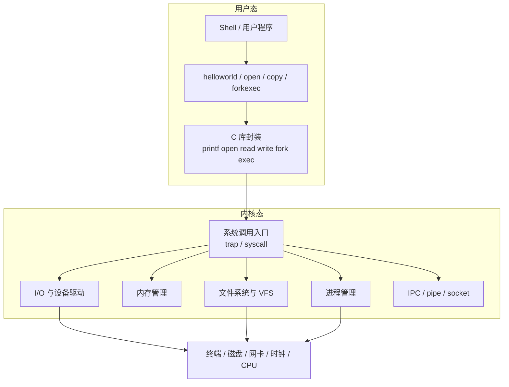
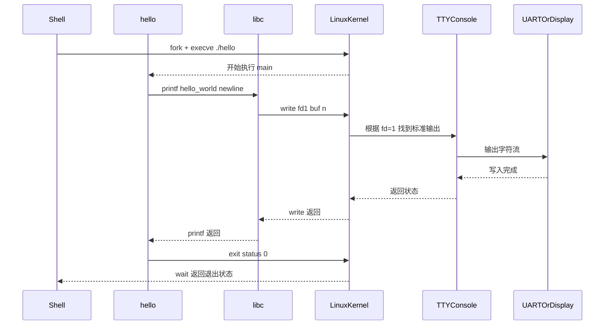
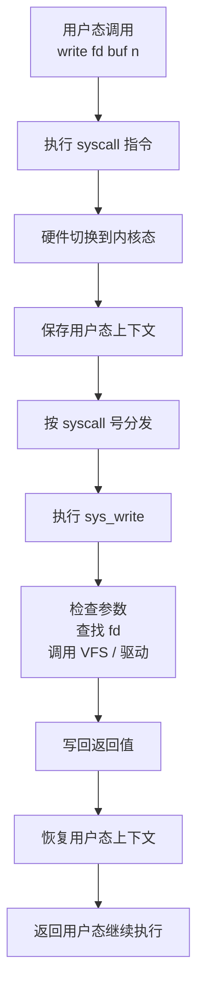
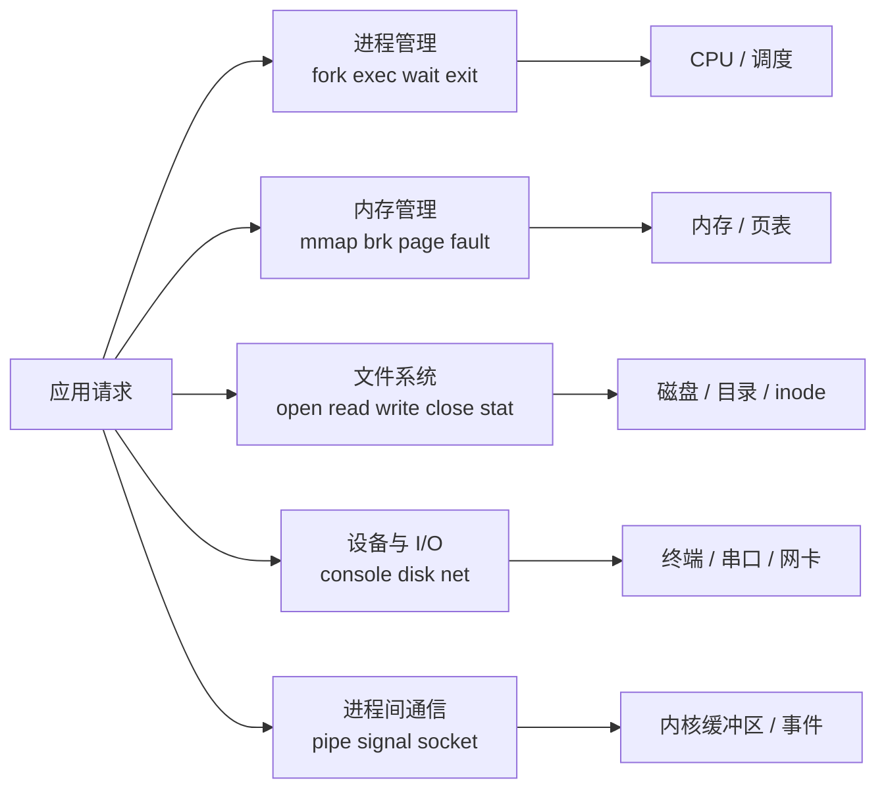
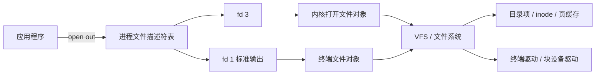
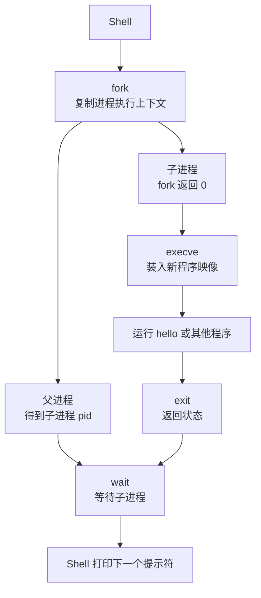
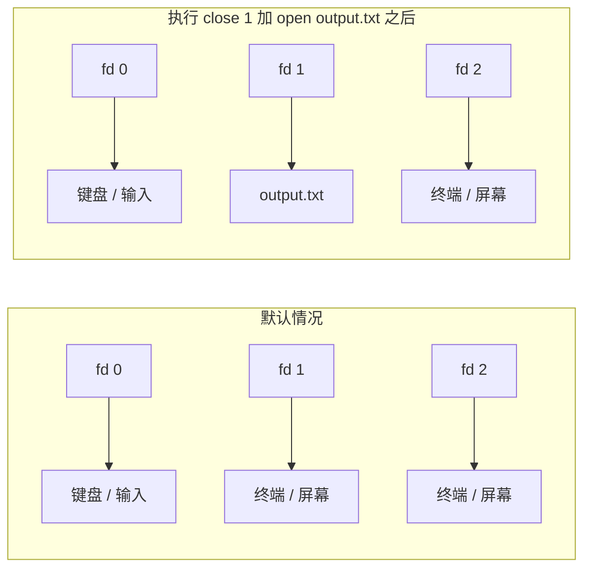
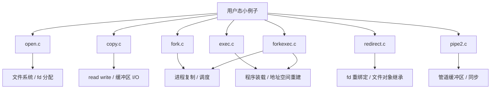

<!-- theme: gaia -->
<!-- page_number: true -->
<!-- _class: lead -->

## 第一讲 操作系统概述

### 第六节 Linux 内核服务总体架构

 
 

向勇 陈渝 李国良 任炬

 
 

2026年春季

---

## 问题

- `helloworld` 为什么不能直接把字符写到硬件上？
- `open`、`copy`、`fork`、`redirect`、`pipe` 为什么都要经过内核？
- Linux 内核到底提供了哪些服务？这些服务如何组合起来？

---

## 总体主线

- 用户程序看到的是函数和文件描述符
- 内核看到的是进程、地址空间、文件对象、设备对象和缓冲区
- 硬件访问被统一封装成受保护的内核服务

---

## `helloworld` 如何得到输出服务

- `helloworld` 并不知道屏幕或串口的寄存器地址
- 它只知道调用 `printf` 或 `write`
- 内核负责把“标准输出”翻译成真正的终端或串口设备

---

## 一次系统调用内部发生了什么

- 看起来像函数调用，本质上是受保护的内核入口
- 应用不能直接跳进任意内核代码，只能通过规定好的系统调用接口
- 这保证了安全性，也让不同程序共享通用服务

---

## Linux 内核服务的总体分工

- `fork/exec/wait/exit` 对应进程管理服务
- `open/read/write/close/stat` 对应文件系统与 I/O 服务
- `pipe`、`signal`、`socket` 对应通信服务
- 各类服务共用同一个系统调用边界

---

## 文件与 I/O：`open / read / write / close`

- `open()` 返回的是文件描述符，不是直接返回“磁盘块”
- `read()` 和 `write()` 总是先根据 `fd` 找到内核中的打开文件对象
- 这样同一套接口既能访问普通文件，也能访问终端、管道、设备

---

## 进程服务：`fork / exec / wait / exit`

- Shell 本身并不实现“运行别的程序”的全部细节
- 它依赖内核的进程创建、程序装载和等待回收服务
- `fork + exec + wait` 是 UNIX/Linux 非常经典的组合方式

---

## 重定向：为什么改 `fd=1` 就够了

- 程序只会向 `fd=1` 写数据，不需要知道它后面连的是屏幕还是文件
- 重定向的关键不在应用本身，而在 Shell 和内核共同维护的文件描述符绑定
- 这说明内核抽象强调“统一接口、可替换后端”

---

## 管道：`pipe` 如何提供进程间通信

- `pipe()` 创建两个文件描述符：一个读端，一个写端
- 数据并不是直接从一个用户进程内存拷到另一个用户进程内存
- 内核提供缓冲、同步和阻塞唤醒机制，因此管道能安全工作

---

## 从 `p5-tryunix` 的例子看内核服务

- `open.c` 强调“名字 -> 文件对象 -> 文件描述符”
- `copy.c` 强调“文件访问其实统一成 `read/write`”
- `fork/exec/forkexec` 强调程序执行依赖进程管理服务
- `redirect` 和 `pipe2` 强调 UNIX 抽象具有很强的组合能力

---

## `helloworld` 到各个服务的联系

- `printf("hello world\\n")`
  - 常经过 libc，最终调用 `write`
- `write(fd=1, buf, n)`
  - 用到文件描述符、VFS、终端驱动
- Shell 启动 `./hello`
  - 用到 `fork + execve + wait`
- 程序运行本身
  - 用到调度器、地址空间、栈和代码段
- 最终看到字符输出
  - 依赖终端设备和驱动程序

---

## 为什么由内核统一提供这些服务

- 硬件访问需要保护，不能让任意应用直接操作设备和内存
- 不同程序都需要进程、文件、通信等共性能力，适合由内核统一实现
- 内核提供统一抽象后，应用只需面对少量简单接口
- 这些接口还能组合出重定向、管道、Shell 执行等强大机制

---

## 小结

- 用户程序通过 `C 库 -> 系统调用 -> 内核服务` 获得能力
- Linux 内核把硬件访问封装成进程、内存、文件、I/O、IPC 等抽象
- `helloworld`、`open`、`copy`、`forkexec`、`redirect`、`pipe2` 都只是这些抽象的不同组合
- UNIX/Linux 接口数量不多，但表达力很强，这正是其经典之处
