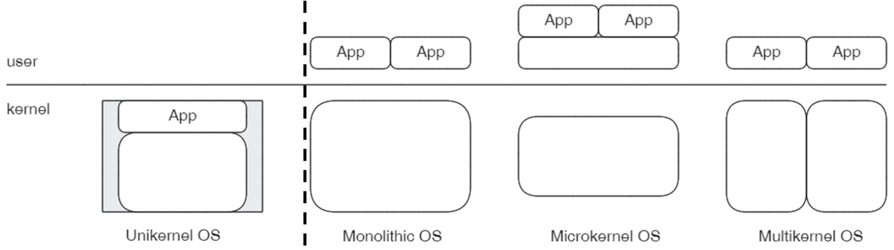

<!-- theme: gaia -->
<!-- _class: lead -->

## 第一讲 操作系统概述
### 第一节 课程概述 & 教学安排

 
 

向勇 陈渝 李国良 任炬 

 

2025年秋季

[课程幻灯片列表](https://www.yuque.com/xyong-9fuoz/qczol5/xpvcf129pvf3fuxb)

---

## 问题

- 我要学操作系统课吗？
- 秋季学期的操作系统课是如何安排的？
- 我打算如何学操作系统课？

---

## 课程信息

### 主讲教师：
  - 向勇 陈渝 李国良 任炬 

### 助教
  - 郑友捷、苏明贤、岳凯

---

## 上课信息

### 上课时间地点
- 时间
  - 周一下午第4节(15:20-16:55) 
  - 周四上午第2节(09:50-11:25) 
- 地点
   - 六教6A213

----

## 预备知识

### 程序设计语言（汇编、C 和 Rust）
 - :confounded: 不是开发应用程序
 - :smile: 而是开发系统程序

### 数据结构
 - :smile: 理解基本数据结构即可

---

## 预备知识
### 计算机组成原理
 - :smile: :smile: :smile: 刘总/康总/陆总的 RISC-V 原理 
 - :smile: Patterson 的 RISC-V 原理

### 编译原理
 - :smile: 没学过影响不大 
 - :smile: 但还是要了解高级语言 <–>RISC-V 汇编语言

---

#### 课程参考
- [课程幻灯片列表](https://www.yuque.com/xyong-9fuoz/qczol5/xpvcf129pvf3fuxb)
- 参考书
  - [Operating Systems: Three Easy Pieces](https://pages.cs.wisc.edu/~remzi/OSTEP/)
  - [深入了解计算机系统](https://hansimov.gitbook.io/csapp/)
  - [RISC-V Reader中文版](http://riscvbook.com/chinese/RISC-V-Reader-Chinese-v2p1.pdf)
#### 课程实践：rCore Tutorial Book v3
-  [课程实践参考书](https://learningos.github.io/rCore-Tutorial-Book-v3/)
-  [课程实践代码仓库](https://github.com/rcore-os/rCore-Tutorial-v3)
-  [课程实践代码的API文档](https://github.com/rcore-os/rCore-Tutorial-v3#os-api-docs)

---

### 实验指导

#### uCore Tutorial

- [实验代码](https://github.com/LearningOS/uCore-Tutorial-Code-2025A/)
- [实验文档](https://learningos.github.io/uCore-Tutorial-Guide-2025A/)
- [测试用例](https://github.com/LearningOS/uCore-Tutorial-Test-2025A/)

---

### 实验指导

* rCore Tutorial
  - [实验文档](https://learningos.github.io/rCore-Tutorial-Guide-2025A/)
  - [API文档](https://github.com/LearningOS/rCore-Tutorial-Guide-2025A/#os-api-docs-of-rcore-tutorial-code-2022a) 
  - [实验代码](https://github.com/LearningOS/rCore-Tutorial-Code-2025A)
  - [测试用例](https://github.com/LearningOS/rCore-Tutorial-Test-2025A)
* [uCore和rCore实验帮助](https://www.yuque.com/xyong-9fuoz/qczol5/miqaip1ig4005ogm)
  - 讲解视频
  - 部分内容将逐步更新

---

### OS 原理与设计思想

- 操作系统结构
- 中断及系统调用
- 内存管理
- 进程管理
- 处理机调度
- 同步互斥
- 文件系统
- I/O 子系统

---

## 作业与实验

* **平时作业**
  - 课后练习：包括问答题和编程题目，要求在deadline前提交

* **基础实验**
  - （必做）：面向 RISC-V CPU 用 Rust/C 设计实现操作系统的功能
  - （选做）：难度和工作量比必做题目大的其它题目

* **课程设计（Rust）**
  - 用组件来组合操作系统内核 
  - 参加全国大学生OS比赛

---

### 操作系统课关于AI工具的使用约定

- 操作系统课鼓励使用各种AI工具来帮助OS
  - AI助教可以同学们及时获取可能的帮助
  - AI助教可以减少助教老师的工作量
- 工具使用者需要对使用工具的后果负责
  - AI工具给出的建议可以能幻觉
  - 许多复杂问题无法完全靠工具来完成
  - 考试时不允许使用AI工具
  - “老师用AI工具出题，同学用AI工具回答”应该不是大家希望的状态

---
## 基础实验
* 实验一：操作系统的基本支持
* 实验二：地址空间
* 实验三：进程管理与调度
* 实验四：文件系统与进程间通信
* 实验五：同步互斥

**注意：每次实验的必做题和选做题的提交截止时间相同。**

---
## 课程设计(Rust语言)

* **用组件来组合操作系统内核**
  * unikernel: ArceOS
    * [arceos-tutorial-v2](https://github.com/scPointer/arceos-tutorial-v2/)
  * 宏内核: StarryOS
  * hypervisor: AxVisor
  * 微内核: ReL4
  * 异步操作系统: AsyncOS
* 开源操作系统社区项目

<!--
出处： https://www.zhihu.com/question/667354659
-->

* 往届同学的[课程设计成果](https://shimo.im/docs/QTPRT8h8jyGQCqkJ)

---

## 成绩评定

### 选择1：（总分不超过100） 
  - 实验一~五必做题目： 30% ；期中考试 30% ； 期末考试 40%
  - 平时作业加分：每做一次平时作业加0.5分，最高加5分，且课程总评成绩总分不超过100分
  - 选做实验题加分：每做一个选做实验题，可得到相应分值，但是选做+必做实验题的总分不超过30分

---

### 选择2： 
  - 四周内完成实验一~五(2025秋实验)：30% 
  - 课程设计（即大实验）：70%

**注：选择大实验的同学如果后续退出课程设计，需参加考试。**

---

## 选课问卷

[2025年秋学期操作系统课选课问卷](http://oscourse2019.mikecrm.com/uNEDRhh)
- 访问密码：PkmG1kd1h
- 请大家在第二节课前及时填写问卷，以便我们更好地上课。

---

## 总结

- 操作系统课是计算机系的核心基础课，讲解操作系统的基本原理（资源管理和运行环境），通过实验来学习和运用基本原理
- 秋季学期的操作系统课持续12周，主要要求是实验和期中和期末考试
  - 大实验可以替代考试
- 基于选课目标确定用多少精力来学操作系统课
  - 从事计算机专业的工作，多少都需要了解操作系统的原理的
  - 对计算机底层技术有兴趣的同学，通过做好实验来比较透彻地掌握和运行操作系统的原理
