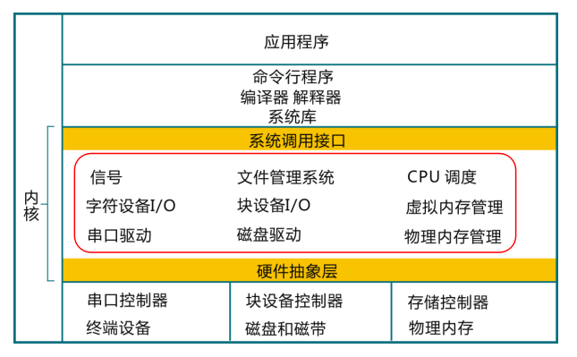
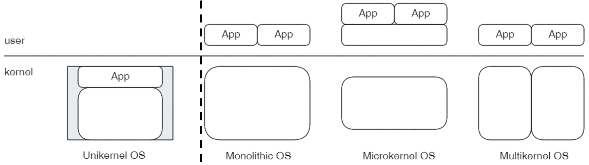

<!--PUPPETEER_TIMEOUT=90000 marp p1-intro.md --pdf --allow-local-files-->

<!-- theme: gaia -->
<!-- _class: lead -->

## 第一讲 操作系统概述
### 第一节 课程概述 & 教学安排

 
 

向勇 陈渝 李国良 任炬 

 

2026年秋季

[课程幻灯片列表](https://oscourse-cn.github.io/Tsinghua-oscourse-OsTrain-2026/lecture-slides.html) 

---

## 问题

- 我要学操作系统课吗？
- 操作系统课是如何安排的？
- 我打算如何学操作系统课？

---

## 课程信息

### 主讲教师：
  - 向勇 陈渝

### 助教
  - 李璜华、谢祖钧、洪世金

---

## 上课信息

### 上课时间地点
- 时间
  - 周二上午 9:50-11:25
  - 周五下午 15:20-16:55
- 地点
   - 三教3304

----

## 预备知识

### 程序设计语言（汇编、C 和 Rust）
 - 不是开发应用程序
 - 而是开发系统程序

### 数据结构
 - 理解基本数据结构即可

---

## 预备知识
### 计算机组成原理
 - 刘卫东/陆游游老师 RISC-V 原理 
 - Patterson 的 RISC-V 原理

### 编译原理
 - 没学过影响不大 
 - 但还是要了解高级语言 <–>RISC-V 汇编语言

---

#### 课程参考
- [课程幻灯片列表](https://oscourse-cn.github.io/Tsinghua-oscourse-OsTrain-2026/lecture-slides.html)
- 参考书
  - [Operating Systems: Three Easy Pieces](https://pages.cs.wisc.edu/~remzi/OSTEP/)
  - [深入了解计算机系统](https://hansimov.gitbook.io/csapp/)
  - [RISC-V Reader中文版](http://riscvbook.com/chinese/RISC-V-Reader-Chinese-v2p1.pdf)
#### 课程实践：rCore Tutorial Book v3
-  [课程实践参考书](https://learningos.github.io/rCore-Tutorial-Book-v3/)
-  [课程实践代码仓库](https://github.com/rcore-os/rCore-Tutorial-v3)
-  [课程实践代码的API文档](https://github.com/rcore-os/rCore-Tutorial-v3#os-api-docs)

---

### 实验指导

- uCore Tutorial

  - [实验代码](https://github.com/LearningOS/uCore-Tutorial-Code/)
  - [实验文档](https://learningos.github.io/uCore-Tutorial-Guide/)
  - [测试用例](https://github.com/LearningOS/uCore-Tutorial-Test/)

- rCore Tutorial
  - [实验代码](https://github.com/LearningOS/rCore-Tutorial-Code/)
  - [实验文档](https://learningos.github.io/rCore-Tutorial-Guide/)
  - [测试用例](https://github.com/LearningOS/rCore-Tutorial-Test/)
* [uCore和rCore实验帮助](https://oscourse-cn.github.io/Tsinghua-oscourse-OsTrain-2026/lab-support.html)
  - 讲解视频
  - 部分内容将逐步更新

---

### OS 原理与设计思想

- 操作系统结构
- 中断及系统调用
- 内存管理
- 进程管理
- 处理机调度
- 同步互斥
- 文件系统
- I/O 子系统

---

## 作业与实验

* **平时作业**
  - 课后练习：包括问答题和编程题目

* **基础实验**
  - 面向 RISC-V CPU 用 Rust/C 设计实现操作系统的功能

* **综合实验**
  - 对开源的操作系统内核中的模块（组件）进行分析、复现的改进 

---

### 操作系统课关于AI工具的使用约定

- 操作系统课鼓励使用各种AI工具来帮助学习OS
  - 同学们可以及时获取可能的帮助
  - 减少助教老师的答疑工作量
- 工具使用者需要**对使用工具的后果负责**
  - AI工具给出的建议可能是幻觉
  - 许多复杂问题无法完全靠AI工具来完成
  - “老师用AI工具出题，同学用AI工具回答”应该不是大家希望的状态
- 参考：[MIT’s Ad Hoc Committee on AI Use](https://aiandeducation.mit.edu/report/)（[豆包的总结](https://www.doubao.com/thread/xD6eovmAr2f6hiOLy)）
  - [A Severe Misalignment of AI in Mathematics](https://mathandai.org/)([中文版](https://mp.weixin.qq.com/s/ZLbS0B1l_CDhklthXfQBmQ)）

---
## 实验要求
* 实验一至五：[uCore](https://learningos.github.io/uCore-Tutorial-Guide/)或[rCore](https://learningos.github.io/rCore-Tutorial-Guide/)的实验任务书中选择5章，完成如下任务。
  * 对源代码进行静态分析和跟踪分析，写出实验报告；
  * 从自己做分析的章节中选择2章，进行独立实现，并比较与参考实现的异同；
  * 提供代码仓库中必须包括开发过程的操作日志和AI交互日志；
* 实验六：综合实验
  * 选择开源的内核中的模块（组件）进行分析、复现的改进

**注意：每次实验提交截止时间：双周周日晚23点**

---
## 综合实验选题参考

- [2026年春季OS课程设计](https://ycn7wewvu6vl.feishu.cn/wiki/WXJYwKB30ivHvIkl14wcRSvGnbb)
* [2023年春季OS课程设计](https://shimo.im/docs/QTPRT8h8jyGQCqkJ)
- 开源项目
  - Unikernel：[ArceOS](https://arceos.org/)
  - 宏内核：[Starry-OS](https://github.com/Starry-OS)
  - Hypervisor：[AxVisor](https://arceos-hypervisor.github.io/axvisorbook/docs/introduction)
  - 微内核：[reL4](https://rel4team.github.io/zh/docs/about_rel4/introduction/)
  - 异步操作系统：[AsyncOS](https://asyncos.github.io/design/overview/)

---

## 成绩评定

  - 实验成绩：95%
    - 实验一~五： 15% ；
    - 综合实验： 20% ；
    - 两个独立实现的实验将安排基于抽查的口试；
      - 口试成绩将计入实验成绩中
  - 平时作业：5% ；
    - 每做一次平时作业0.5分，最高加5分，且课程总评成绩总分不超过100分

---

## 选课问卷

### 问卷内容
- 基本信息和已修课情况
- 对操作系统课的期望和计划
- 加入操作系统课的微信群

### 2026秋季操作系统课选课问卷
- http://oscourse2019.mikecrm.com/j5wEw5T
- 访问密码：
8e2JC8KFxq+Vere

---

## 总结

- 操作系统课是计算机系的核心基础课，讲解操作系统的基本原理（资源管理和运行环境），通过实验来学习和运用基本原理
- 秋季学期的操作系统课持续12周
- 只进行抽查口试，没有闭卷考试
- 基于选课目标确定用多少精力来学操作系统课
  - 从事计算机专业的工作，需要了解操作系统的原理
  - 对计算机底层技术有兴趣的同学，通过做好实验来比较透彻地掌握和运用操作系统的原理

