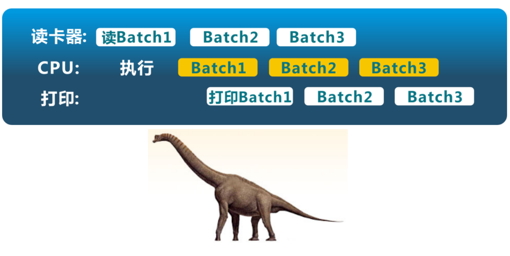
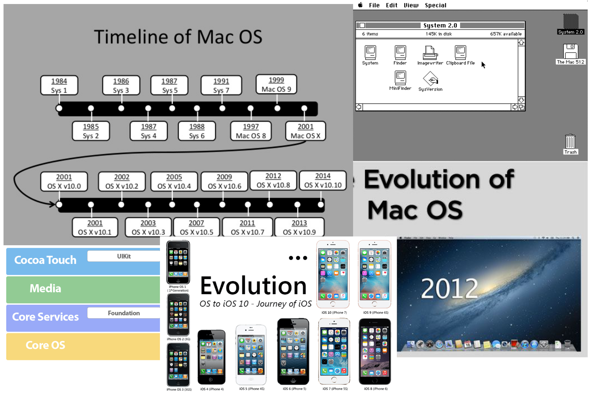

<!-- theme: gaia -->
<!-- page_number: true -->
<!-- _class: lead -->

## 第一讲 操作系统概述

### 第三节 操作系统历史演化

 
 

向勇 陈渝 李国良 

 
 

2022年秋季

---

## 单用户系统

单用户系统 (1945-1955)

- **手动**连线/纸带传输进行程序输入
- 机器成本远大于人力**成本**
- **操作系统 = 装载器 + 程序库**
- 问题：昂贵组件的**低利用率**

---

## 批处理系统

批处理系统 (1955-1965)

- **磁带/磁盘传输**进行程序输入
- 机器成本大于人力成本
- 操作系统 = 装载器 + **程序控制器 + 输出处理器**
- 问题：相比以前利用率提高

---

## 批处理系统

**批处理**系统 (1955-1965)

- 磁带/磁盘传输进行程序输入
- 机器成本大于人力成本
- 操作系统 = 装载器 + 程序控制器 + 输出处理器
- 问题：相比以前利用率提高

---

## 多道程序系统

**多道**程序系统 (1955-1980)

- 多个程序驻留**内存**中
- 多个程序轮流使用 **CPU**
- 操作系统 = 装载器 + **程序调度 + 内存管理** + 输出管理
- 演变：相比以前利用率提高

---

## 分时系统

分时系统 (1970- 至今)  
- 多个程序驻留内存中  
- 多个程序分时使用 CPU  
- 操作系统 = 装载器 + 程序调度 + 内存管理 + **中断处理** +...  
- 演变：相比以前利用率提高、与外界**交互延时**缩短

---
## Multics OS

---
## Multics OS

---
## 开放的UNIX

---
## Linux家族

---
## 个人电脑

个人电脑 (1981- )
- 单用户
- **计算机成本下降**使CPU利用率不再是最重要的关注点
- 重点是**用户界面和多媒体功能**
- 操作系统 = 装载器 + 程序调度 + 内存管理 + 中断处理 +...
- 演变：**走向大众**，老的服务和功能不存在，越来越多的安全问题

---
## MacOS家族

---
## MacOS家族

---
## Windows家族

---
## 分布式系统

**分布式**系统 (1990- )
- 分布式多用户
- 分布式系统利用率是关注点
- 重点是网络/存储/计算的效率
- 操作系统 = 分布式（装载器 + 程序/OS 调度 + 内存管理）
- 演变：走向大众，走向**网络**，新的挑战 (不可靠/不确定)

---
## Android操作系统
- 跨平台：支持Java应用程序
- 运行时(runtime)：Android虚拟机
- 应用框架：简化应用程序开发

---
## AIoT操作系统

AIoT 系统 (2000- )
- 分布式**多设备**
- 分布式系统利用率/可用性是关注点
- 重点是网络/存储/计算的效率
- 操作系统 = 分布式（程序/OS 调度 + 内存管理 + 安全/更新）
- 演变：走向设备，走向网络，新的挑战 (不可靠/大数据)

---
## Fuchsia操作系统

