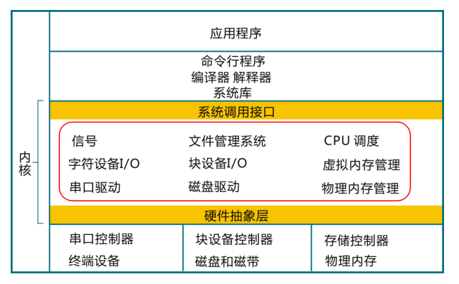

<!-- theme: gaia -->
<!-- _class: lead -->

## 第一讲 操作系统概述

### 第五节 实践：试试UNIX/Linux

<br>
<br>

向勇 陈渝 李国良 任炬 

<br>
<br>

2025年秋季

---
## UNIX/Linux？

- Linux 
   - Ubuntu、Fedora、SuSE、openEuler 
   - 麒麟  统信  
- Windows with WSL (Windows Subsystem of Linux)
- MacOS with UNIX shell 


---
## UNIX/Linux？
- 开放源码，有很好的文档，设计简洁，使用广泛
- 如果你了解Linux的内部情况，学习ucore/rcore会有帮助。



---
## Try UNIX/Linux

- shell
   - bash 基本的shell环境
   - fish 强调交互性和可用性
   - zsh 带有自动补全、支持插件
   - starship 轻量、迅速、可无限定制

- program
   - ls, rm，gcc，gdb, vim ...


---
## UNIX/Linux提供哪些服务？

  - 进程（正在运行的程序）
  - 内存分配
  - 文件内容、文件名、目录
  - 访问控制（安全）
  - 许多其他的：用户、IPC、网络、时间


---
## UNIX/Linux提供的应用/内核接口？

  - APP -> C lib -> Syscall -> Kernel
  - 用C语言，来自类UNIX OS

            fd = open("out", 1);
            write(fd, "hello\n", 6);


 -  看起来像函数调用，其实是系统调用
 -  核心的系统调用数量并不多


---
## UNIX/Linux提供的应用/内核接口？

| 系统调用名 | 含义 |
| ------------------------ | ---- |
| ``int fork()``           |  创建一个进程，返回子进程的PID。    |
| ``int exit(int status)`` | 终止当前进程；报告状态给执行wait()系统调用的父进程。没有返回。     |
| ``int wait(int *status)``    |  等待子进程退出；退出状态为 ``*status`` ；返回子进程的PID。    |
| ``int kill (int pid)``           |   终止进程号为PID的进程。返回0表示成功，或-1表示错误。    |
| ``int getpid()``             |   返回当前进程的PID。   |

---
## UNIX/Linux提供的应用/内核接口？

| 系统调用名 | 含义 |
| ------------------------ | ---- |
| ``int sleep(int n)``                         | 暂停n个时钟周期。     |
| ``int exec(char *file，char *argv[])``   |  用参数加载文件并执行；仅当出错时返回。    |
|   ``char *sbrk(int n)``   |  将进程内存增加n个字节。返回新内存的开始地址。    |
|   ``int open(char *file，int flags)``   |  打开文件；标志flag表示文件操作的读/写属性；返回一个fd(文件描述符)。    |
|   ``int write(int fd，char *buf，int n)``   |  从buf向文件描述符fd写入n个字节；返回n。    |

---
## UNIX/Linux提供的应用/内核接口？

| 系统调用名 | 含义 |
| ------------------------ | ---- |
|  ``int read(int fd，char *buf，int n)``   |    将n个字节读入buf；返回读取的数字；如果文件结束，则为0。   |
|  ``int close(int fd)``   |  释放打开的描述符为fd的文件。    |
|  ``int dup(int fd)``  |  返回一个新的文件描述符，引用与文件描述符相同的文件。    |
|  ``int pipe(int p[])``   |  创建一个管道，将读/写文件描述符放在p[0]和p[1]中。    |
|  ``int chdir(char *dir)``     | 更改当前目录。|

---
## UNIX/Linux提供的应用/内核接口？
| 系统调用名 | 含义 |
| ------------------------ | ---- |
|  ``int mkdir(char *dir) ``     |  创建一个新目录。    |
| ``int mknod(char *file, int, int)``  |  创建一个设备文件。    |
|  ``int fstat(int fd,struct stat *st)`` | 将文件fd的元信息放入``*st``|
|   ``int stat(char *file,struct stat *st)``| 将文件 ``*file`` 的元信息放入 ``*st``|
| ``int link(char *file1，char *file2)``    | 为文件file1创建另一个名称(file2)|
| ``int unlink(char *file)``    |   删除文件。    |


---
## UNIX/Linux应用

[分析一些非常简单的小程序](https://pdos.csail.mit.edu/6.828/2021/lec/l-overview/)

#### 进程相关

fork.c  exec.c  forkexec.c
#### 文件系统相关
list.c  open.c echo.c  copy.c
#### 进程间通信相关
 pipe1.c  pipe2.c  redirect.c


---
## UNIX/Linux应用 - open

- 例如：[open.c](https://pdos.csail.mit.edu/6.828/2021/lec/l-overview/open.c)，创建一个文件

    $ open
    $ cat output.txt

- open() 创建一个文件，返回一个文件描述符（File Descriptor，简称FD，或-1表示错误）。
- FD是正整数，代表一个打开的文件
- 进一步细节可以参考UNIX/Linux手册，例如执行 "man 2 open"
- man的第一个参数：1 表示查shell命令；2 表示查系统调用

---
## UNIX/Linux应用 - copy
 例如：[copy.c](https://pdos.csail.mit.edu/6.828/2021/lec/l-overview/copy.c)，将输入文件内容复制到输出文件中
从输入文件中读取字节内容，将其写入输出文件中

        $ copy
    
  read()和write()是系统调用
  read()/write()第一个参数是"文件描述符"(fd)
  传递给内核，告诉它要读/写哪个 "打开的文件"

---
## UNIX/Linux应用 - copy

- 一个文件描述符对应一个打开的文件
- 一个进程可以打开许多文件，有许多描述符
- 缺省情况：
  - 文件描述符`0`是 "标准输入", 通常是键盘
  - 文件描述符`1`是 "标准输出"，通常是显示器

- read()第二个参数是指向要读取的缓冲区的指针，缓冲区的大小由第三个参数指定
- 文件访问模式：`open -> read/write -> close`


<!-- ---
## UNIX/Linux应用 - copy 

- 返回值：实际读取的字节数，或者-1表示错误
- 注意：copy.c并不关心数据的格式
- 数据格式的解释是特定于应用的，例如数据库记录、C源码等
- 文件描述符从何而来？ -->


<!-- ---
## UNIX/Linux应用 - open

当程序调用open()这样的系统调用时会发生什么？

- 看起来像一个函数调用，但它实际上是一个特殊的指令
- 硬件保存了一些用户寄存器（用户态）
- 硬件提高权限级别（内核态）
- 硬件跳转到内核中一个已知的 "入口点"（内核态入口）
- 然后在内核中运行C代码（执行内核态代码）


---
## UNIX/Linux应用 - open

当程序调用open()这样的系统调用时会发生什么？

- 内核调用系统调用实现
- open() 在文件系统中查找名字
- 它可能会等待磁盘的到来
- 更新内核数据结构（缓存，FD表）
- 恢复用户寄存器
- 降低权限级别
- 跳回程序中的调用点，继续运行
- 将在后面的课程中看到更多的细节 -->

<!-- ---
## UNIX/Linux应用 - shell

- 在向UNIX的命令行界面（shell）输入信息。
- shell打印出"$"的提示。
- shell让你运行UNIX的命令行工具
- 对系统管理、处理文件、开发和编写脚本很有用

    $ ls
    $ ls > out
    $ grep x < out

---
## UNIX/Linux应用  - shell

- 但通过shell来支持分时共享多任务执行是UNIX设计之初的重点。
- 可以通过shell行使许多系统调用。

- shell为输入的每个命令创建一个新的进程，例如，对于

    $ echo hello -->


---


## UNIX/Linux应用 - fork
fork()系统调用创建一个进程的副本（子进程）

- 复制：指令、数据、寄存器、文件描述符、当前目录
- 形成"父 "和 "子 "进程


---


## UNIX/Linux应用 - fork 

- 区别：fork()在父进程中返回一个pid，在子进程中返回0。
- pid（进程ID）是一个整数，内核给每个进程一个不同的pid

- 因此，[fork.c](https://pdos.csail.mit.edu/6.828/2021/lec/l-overview/fork.c)中父子进程的`fork()`返回值`pid`不同 

- 父子进程的执行差别就体现在对`fork()`返回值`pid`的判别上
   - 0代表子进程，否则代表父进程 


---
## UNIX/Linux应用 - exec

- 怎样才能在这个进程中运行一个新程序呢？  

- 例如：[exec.c](https://pdos.csail.mit.edu/6.828/2021/lec/l-overview/exec.c)，用一个可执行文件代替调用进程。

exec(filename, argument-array)
argument-array保存命令行参数；exec传递给main()

exec()用新执行文件取代当前进程
- 丢弃已有指令和数据内存空间
- 从文件中加载新执行程序的指令和数据

<!-- ---
## UNIX/Linux应用 - exec

exec(filename, argument-array)
argument-array保存命令行参数；exec传递给main()

    cat user/echo.c

echo.c显示了一个程序如何看待它的命令行参数 -->

---
## UNIX/Linux应用 - forkexec

例如：[forkexec.c](https://pdos.csail.mit.edu/6.828/2021/lec/l-overview/forkexec.c)，fork()一个新进程，exec()一个程序。


常见的UNIX APP执行模式
- fork()：创建子进程
- exec()：子进程中执行新程序
- wait()：父进程等待子进程完成
- exit()：进程退出


<!-- ---
## UNIX/Linux应用 - wait

- shell你输入的每个命令都进行fork/exec/wait操作。
- 在wait()之后，shell会打印出下一个提示信息
- 在后台运行 -- `&` -- , shell会跳过wait() -->


<!-- 
---
## UNIX/Linux应用 - exit
- exit(status) --\> wait(&status)

- status约定：0 = 成功，1 = 命令遇到了一个错误
- 注意：fork()会复制，但exec()会丢弃复制的内存。
- 这可能看起来很浪费
- 可以通过 "写时复制 "技术透明地消除复制 
-->


---
## UNIX/Linux应用 - redirect

例子：[redirect.c](https://pdos.csail.mit.edu/6.828/2021/lec/l-overview/redirect.c)，重定向一个命令的输出

- 缺省情况下，文件描述符为`1`的文件是`屏幕输出`
- open()总是选择值最小的未使用的文件描述符
- 通过 `close(1) + open(...)`操作，设定"output.txt"的文件描述符为1
- exec(...)系统调用保留了文件描述符，执行echo命令后，它的屏幕输出将被重定向到"output.txt"
```
    $ redirect
    $ cat output.txt
```

<!-- ---
## 分析UNIX/Linux类应用 - pipe1

例子：[pipe1.c](https://pdos.csail.mit.edu/6.828/2021/lec/l-overview/pipe1.c)，通过一个管道（PIPE）进行通信
shell如何使用管道机制 `"|"`

    $ ls | grep x
    $ pipe1


pipe()系统调用创建了两个fd
- 写入fd[1]，从fd[0]中读取
  
 -->

<!-- ---
## 分析UNIX/Linux类应用 - pipe1

内核为每个管道维护一个缓冲区
- write()添加到缓冲区中
- read()等待，直到有数据出现 -->

---
## 分析UNIX/Linux类应用 - pipe2

- 例子[pipe2.c](https://pdos.csail.mit.edu/6.828/2021/lec/l-overview/pipe2.c)，进程间通信。
- shell如何使用管道机制 `"|"`
```
    $ ls | grep x
```
pipe()系统调用创建了两个fd
- 从fd[1]写入，从fd[0]中读取


<!-- ---
## UNIX/Linux应用

- 注意：open()总是选择最低的未使用的FD；选择1是由于close(1)。
- fork、FD和exec很好地互动，以实现I/O重定向
- 独立的fork-then-exec给子进程一个机会在exec之前改变FD。
- FDs提供了指示作用
- 命令只需使用FDs 0和1，不需要知道它们的位置
- exec保留了shell设置的FDs
- 因此：只有shell需要知道I/O重定向，而不是每个程序 -->


---
## UNIX/Linux应用

一些值得思考的问题：
- 为什么是这些I/O和进程的抽象？为什么不是其他的东西？
- 为什么要提供一个文件系统，而不让程序以自己的方式使用磁盘？
- 为什么read/write文件用FD而不是文件名？
- 为什么文件是字节流，而不是磁盘块或格式化记录？
- 为什么不把fork()和exec()结合起来？

UNIX的设计很好用，但也存在其他的设计


<!-- ---
## 分析UNIX/Linux类应用


- 例子：[list.c](https://pdos.csail.mit.edu/6.828/2021/lec/l-overview/list.c)，列出一个目录中的文件
- ls是如何获得一个目录中的文件列表的？
- 可以打开一个目录并读取它 -> 文件名
- "... "是一个进程的当前目录的假名
- 更多细节见ls.c -->

---
## 分析UNIX/Linux类应用

小结

- 介绍了UNIX的I/O、文件系统和进程的抽象
- 这些接口很简洁，只有整数和I/O缓冲区
-  这些抽象结合得很好，例如，I/O重定向
