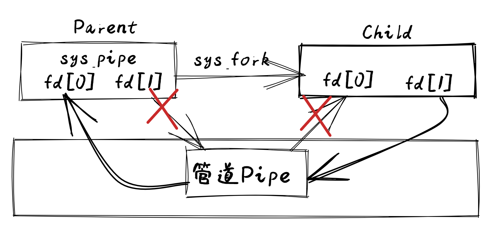
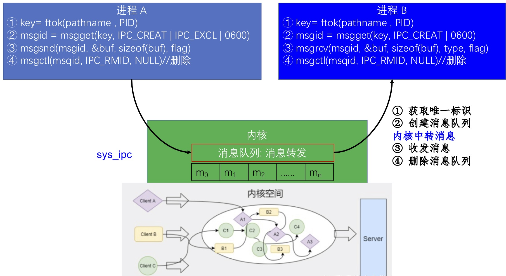
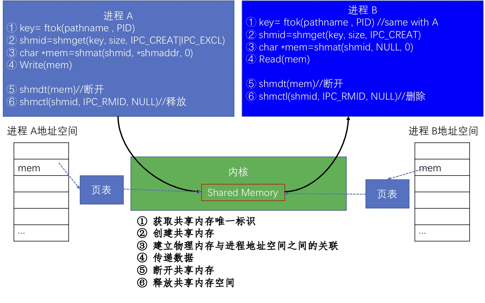

<!-- theme: gaia -->
<!-- _class: lead -->

# 第十讲 进程间通信
Inter Process Communication，IPC
## 第一节 进程间通信(IPC)概述

<br>
<br>

向勇 陈渝 李国良 

<br>
<br>

2022年春季


---
### IPC基本概念 -- 需求背景
目标：完成复杂应用需求
- 功能模块化
- 应用之间可以相对隔离
- 单个程序的功能有限
- 多个程序的合作可完成复杂的事情

定义：各进程之间通过数据交换进行交互的行为称为进程间通信（Inter-process communication，IPC）


---
### IPC基本概念 -- 需求背景

进程可分为两类：
- 独立进程：这类进程与其它进程无交互
- 协作进程：两个或多个进程之间有交互
   - 发送者 接收者 / 客户端 服务端 

```
❯ cat README.md | grep rcore
$ git clone https://github.com/rcore-os/rCore-Tutorial-v3.git
...
* [x] expand the fs image size generated by `rcore-fs-fuse` to 128MiB
```
`grep`依赖`cat`。`grep`等`cat`产生的输出作为其输入，来匹配字符串

---
### IPC基本概念
 -- 需求背景

进程间能共享或传递数据就算是进程间通信。

- 右图：UNIX中典型的IPC机制


---
### IPC基本概念 -- 需求背景
进程间能共享或传递数据就算是进程间通信。

| IPC手段  |  含义  | 通信方式 |
| ------------------------ | ---- | ---- |
|  共享内存（Shared Memory)    |  多个进程共享一块物理内存  | 直接通信 |
| 文件（File）     |  多个进程可访问同一文件 | 间接通信 |

**直接通信**：两个进程间不需要通过内核的中转，就可以相互传递信息
**间接通信**：两个进程间通过系统调用和内核的中转，来相互传递消息

除了共享内存机制，其它IPC机制都会经过内核的中转。

<!-- 另外一种定义 https://zhidao.baidu.com/question/1695485023365050948.html
直接通信为了实现直接通信，要有发送和接收的ID进程必须正确地命名对方send( P, message) - 发送信息到进程P通信链路的属性自动建立链路一条链路恰好对应一对通信进程每对进程之间只有一个链接存在链接可以是单向的，但通常为双向的
间接通信为了实现间接通信，要发送到共享区，发送方和接收方都不关注具体的另一方是谁定向从消息队列接收消息：每个消息队列都有一个唯一的ID只有他们共享了一个消息队列，进程才能通信通信链路的属性 -->


---
### IPC基本概念 -- 需求背景
进程间能共享或传递数据就算是进程间通信。

| IPC手段  |  含义  | 通信方式 |
| ------------------------ | ---- |---- |
|   管道（Pipe）   | 单方向传输字节流  |间接通信 |
|   消息队列（Message Queue）   | 通过队列中收/发消息 |间接通信 |
|  信号（Signal）    | 异步发送信号给进程处理  |间接通信 |
|  套接字（Socket）    | 多/单机进程间网络通信  |间接通信 |


---
### IPC基本概念 -- 需求背景
进程间能共享或传递数据就算是进程间通信。
- 通信方式：直接通信   间接通信
- 消息传递的基本接口
  -  发送(send)消息
  -  接收(recv)消息
  -  远程过程调用(RPC)
  -  回复(reply)消息

Remote Procedure Call，RPC = send + recv


---
### IPC基本概念 -- 需求背景
进程间能共享或传递数据就算是进程间通信。
- 通信方式：阻塞或非阻塞
- 阻塞通信: 
  - 阻塞发送、阻塞接收
- 非阻塞通信
  - 非阻塞发送、非阻塞接收


---
### IPC基本概念 -- 需求背景
进程间能共享或传递数据就算是进程间通信。
- 缓冲方式：
  - 0 容量: 发送方必须等待接收方
  - 有限容量：通信链路缓冲队列满时，发送方必须等待
  - 无限容量：发送方不需要等待


---
### IPC基本概念 -- 管道
管道(pipe)
- 一种进程间通信机制
- 有读写端的一定大小的字节队列
- 读端只能用来从管道中读取
- 写端只能用来将数据写入管道
- 读/写端通过不同文件描述符表示


---
### IPC基本概念 -- 管道
管道(pipe)
- 创建一个管道，返回两个文件描述符，一个是负责读管道的返回，一个是负责写管道
- 管道可表示为两个文件描述符加一段内核空间中的内存
-  `int pipe(int pipefd[2])`


---
### IPC基本概念 -- 管道
管道(pipe)
- 支持有关系的进程间通信，如父子进程、兄弟进程等
- 当某进程创建了一个管道(两个文件描述符)，它的子进程会继承这些文件描述符，并读写这个管道


---
### IPC基本概念 -- 管道
管道(pipe)
- 一般情况下，管道两端的每个进程会各自关闭一个管道的文件描述符
- 如父进程关闭读描述符，这样父进程只能向管道写数据，子进程关闭写描述符，这样子进程只能从管道读数据。




---
### IPC基本概念 -- 管道实现机制


 
---
### IPC基本概念--管道
[例子](https://gitee.com/chyyuu/os-usrapp-lab/blob/main/c/ipc/pipe/ex1.c)
```
$ gcc -o ex1 ex1.c
$ ./ex1
parent
write: the 0 message.
...
children
read: the 0 message.
...
```
建议：同学们可在课后在自己的开发环境中实践一下


---
### IPC基本概念 -- 管道
Shell也提供了管道 ，只需使用一根竖线 "**|**" 连接两个命令即
```
rCore-Tutorial-v3 on  ch7
❯ cat README.md | grep rcore
$ git clone https://github.com/rcore-os/rCore-Tutorial-v3.git
...
* [x] expand the fs image size generated by `rcore-fs-fuse` to 128MiB
```
这种管道称为匿名管道，它对于编写灵活的命令行脚本非常方便。
但：不支持任意两个进程间的通信

---
### IPC基本概念 -- 管道
在shell下，还支持使用mkfifo命令创建命名管道（named pipe），也称为FIFO，它支持任意进程间的数据通信。
```
$ mkfifo name.fifo
$  ls -l name.fifo   # 文件类型为p
prw-r--r-- 1 chyyuu chyyuu 0 4月  14 20:19 name.fifo
```

注：无名管道与有名管道都属于单向通信机制。有名管道与无名管道不同的是，有名管道可以支持任意两个进程间的通信。

---
### IPC基本概念 -- 管道
命名管道是阻塞式的单向通信管道，任意一方都可以读、写，但是只有读、写端同时打开了命名管道时，数据才会写入并被读取。

shell A
```
$ echo README > name.fifo  #写命名管道阻塞
```
shell B
```
$ cat name.fifo
```

但：字节流形态，不支持任意两个进程间的双向通信

---
### IPC基本概念 -- 消息队列
消息队列（Message Queue)
 - 是由操作系统维护的以结构数据为基本单位的间接通信机制
   - 每个消息(Message)是一个字节序列，有自己的类型标识
   - 相同标识的消息组成按先进先出顺序组成一个消息队列


---
### IPC基本概念 -- 消息队列实现机制


---
### IPC基本概念 -- 消息队列实现机制


---
### IPC基本概念 -- 消息队列
<!-- https://zhuanlan.zhihu.com/p/268389190  Linux进程间通信——消息队列 -->
- 消息队列的系统调用
  - msgget ( key, flags） //获取消息队列标识
  - msgsnd ( QID, buf, size, flags ） //发送消息
  - msgrcv ( QID, buf, size, type, flags ） //接收消息
  - msgctl( … ） // 消息队列控制

消息的结构
```
struct msgbuf {
	long mtype;         /* 消息的类型 */
	char mtext[1];      /* 消息正文 */
};
```

---
### IPC基本概念 -- 消息队列  -- 创建消息队列
```
#include <sys/types.h>
#include <sys/ipc.h>
#include <sys/msg.h>

int msgget(key_t key, int msgflg);
```
参数：
- key: 某个消息队列的名字
- msgflg:由九个权限标志构成，用法和创建文件时使用的mode模式标志是一样的，IPC_CREAT or IPC_EXCL等


---
### IPC基本概念 -- 消息队列  -- 创建消息队列
```
#include <sys/types.h>
#include <sys/ipc.h>
#include <sys/msg.h>

int msgget(key_t key, int msgflg);
```
返回值：

- 成功：msgget将返回一个非负整数，即该消息队列的标识码；
- 失败：则返回“-1”


---
### IPC基本概念 -- 消息队列  -- 创建消息队列
```
#include <sys/types.h>
#include <sys/ipc.h>
#include <sys/msg.h>

int msgget(key_t key, int msgflg);
```
那么如何获取key值？

- 通过宏定义key值
- 通过ftok函数生成key值


---
### IPC基本概念 -- 消息队列  -- 添加信息到消息队列
```
int  msgsnd(int msgid, const void *msg_ptr, size_t msg_sz, int msgflg);
```
参数：
- msgid: 由msgget函数返回的消息队列标识码
- msg_ptr:是指向待发送数据的指针
- msg_sz:是msg_ptr指向的数据长度
- msgflg:控制着当前消息队列满或到达系统上限时的行为
如：IPC_NOWAIT 表示队列满不等待，返回EAGAIN错误


---
### IPC基本概念 -- 消息队列  -- 添加信息到消息队列
```
int  msgsnd(int msgid, const void *msg_ptr, size_t msg_sz, int msgflg);
```
- 成功返回0
- 失败则返回-1


---
### IPC基本概念 -- 消息队列  -- 从消息队列中读取消息
```
int  msgrcv(int msgid, void *msg_ptr, size_t msgsz,long int msgtype, int msgflg);
```

- msgid: 由msgget函数返回的消息队列标识码
- msg_ptr:是指向准备接收的消息的指针
- msgsz:是msg_ptr指向的消息长度
- msgtype:它可以实现接收优先级的简单形式
    - msgtype=0返回队列第一条信息
    - msgtype>0返回队列第一条类型等于msgtype的消息　
    - msgtype<0返回队列第一条类型小于等于msgtype绝对值的消息


---
### IPC基本概念 -- 消息队列  -- 从消息队列中读取消息
```
int  msgrcv(int msgid, void *msg_ptr, size_t msgsz,long int msgtype, int msgflg);
```
- msgflg:控制着队列中没有相应类型的消息可供接收时的行为
  - IPC_NOWAIT，队列没有可读消息不等待，返回ENOMSG错误
  - MSG_NOERROR，消息大小超过msgsz时被截断

返回值：
- 成功：返回实际放到接收缓冲区里去的字符个数
- 失败：则返回-1


---
### IPC基本概念 -- 消息队列  -- 从消息队列中读取消息
[例子](https://gitee.com/chyyuu/os-usrapp-lab/blob/main/c/ipc/message-queues/ex1.c)
```
$ gcc ex1.c 
$ ./a.out
```
建议：同学们可在课后在自己的开发环境中实践一下

---
### IPC基本概念 -- 共享内存
共享内存 shared memory, shmem
- 是把同一个物理内存区域同时映射到多个进程的内存地址空间的通信机制
- 每个进程的内存地址空间需明确设置共享内存段
- 优点: 快速、方便地共享数据
- 不足: 需要同步机制协调数据访问


 

---
### IPC基本概念 -- 共享内存
<!-- https://zhuanlan.zhihu.com/p/147826545  Linux系统编程之进程间通信：共享内存 -->
- 共享内存的系统调用
  -  shmget( key, size, flags） //创建共享段
  - shmat( shmid, *shmaddr, flags） //把共享段映射到进程地址空间
  - shmdt( *shmaddr）//取消共享段到进程地址空间的映射
  - shmctl( …） //共享段控制

注：需要信号量（后续介绍）等机制协调共享内存的访问冲突

---
### IPC基本概念 -- 共享内存实现机制



---
### IPC基本概念 -- 共享内存 -- 创建共享内存
```
#include <sys/ipc.h>
#include <sys/shm.h>
int shmget(key_t key, size_t size,int shmflg);
```
- key：进程间通信键值，ftok() 的返回值。
- size：该共享存储段的长度(字节)。
- shmflg：标识函数的行为及共享内存的权限，其取值如下：
  - IPC_CREAT：如果不存在就创建
  - IPC_EXCL： 如果已经存在则返回失败

返回值：成功：共享内存标识符； 失败：-1。


---
### IPC基本概念 -- 共享内存 -- 共享内存映射
```
#include <sys/types.h>
#include <sys/shm.h>
void *shmat(int shmid, const void *shmaddr, int shmflg);
```
将一个共享内存段映射到调用进程的数据段中。简单来理解，让进程和共享内存建立一种联系，让进程某个指针指向此共享内存。

返回值：
- 成功：共享内存段映射地址( 相当于这个指针就指向此共享内存 )
- 失败：-1

---
### IPC基本概念 -- 共享内存 -- 共享内存映射
```
void *shmat(int shmid, const void *shmaddr, int shmflg);
```
- shmid：共享内存标识符，shmget() 的返回值。
- shmaddr：共享内存映射地址，若为 NULL 则由系统自动指定
- shmflg：共享内存段的访问权限和映射条件，取值如下：
  - 0：共享内存具有可读可写权限。
  - SHM_RDONLY：只读。
  - SHM_RND：（shmaddr 非空时才有效）


---
### IPC基本概念-- 共享内存
[例子](https://gitee.com/chyyuu/os-usrapp-lab/blob/main/c/ipc/shared-memory/)
```
$ gcc writer.c -o w
$ gcc reader.c -o r
$ ./w
 Writer: copy data to shared-memory
```

 
---
### IPC基本概念-- 共享内存
[例子](https://gitee.com/chyyuu/os-usrapp-lab/blob/main/c/ipc/shared-memory/)
```
$ ./r
------------ 共享内存段 --------------
键        shmid      拥有者  权限     字节     连接数  状态
0xdf20482b 1          chyyuu     666        512        0

data = [ How are you, mike: from Writer ]
deleted shared-memory

------------ 共享内存段 --------------
键        shmid      拥有者  权限     字节     连接数  状态
```
建议：同学们可在课后在自己的开发环境中实践一下

---
### IPC基本概念 -- 信号
之前的IPC聚焦在数据传输上
信号（Signal）
- 信号是中断正在运行的进程的异步消息或事件
- 信号机制是一种进程间异步通知机制

问题：
 - `Ctrl+C`为什么可以结束进程？
- kill命令是怎么结束进程的？


---
### IPC基本概念 -- 信号
信号命名
- 信号是一个整数编号，这些整数编号都定义了对应的宏名，宏名都是以SIG开头，比如SIGABRT, SIGKILL, SIGSTOP, SIGCONT


---
### IPC基本概念 -- 信号
信号发送方
- 进程
  - shell通过kill命令向某个进程发送一个信号将其终止
- 内核
  - 进程从管道文件读取数据，但是管道文件的读权限被关闭了，进程会被内核发送一个SIGPIPE信号，提示读管道出错了 
- 外设


---
### IPC基本概念 -- 信号
信号发送方
- 外设
  - 比如按下Ctrl+C按键时，内核收到包含Ctrl+C按键的外设中断，会向正在运行的进程发送SIGINT信号，将其异常终止


---
### IPC基本概念 -- 信号
信号接收进程的处理方式
- 忽略：信号没有发生过
- 捕获：进程会调用相应的处理函数进行处理
- 默认：如果不忽略也不捕获，此时进程会使用内核默认的处理方式来处理信号
  -  内核默认的信号处理：在大多情况下就是杀死进程或者直接忽略信号


---
### IPC基本概念 -- 信号实现机制


---
### IPC基本概念 -- 信号
Linux有哪些信号？ -- 62个


---
### IPC基本概念 -- 信号
Linux有哪些信号？ -- 62个
-  为什么这么多信号？
  -  每个信号代表着某种事件，一般情况下，当进程收到某个信号时，就表示该信号所代表的事件发生了。  
  - 对1~34中的常用信号，要求是理解，而不是记忆。当忘记了信号名字时，kill -l查看即可。
  

---
### IPC基本概念 -- 信号
Linux常用信号
- SIGKILL
- SIGINT
- SIGSEGV


---

信号应用编程


---
### IPC基本概念 -- 信号
实现机制


<!-- Ref: Understanding the Linux Kernel
Signals and Inter-Process Communication  https://compas.cs.stonybrook.edu/~nhonarmand/courses/fa14/cse506.2/slides/ipc.pdf -->


---
### IPC基本概念 -- 信号
实现机制
- 注册用户态信号处理函数sig_handler；
- 内核在返回用户态前，发现有信号要处理；
- 内核在用户栈压入sig_handler函数栈信息；
  - 模拟用户代码调用sig_handler函数
-  内核在陷入上下文中修改用户态返回地址；
- 内核返回用户态，直接跳到sig_handler;
- sig_handler函数返回到旧代码位置继续执行

