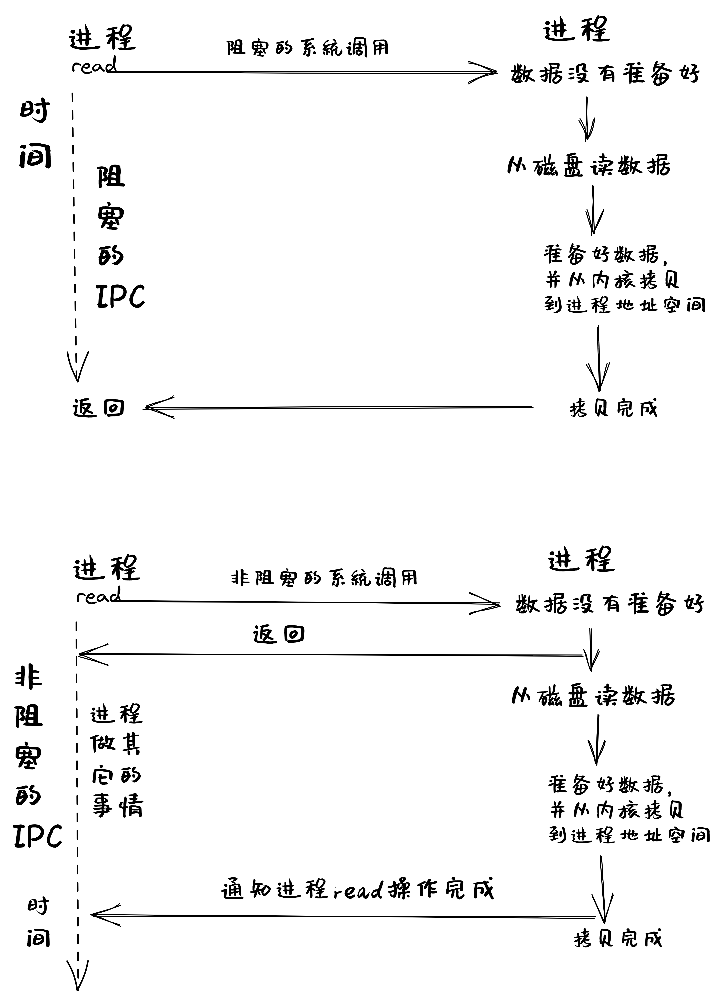
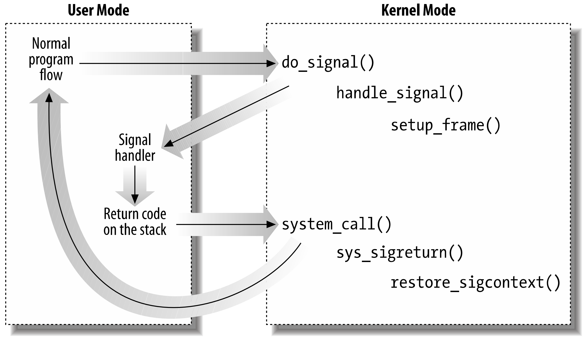
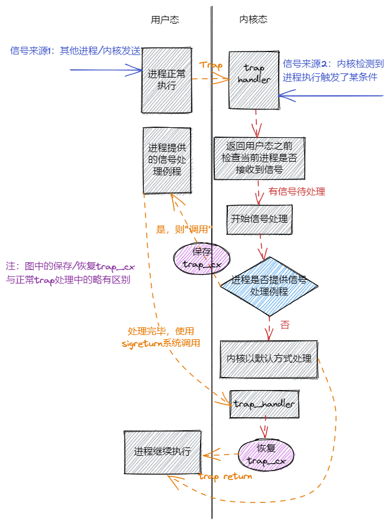

<!-- theme: gaia -->
<!-- _class: lead -->

# 第十讲 进程间通信
Inter Process Communication, IPC
## 第一节 进程间通信(IPC)概述

<br>
<br>

向勇 陈渝 李国良 任炬 

2025年春季

[课程幻灯片列表](https://www.yuque.com/xyong-9fuoz/qczol5/glemuu?)

---

**提纲**

### 1. 进程间通信概述
2. 管道(pipe)
3. 消息队列(Message Queue)
4. 共享内存(shared memory)
5. 信号(Signal)

---

#### 进程间通信的需求

- 挑战：单个程序的功能有限
- IPC的目标：多进程协作完成复杂应用需求
  - 功能模块化
  - 程序之间相对隔离
  - 多个程序合作可完成复杂任务

**进程间通信的定义**：进程间通过数据交换（共享或传递）进行**交互**的行为


---
#### 进程间的交互关系

- 独立进程：与其它进程无交互
- 协作进程：两个或多个进程之间有交互
   - 发送者 接收者 / 客户端 服务端 

```
❯ cat README.md | grep rcore
$ git clone https://github.com/rcore-os/rCore-Tutorial-v3.git
...
* [x] expand the fs image size generated by `rcore-fs-fuse` to 128MiB
```
- `grep`依赖`cat`
  - `grep`等`cat`产生的输出作为其输入，来匹配字符串

---

#### 进程通信方式

- **直接通信**：两个进程间不需要通过内核的中转，就可以相互传递信息
- **间接通信**：两个进程间通过系统调用和内核的中转，来相互传递消息


---
#### IPC机制
进程间能共享或传递数据就算是进程间通信。

| IPC机制  |  含义  | 通信方式 |
| ------------------------ | ---- |---- |
|  信号 (Signal)    | 异步发送信号给进程处理  |间接通信 |
|   管道 (Pipe)   | 单方向传输字节流  |间接通信 |
|   消息队列 (Message Queue)   | 通过队列中转收/发消息 |间接通信 |
|  套接字 (Socket)    | 多/单机进程间网络通信  |间接通信 |
|  共享内存 (Shared Memory)    |  多个进程共享一块物理内存  | 直接通信 |
| 文件 (File)     |  多个进程可访问同一文件 | 间接通信 |

---
#### UNIX的典型IPC机制

进程间能共享或传递数据就是进程间通信。


---

#### 消息传递的基本接口
-  发送(send)消息
-  接收(recv)消息
-  远程过程调用(RPC)
-  回复(reply)消息

Remote Procedure Call, RPC = send + recv


---
#### 阻塞或非阻塞通信

- 阻塞通信: 
  - 阻塞发送、阻塞接收
- 非阻塞通信
  - 非阻塞发送、非阻塞接收




---
#### IPC的缓冲方式

- **无限容量**：发送方不需要等待
- **有限容量**：通信链路缓冲队列满时，发送方必须等待
- **0容量**: 发送方必须等待接收方


---

**提纲**

1. 进程间通信概述
### 2. 管道(pipe)
3. 消息队列(Message Queue)
4. 共享内存(shared memory)
5. 信号(Signal)

---

#### 管道(pipe)

管道是一种进程间通信机制， 也称为匿名管道(anonymous pipe)

- 有读写端的一定大小的**字节队列**
- **读端**只能用来从管道中读取
- **写端**只能用来将数据写入管道
- 读/写端通过**不同文件描述符**表示


---
#### 创建管道

`int pipe(int pipefd[2])`
- 管道可表示为两个文件描述符加一段内核空间中的内存
- 创建管道时，返回两个文件描述符
  - 读管道
  - 写管道


---
#### 管道(pipe)的应用场景

- 支持有关系的进程间通信
  - 父子进程、兄弟进程等
- 父进程创建管道(两个文件描述符)
  - 子进程会继承文件描述符，执行读写管道


---
#### 管道(pipe)的应用场景

- 通常管道两端的进程会各自关闭管道的一个文件描述符，如
  - 父进程关闭写描述符，只能向管道**读数据**
  - 子进程关闭读描述符，只能从管道**写数据**。


---
#### 管道实现机制


 
---
#### 管道[示例](https://gitee.com/chyyuu/os-usrapp-lab/blob/main/c/ipc/pipe/ex1.c)

```
$ gcc -o ex1 ex1.c
$ ./ex1
parent
write: the 0 message. 
write: the 1 message. 
...
children
read: the 0 message. 
read: the 1 message. 
...
```
建议：同学们可在课后在自己的开发环境中实践一下


---
#### Shell中的管道

只需使用一根竖线 "**|**" 连接两个命令即

```
rCore-Tutorial-v3 on ch7
❯ cat README.md | grep rcore
$ git clone https://github.com/rcore-os/rCore-Tutorial-v3.git
...
* [x] expand the fs image size generated by `rcore-fs-fuse` to 128MiB
```
- 对于编写灵活的命令行脚本非常方便
- 不支持任意两个进程间的通信

---
#### 命名管道（named pipe）
在shell中可用mkfifo命令创建命名管道，也称为FIFO。

匿名管道与命名管道都属于单向通信机制。两者的不同是：
- 命名管道可以支持任意两个进程间的通信
- 匿名管道只支持父子进程和兄弟进程间的通信

命名管道是阻塞式的单向通信管道
- 任意一方都可以读、写
- 只有读、写端同时打开了命名管道时，数据才会写入并被读取

---

#### 命名管道

shell A
```
$ mkfifo name.fifo #创建一个名为 name.fifo 的命名管道（文件类型为 p）
$ echo README > name.fifo  #文件类型为p（ls -l，第一个字母p表示命名管道），写命名管道阻塞
```
shell B
```
$ cat name.fifo #解除 Shell A 的阻塞
```

但：字节流形态，不支持任意两个进程间的双向通信
命名管道[示例](https://www.cnblogs.com/52php/p/5840229.html)

---

**提纲**

1. 进程间通信概述
2. 管道(pipe)
### 3. 消息队列(Message Queue)
4. 共享内存(shared memory)
5. 信号(Signal)

---

#### 消息队列(Message Queue)
消息队列是由**操作系统维护**的以**结构数据**为基本单位的间接通信机制
- 每个消息(Message)是一个字节序列，有自己的**类型标识**
- 相同类型标识的消息组成按**先进先出**顺序组成一个消息队列


---
#### 消息队列实现机制


---
#### ftok
ftok 会基于文件的 inode 信息和 proj_id 生成一个唯一的键值。
两个进程必须使用相同的 pathname 和 proj_id，才能生成相同的键值，从而访问同一个 IPC 资源。
```
key_t ftok(const char *pathname, int proj_id);
```
- pathname：一个已存在的文件路径（如进程A和B都能访问的文件）
- proj_id：一个用户自定义的整型值（通常是一个字符的 ASCII 码，如 'A'）。


---
#### 消息队列实现机制

- 不同消息类型
  - 优先级排序
  - 选择性接收
  - 安全和隔离

-消息的结构
```
struct msgbuf {
	long mtype;   /* 消息的类型 */
	char mtext[1];/* 消息正文 */
};
```


---
#### 消息队列的系统调用
<!-- https://zhuanlan.zhihu.com/p/268389190  Linux进程间通信——消息队列 -->
- 消息队列的系统调用
  - msgget ( key, flags） //创建息队列
  - msgsnd ( msgid, buf, size, flags ） //发送消息
  - msgrcv ( msgid, buf, size, type, flags ） //接收消息
  - msgctl(msqid, cmd, msqid_ds *buf） // 消息队列控制

消息的结构
```
struct msgbuf {
	long mtype;         /* 消息的类型 */
	char mtext[1];      /* 消息正文 */
};
```

---
#### 创建消息队列
```
#include <sys/types.h>
#include <sys/ipc.h>
#include <sys/msg.h>

int msgget(key_t key, int msgflg);
```
参数：
- key: 某个消息队列的名字
- msgflg:由九个权限标志构成，用法和创建文件时使用的mode模式标志是一样的，IPC_CREAT or IPC_EXCL等


---
#### 创建消息队列
```
#include <sys/types.h>
#include <sys/ipc.h>
#include <sys/msg.h>

int msgget(key_t key, int msgflg);
```
返回值：

- 成功：msgget将返回一个非负整数，即该消息队列的标识码；
- 失败：则返回“-1”


---
#### 创建消息队列
```
#include <sys/types.h>
#include <sys/ipc.h>
#include <sys/msg.h>

int msgget(key_t key, int msgflg);
```
那么如何获取key值？

- 通过宏定义key值
- 通过ftok函数生成key值


---
#### 发送消息
```
int  msgsnd(int msgid, const void *msg_ptr, size_t msg_sz, int msgflg);
```
参数：
- msgid: 由msgget函数返回的消息队列标识码
- msg_ptr:是指向待发送数据的指针
- msg_sz:是msg_ptr指向的数据长度
- msgflg:控制着当前消息队列满或到达系统上限时的行为
如：IPC_NOWAIT 表示队列满不等待，返回EAGAIN错误


---
#### 发送消息

```
int  msgsnd(int msgid, const void *msg_ptr, size_t msg_sz, int msgflg);
```
- 成功返回0
- 失败则返回-1


---
#### 接收消息
```
int  msgrcv(int msgid, void *msg_ptr, size_t msgsz,long int msgtype, int msgflg);
```
- msgid: 由msgget函数返回的消息队列标识码
- msg_ptr:是指向准备接收的消息的指针
- msgsz:是msg_ptr指向的消息长度
- msgtype:它可以实现接收优先级的简单形式
    - msgtype=0返回队列第一条信息
    - msgtype>0返回队列第一条类型等于msgtype的消息　
    - msgtype<0返回队列第一条类型小于等于msgtype绝对值的消息


---
#### 接收消息
```
int  msgrcv(int msgid, void *msg_ptr, size_t msgsz,long int msgtype, int msgflg);
```
- msgflg:控制着队列中没有相应类型的消息可供接收时的行为
  - IPC_NOWAIT，队列没有可读消息不等待，返回ENOMSG错误
  - MSG_NOERROR，消息大小超过msgsz时被截断
返回值：
- 成功：返回实际放到接收缓冲区里去的字符个数
- 失败：则返回-1

消息会被第一个调用 msgrcv() 且匹配 mtype 的进程接收。若多个进程监听同一mtype，则操作系统调度随机选择一个进程（存在竞争）。


---
#### 消息队列控制：查询队列状态、修改权限、删除队列等
```
int msgctl(int msqid, int cmd, struct msqid_ds *buf);
```
- 消息队列的属性保存在系统维护的数据结构msqid_ds中，可以通过函数msgctl获取或设置消息队列的属性。
- msgctl：对msgqid标识的消息队列执行cmd操作，3种cmd操作：
  - IPC_STAT：获取消息队列对应的msqid_ds数据结构（保存到buf）
  - IPC_SET：修改消息队列的属性（存储在buf中），包括：msg_perm.uid、 msg_perm.gid、msg_perm.mode、msg_qbytes
  - IPC_RMID：从内核中删除msgqid标识的消息队列
- buf是指向msgid_ds结构的指针，指向消息队列模式和访问权限


---
#### 消息队列
```
struct msqid_ds {
    struct ipc_perm msg_perm;  // 权限信息
    time_t          msg_stime; // 最后发送消息的时间（单位：秒，从 1970-01-01 起）
    time_t          msg_rtime; // 最后接收消息的时间
    time_t          msg_ctime; // 最后修改队列的时间（如 IPC_SET、IPC_RMID）
    unsigned long   msg_cbytes;// 当前队列中的字节数
    msgqnum_t       msg_qnum;  // 当前队列中的消息数量
    msglen_t        msg_qbytes; // 队列允许的最大字节数
    pid_t           msg_lspid; // 最后发送消息的进程 PID
    pid_t           msg_lrpid; // 最后接收消息的进程 PID
};
```

---
#### 消息队列[示例程序](https://gitee.com/chyyuu/os-usrapp-lab/blob/main/c/ipc/message-queues/ex1.c)
```
$ gcc ex1.c 
$ ./a.out
Parent: input message type:
1
Parent: input message to be sent:
test
Parent: input message type:
Child: read msg:test
0
```
建议：同学们可在课后在自己的开发环境中实践一下

---

**提纲**

1. 进程间通信概述
2. 管道(pipe)
3. 消息队列(Message Queue)
### 4. 共享内存(shared memory)
5. 信号(Signal)

---

#### 共享内存(shared memory, shmem)

共享内存是把同一个物理内存区域同时映射到多个进程的内存地址空间的通信机制
- 每个进程的内存地址空间需明确设置共享内存段
- 优点：快速、方便地共享数据
- 不足：需要同步机制协调数据访问


---
#### 共享内存实现机制


---
#### 共享内存的系统调用
<!-- https://zhuanlan.zhihu.com/p/147826545  Linux系统编程之进程间通信：共享内存 -->
- shmget( key, size, flags） //创建共享段
- shmat( shmid, *shmaddr, flags） //把共享段映射到进程地址空间
- shmdt( *shmaddr）//取消共享段到进程地址空间的映射
- shmctl(shmid, cmd, shmid_ds *buf） //控制共享段

注：需要信号量等同步机制协调共享内存的访问冲突


---
#### 创建共享内存
```
#include <sys/ipc.h>
#include <sys/shm.h>
int shmget(key_t key, size_t size, int shmflg);
```
- key：进程间通信键值，ftok() 的返回值。
- size：该共享存储段的长度(字节)。
- shmflg：标识函数的行为及共享内存的权限，其取值如下：
  - IPC_CREAT：如果不存在就创建
  - IPC_EXCL： 如果已经存在则返回失败
- 返回值：成功：共享内存标识符； 失败：-1。


---
#### 共享内存映射
```
#include <sys/types.h>
#include <sys/shm.h>
void *shmat(int shmid, const void *shmaddr, int shmflg);
```
将一个共享内存段映射到调用进程的数据段中。即：让进程和共享内存建立一种联系，让进程某个指针指向此共享内存。

返回值：
- 成功：共享内存段映射地址( 相当于这个指针就指向此共享内存 )
- 失败：-1

---
#### 共享内存映射
```
void *shmat(int shmid, const void *shmaddr, int shmflg);
```
- shmid：共享内存标识符，shmget() 的返回值。
- shmaddr：共享内存映射地址，若为 NULL 则由系统自动指定 
- shmflg：共享内存段的访问权限和映射条件，取值如下：
  - 0：共享内存具有可读可写权限。
  - SHM_RDONLY：只读。
  - SHM_RND：（shmaddr 非空时才有效）

---
#### 删除共享内存
```
int shmdt(const void *shmaddr);
```
- shmaddr是shmat()函数返回的地址指针
- 调用成功时返回0，失败时返回-1.

---
#### 共享内存控制
```
int shmctl(int shmid, int cmd, struct shmid_ds *buf);
```
- shm_id是shmget()函数返回的共享内存标识符。
- cmd是要采取的操作，它可以取下面的三个值 ：
  - IPC_STAT：把shmid_ds结构中的数据设置为共享内存的当前关联值，即用共享内存的当前关联值覆盖shmid_ds的值。
  - IPC_SET：如果进程有足够的权限，就把共享内存的当前关联值设置为shmid_ds结构中给出的值
  - IPC_RMID：删除共享内存段
- buf是一个结构指针，它指向共享内存模式和访问权限的结构。

---
#### 共享内存[示例程序](https://gitee.com/chyyuu/os-usrapp-lab/blob/main/c/ipc/shared-memory/)

```
$ gcc writer.c -o w
$ gcc reader.c -o r
$ ./w
 Writer: copy data to shared-memory
```

---
#### 共享内存示例

```
$ ./r
------------ 共享内存段 --------------
键        shmid      拥有者  权限     字节     连接数  状态
0xdf20482b 1          chyyuu     666        512        0

data = [ How are you, mike: from Writer ]
deleted shared-memory

------------ 共享内存段 --------------
键        shmid      拥有者  权限     字节     连接数  状态
```
建议：同学们可在课后在自己的开发环境中实践一下

---

**提纲**

1. 进程间通信概述
2. 管道(pipe)
3. 消息队列(Message Queue)
4. 共享内存(shared memory)
### 5. 信号(Signal)

---

#### 信号(Signal)
- **信号**是中断正在运行的进程的异步消息或事件
- **信号机制**是一种进程间异步通知机制

问题：
- `Ctrl+C`为什么可以结束进程？
- kill命令是怎么结束进程的？


---
#### 信号发送和响应过程


---
#### 信号命名
- 信号是一个**整数编号**，这些整数编号都定义了对应的宏名，宏名都是以SIG开头，比如SIGABRT, SIGKILL, SIGSTOP, SIGCONT


---
#### 信号发送
- 进程通过内核发出信号
  - shell通过kill命令向某个进程发送一个信号将其终止
- 内核直接发出信号
  - 某进程从管道读取数据，但是管道的读权限被关闭了，内核会给进程发送一个SIGPIPE信号，提示读管道出错 


---
#### 信号发送
- 外设通过内核发出
  - 比如按下Ctrl+C按键时，内核收到包含Ctrl+C按键的外设中断，会向正在运行的进程发送SIGINT信号，将其异常终止


---
#### 信号接收进程的处理方式
- 忽略：信号没有发生过
- 捕获：进程会调用相应的处理函数进行处理
- 默认：如果不忽略也不捕获，此时进程会使用内核默认的处理方式来处理信号
  -  内核默认的信号处理：在大多情况下就是杀死进程或者直接忽略信号


---
#### Linux信号
Linux有哪些信号？ -- 62个


---
#### Linux信号

为什么这么多信号？
  -  每个信号代表着某种事件，一般情况下，当进程收到某个信号时，就表示该信号所代表的事件发生了。  
  - 对1~34中的常用信号，要求是理解，而不是记忆。当忘记了信号名字时，kill -l查看即可。

---
#### Linux常用信号
- SIGKILL
- SIGINT
- SIGSEGV


---
#### 信号实现机制


<!-- Ref: Understanding the Linux Kernel
Signals and Inter-Process Communication  https://compas.cs.stonybrook.edu/~nhonarmand/courses/fa14/cse506.2/slides/ipc.pdf -->


---
#### 信号实现机制



---
#### 信号实现机制
- 注册用户态信号处理函数sig_handler；
- 内核在返回用户态前，发现有信号要处理；
- 内核在用户栈压入sig_handler函数栈信息；
  - 模拟用户代码调用sig_handler函数
-  内核在陷入上下文中修改用户态返回地址；
- 内核返回用户态，直接跳到sig_handler;
- 执行sig_handler函数结束后，自动通过系统调用sigreturn陷入内核态
- sigreturn恢复进程正常执行的上下文，返回用户态继续执行


---
#### 信号实现机制

为什么需要通过sigreturn切换到用户态正常执行流程？




---
#### 信号实现机制

为什么需要通过sigreturn切换到用户态正常执行流程？

 - 权限需求：只有内核能安全操作硬件上下文。
 - 安全校验：防止用户态篡改攻击。


---

#### 信号应用编程


---
### 小结
- 管道的机制和实现原理
- 消息队列的机制和实现原理
- 共享内存的机制和实现原理
- 信号的机制和实现原理
- 上述机制与进程控制与管理的关系