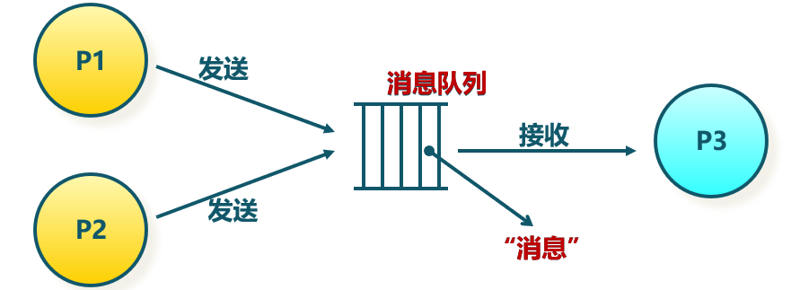

<!-- theme: gaia -->
<!-- _class: lead -->

# 第十讲 进程间通信
Inter Process Communication，IPC
## 第一节 进程间通信(IPC)概述

<br>
<br>

向勇 陈渝 李国良 

<br>
<br>

2022年春季


---
### IPC基本概念 -- 需求背景
目标：完成复杂应用需求
- 单个程序的功能有限
- 可通过多个程序的合作完成复杂的事情

定义：各进程之间通过数据交换进行交互的行为称为进程间通信（Inter-process communication，IPC）


---
### IPC基本概念 -- 需求背景

进程可分为两类：
- 独立进程：这类进程与其它进程有交互
- 协作进程：两个或多个进程之间有交互
```
rCore-Tutorial-v3 on  ch7
❯ cat README.md | grep rcore
$ git clone https://github.com/rcore-os/rCore-Tutorial-v3.git
...
* [x] expand the fs image size generated by `rcore-fs-fuse` to 128MiB
```
`grep`进程依赖于`cat`进程。`cat` 产生输出，`grep`等待`cat`的输出作为自己的输入，并进行字符串匹配。


---
### IPC基本概念 -- 需求背景
进程间能共享或传递数据就算是进程间通信。

| IPC手段  |  含义  |
| ------------------------ | ---- |
|  共享内存（Shared Memory)    |  多个进程共享一块物理内存  |
| 文件（File）     |  多个进程可访问同一文件 |


---
### IPC基本概念 -- 需求背景
进程间能共享或传递数据就算是进程间通信。

| IPC手段  |  含义  |
| ------------------------ | ---- |
|   管道（Pipe）   | 单方向传输字节流  |
|   消息队列（Message Queue）   |  多个进程从队列中发送/接收消息 |
|  信号（Signal）    | 发送某些信号通知进程，进程异步收到信号并处理  |
|  套接字（Socket）    | 多/单机进程间网络通信  |


---
### IPC基本概念 -- 需求背景
进程间能共享或传递数据就算是进程间通信。
- 通信方式：直接通信   间接通信


---
### IPC基本概念 -- 需求背景
进程间能共享或传递数据就算是进程间通信。
- 通信方式：阻塞（同步）或非阻塞（异步）
- 阻塞通信: 
  - 阻塞发送、阻塞接收
- 非阻塞通信
  - 非阻塞发送、非阻塞接收


---
### IPC基本概念 -- 需求背景
进程间能共享或传递数据就算是进程间通信。
- 缓冲方式：
  - 0 容量: 发送方必须等待接收方
  - 有限容量：通信链路缓冲队列满时，发送方必须等待
  - 无限容量：发送方不需要等待


---
### IPC基本概念 -- 管道
管道(pipe)
- 一种进程间通信机制
- 有读写端的一定大小的字节队列
- 读端只能用来从管道中读取
- 写端只能用来将数据写入管道
- 读/写端通过不同文件描述符表示


---
### IPC基本概念 -- 管道
管道(pipe)
- 创建一个管道，返回两个文件描述符，一个是负责读管道的返回，一个是负责写管道
- 管道可表示为两个文件描述符加一段内核空间中的内存
-  `int pipe(int pipefd[2])`


---
### IPC基本概念 -- 管道
管道(pipe)
- 支持有关系的进程间通信，如父子进程、兄弟进程等
- 当某进程创建了一个管道(两个文件描述符)，它的子进程会继承这些文件描述符，并读写这个管道


---
### IPC基本概念 -- 管道
管道(pipe)
- 一般情况下，管道两端的每个进程都会各自关闭一个管道的文件描述符
- 如父进程关闭读描述符，这样父进程只能向管道写数据，子进程关闭写描述符，这样子进程只能从管道读数据。


---
### IPC基本概念 -- 管道
Shell也提供了管道 ，只需使用一根竖线 "**|**" 连接两个命令即
```
rCore-Tutorial-v3 on  ch7
❯ cat README.md | grep rcore
$ git clone https://github.com/rcore-os/rCore-Tutorial-v3.git
...
* [x] expand the fs image size generated by `rcore-fs-fuse` to 128MiB
```
这种管道称为匿名管道，它对于编写灵活的命令行脚本非常方便。

---
### IPC基本概念 -- 管道
在shell下，还支持使用mkfifo命令创建命名管道（named pipe），也称为FIFO，它支持任意进程间的数据通信。
```
$ mkfifo name.fifo
$  ls -l name.fifo   # 文件类型为p
prw-r--r-- 1 chyyuu chyyuu 0 4月  14 20:19 name.fifo
```

---
### IPC基本概念 -- 管道
命名管道是阻塞式的双向通信管道，任意一方都可以读、写，但是只有读、写端同时打开了命名管道时，数据才会写入并被读取。

shell A
```
$ echo README > name.fifo  #写命名管道阻塞
```
shell B
```
$ cat name.fifo
```
---
### IPC基本概念 -- 消息队列
消息队列（Message Queue)
 - 是由操作系统维护的以字节序列为基本单位的间接通信机制
   - 每个消息(Message)是一个字节序列
   - 相同标识的消息组成按先进先出顺序组成一个消息队列



---
### IPC基本概念 -- 消息队列
- 消息队列的系统调用
  - msgget ( key, flags） //获取消息队列标识
  - msgsnd ( QID, buf, size, flags ） //发送消息
  - msgrcv ( QID, buf, size, type, flags ） //接收消息
  - msgctl( … ） // 消息队列控制

---
### IPC基本概念 -- 共享内存
共享内存 shared memory, shmem
- 是把同一个物理内存区域同时映射到多个进程的内存地址空间的通信机制
- 每个进程的内存地址空间需明确设置共享内存段
- 优点: 快速、方便地共享数据
- 不足: 需要同步机制协调数据访问


 

---
### IPC基本概念 -- 共享内存
- 共享内存的系统调用
  -  shmget( key, size, flags） //创建共享段
  - shmat( shmid, *shmaddr, flags） //把共享段映射到进程地址空间
  - shmdt( *shmaddr）//取消共享段到进程地址空间的映射
  - shmctl( …） //共享段控制

注：需要信号量（后续介绍）等机制协调共享内存的访问冲突


---
### IPC基本概念 -- 信号
信号（Signal）
- 进程间的软件中断通知和处理机制

问题：
 - `Ctrl+C`为什么可以结束进程？
 - 指针错误为什么让进程结束？
- kill命令是怎么结束进程的？


---
### IPC基本概念 -- 信号
信号命名
- 信号是一个整数编号，这些整数编号都定义了对应的宏名，宏名都是以SIG开头，比如SIGABRT, SIGKILL, SIGSTOP, SIGCONT


---
### IPC基本概念 -- 信号
信号发送方
- 进程
  - shell通过kill命令向某个进程发送一个信号将其终止
- 内核
  - 进程从管道文件读取数据，但是管道文件的读权限被关闭了，进程会被内核发送一个SIGPIPE信号，提示读管道出错了 
- 外设


---
### IPC基本概念 -- 信号
信号发送方
- 外设
  - 比如按下Ctrl+C按键时，内核收到包含Ctrl+C按键的外设中断，会向正在运行的进程发送SIGINT信号，将其异常终止


---
### IPC基本概念 -- 信号
信号接收进程的处理方式
- 忽略：信号没有发生过
- 捕获：进程会调用相应的处理函数进行处理
- 默认：如果不忽略也不捕获，此时进程会使用系统默认的处理方式来处理信号


---
### IPC基本概念 -- 信号
Linux有哪些信号？ -- 62个


---
### IPC基本概念 -- 信号
Linux有哪些信号？ -- 62个
-  为什么这么多信号？
  -  每个信号代表着某种事件，一般情况下，当进程收到某个信号时，就表示该信号所代表的事件发生了。  
  - 对1~34中的常用信号，要求是理解，而不是记忆。当忘记了信号名字时，kill -l查看即可。

---
### IPC基本概念 -- 信号
Linux常用信号
- SIGKILL
- SIGINT
- SIGSEGV


---

信号应用编程


---
### IPC基本概念 -- 信号
实现机制
