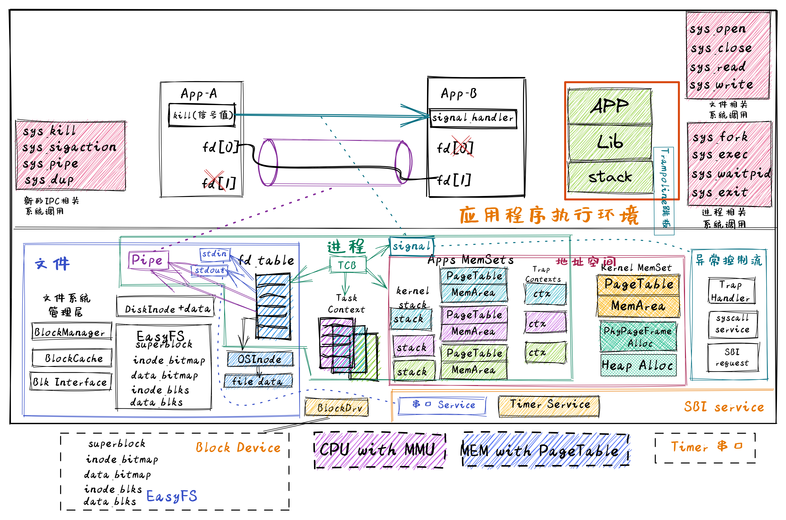

<!-- theme: gaia -->
<!-- _class: lead -->

# 第十讲 进程间通信

## 第二节 支持IPC的OS
IPC OS (IOS)

---
## 实践：IOS
- **进化目标**
- 总体思路
- 历史背景
- 实践步骤
- 软件架构
- 相关硬件
- 程序设计

---
## 实践：IOS -- 以往目标
提高性能、简化开发、加强安全、支持数据持久保存
- Filesystem OS：支持数据持久保存
- Process OS: 增强进程管理和资源管理
- Address Space OS: 隔离APP访问的内存地址空间
- multiprog & time-sharing OS目标: 让APP共享CPU资源
- BatchOS目标: 让APP与OS隔离，加强系统安全，提高执行效率
- LibOS目标: 让APP与HW隔离，简化应用访问硬件的难度和复杂性
---
## 实践：IOS -- 进化目标
支持进程间交互
- 扩展文件抽象：Pipe，Stdout, Stdin
- 以文件形式进行进程间数据交换
- 以文件形式进行串口输入输出  
- 信号机实现进程间异步通知机制

---
## 实践：IOS
### 同学的进化目标
- 理解文件抽象
- 理解IPC机制的设计与实现
  - pipe
  - signal
- 会写支持IPC的OS

<!-- 迅猛龙Velociraptor具有匿踪能力和狡诈本领。迅猛龙比较聪明具有团队协作能力、擅长团队合作 操作系统  -->

---
## 实践：IOS
- 进化目标
- **总体思路**
- 历史背景
- 实践步骤
- 软件架构
- 程序设计

---

**总体思路**

