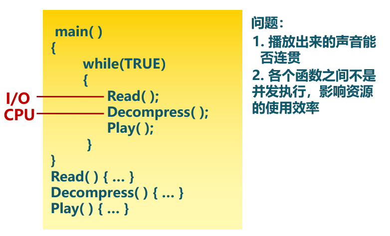
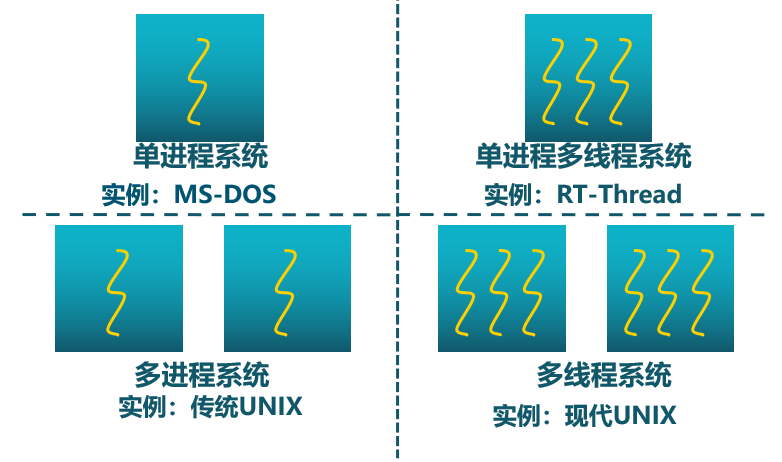
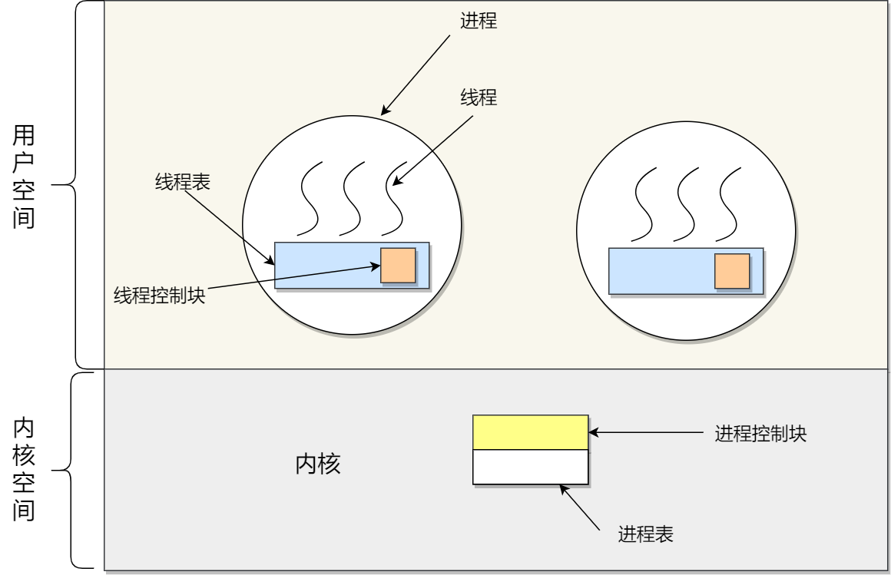
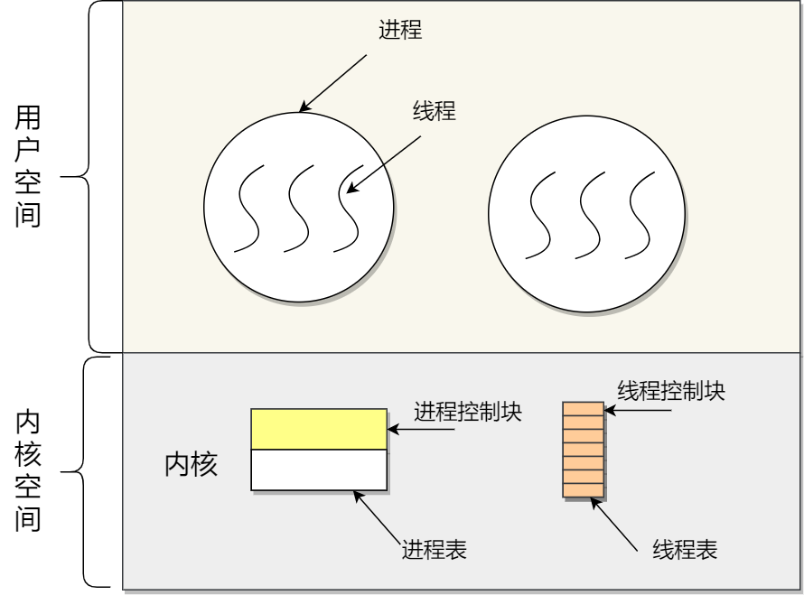
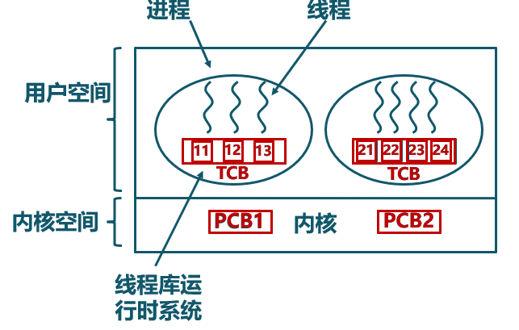
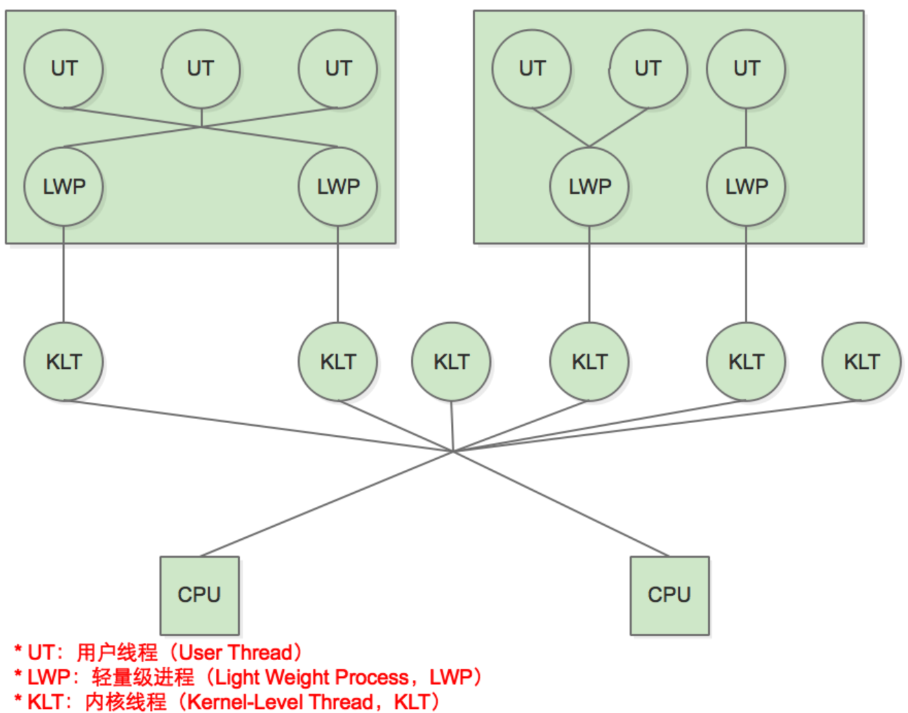
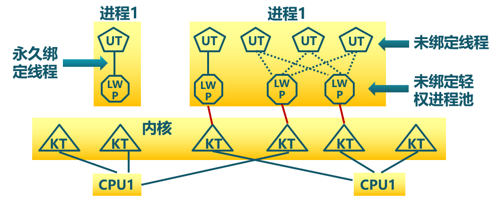

<!-- theme: gaia -->
<!-- _class: lead -->

# 第十一讲 线程与协程

## 第一节 线程


<br>
<br>

向勇 陈渝 李国良 

2022年秋季

---

**提纲**

### 1. 为何需要线程？
2. 线程的概念
3. 使用线程
4. 线程的设计实现

---
#### 进程存在的不足

  -  并行/并发处理困难
  -  进程之间地址空间隔离
  -  通过IPC共享/交换数据不方便
  -  管理进程开销大
     - 创建/删除/切换



---

#### 进程存在的不足

  -  并行/并发处理困难
  -  进程之间地址空间隔离
  -  通过IPC共享/交换数据不方便
  -  管理进程开销大
     - 创建/删除/切换


---
#### 为何需要线程？

在应用中可能同时发生多种活动，且某些活动会被阻塞。将**程序分解成可并行运行的多个顺序控制流**，可提高执行**效率**，且程序设计模型也会变得更**简单**。


<!--

-->

---
#### 为何需要线程？
永远存在的用户需求 -- **性能**！
-  并行实体（多个顺序控制流）共享同一个地址空间和所有可用数据
  - 访问数据和共享资源方便
  - 切换控制流轻量
  - 管理不同控制流便捷 


---

#### 线程 vs 进程
- 进程是资源（包括内存、打开的文件等）分配的单位，线程是 CPU 调度的单位；
- 进程拥有一个完整的资源平台，而线程只独享必不可少的资源，如寄存器和栈；
- 线程同样具有就绪、阻塞、执行三种基本状态，同样具有状态之间的转换关系；
- 线程能减少并发执行的时间和空间开销；

---
#### 线程 vs 进程
- 一个进程中可以同时存在多个线程；
- 各个线程之间可以并发执行；
- 各个线程之间可以共享地址空间和文件等资源；
- 当进程中的一个线程崩溃时，会导致其所属进程的所有线程崩溃（这里是针对 C/C++ 语言，Java语言中的线程崩溃不会造成进程崩溃）。

---

**提纲**

1. 为何需要线程？
### 2. 线程的概念
3. 使用线程
4. 线程的设计实现

---
#### 线程的定义

线程是进程的一**部分**，描述指令流**执行状态**。它是进程中的指令执行流的基本单元，是CPU调度的**基本单位**。


---
#### 进程和线程的角色

- 进程的**资源分配**角色
  - 进程由一组相关资源构成，包括地址空间（代码段、数据段）、打开的文件等各种资源

- 线程的**处理机调度**角色
  - 线程描述在进程资源环境中的指令流执行状态


---
#### 不同操作系统对线程的支持



---
#### 进程和线程的关系

**线程 = 进程 - 共享资源**
- 一个进程中可存在多个线程
- 线程共享进程的地址空间
- 线程共享进程的资源
- 线程崩溃会导致进程崩溃

线程是一个调度实体 Scheduling Entry
User-SE  v.s.  Kernel-SE 


---
#### 线程与进程的比较
- 进程是资源分配单位，线程是CPU调度单位
- 进程拥有一个完整的资源平台，而线程只独享指令流执行的必要资源，如寄存器和栈
- 线程具有就绪、等待和运行三种基本状态和状态间的转换关系
- 线程能减少并发执行的时间和空间开销
  - 线程的创建/终止/切换时间比进程短
  - 同一进程的各线程间共享内存和文件资源，可不通过内核进行直接通信


---

#### 用户态管理的线程与内核态管理的线程




---

#### 线程控制块(TCB, Thread Control Block)
```c
typedef struct
{
       int                       detachstate;   // 线程的分离状态
       int                       schedpolicy;   // 线程调度策略
       structsched_param         schedparam;    // 线程的调度参数
       int                       inheritsched;  // 线程的继承性
       int                       scope;         // 线程的作用域
       size_t                    guardsize;     // 线程栈末尾的警戒缓冲区大小
       int                       stackaddr_set; // 线程的栈设置
       void*                     stackaddr;     // 线程栈的位置
       size_t                    stacksize;     // 线程栈的大小
} pthread_attr_t;
```
---

#### 创建线程API
创建线程：成功返回零，否则返回非零值
```c
#include <pthread.h>
int pthread_create(      pthread_t *        thread,
               const pthread_attr_t *       attr,
                     void *                 (*start_routine)(void*),
                     void *                 arg);
```       
- thread指向pthread_t结构类型的指针
- attr用于指定该线程可能具有的任何属性
- start_routine是线程开始运行的函数指针
- arg是要传递给线程开始执行的函数的参数


---

#### 等待线程API

等待线程：一直阻塞调用它的线程，直至目标线程执行结束
```c
#include <pthread.h>
int pthread_join(pthread_t thread, void **retval);
```       
- thread指向pthread_t结构类型的指针
- retval是指向返回值的指针

---

**提纲**

1. 为何需要线程？
2. 线程的概念
### 3. 使用线程
4. 线程的设计实现

---

#### 线程示例

```c
1    void *mythread(void *arg) {
2        printf("%s\n", (char *) arg);
3        return NULL;
4    }
5    int main(int argc, char *argv[]) {
6       pthread_t p1, p2;
7       int rc;
8       printf("main: begin\n");
9       rc = pthread_create(&p1, NULL, mythread, "A"); assert(rc == 0);
10       rc = pthread_create(&p2, NULL, mythread, "B"); assert(rc == 0);
11       // join waits for the threads to finish
12       rc = pthread_join(p1, NULL); assert(rc == 0);
13       rc = pthread_join(p2, NULL); assert(rc == 0);
14       printf("main: end\n");
15       return 0;
16   }
```

---
#### 线程示例输出

一个程序，它创建两个线程，每个线程都做了一些独立的工作，在这例子中，打印“A”或“B”。

```
❯ ./t0
main: begin
A
B
main: end
```

---

**提纲**

1. 为何需要线程？
2. 线程的概念
3. 使用线程
### 4. 线程的设计实现
- 用户线程(用户态管理的线程)
- 内核线程(内核态管理的线程)
- 轻权进程


---
### 线程的设计实现
- 线程的几种实现方式 
  - 用户态管理且用户态运行的线程（内核不可见的用户线程）
    - Thread managed&running in User-Mode
  - 内核态管理且用户态运行的线程（内核可见的用户线程）
    - Thread managed in Kernel-Mode&running in User-Mode
  - 内核态管理且内核态运行的线程（内核线程）
    - Thread managed&running in Kernel-Mode
  - 混合管理且运行的线程（轻量级进程，混合线程）
    - Thread managed&running in Mixed-Mode
---
### 线程的设计实现
- 用户态管理且用户态运行的线程
  - 在用户态实现线程的管理与运行，操作系统感知不到这类线程的存在
     -  POSIX Pthreads，Mach C-threads，Solaris threads
     - 别名：用户态线程(User-level Thread)、绿色线程(Green Thread)、有栈协程(Stackful Coroutine)、纤程(Fiber)




---
### 线程的设计实现

- 用户态管理且用户态运行的线程
   - 由一组用户级的线程库函数来完成线程的管理，包括线程的创建、终止、同步和调度等


---
### 线程的设计实现
- 用户态管理且用户态运行的线程的不足之处
     -  一个线程发起系统调用而阻塞时，则整个进程进入等待
     -  不支持基于线程的处理机抢占
     -  只能按进程分配CPU时间


---
### 线程的设计实现
- 内核态管理且用户态运行的线程 
  - 由内核通过系统调用实现的线程机制，由内核完成线程的创建、终止和管理
  - 由内核维护线程控制块TCB, 在内核实现
  - 线程执行系统调用而被阻塞不影响其他线程


---
### 线程的设计实现
- 内核态管理且用户态运行的线程 
  - 一个进程中可以包括多个线程
     - Windows内核的设计 
     - rCore/uCore内核的设计
  - 一个进程中只包括一个线程
    - Linux内核的设计


---
### 线程的设计实现
- 内核态管理且用户态运行的线程的不足之处 
  - 在一般情况下，线程切换开销与进程切换开销相差不大，大于用户态管理且用户态允许的线程切换开销
  - 与传统的进程管理机制会产生一些矛盾，一些系统调用的实现功能/语义上会不协调
    - fork()、signal() ...


---
### 线程的设计实现
- 内核态管理且内核态运行的线程 （简称：内核线程）
  - 由内核实现线程机制，由内核完成线程的创建、终止和管理
  - 由内核维护TCB, 在内核实现
  - 线程在内核中执行
     - 如：Linux的内核线程 


---
### 线程的设计实现
- 内核态管理且内核态运行的线程 （简称：内核线程）
  - 内核线程就是内核的分身，一个分身可以分时/并行处理一件特定事情
  - 内核线程的调度由内核负责，一个内核线程处于阻塞状态时不影响其他的内核线程，因为其是调度的基本单位。


---
### 线程的设计实现
- 内核态管理且内核态运行的线程 （简称：内核线程）的作用
  - 执行周期性的任务
    -  把Buffer-Cache定期写回到存储设备上
    -  在可用物理内存页很少情况下执行虚存交换操作 
    -  实现文件系统的事务日志
   


---
### 线程的设计实现
- 双态管理的线程

轻量级进程（Light-Weight Process，LWP）是内核支持的用户线程，一个进程可有一个或多个 LWP，每个 LWP 是跟内核线程一对一映射的，也就是 LWP 都是由一个内核线程支持。 在 LWP 之上也可使用用户线程。

---
### 线程的设计实现
- 双态管理的线程

LWP 与用户线程的对应关系就有三种：

- 1 : 1，即一个 LWP 对应 一个用户线程：Linux, JVM 
  - 用户态管理取消，内核管理线程
- N : 1，即一个 LWP 对应多个用户线程：与OS无关的Green Thread 
  - 内核态仅管理包含多个线程的进程，用户态的线程运行时管理线程
- M : N，即多个 LWP 对应多个用户线程：Solaris OS, Go runtime
  - 用户态线程运行时和内核协同进行管理

---
### 线程的设计实现
- 双态管理的线程
  - M : N线程模型
  - Solaris 操作系统+C线程运行时库
  - Go语言+Go运行时库+OS



---
### 线程的设计实现
- 双态管理的线程
  - 编程人员决定内核线程与用户级线程的复用关系
  - 用户级线程由用户线程管理库管理
  - 内核只识别内核级线程/进程，并对其进行调度
  - 内核与用户态线程管理库交互
  - 具有最大灵活度和实现复杂性




---
### 线程的上下文切换

线程是调度的基本单位，而进程则是资源拥有的基本单位。

- 不同进程中的线程切换：进程上下文切换
- 相同进程中的线程切换：虚拟内存是共享的，切换时**虚拟内存这些资源就保持不动，只需要切换线程的私有数据、寄存器等不共享的数据**

---

### 小结

1. 为何需要线程？
2. 线程的概念
3. 使用线程
4. 线程的设计实现
