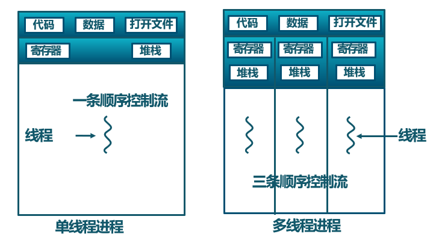
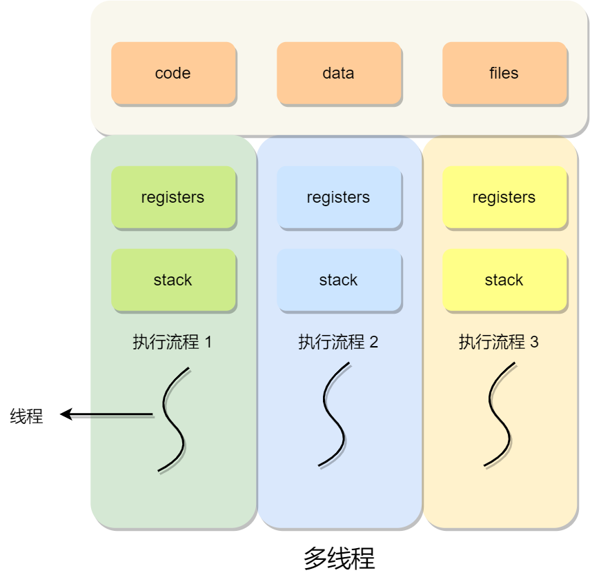
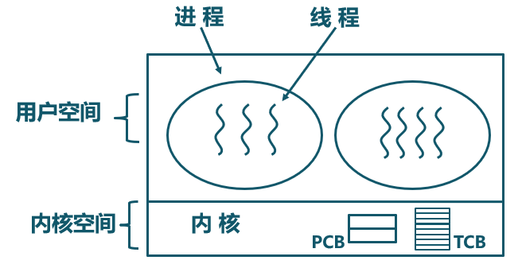

<!-- theme: gaia -->
<!-- _class: lead -->

# 第十一讲 线程与协程
Inter Process Communication，IPC
## 第一节 线程

<br>
<br>

向勇 陈渝 李国良 

<br>
<br>

2022年春季

---
### 概述
- 为何需要线程？
- 使用线程
- 线程的概念
- 线程的设计实现

---
### 为何需要线程？
- 进程还有啥不足？
  -  并行/并发处理困难
  -  进程之间地址空间隔离
  -  通过IPC共享/交换数据不方便
  -  管理进程开销大
     - 创建/删除/切换


---
### 为何需要线程？
- 进程还有啥不足？
  -  并行/并发处理困难
  -  进程之间地址空间隔离
  -  通过IPC共享/交换数据不方便
  -  管理进程开销大
     - 创建/删除/切换


---
### 为何需要线程？

在许多应用中实际上课同时发生多种活动，且某些活会被阻塞。通过将这些应用程序分解成可并行运行的多个顺序控制流，可提高执行效率，且程序设计模型也会变得更简单。





---
### 为何需要线程？
永远存在的用户需求 -- 性能！
-  并行实体（多个顺序控制流）共享同一个地址空间和所有可用数据
  - 访问数据和共享资源方便
  - 切换控制流轻量
  - 管理不同控制流便捷 


---
### 线程 vs 进程
- 进程是资源（包括内存、打开的文件等）分配的单位，线程是 CPU 调度的单位；
- 进程拥有一个完整的资源平台，而线程只独享必不可少的资源，如寄存器和栈；
- 线程同样具有就绪、阻塞、执行三种基本状态，同样具有状态之间的转换关系；
- 线程能减少并发执行的时间和空间开销；

---
### 线程 vs 进程
- 一个进程中可以同时存在多个线程；
- 各个线程之间可以并发执行；
- 各个线程之间可以共享地址空间和文件等资源；
- 当进程中的一个线程崩溃时，会导致其所属进程的所有线程崩溃（这里是针对 C/C++ 语言，Java语言中的线程奔溃不会造成进程崩溃）。

---
### 使用线程

```c
1    void *mythread(void *arg) {
2        printf("%s\n", (char *) arg);
3        return NULL;
4    }
5    int main(int argc, char *argv[]) {
6       pthread_t p1, p2;
7       int rc;
8       printf("main: begin\n");
9       rc = pthread_create(&p1, NULL, mythread, "A"); assert(rc == 0);
10       rc = pthread_create(&p2, NULL, mythread, "B"); assert(rc == 0);
11       // join waits for the threads to finish
12       rc = pthread_join(p1, NULL); assert(rc == 0);
13       rc = pthread_join(p2, NULL); assert(rc == 0);
14       printf("main: end\n");
15       return 0;
16   }
```

---
### 使用线程
一个程序，它创建两个线程，每个线程都做了一些独立的工作，在这例子中，打印“A”或“B”。

```
❯ ./t0
main: begin
A
B
main: end
```

---
### 使用线程

```c
#include <pthread.h> 
int pthread_create(      pthread_t *        thread,
               const pthread_attr_t *       attr,
                     void *                 (*start_routine)(void*),
                     void *                 arg);
```                     
- thread指向pthread_t结构类型的指针
- attr用于指定该线程可能具有的任何属性
- start_routine是线程开始运行的函数指针
- arg是要传递给线程开始执行的函数的参数


---
### 使用线程

```c
#include <pthread.h>
int pthread_join(pthread_t thread, void **retval);
```       
- thread指向pthread_t结构类型的指针
- retval是指向返回值的指针

---
### 线程的概念
- 线程的基本定义
  - 线程是进程的一部分，描述指令流执行状态。它是进程中的指令执行流的基本单元，是CPU调度的基本单位。


---
### 线程的概念

- 进程的资源分配角色：进程由一组相关资源构成，包括地址空间（代码段、数据段）、打开的文件等各种资源

- 线程的处理机调度角色：线程描述在进程资源环境中的指令流执行状态


---
### 线程的概念
不同操作系统对线程的支持


---
### 线程的概念
进程和线程的关系
- 线程 = 进程 - 共享资源
- 一个进程中可存在多个线程
- 线程共享进程的地址空间
- 线程共享进程的资源
- 线程崩溃会导致进程崩溃


---
### 线程的概念
线程与进程的比较 
- 进程是资源分配单位，线程是CPU调度单位
- 进程拥有一个完整的资源平台，而线程只独享指令流执行的必要资源，如寄存器和栈
- 线程具有就绪、等待和运行三种基本状态和状态间的转换关系
- 线程能减少并发执行的时间和空间开销
  - 线程的创建/终止/切换时间比进程短
  - 同一进程的各线程间共享内存和文件资源，可不通过内核进行直接通信

---
### 线程的设计实现
- 线程的几种实现方式 
  - 用户态管理且运行的线程(Thread managed&running in User-Mode)
  - 内核态管理且用户态运行的线程(Thread managed in Kernel-Mode&running in User-Mode)
  - 内核态管理且内核态运行的线程(Thread managed&running in Kernel-Mode)
  - 混合管理且运行的线程(Thread managed&running in Mixed-Mode)
---
### 线程的设计实现
- 用户态管理且运行的线程
  - 在用户态实现线程的管理与运行，操作系统感知不到这类线程的存在
     -  POSIX Pthreads，Mach C-threads，Solaris threads
     - 别名：用户态线程(User-level Thread)、绿色线程(Green Thread)、有栈协程(Stackful Coroutine)、纤程(Fiber)


---
### 线程的设计实现

- 用户态管理且运行的线程
   - 由一组用户级的线程库函数来完成线程的管理，包括线程的创建、终止、同步和调度等


---
### 线程的设计实现
- 用户态管理且运行的线程的不足
     -  一个线程发起系统调用而阻塞时，则整个进程进入等待
     -  不支持基于线程的处理机抢占
     -  只能按进程分配CPU时间


---
### 线程的设计实现
- 内核态管理且用户态运行的线程 
  - 由内核通过系统调用实现的线程机制，由内核完成线程的创建、终止和管理
  - 由内核维护TCB, 在内核实现
  - 线程执行系统调用而被阻塞不影响其他线程




---
### 线程的设计实现
- 内核态管理且运行的线程 
  - 由内核实现线程机制，由内核完成线程的创建、终止和管理
  - 由内核维护TCB, 在内核实现
  - 线程在内核中执行


---
### 线程的设计实现 - 线程 vs 进程 


---
### 线程的设计实现
- 混合管理且运行的线程

轻量级进程（Light-weight process，LWP）是内核支持的用户线程，一个进程可有一个或多个 LWP，每个 LWP 是跟内核线程一对一映射的，也就是 LWP 都是由一个内核线程支持。 在 LWP 之上也是可以使用用户线程的，那么 LWP 与用户线程的对应关系就有三种：

- 1 : 1，即一个 LWP 对应 一个用户线程；
- N : 1，即一个 LWP 对应多个用户线程；
- M : N，即多个 LWP 对应多个用户线程；


---
### 线程的设计实现


---
### 线程的设计实现
- 混合管理且运行的线程
  - 编程人员可以决定有多少个内核级线程和多少个用户级线程彼此多路复用
  - 用户级线程由用户线程管理库管理
  - 内核只识别内核级线程，并对其进行调度
  - 内核与用户态线程管理库交互
  - 具有最大灵活度和实现复杂性


---
### 线程的上下文切换

线程是调度的基本单位，而进程则是资源拥有的基本单位。

操作系统的任务调度，实际上的调度对象是线程，而进程只是给线程提供了虚拟内存、全局变量等资源。

- 当两个线程不是属于同一个进程，则切换的过程就跟进程上下文切换一样；
- 当两个线程是属于同一个进程，因为虚拟内存是共享的，所以在切换时，**虚拟内存这些资源就保持不动，只需要切换线程的私有数据、寄存器等不共享的数据；**