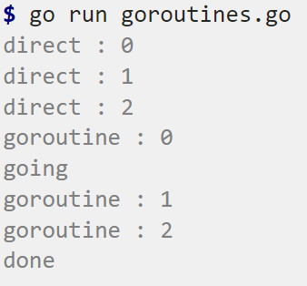

<!-- theme: gaia -->
<!-- _class: lead -->

# 第十一讲 线程与协程
Inter Process Communication，IPC
## 第二节 协程

<br>
<br>

向勇 陈渝 李国良 

<br>
<br>

2022年春季

---
### 概述
- 为何需要协程？
- 使用协程
- 协程的设计实现

---
### 为何需要协程？
<!-- 什么是协程？ https://zhuanlan.zhihu.com/p/172471249 -->
- 线程有啥不足？
  -  大规模并发I/O操作场景
     -  大量线程占内存总量大
     -  管理线程程开销大
        - 创建/删除/切换
     -  访问共享数据易错


---
### 为何需要协程？
<!-- 并发编程漫谈之 协程详解--以python协程入手（三） https://blog.csdn.net/u013597671/article/details/89762233 -->
- 协程采用同步编程方式支持大规模并发I/O异步操作
- 协程(coroutine)是啥？
  -  协程由Melvin Conway在1963年提出并实现
  -  当时他对协程的描述是“行为与主程序相似的子例程(subroutine)”

Donald  Knuth ：子例程是协程的特例


<!-- 协程的概念最早由Melvin Conway在1963年提出并实现，用于简化COBOL编译器的词法和句法分析器间的协作，当时他对协程的描述是“行为与主程序相似的子例程”。 -->

---
### 为何需要协程？
<!-- 并发编程漫谈之 协程详解--以python协程入手（三） https://blog.csdn.net/u013597671/article/details/89762233 -->
- 协程(coroutine)是啥？
  - Wiki的定义：协程是一种程序组件，是由子例程（过程、函数、例程、方法、子程序）的概念泛化而来的，子例程只有一个入口点且只返回一次，协程允许多个入口点，可在指定位置挂起和恢复执行。

协程的核心思想：控制流的主动让出与恢复

<!-- 协程(Coroutine)-ES中关于Generator/async/await的学习思考 https://blog.csdn.net/shenlei19911210/article/details/61194617 -->


---
### 为何需要协程？
<!-- C++20协程原理和应用 https://zhuanlan.zhihu.com/p/498253158 -->
- 协程(coroutine)是啥？
  - 相比普通函数，协程的函数体可以挂起并在任意时刻恢复执行

**无栈协程是普通函数的泛化**

---
### 为何需要协程？-- 协程分类
<!-- 并发编程漫谈之 协程详解--以python协程入手（三） https://blog.csdn.net/u013597671/article/details/89762233 -->
2004年Lua的作者Ana Lucia de Moura和Roberto Ierusalimschy发表论文“Revisiting Coroutines”，提出依照三个因素来对协程进行分类：
- 控制传递（Control-transfer）机制
- 栈式（Stackful）构造
- 编程语言中第一类（First-class）对象

---
### 为何需要协程？-- 协程分类
控制传递机制：对称（Symmetric） v.s. 非对称（Asymmetric）协程
- 对称协程：
   - 只提供一种传递操作，用于在协程间直接传递控制
   - 对称协程都是等价的，控制权直接在对称协程之间进行传递
   - 对称协程在挂起时主动指明另外一个对称协程来接收控制权
- 非对称协程（半对称（Semi-symmetric）协程）：
  - 提供调用和挂起两种操作，非对称协程挂起时将控制返回给调用者
  - 调用者或上层管理者根据某调度策略调用其他非对称协程进行工作

<!-- 出于支持并发而提供的协程通常是对称协程，用于表示独立的执行单元，如golang中的协程。用于产生值序列的协程则为非对称协程，如迭代器和生成器。
这两种控制传递机制可以相互表达，因此要提供通用协程时只须实现其中一种即可。但是，两者表达力相同并不意味着在易用性上也相同。对称协程会把程序的控制流变得相对复杂而难以理解和管理，而非对称协程的行为在某种意义上与函数类似，因为控制总是返回给调用者。使用非对称协程写出的程序更加结构化。 -->


---
### 为何需要协程？-- 协程分类
<!-- 有栈协程和无栈协程 https://cloud.tencent.com/developer/article/1888257 -->
栈式（Stackful）构造：有栈(stackful)协程 v.s. 无栈(stackless)协程
- 无栈协程：指可挂起/恢复的函数
   - 无独立的上下文空间（栈），数据保存在堆上 
   - 开销： 函数调用的开销
- 有栈协程：用户态管理并运行的线程
  - 有独立的上下文空间（栈）
  - 开销：用户态切换线程的开销
- 是否可以在任意嵌套函数中被挂起？
  - 有栈协程：可以；无栈协程：不行
<!--  -->

<!-- 
https://zhuanlan.zhihu.com/p/25513336
Coroutine从入门到劝退

除此之外，wiki上还对coroutine做了分类：
非对称式协程，asymmetric coroutine。
对称式协程，symmetric coroutine。
半协程，semi-coroutine。 

-->

---
### 为何需要协程？-- 协程分类
<!-- 有栈协程和无栈协程 https://cloud.tencent.com/developer/article/1888257 -->
第一类（First-class）语言对象：First-class对象 v.s. 受限协程
- First-class对象 : 协程被在语言中作为first-class对象
   - 可以作为参数被传递，由函数创建并返回，并存储在一个数据结构中供后续操作
   - 提供了良好的编程表达力，方便开发者对协程进行操作
-  受限协程
   -  特定用途而实现的协程，协程对象限制在指定的代码结构中
 
---
### 为何需要协程？
支持协程的编程语言
- C++20(无栈)，Go(有栈)，Rust（无栈）
- C#(无栈)，Java 2022(有栈)
- Python（有/无栈）, Javascript（无栈）, Lua(有栈)


<!-- 
https://wiki.brewlin.com/wiki/compiler/rust%E5%8D%8F%E7%A8%8B_%E8%B0%83%E5%BA%A6%E5%99%A8%E5%AE%9E%E7%8E%B0/

理解协程的核心就是暂停和恢复，rust的协程通过状态机做到这一点，golang通过独立的栈做到这一点。理解这一点很重要 -->

<!-- Java 协程要来了 https://cloud.tencent.com/developer/article/1949981 -->
<!-- 深入Lua：协程的实现 https://zhuanlan.zhihu.com/p/99608423 -->

<!-- Rust中的协程: Future与async/await https://zijiaw.github.io/posts/a7-rsfuture/ -->

---
### 使用协程 -- go
<!-- Go by Example 中文版: 协程
https://gobyexample-cn.github.io/goroutines -->

```go
... //https://gobyexample-cn.github.io/goroutines
func f(from string) {
    for i := 0; i < 3; i++ {
        fmt.Println(from, ":", i)
    }
}
func main() {
    f("direct")
    go f("goroutine")
    go func(msg string) {
        fmt.Println(msg)
    }("going")
    time.Sleep(time.Second)
    fmt.Println("done")
}
```



---
<!-- 
Making multiple HTTP requests using Python (synchronous, multiprocessing, multithreading, asyncio)
https://www.youtube.com/watch?v=R4Oz8JUuM4s
https://github.com/nikhilkumarsingh/async-http-requests-tut -->
### 使用协程 -- python
<!-- asyncio 是 Python 3.4 引入的标准库，直接内置了对异步 IO 的支持。只要在一个函数前面加上 async 关键字就可以将一个函数变为一个协程。 -->

```python
URL = 'https://httpbin.org/uuid'
async def fetch(session, url):
    async with session.get(url) as response:
        json_response = await response.json()
        print(json_response['uuid'])
async def main():
    async with aiohttp.ClientSession() as session:
        tasks = [fetch(session, URL) for _ in range(100)]
        await asyncio.gather(*tasks)
def func():
    asyncio.run(main())
```    
```
// https://github.com/nikhilkumarsingh/async-http-requests-tut/blob/master/test_asyncio.py
b6e20fef-5ad7-49d9-b8ae-84b08e0f2d35
69d42300-386e-4c49-ad77-747cae9b2316
1.5898115579998375
```

<!-- 进程，线程和协程 (Process, Thread and Coroutine) 理论篇，实践篇，代码 python
https://leovan.me/cn/2021/04/process-thread-and-coroutine-theory/
https://leovan.me/cn/2021/04/process-thread-and-coroutine-python-implementation/
https://github.com/leovan/leovan.me/tree/master/scripts/cn/2021-04-03-process-thread-and-coroutine-python-implementation -->


---
### 使用协程 -- rust

<!-- https://rust-lang.github.io/async-book/01_getting_started/01_chapter.html -->

```rust
use futures::executor::block_on;

async fn hello_world() {
    println!("hello, world!");
}

fn main() {
    let future = hello_world(); // Nothing is printed
    block_on(future); // `future` is run and "hello, world!" is printed
}
```
```
https://rust-lang.github.io/async-book/01_getting_started/01_chapter.html 
```

<!-- 
用python 写一个os
http://www.dabeaz.com/coroutines/
http://www.dabeaz.com/coroutines/Coroutines.pdf -->
---
### 进程/线程/协程性能比较
<!-- 
https://www.youtube.com/watch?v=R4Oz8JUuM4s
https://github.com/nikhilkumarsingh/async-http-requests-tut
git@github.com:nikhilkumarsingh/async-http-requests-tut.git -->
单进程：28秒
```python
import requests
from timer import timer
URL = 'https://httpbin.org/uuid'
def fetch(session, url):
    with session.get(url) as response:
        print(response.json()['uuid'])
@timer(1, 1)
def main():
    with requests.Session() as session:
        for _ in range(100):
            fetch(session, URL)

```
---
### 进程/线程/协程性能比较
<!-- 
https://www.youtube.com/watch?v=R4Oz8JUuM4s
https://github.com/nikhilkumarsingh/async-http-requests-tut
git@github.com:nikhilkumarsingh/async-http-requests-tut.git -->
多进程：7秒
```python
from multiprocessing.pool import Pool
import requests
from timer import timer
URL = 'https://httpbin.org/uuid'
def fetch(session, url):
    with session.get(url) as response:
        print(response.json()['uuid'])
@timer(1, 1)
def main():
    with Pool() as pool:
        with requests.Session() as session:
            pool.starmap(fetch, [(session, URL) for _ in range(100)])
```

---
### 进程/线程/协程性能比较
<!-- 
https://www.youtube.com/watch?v=R4Oz8JUuM4s
https://github.com/nikhilkumarsingh/async-http-requests-tut
git@github.com:nikhilkumarsingh/async-http-requests-tut.git -->
线程：4秒
```python
from concurrent.futures import ThreadPoolExecutor
import requests
from timer import timer
URL = 'https://httpbin.org/uuid'
def fetch(session, url):
    with session.get(url) as response:
        print(response.json()['uuid'])
@timer(1, 1)
def main():
    with ThreadPoolExecutor(max_workers=100) as executor:
        with requests.Session() as session:
            executor.map(fetch, [session] * 100, [URL] * 100)
            executor.shutdown(wait=True)
```

---
### 进程/线程/协程性能比较
<!-- 
https://www.youtube.com/watch?v=R4Oz8JUuM4s
https://github.com/nikhilkumarsingh/async-http-requests-tut
git@github.com:nikhilkumarsingh/async-http-requests-tut.git -->
协程：2秒
```python
...
URL = 'https://httpbin.org/uuid'
async def fetch(session, url):
    async with session.get(url) as response:
        json_response = await response.json()
        print(json_response['uuid'])
async def main():
    async with aiohttp.ClientSession() as session:
        tasks = [fetch(session, URL) for _ in range(100)]
        await asyncio.gather(*tasks)
@timer(1, 1)
def func():
    asyncio.run(main())
```
<!-- import asyncio
import aiohttp
from timer import timer 

requirements.txt
requests
aiohttp

-->