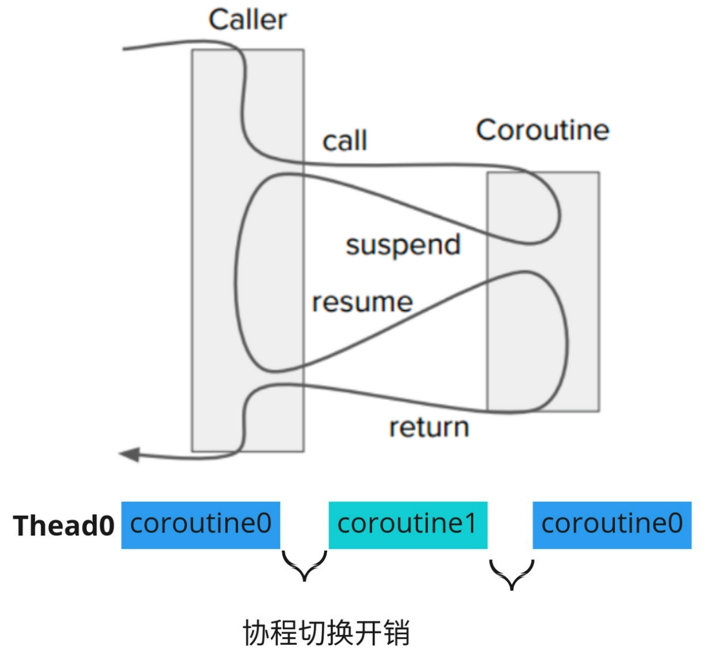
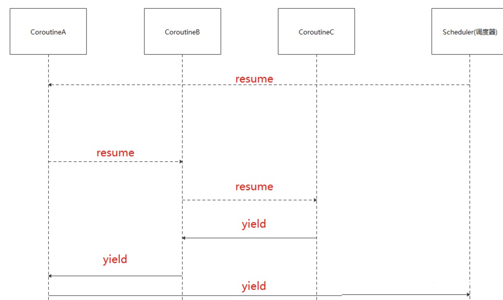
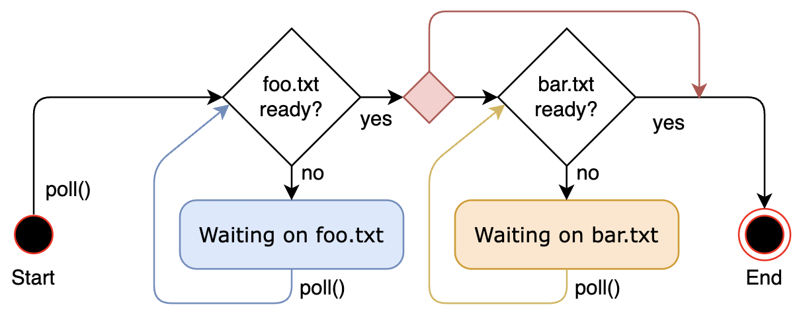
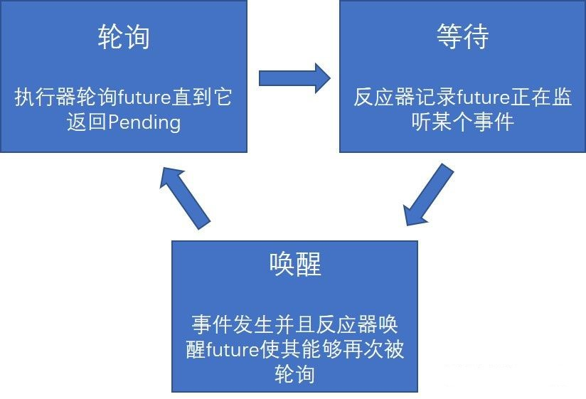
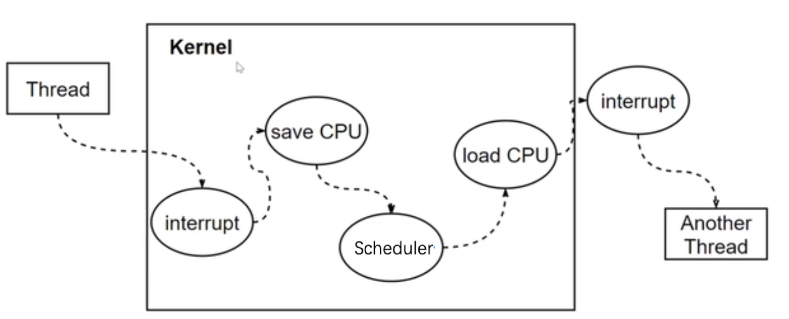
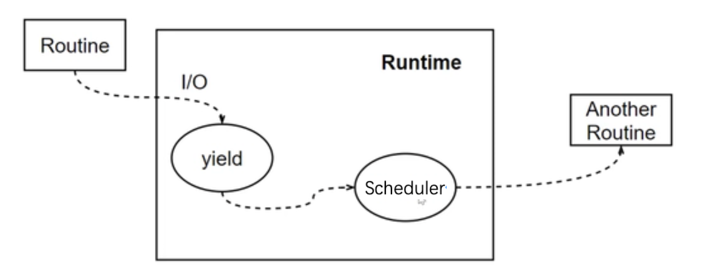
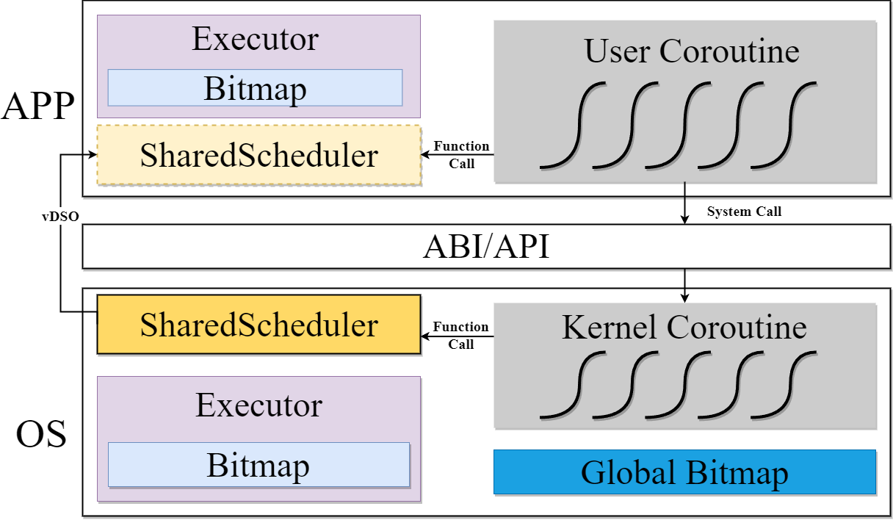
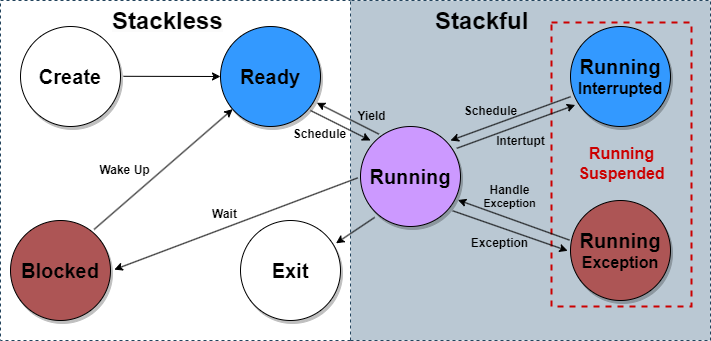
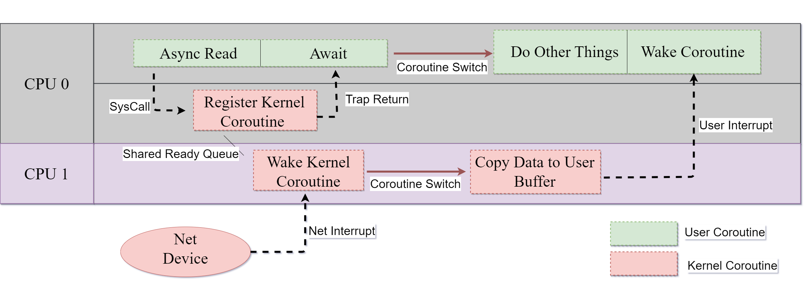

<!-- theme: gaia -->
<!-- _class: lead -->

# 第十一讲 线程与协程

## 第二节 协程（Coroutine）

<br>
<br>

向勇 陈渝 李国良 任炬 

2024年春季

[课程幻灯片列表](https://www.yuque.com/xyong-9fuoz/qczol5/ewvhdy3epbwbkn3n)

---

**提纲**

### 1. 协程的概念
2. 协程的实现
3. 协程示例
4. 协程与操作系统内核


---

#### 线程存在的不足

<!-- 什么是协程？ https://zhuanlan.zhihu.com/p/172471249 -->
-  大规模并发I/O操作场景
   -  大量线程**占内存**总量大
   -  管理线程程开销大
      - 创建/删除/切换
   -  访问共享数据易错


---
#### 协程(coroutine)的提出

<!-- 并发编程漫谈之 协程详解--以python协程入手（三） https://blog.csdn.net/u013597671/article/details/89762233 -->
协程由Melvin Conway在1963年提出并实现([Ref](http://melconway.com/Home/pdf/compiler.pdf))
- 作者对协程的描述是“**行为与主程序相似的子例程**(subroutine)”
- 协程采用同步编程方式支持大规模并发I/O异步操作

[Donald  Knuth](https://www.chiark.greenend.org.uk/~sgtatham/coroutines.html) ：子例程是协程的特例


<!-- 协程的概念最早由Melvin Conway在1963年提出并实现，用于简化COBOL编译器的词法和句法分析器间的协作，当时他对协程的描述是“行为与主程序相似的子例程”。 -->

---

#### 协程的定义

<!-- 并发编程漫谈之 协程详解--以python协程入手（三） https://blog.csdn.net/u013597671/article/details/89762233 -->
- Wiki的定义：协程是一种程序组件，是由子例程（过程、函数、例程、方法、子程序）的概念泛化而来的，子例程只有一个入口点且只返回一次，协程允许**多个入口点**，可在**指定位置挂起和恢复**执行。

协程的核心思想：控制流的主动让出与恢复

<!-- 协程(Coroutine)-ES中关于Generator/async/await的学习思考 https://blog.csdn.net/shenlei19911210/article/details/61194617 -->


---
#### 协程（异步函数）与函数（同步函数）

<!-- C++20协程原理和应用 https://zhuanlan.zhihu.com/p/498253158 -->
- 相比普通函数，协程的函数体可以挂起并在任意时刻恢复执行
  - **无栈协程是普通函数的泛化**
  - **本课程**中的协程限指无栈协程(Stackless Coroutine)


---

#### 协程与用户线程的比较

- 协程的内存占用比线程小
  - 线程数量越多，协程的性能优势越明显
- 不需要多线程的锁机制，不存在同时写变量冲突，在协程中控制共享资源不加锁，只需要判断状态，所以执行效率比多线程高很多。


---

#### 协程示例(python)

```
def func()://普通函数
   print("a")
   print("b")
   print("c")
```
```
def func()://协程函数
  print("a")
  yield
  print("b")
  yield
  print("c")
```


---

**提纲**

1. 协程的概念
### 2. 协程的实现
3. 协程示例
4. 协程与操作系统内核


---

#### 协程的实现方式

<!-- 并发编程漫谈之 协程详解--以python协程入手（三） https://blog.csdn.net/u013597671/article/details/89762233 -->
2004年Lua的作者Ana Lucia de Moura和Roberto Ierusalimschy发表论文“[Revisiting Coroutines](https://dl.acm.org/doi/pdf/10.1145/1462166.1462167)”，提出依照三个因素来对协程进行分类：
- 控制传递（Control-transfer）机制
- 栈式（Stackful）构造
- 编程语言中第一类（First-class）对象

---

#### 基于控制传递的协程

控制传递机制：对称（Symmetric） v.s. 非对称（Asymmetric）协程
- 对称协程：
   - 只提供一种传递操作，用于**在协程间直接传递控制**
   - 对称协程都是等价的，控制权直接在对称协程之间进行传递
   - 对称协程在挂起时主动指明另外一个对称协程来接收控制权
- 非对称协程（半对称(Semi-symmetric)协程）：
  - 提供调用和挂起两种操作，非对称协程挂起时将**控制返回给调用者**
  - 调用者或上层管理者根据某调度策略调用其他非对称协程

<!-- 出于支持并发而提供的协程通常是对称协程，用于表示独立的执行单元，如golang中的协程。用于产生值序列的协程则为非对称协程，如迭代器和生成器。
这两种控制传递机制可以相互表达，因此要提供通用协程时只须实现其中一种即可。但是，两者表达力相同并不意味着在易用性上也相同。对称协程会把程序的控制流变得相对复杂而难以理解和管理，而非对称协程的行为在某种意义上与函数类似，因为控制总是返回给调用者。使用非对称协程写出的程序更加结构化。 -->

---

#### 对称协程的控制传递


---

#### 非对称协程的控制传递




---

#### 对称协程

**对称协程**是指所有协程都是对等的，每个协程可以主动挂起自己，并让出处理器给其他协程执行。对称协程不需要操作系统内核的支持，可以在用户空间中实现，具有更快的上下文切换速度和更小的内存开销。
* 优点：简单易用，没有复杂的调度逻辑。
* 缺点：如果某个协程死循环或阻塞，会导致整个进程挂起。

---

#### 非对称协程

**非对称协程**是指协程和线程一起使用，协程作为线程的子任务来执行。只有线程可以主动挂起自己，而协程则由线程控制其执行状态。
* 优点：
  - 支持并发执行，可以通过多线程实现更高的并发性。
  - 协程之间不会相互阻塞，可处理一些长时间任务。
* 缺点：
  - 实现较为复杂。<!-- 可通过操作系统内核获得支持。-->
  - 需要通过锁等机制来保证协程之间的同步和互斥。

---

#### 有栈(stackful)协程和无栈(stackless)协程

<!-- 有栈协程和无栈协程 https://cloud.tencent.com/developer/article/1888257 -->

- 无栈协程：指可挂起/恢复的函数
   - 无独立的上下文空间（栈），数据保存在堆上 
   - 开销： 函数调用的开销
- 有栈协程：用户态管理并运行的线程
  - 有独立的上下文空间（栈）
  - 开销：用户态切换线程的开销
<!-- - 是否可以在任意嵌套函数中被挂起？
  - 有栈协程：可以；无栈协程：不行 -->
<!--  -->

<!-- 
https://zhuanlan.zhihu.com/p/25513336
Coroutine从入门到劝退

除此之外，wiki上还对coroutine做了分类：
非对称式协程，asymmetric coroutine。
对称式协程，symmetric coroutine。
半协程，semi-coroutine。 

-->

---
#### 基于第一类语言对象的协程
<!-- 有栈协程和无栈协程 https://cloud.tencent.com/developer/article/1888257 -->
第一类（First-class）语言对象：First-class对象 v.s. second-class对象 (**是否可以作为参数传递**)
- First-class对象 : 协程被在语言中作为first-class对象
   - 可作为参数被传递，由函数创建并返回，并存储在一个数据结构中供后续操作
   - 提供了良好的编程表达力，方便开发者对协程进行操作
- 受限协程
   - 特定用途而实现的协程，协程对象限制在指定的代码结构中
 
---
#### 第一类（First-class）语言对象
- 可被赋值给一个变量
- 可嵌入到数据结构中
- 可作为参数传递给函数
- 可作为值被函数返回

---
#### 第一类（First-class）语言对象 

* First-class 对象优势：
  - 可作为函数参数传递，使得代码更加灵活
  - 可作为函数返回值返回，方便编写高阶函数
  - 可被赋值给变量或存储在数据结构中，方便编写复杂的数据结构
* First-class 对象劣势：
  - 可能会增加程序的开销和复杂度。
  - 可能存在安全性问题，例如对象被篡改等。
  - 可能会导致内存泄漏和性能问题。

---
#### 第二类（Second-class）语言对象 
* Second-class 对象优势：
  - 可以通过类型系统来保证程序的正确性
  - 可以减少程序的复杂度和开销
  - 可以提高程序的运行效率和性能
* Second-class 对象劣势：
  - 缺乏灵活性，不能像 First-class 对象一样灵活使用
  - 不太适合处理复杂的数据结构和算法
  - 不支持函数式编程和面向对象编程的高级特性（例如不支持多态）

---

#### Rust语言中的协程Future

<!--
Ref: https://os.phil-opp.com/async-await/#example
-->

A future is a representation of some operation which will **complete in the future**.


---

#### Rust语言中的协程Future

Rust 的 Future 实现了 Async Trait，它包含了三个方法：
- poll: 用于检查 Future 是否完成。
- map: 用于将 Future 的结果转换为另一个类型。
- and_then: 用于将 Future 的结果传递给下一个 Future。

使用 Future 时，可以通过链式调用的方式对多个异步任务进行串联。

---
#### Rust语言中的协程Future

```rust
use futures::future::Future;

fn main() {
    let future1 = async { 1 + 2 };
    let future2 = async { 3 + 4 };

    let result = future1
        .and_then(|x| future2.map(move |y| x + y))
        .await;

    println!("Result: {}", result);
}
```
---

#### 基于有限状态机的Rust协程实现

```rust
async fn example(min_len: usize) -> String {
    let content = async_read_file("foo.txt").await;
    if content.len() < min_len {
        content + &async_read_file("bar.txt").await
    } else {
        content
    }
}
```



---
<!--
#### Concept of Future

* Three phases in asynchronous task:

  1. **Executor**: A Future is **polled** which result in the task progressing
     - Until a point where it can no longer make progress
  2. **Reactor**: Register an **event source** that a Future is waiting for
     - Makes sure that it will wake the Future when event is ready
  3. **Waker**: The event happens and the Future is **woken up**
     - Wake up to the executor which polled the Future
     - Schedule the future to be polled again and make further progress

---
-->

#### 基于轮询的 Future的异步执行过程

<!--
基于轮询的 Future的异步执行过程

- 执行器会轮询 `Future`，直到最终 `Future` 需要执行某种 I/O 
- 该 `Future` 将被移交给处理 I/O 的反应器，即 `Future` 会等待该特定 I/O 
- I/O 事件发生时，反应器将使用传递的`Waker` 参数唤醒 `Future` ，传回执行器
- 循环上述三步，直到最终`future`任务完成（resolved）
- 任务完成并得出结果时，执行器释放句柄和整个`Future`，整个调用过程就完成了
  -->



---

#### 协程的优点
- 协程创建成本小，降低了内存消耗
- 协程自己的调度器，减少了 CPU 上下文切换的开销，提高了 CPU 缓存命中率
- 减少同步加锁，整体上提高了性能
- 可按照同步思维写异步代码
  - 用同步的逻辑，写由协程调度的回调

---
#### 协程 vs 线程 vs 进程 
- 切换
  - 进程：页表，堆，栈，寄存器
  - 线程：栈，寄存器
  - 协程：寄存器，不换栈



---

#### 协程 vs 线程 vs 进程 

协程适合IO密集型场景


---

**提纲**

1. 协程的概念
2. 协程的实现
### 3. 协程示例
4. 协程与操作系统内核


---

#### 支持协程的编程语言
- 无栈协程：Rust、C++20、C、Python、Java、Javascript等
- 有栈协程（即线程）：Go、Java2022、Python、Lua
   

<!-- 
https://wiki.brewlin.com/wiki/compiler/rust%E5%8D%8F%E7%A8%8B_%E8%B0%83%E5%BA%A6%E5%99%A8%E5%AE%9E%E7%8E%B0/

理解协程的核心就是暂停和恢复，rust的协程通过状态机做到这一点，golang通过独立的栈做到这一点。理解这一点很重要 -->

<!-- Java 协程要来了 https://cloud.tencent.com/developer/article/1949981 -->
<!-- 深入Lua：协程的实现 https://zhuanlan.zhihu.com/p/99608423 -->

<!-- Rust中的协程: Future与async/await https://zijiaw.github.io/posts/a7-rsfuture/ -->

---

#### GO协程(goroutine)
<!-- Go by Example 中文版: 协程
https://gobyexample-cn.github.io/goroutines -->

```go
... //https://gobyexample-cn.github.io/goroutines
func f(from string) {
    for i := 0; i < 3; i++ {
        fmt.Println(from, ":", i)
    }
}
func main() {
    f("direct")
    go f("goroutine")
    go func(msg string) {
        fmt.Println(msg)
    }("going")
    time.Sleep(time.Second)
    fmt.Println("done")
}
```


---

#### python协程

<!-- 
Making multiple HTTP requests using Python (synchronous, multiprocessing, multithreading, asyncio)
https://www.youtube.com/watch?v=R4Oz8JUuM4s
https://github.com/nikhilkumarsingh/async-http-requests-tut -->

<!-- asyncio 是 Python 3.4 引入的标准库，直接内置了对异步 IO 的支持。只要在一个函数前面加上 async 关键字就可以将一个函数变为一个协程。 -->

```python
URL = 'https://httpbin.org/uuid'
async def fetch(session, url):
    async with session.get(url) as response:
        json_response = await response.json()
        print(json_response['uuid'])
async def main():
    async with aiohttp.ClientSession() as session:
        tasks = [fetch(session, URL) for _ in range(100)]
        await asyncio.gather(*tasks)
def func():
    asyncio.run(main())
```    
```
// https://github.com/nikhilkumarsingh/async-http-requests-tut/blob/master/test_asyncio.py
b6e20fef-5ad7-49d9-b8ae-84b08e0f2d35
69d42300-386e-4c49-ad77-747cae9b2316
1.5898115579998375
```

<!-- 进程，线程和协程 (Process, Thread and Coroutine) 理论篇，实践篇，代码 python
https://leovan.me/cn/2021/04/process-thread-and-coroutine-theory/
https://leovan.me/cn/2021/04/process-thread-and-coroutine-python-implementation/
https://github.com/leovan/leovan.me/tree/master/scripts/cn/2021-04-03-process-thread-and-coroutine-python-implementation -->


---

#### Rust协程

<!-- https://rust-lang.github.io/async-book/01_getting_started/01_chapter.html -->

```rust
use futures::executor::block_on;

async fn hello_world() {
    println!("hello, world!");
}

fn main() {
    let future = hello_world(); // Nothing is printed
    block_on(future); // `future` is run and "hello, world!" is printed
}
```
```
https://rust-lang.github.io/async-book/01_getting_started/01_chapter.html 
```

<!-- 
用python 写一个os
http://www.dabeaz.com/coroutines/
http://www.dabeaz.com/coroutines/Coroutines.pdf -->
---

#### 进程/线程/协程性能比较
<!-- 
https://www.youtube.com/watch?v=R4Oz8JUuM4s
https://github.com/nikhilkumarsingh/async-http-requests-tut
git@github.com:nikhilkumarsingh/async-http-requests-tut.git -->
单进程：28秒
```python
import requests
from timer import timer
URL = 'https://httpbin.org/uuid'
def fetch(session, url):
    with session.get(url) as response:
        print(response.json()['uuid'])
@timer(1, 1)
def main():
    with requests.Session() as session:
        for _ in range(100):
            fetch(session, URL)

```
---

#### 进程/线程/协程性能比较
<!-- 
https://www.youtube.com/watch?v=R4Oz8JUuM4s
https://github.com/nikhilkumarsingh/async-http-requests-tut
git@github.com:nikhilkumarsingh/async-http-requests-tut.git -->
多进程：7秒
```python
from multiprocessing.pool import Pool
import requests
from timer import timer
URL = 'https://httpbin.org/uuid'
def fetch(session, url):
    with session.get(url) as response:
        print(response.json()['uuid'])
@timer(1, 1)
def main():
    with Pool() as pool:
        with requests.Session() as session:
            pool.starmap(fetch, [(session, URL) for _ in range(100)])
```

---

#### 进程/线程/协程性能比较
<!-- 
https://www.youtube.com/watch?v=R4Oz8JUuM4s
https://github.com/nikhilkumarsingh/async-http-requests-tut
git@github.com:nikhilkumarsingh/async-http-requests-tut.git -->
线程：4秒
```python
from concurrent.futures import ThreadPoolExecutor
import requests
from timer import timer
URL = 'https://httpbin.org/uuid'
def fetch(session, url):
    with session.get(url) as response:
        print(response.json()['uuid'])
@timer(1, 1)
def main():
    with ThreadPoolExecutor(max_workers=100) as executor:
        with requests.Session() as session:
            executor.map(fetch, [session] * 100, [URL] * 100)
            executor.shutdown(wait=True)
```

---

#### 进程/线程/协程性能比较
<!-- 
https://www.youtube.com/watch?v=R4Oz8JUuM4s
https://github.com/nikhilkumarsingh/async-http-requests-tut
git@github.com:nikhilkumarsingh/async-http-requests-tut.git -->
协程：2秒
```python
...
URL = 'https://httpbin.org/uuid'
async def fetch(session, url):
    async with session.get(url) as response:
        json_response = await response.json()
        print(json_response['uuid'])
async def main():
    async with aiohttp.ClientSession() as session:
        tasks = [fetch(session, URL) for _ in range(100)]
        await asyncio.gather(*tasks)
@timer(1, 1)
def func():
    asyncio.run(main())
```
<!-- import asyncio
import aiohttp
from timer import timer 

requirements.txt
requests
aiohttp

-->

---
#### Rust线程与协程的[示例](https://deepu.tech/concurrency-in-modern-languages/)

Multi-threaded concurrent webserver

```rust
fn main() {
    let listener = TcpListener::bind("127.0.0.1:8080").unwrap(); // bind listener
    let pool = ThreadPool::new(100); // same number as max concurrent requests

    let mut count = 0; // count used to introduce delays

    // listen to all incoming request streams
    for stream in listener.incoming() {
        let stream = stream.unwrap();
        count = count + 1;
        pool.execute(move || {
            handle_connection(stream, count); // spawning each connection in a new thread
        });
    }
}
```

---

#### Rust线程与协程的[示例](https://deepu.tech/concurrency-in-modern-languages/)

Asynchronous concurrent webserver

```rust
#[async_std::main]
async fn main() {
    let listener = TcpListener::bind("127.0.0.1:8080").await.unwrap(); // bind listener
    let mut count = 0; // count used to introduce delays

    loop {
        count = count + 1;
        // Listen for an incoming connection.
        let (stream, _) = listener.accept().await.unwrap();
        // spawn a new task to handle the connection
        task::spawn(handle_connection(stream, count));
    }
}
```
---

#### Rust线程与协程的[示例](https://deepu.tech/concurrency-in-modern-languages/)


```rust
fn main() { //Asynchronous multi-threaded concurrent webserver
    let listener = TcpListener::bind("127.0.0.1:8080").unwrap(); // bind listener

    let mut pool_builder = ThreadPoolBuilder::new();
    pool_builder.pool_size(100);
    let pool = pool_builder.create().expect("couldn't create threadpool");
    let mut count = 0; // count used to introduce delays

    // Listen for an incoming connection.
    for stream in listener.incoming() {
        let stream = stream.unwrap();
        count = count + 1;
        let count_n = Box::new(count);

        // spawning each connection in a new thread asynchronously
        pool.spawn_ok(async {
            handle_connection(stream, count_n).await;
        });
    }
}
```

---

#### 线程/协程性能比较


---

**提纲**

1. 协程的概念
2. 协程的实现
3. 协程示例
### 4. 协程与操作系统内核


---

#### 共享调度器：[一种支持优先级的协程调度框架](https://github.com/zflcs/SharedScheduler)（赵方亮、廖东海）

* 将协程作为操作系统和应用程序的最小任务单元
* 引入协程的优先级属性，基于优先级位图，操作系统和应用程序实现协程调度

<!--
-->

---

#### Architecture of SharedScheduler



1. 操作系统与用户程序各自的 Executor 维护协程
2. SharedScheduler 通过 vDSO (virtual Dynamic Shared Object) 共享给用户进程
3. 通过 Global Bitmap 进行操作系统与用户进程之间协调调度

<!--
-->

---

#### Coroutine Control Block

```rust
pub struct Coroutine{
 /// Immutable fields
 pub cid: CoroutineId,
 pub kind: CoroutineKind,
 /// Mutable fields
 pub priority: usize,
 pub future: Pin<Box<dyn Future<Output=()> + 'static + Send + Sync>>, 
 pub waker: Arc<Waker>,
}
```

<font size=5>

1. future、waker 字段由 Rust 协程特性决定

2. cid 字段用于标识协程

3. kind 字段标识协程任务类型，根据类型进行不同处理

4. priority 字段表示优先级，实现优先级调度的关键

</font>

<!--
-->

---

#### Coroutine state transition model



根据 CPU 和 stack 占用的情况划分为三类
* 状态转换
   1. 就绪 <==> 运行
   2. 运行 <==> 运行挂起
   3. 运行 <==> 阻塞
   4. 阻塞  ==> 就绪

<!--
根据 CPU 和 stack 占用的情况划分为三类（创建、退出、就绪、阻塞 | 运行 | 运行挂起）
-->

---

#### Asynchronous system call

```rust
read!(fd, buffer, cid); // Async call
read!(fd, buffer); // Sync call
```

* 用户态系统调用接口，通过参数区分
* 内核协程与异步 I/O 机制结合，内核协程完成读取、复制数据操作


<!--
-->

---

#### Throughput and message latency


1. kcuc: 内核协程 + 用户协程
2. kcut：内核协程 + 用户线程
3. ktut：内核线程 + 用户线程
4. ktuc：内核线程 + 用户协程

<!--
-->

---

#### Throughput and message latency


1. SharedScheduler 同步互斥开销，不适用于低并发或低响应要求的场景
2. 协程切换开销小
3. SharedScheduler 适用于高并发场景

<!--
-->

---

#### Throughput and message latency of different priority connections


<!--
-->

---

#### Throughput and message latency of different priority connections


结论：在资源有限的条件下，高优先级协程能够得到保证

<!--
-->

---

### 小结

1. 协程的概念
2. 协程的实现
3. 协程示例
4. 协程与操作系统内核


---

#### 参考文献

- https://www.youtube.com/watch?v=R4Oz8JUuM4s
- https://github.com/nikhilkumarsingh/async-http-requests-tut
- http://www.dabeaz.com/coroutines/
- https://rust-lang.github.io/async-book/01_getting_started/01_chapter.html 
- https://github.com/nikhilkumarsingh/async-http-requests-tut/blob/master/test_asyncio.py
- https://gobyexample-cn.github.io/goroutines 
- https://zijiaw.github.io/posts/a7-rsfuture/
