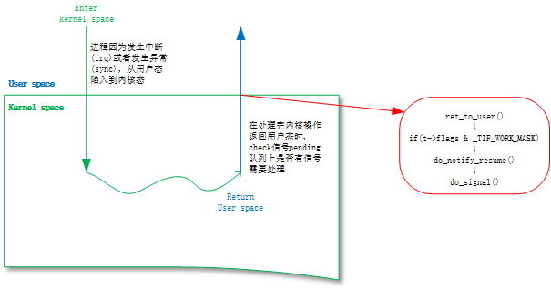
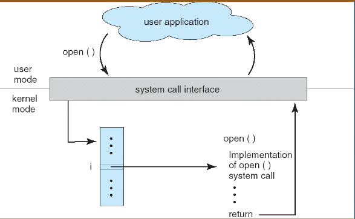
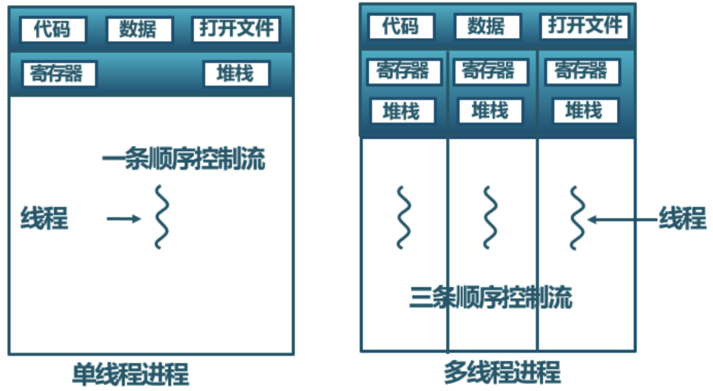
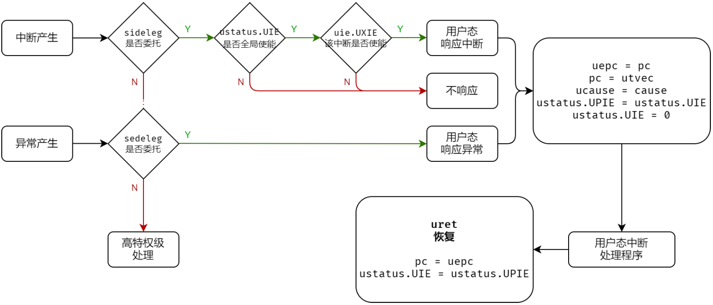
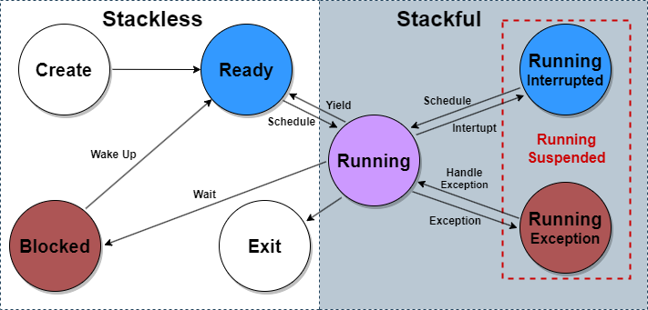
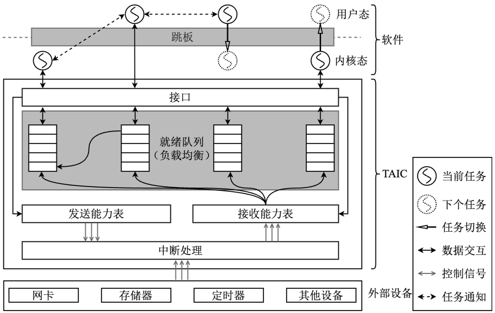

<!-- theme: gaia -->
<!-- _class: lead -->

# 第十一讲 线程与协程

## 第四节 关于任务模型的思考

<br>
<br>

向勇 陈渝 李国良 任炬 

2025年秋季

[课程幻灯片列表](https://www.yuque.com/xyong-9fuoz/qczol5/glemuu?)

---

### 问题

- 进程、线程和协程的调度有可能统一起来吗？
  - 用户态与内核态

---

**提纲**

### 1. 操作系统中的任务模型
2. 异步操作系统

---

##### 如何描述CPU上的执行流及其生命周期的状态变化？

* 进程(Process)是一个具有一定**独立功能**的程序在一个**数据集合**上的一次动态**执行过程**。也称为**任务(Task)**。（[ref](https://learningos.cn/os-lectures/lec4/p1-multiprog.html#9)）
  * 进程 = 程序 + 执行状态
* 线程是操作系统调度调度的指令执行流的最小单元。
* CPU调度基本单位的演化
  * 进程
  * 线程（包括栈）+ 进程（资源）
  * 协程+进程（栈、资源）

---

##### 关于执行流的几个刁钻问题

- 中断处理函数是线程吗？
- 内核是一个进程吗？
- 调度器的功能是进程调度。调度代码算是哪个进程（线程、协程）的？

---

##### 并发机制

* 内核线程：内核实现
* 用户线程：用户库实现、语言支持
* 协程：用户库实现、语言支持

---

##### 上下文切换与调度器：执行流控制

* 中断上下文保存与恢复：基于中断（硬件）
* 进程切换：基于时钟中断、主动让权（应用、内核）
* 线程切换：基于时钟中断、主动让权
* 协程切换：主动让权（语言）

---

##### 异常和错误处理

 * 内核中断机制：硬件与操作系统协作
   * 用户态中断：硬件、操作系统和应用协作管理
 * rust中的option：程序设计语言管理
 * 信号：操作系统和应用协作管理

---

##### 操作系统课描述执行流的词汇

* task任务、job作业、process进程、LWP轻权进程
* thread线程（user-level thread用户级线程、kernel-level thread内核级线程）、hyperthread超线程、fiber纤程
* function函数、subroutine子程序、subprogram子程序、coroutine协程（stackless coroutine无栈协程、stackful coroutine有栈协程）、
* context上下文（函数调用上下文、trap context中断上下文、process context进程上下文、thread context线程上下文）

---

##### 时钟中断

时钟中断是由硬件时钟设备产生的一种按设定时间间隔触发的中断信号，用于CPU资源的分时复用。([ref](https://www.cnblogs.com/lethe1203/p/18118231))


* 问题：中断处理函数的执行是一个独立的执行流吗？

---

##### 信号（[Signal](http://kernel.meizu.com/linux-signal.html))

用户态的异常处理机制

* 信号（Signal）响应时机

  * 发送信号并没有发生硬中断，只是把信号挂载到目标进程的信号 pending 队列
  * 信号执行时机：进程执行完异常/中断返回用户态的时刻



---

##### 函数调用栈（Call Stack）

函数调用栈（Call Stack）记录了当前执行流正在执行的**函数状态**和**函数调用顺序**。

* 问题：每个函数的执行是一个独立的执行流吗？

---

##### 系统调用 (System Call)（[ref](https://www.cnblogs.com/java-ssl-xy/p/7511843.html)）

系统调用是内核向用户程序提供服务的受控访问接口。系统调用可通过中断或陷入机制实现，用户程序执行特殊指令会引发中断，将 CPU 控制权转移到内核。




---

##### 进程切换

先切换特权级、再切换进程上下文


* 问题：
  * 每个地址空间只能有一个执行流吗？
  * 第一个用户进程如何创建?

---

##### 挑战

进程切换开销、并发执行性能

* 为什么进程切换只能在内核态进行？
* 进程概念依赖的硬件支持？
* 硬件可能直接支持进程切换吗？
* 进程的实现目前只是由操作系统内核支持，可能在用户态支持吗？
* 硬件感知到什么程度？

---

##### 线程概念

线程是进程的一**部分**，描述指令流**执行状态**。它是进程中的指令执行流的基本单元，是CPU调度的**基本单位**。（[ref](https://learningos.cn/os-lectures/lec11/p1-thread.html#10)）




---

##### 挑战

* 超线程在操作系统看来是什么？
* 线程实现可能在用户库（语言支持）、内核支持、CPU硬件支持吗？它们能结合吗？
* 高并发场景下栈开销？
* 栈到底算是内存资源的一种，还是执行流的上下文？
* 中断处理函数（程序）是一个独立的线程吗？

---

##### 协程的概念

* 有栈协程：与用户级线程是等价的概念
* 无线协程：把栈视为CPU执行需要的资源，而不是附属于执行流的资源；实现栈复用；
* 同步函数和异步函数：区分函数执行中的暂停支持机制；

---

##### 挑战

Rust、C++和Java等语言支持协程。
* 操作系统和CPU硬件都不感知协程。可以感知吗？
* 操作系统和CPU感知协程能带来什么好处？

---

**提纲**

<style>
.container{
    display: flex;    
}
.col{
    flex: 1;    
}
</style>

<div class="container">

<div class="col">

1. 操作系统中的任务模型
### 2. 异步操作系统

</div>

<div class="col">

#### 2.1 异步操作系统设计方案
2.2 在用户态直接处理中断
2.3 让操作系统感知协程
2.4 让硬件感知协程

</div>

</div>

<br>
<br>

---

##### [异步操作系统设计](https://asyncos.github.io/design/overview/)的整体目标

在RISC-V平台上设计并实现一个基于Rust语言的异步操作系统。

1. 在操作系统内核中实现**细粒度**的并发安全、模块化和可定制特征；
2. 利用Rust语言的**异步机制**，优化操作系统内核的并发性能；
3. 向应用程序提供**异步系统调用**接口，优化系统调用访问性能；
4. 结合LLVM中Rust语言编译器的异步支持技术，完善操作系统的进程、线程和协程**概念**，统一进程、线程和协程的**调度机制**；
5. 利用RISC-V**用户态中断**，优化操作系统的信号和进程通信性能；
6. 开发**原型系统**，对异步操作系统的特征进行定量性的评估。

---

##### [任务管理：进程、线程与协程](https://github.com/async-kernel/documents/blob/main/design/design.md#任务管理进程线程与协程)

- 进程：有独立的**地址空间**，存有页表切换开销；
  - 在异步操作系统中，内核是一个独立的进程，有自己的页表；
  - 系统调用过程会变成一种特殊和优化的进程切换。
  - 进程切换代码是在所有进程的内核态共享的。
- 线程：有独立的**堆栈**，切换时需要保存和恢复全部寄存器。
  - 由于内核与用户线程不在一个地址空间中，每个用户线程只有用户栈，不存在对应的内核栈；
  - 每个内核线程只有内核栈，不存在对应的用户栈。

---

##### [任务管理：进程、线程与协程](https://github.com/async-kernel/documents/blob/main/design/design.md#任务管理进程线程与协程)

- 协程：可以理解为**状态机**转移函数，执行时可共用同一个栈。
  - 每个线程内可以有多个协程。
  - 编译器将 async 函数变换成状态机时，函数中需要跨越 await 的变量将存放在 Future 对象中（一般在堆上），其它变量只需放在栈上或寄存器中。

---

##### [理想的协程切换过程](https://github.com/async-kernel/documents/blob/main/design/design.md#理想的协程切换过程贾越凯细化)（[协程、线程和进程的调度](https://github.com/async-kernel/documents/blob/main/design/design.md#协程线程和进程的调度)）

协程切换可表现为不同进程和不同线程中的下一个**就绪协程选择**。

1. 协程切换：**同一进程**中**主动让权**协程间的切换；
   * 由编译器自动生成的有限状态机切换代码完成协程切换；
2. 线程切换：**同一进程**中由于**被抢占**让权协程间的切换；
   * 切换需要进行堆栈保存和切换；
   * 当前执行流占有堆栈（被视为线程）；
3. 进程切换：**不同进程**中由于被抢占让权协程间的切换；
   * 保存当前用户堆栈，切换到内核态，完成进程地址空间；

---

##### [理想的异步系统调用](https://github.com/async-kernel/documents/blob/main/design/design.md#理想的异步系统调用接口)

* 用户态的异步系统调用会执行**编译器自动生成**相应的系统调用请求代码，维护协程控制块数据结构；
* 第一次系统调用请求时和最后一次系统调用完成时，需要**进入内核**；
* 中间的各次系统调用只进行系统调用的**请求提交和结果查询**，并进行进程、线程或协程切换。
* 在当前协程的系统调用还没有结果返回且**没有新的可执行用户任务**时，才会进行协程切换。

---

**提纲**

<style>
.container{
    display: flex;    
}
.col{
    flex: 1;    
}
</style>

<div class="container">

<div class="col">

1. 操作系统中的任务模型
2. **异步操作系统**

</div>

<div class="col">

2.1 异步操作系统设计方案
#### 2.2 在用户态直接处理中断
2.3 让操作系统感知协程
2.4 让硬件感知协程

</div>

</div>

<br>
<br>

---

##### [尤予阳、贺锟鹏](https://gallium70.github.io/rv-n-ext-impl/intro.html)、[田凯夫](https://github.com/tkf2019/undergraduate-thesis/blob/main/thesis.pdf)：RISC-V的用户态中断扩展
<!-- 
ref：Evernote：20210925-第五次操作系统专题训练课安排
-->
* 在QEMU和FPGA上实现用户态中断的支持：
  * 用户态中断的注册通过系统调用在内核进程进行处理。
  * 用户态中断支持的信号处理过程，可完全在用户态完成，不需要内核的参与。
* 面临的挑战：
  * 中断编号：需要标识中断的类型、中断源和中断目的方标识；
  * 中断请求和响应的硬件支持：中断目的方可能处于暂停或在不同CPU上运行；
<!--
* 已有参考
    * 尤予阳、贺锟鹏：[软硬件协同的用户态中断扩展](https://gallium70.github.io/rv-n-ext-impl/intro.html)
    * 田凯夫：[RISC-V 用户态中断扩展设计与实现](https://github.com/tkf2019/undergraduate-thesis/blob/main/thesis.pdf)
-->

---

##### 软硬协同的用户态中断

清华大学 尤予阳、贺锟鹏：[软硬协同的用户态中断](https://gallium70.github.io/rv-n-ext-impl/intro.html)(2021年)



---

<!-- 
##### [软硬件协同的用户态中断扩展](https://gallium70.github.io/rv-n-ext-impl/intro.html)


---
-->

##### [用户态陷入的硬件处理流程](https://lexiangla.com/teams/k100041/classes/e47ce740189811ecaccbb68950a81bc7/courses/553897ce225111ecbdf9469b8754dc9a)



---

**提纲**

<style>
.container{
    display: flex;    
}
.col{
    flex: 1;    
}
</style>

<div class="container">

<div class="col">

1. 操作系统中的任务模型
2. **异步操作系统**

</div>

<div class="col">

2.1 异步操作系统设计方案
2.2 在用户态直接处理中断
#### 2.3 让操作系统感知协程
2.4 让硬件感知协程

</div>

</div>

<br>
<br>

---

##### 首都师范大学 王文智：[轻量级的操作系统基本调度单位的设计与实现](https://github.com/AmoyCherry/graduate-materials/blob/main/resources/Thesis.pdf)（2023年）


---

##### 让内核使用协程

电子科技大学 袁子为、施诺晖：基于Rust异步机制的嵌入式操作系统调度模块embassy_preempt（2024年）（[ref](https://www.yuque.com/xyong-9fuoz/hg8kgr/culbvrzfn9qu9lby)）

* 协程任务任意点切换——高实时
  * 可抢占、具有优先级的协程调度机制，保证了系统的实时性
* 较高的空间利用率——高并发
  * 借助协程机制提供的栈复用，有效提高了空间利用率，进而提高了并发度
* FFI接口——对外兼容性
  * 暴露出了与uCOSII相同的FFI接口，保证了外部兼容性

---

##### 共享调度器：[一种支持优先级的协程调度框架](https://github.com/zflcs/SharedScheduler)（赵方亮、廖东海）

* 将协程作为操作系统和应用程序的最小任务单元
* 引入协程的优先级属性，基于优先级位图，操作系统和应用程序实现协程调度

<!--
-->

---

##### Architecture of SharedScheduler


1. 操作系统与用户程序各自的 Executor 维护协程
2. SharedScheduler 通过 vDSO 共享给用户进程
3. 通过 Global Bitmap 进行操作系统与用户进程之间协调调度

<!--
-->

---

<style scoped>
/* 当前幻灯片的字体变大 */
section {
  font-size: 31px;
}
</style>

##### Coroutine Control Block

```rust
pub struct Coroutine{
 /// Immutable fields
 pub cid: CoroutineId,
 pub kind: CoroutineKind,
 /// Mutable fields
 pub priority: usize,
 pub future: Pin<Box<dyn Future<Output=()> + 'static + Send + Sync>>, 
 pub waker: Arc<Waker>,
}
```

1. future、waker 字段由 Rust 协程特性决定
2. cid 字段用于标识协程
3. kind 字段标识协程任务类型，根据类型进行不同处理
4. priority 字段表示优先级，实现优先级调度的关键


<!--
-->

---

##### Coroutine state transition model



根据 CPU 和 stack 占用的情况划分为三类
* 状态转换
   1. 就绪 <==> 运行
   2. 运行 <==> 运行挂起
   3. 运行 <==> 阻塞
   4. 阻塞  ==> 就绪

<!--
根据 CPU 和 stack 占用的情况划分为三类（创建、退出、就绪、阻塞 | 运行 | 运行挂起）
-->

---

##### Asynchronous system call

```rust
read!(fd, buffer, cid); // Async call
read!(fd, buffer); // Sync call
```

1. 用户态系统调用接口，通过参数区分
2. 内核协程与异步 I/O 机制结合，内核协程完成读取、复制数据操作


<!--
-->

---

##### Throughput in SharedScheduler


1. kcuc: 内核协程 + 用户协程
2. kcut：内核协程 + 用户线程
3. ktut：内核线程 + 用户线程
4. ktuc：内核线程 + 用户协程

<!--
-->

---

##### message latency in SharedScheduler


1. SharedScheduler 同步互斥开销，不适用于低并发或低响应要求的场景
2. 协程切换开销小
3. SharedScheduler 适用于高并发场景

<!--
-->

---

##### Throughput and message latency of different priority connections

<table>
<tr>
<td>


</td>
<td>


</td>
</tr>
</table>

结论：在资源有限的条件下，高优先级协程能够得到保证

<!--
-->

---

**提纲**

<style>
.container{
    display: flex;    
}
.col{
    flex: 1;    
}
</style>

<div class="container">

<div class="col">

1. 操作系统中的任务模型
2. **异步操作系统**

</div>

<div class="col">

2.1 异步操作系统设计方案
2.2 在用户态直接处理中断
2.3 让操作系统感知协程
#### 2.4 让硬件感知协程

</div>

</div>

<br>
<br>

---

<style scoped>
/* 当前幻灯片的字体变大 */
section {
  font-size: 31px;
}
</style>

##### [基于软硬协同的任务调度和中断响应研究](https://www.yuque.com/xyong-9fuoz/hg8kgr/cxnbc2dhznprgaek#CX9e8)(清华大学 赵方亮 2025年）

<!--


---

##### Task State Model of TAIC
-->

* 将不同地址空间、特权级和堆栈的**进程、线程和协程任务模型统一**，降低了调度的复杂性。
* 基于**软硬协同的任务状态维护**方法，利用硬件维护就绪队列、阻塞队列和当前执行任务，从而高效地实现负载均衡和任务状态修改。
* **硬件响应中断**机制，硬件收到中断后直接唤醒任务，实现基于硬件的任务通知机制，在硬件中建立了跨越不同地址空间、特权级的任务之间的直接通道。


<!--
-->

---

##### [TAIC](https://github.com/ATS-INTC/atsintc-paper/): A Task-Aware Interrupt Controller For Fast Wake-Up Mechanism



<!--
-->

---

##### 硬件响应中断机制


<!--
-->

---

##### Tokio：任务调度开销降低 30%

<!--
- 软件任务队列→硬件任务队列
- 软件任务窃取→硬件负载均衡
-->


---

##### IPC-Bench：微秒级通知，开销降低 98.8%


<!--
-->

---

##### The latency distribution and CDF at various matrix sizes in TAIC


<!--
-->

---

##### 综合测试


<!--
-->

---

##### ReL4:高性能异步微内核

- 内核最小化原则：将同步IPC从内核中移除，仅支持异步通知机制。
- 避免特权级切换：利用软硬件结合的手段减少甚至消除IPC和系统调用过程中的特权级切换。
- 易用性原则：提供更容易编程的异步IPC和异步系统调用接口，提升用户态并发度。

<!--
-->

---

##### ReL4中的异步IPC和系统调用


---

##### 异步IPC性能测试


任务通知+任务调度：异步 IPC
单核/多核环境下的单次 IPC 开销降低 45.7%，65.8%


<!--
-->

---


<!--
##### 异步系统调用性能测试
-->


<!--
-->
