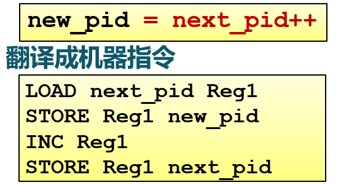
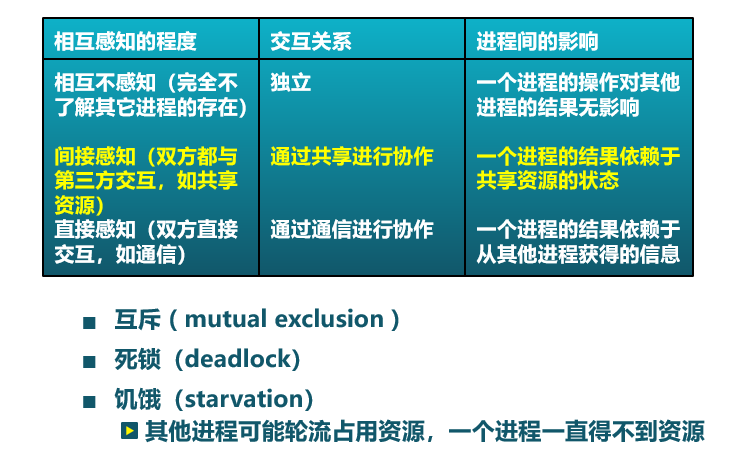
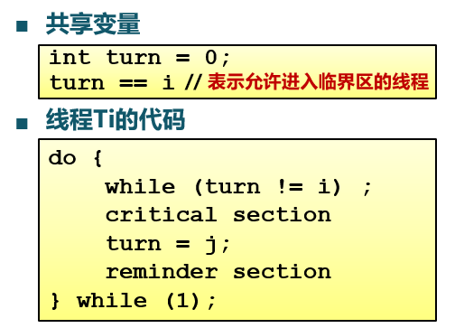

<!-- theme: gaia -->
<!-- _class: lead -->

# 第十二讲 同步与互斥
## 第一节 概述

<br>
<br>

向勇 陈渝 李国良 

<br>
<br>

2022年秋季

---
### 背景
- 独立进/线程
  - 不和其他进/线程共享资源或状态
  - 确定性 => 输入状态决定结果
  - 可重现 =>  能够重现起始条件
  - 调度顺序不重要

- 进/线程如果有资源共享
  - 存在不确定性
  - 存在不可重现
  - 可能出现难以重现的错误



---
### 背景
- 有资源共享的进/线程执行fork时的可能错误


---
### 背景  -- 原子操作（Atomic Operation）

- 原子操作是指一次不存在任何中断或失败的操作
  - 要么操作成功完成
  - 或者操作没有执行
  - 不会出现部分执行的状态

操作系统需要利用同步机制在并发执行的同时，保证一些操作是原子操作


---
### 现实生活中的同步互斥
例如: 家庭采购协调  (利用现实生活问题帮助理解操作系统同步问题)
  - 注意，计算机与人的差异


---
### 现实生活中的同步互斥
- 如何保证家庭采购协调的成功和高效
  - 需要采购时，有人去买面包
  - 最多只有一个人去买面包
- 可能的解决方法
  - 在冰箱上设置一个锁和钥匙（ lock&key）
  - 去买面包之前锁住冰箱并且拿走钥匙
- 加锁导致的新问题
  - 冰箱中还有其他食品时，别人无法取到


---
### 现实生活中的同步互斥 -- 方案一
- 使用便签来避免购买太多面包
  - 购买之前留下一张便签
  - 买完后移除该便签
  - 别人看到便签时，就不去购买面包
```
 if (nobread) {
    if (noNote) {
        leave Note;
        buy bread;
        remove Note;
    }
}
```


---
### 现实生活中的同步互斥 -- 方案一 -- 分析
- 偶尔会购买太多面包 - 重复
  - 检查面包和便签后帖便签前，有其他人检查面包和便签

- 解决方案只是间歇性地失败
  - 问题难以调试
  - 必须考虑调度器所做事情


---
### 现实生活中的同步互斥 -- 方案二
- 先留便签，后查面包和便签
```
leave Note;
if (nobread) {  
  if (noNote) { 
       buy bread;
    }
}
remove note;
```
- 会发生什么？
   - 不会有人买面包


---
### 现实生活中的同步互斥 -- 方案三
- 为便签增加标记，以区别不同人的便签
   - 现在可在检查之前留便签
```
leave note_2;
if (no note_1) {
   if (no bread) { 
     buy bread; 
   } 
} 
remove note_2;	
```


---
### 现实生活中的同步互斥 -- 方案三
- 为便签增加标记，以区别不同人的便签
  - 现在可在检查之前留便签
```
leave note_1;
if (no note_2) {
   if (no bread) { 
     buy bread; 
   } 
} 
remove note_1;
```


---

### 现实生活中的同步互斥 -- 方案三
- 为便签增加标记，以区别不同人的便签
  - 现在可在检查之前留便签

 - 会发生什么？
   - 可能导致没有人去买面包
   - 每个人都认为另外一个去买面包
 


---

### 现实生活中的同步互斥 -- 方案四
两个人采用不同的处理流程


---
### 现实生活中的同步互斥 -- 方案四
两个人采用不同的处理流程
- 现在有效吗？
  - 它有效，但太复杂
- A和B的代码不同
  - 如果线程更多，怎么办？
- 当A等待时，不能做其他事
  - 忙等待（busy-waiting）


---
### 现实生活中的同步互斥 -- 方案五
- 利用两个原子操作实现一个锁(lock)
  -  Lock.Acquire()
     - 在锁被释放前一直等待，然后获得锁
     - 如果两个线程都在等待同一个锁，并且同时发现锁被释放了，那么只有一个能够获得锁
  -  Lock.Release()
     - 解锁并唤醒任何等待中的线程


<!-- 
--- 
### 进/线程的交互关系：相互感知程度


--- 
### 进/线程的交互关系：相互感知程度


--- 
### 进/线程的交互关系：相互感知程度

 -->


---  
### 临界区(Critical Section)
```
entry section
   critical section
exit section
   remainder section
```
- 进入区(entry section)
  - 检查可否进入临界区的一段代码
  - 如可进入，设置相应"正在访问临界区"标志
- 临界区(critical section)
  - 线程中访问临界资源的一段需要互斥执行的代码


---  
### 临界区(Critical Section)
```
entry section
   critical section
exit section
   remainder section
```
- 退出区(exit section)
   - 清除“正在访问临界区”标志
- 剩余区(remainder section)
   - 代码中的其余部分

---  
### 临界区(Critical Section) -- 访问规则
```
entry section
   critical section
exit section
   remainder section
```
- 1 空闲则入：没有线程在临界区时，任何线程可进入
- 2 忙则等待：有线程在临界区时，其他线程均**不能**进入临界区
- 3 有限等待：等待进入临界区的线程**不能**无限期等待
- 4 让权等待（可选）：不能进入临界区的线程，应释放CPU（如转换到阻塞状态）


---  
### 同步互斥的方法
- 方法1：禁用硬件中断
- 方法2：基于软件的解决方法
- 方法3：更高级的抽象方法


---  
### 方法1：禁用硬件中断
- 没有中断，没有上下文切换，因此没有并发
   - 硬件将中断处理延迟到中断被启用之后
   - 现代计算机体系结构都提供指令来实现禁用中断

          local_irq_save(unsigned long flags); 
              critical section
          local_irq_restore(unsigned long flags); 
- 进入临界区：禁止所有中断，并保存标志 
- 离开临界区：使能所有中断，并恢复标志 
 

---  
### 方法1：禁用硬件中断
- 缺点
  - 禁用中断后，线程无法被停止
     - 整个系统都会为此停下来
     - 可能导致其他线程处于饥饿状态
  - 临界区可能很长
     - 无法确定响应中断所需的时间（可能存在硬件影响）
  - 不适合多核
- **要小心使用**


---  
### 方法2：基于软件的解决方法


---  
### 方法2：基于软件的解决方法 -- 尝试一

- 满足“忙则等待”，但是有时不满足“空闲则入”
   - Ti不在临界区，Tj想要继续运行，但是必须等待Ti进入过临界区后
   - turn = 0;
     - T0 不需要访问
     - T1 需要访问->一直等待


---  
### 方法2：基于软件的解决方法 -- 尝试二

- 互相依赖（线程盲等）
- 不满足“忙则等待”
  - flag[i]=flag[j]=0
```c
// 线程 Tj
do {
   while (flag[i] == 1) ;
   flag[j] = 1;
   critical section
   flag[j] = 0;
   remainder section
} while(1)
```


---  
### 方法2：基于软件的解决方法 -- 尝试三

- 满足“忙则等待”，但是不满足“空闲则入”
  - flag[i]=flag[j]=1
```c
// 线程 Tj
do {
   flag[j] = 1;
   while (flag[i] == 1) ;
   critical section
   flag[j] = 0;
   remainder section
} while(1)
```

---  
### 方法2：基于软件的解决方法 -- Peterson算法


- 满足线程Ti和Tj之间互斥的经典的基于软件的解决方法（1981年）
- 孔融让梨


---  
### 方法2：基于软件的解决方法 -- Peterson算法


```
flag[i] = True;
turn = j;
while(flag[j] && turn == j);
critical section;
flag[i] = False;
remainder section;
```
```
flag[j] = True;
turn = i;
while(flag[i] && turn == i);
critical section;
flag[j] = False;
remainder section;
```


---  
### 方法2：基于软件的解决方法 -- Dekkers算法


```
do{
  flag[0] = true;// 首先P0举手示意我要访问
  while(flag[1]) {// 看看P1是否也举手了
     if(turn==1){// 如果P1也举手了，那么就看看到底轮到谁
         flag[0]=false;// 如果确实轮到P1，那么P0先把手放下（让P1先）
         while(turn==1);// 只要还是P1的时间，P0就不举手，一直等
         flag[0]=true;// 等到P1用完了（轮到P0了），P0再举手
     }
     flag[1] = false; // 只要可以跳出循环，说明P1用完了，应该跳出最外圈的while
  }
  critical section;// 访问临界区
  turn = 1;// P0访问完了，把轮次交给P1，让P1可以访问
  flag[0]=false;// P0放下手
  remainder section;
} while(true);
```


---  
### 方法2：基于软件的解决方法 -- Dekkers算法

       vs                           

---  
### 方法2：基于软件的解决方法 -- N线程
Eisenberg和McGuire
- 一个共享的turn变量，若干线程排成一个环
- 每个环有个flag标志，想要进入临界区填写flag标志
- 有多个想进入临界区，从前往后走，执行完一个线程，turn改为下一个线程的值。


---  
### 方法2：基于软件的解决方法 -- N线程
```c 
INITIALIZATION:

enum states flags[n -1]; //{IDLE, WAITING, ACTIVE}
int turn;
for (index=0; index<n; index++) {
   flags[index] = IDLE;
}
```

---  
### 方法2：基于软件的解决方法 -- N线程
```c 
ENTRY PROTOCOL (for Process i ):
repeat {//从turn到i是否存在请求进程:若存在，则不断循环，直至不存在这样的进程，将当前进程标记为ACTIVE
   flags[i] = WAITING;//表明自己需要资源
   index = turn;//轮到谁了
   while (index != i) {//从turn到i轮流找不idle的线程
      if (flag[index] != IDLE) index = turn;//turn到i有非idle的阻塞
      else index = (index+1) mod n; //否则轮到i，并跳出
   }
   flags[i] = ACTIVE;//Pi active; 其他线程有可能active
   //对所有ACTIVE的进程做进一步的判断，判断除了当前进程以外，是否还存在其他ACTIVE的进程
   index = 0;//看看是否还有其他active的
   while ((index < n) && ((index == i) || (flags[index] != ACTIVE))) {
      index = index+1;
   }//如果后面没有active了，并且轮到Pi或者turn idle, 就轮到i;否则继续循环
} until ((index >= n) && ((turn == i) || (flags[turn] == IDLE)));
turn = i;//获得turn并处理
```

---  
### 方法2：基于软件的解决方法 -- N线程
```c 
EXIT PROTOCOL (for Process i ):

index = turn+1 mod n;//找到一个不idle的
while (flags[index] == IDLE) {
   index = index+1 mod n;
}
turn = index;//找到不idle的设置为turn；或者设置为自己
flag[i] = IDLE;//结束，自己变idle
```

---  
### 方法3：更高级的抽象方法
- 基于软件的解决方法
   - 复杂，需要忙等待

- 更高级的抽象方法
   - 硬件提供了一些同步原语
       - 中断禁用，原子操作指令等
   - **操作系统提供更高级的编程抽象来简化线程同步**
       - 例如：锁、信号量
       - 用硬件原语来构建

---  
### 方法3：更高级的抽象方法 -- 锁(lock)
- 锁是一个抽象的数据结构
   - 一个二进制变量（锁定/解锁）
   - 使用锁来控制临界区访问
   - Lock::Acquire()
      - 锁被释放前一直等待，后得到锁
   - Lock::Release()
      -  释放锁，唤醒任何等待的线程


---  
### 方法3：更高级的抽象方法 -- 锁(lock)
现代CPU提供一些特殊的原子操作指令
- 原子操作指令 
  - 测试和置位（Test-and-Set ）指令
     - 从内存单元中读取值
     - 测试该值是否为1(然后返回真或假)
     - 内存单元值设置为1
       - 输入0，改成1，返回0；
       - 输入1，保持1，返回1；


 

---  
### 方法3：更高级的抽象方法 -- 锁(lock)
现代CPU都提供一些特殊的原子操作指令
```
do {
  while(TestAndSet(&lock)） ;
  critical section; 
  lock = false;
  remainder section;
} while (true)
```


 
---  
### 方法3：更高级的抽象方法 -- 锁(lock)
现代CPU都提供一些特殊的原子操作指令
```
do {
  while(TestAndSet(&lock)） ;
  critical section; 
  lock = false;
  remainder section;
} while (true)
```
```
lock(): while(TestAndSet(&lock));
critical section; 
unlock(): lock=false;
```


---  
### 方法3：更高级的抽象方法 -- 锁(lock)
- 原子操作：交换指令CaS（Compare and Swap）
```
bool compare_and_swap(int *value, int old, int new) {
   if(*value==old) {
      *value = new; 
      return true; }
   return false;
}
```
```
int lock = 0;                           // 初始时锁空闲 
while(!compare_and_swap(&lock,0,1));    // lock 加锁
critical section; 
lock=0;                                 // unlock 解锁
remainder section;
```

<!-- ---  
### 方法3：更高级的抽象方法 -- 锁(lock)
- 原子操作：交换指令CaS（Compare and Swap）
```
bool compare_and_swap(int *value, int old, int new) {
   if(*value==old) {
      *value = new; 
      return true;
   }
   return false;
}
```
```
lock(): while(!compare_and_swap(&lock,0,1)); 
critical section; 
unlock(): lock=0; 
``` -->

---  
### 方法3：更高级的抽象方法 -- 锁(lock)
<!-- CAS是什么？ABA问题又应该如何理解？https://zhuanlan.zhihu.com/p/139635112 
https://www.zhihu.com/question/23281499/answer/24112589
关于ABA问题我想了一个例子：在你非常渴的情况下你发现一个盛满水的杯子，你一饮而尽。之后再给杯子里重新倒满水。然后你离开，当杯子的真正主人回来时看到杯子还是盛满水，他当然不知道是否被人喝完重新倒满。解决这个问题的方案的一个策略是每一次倒水假设有一个自动记录仪记录下，这样主人回来就可以分辨在她离开后是否发生过重新倒满的情况。这也是解决ABA问题目前采用的策略。
-->
- 原子操作：交换指令CaS（Compare and Swap）
- ABA 问题：
  - value= 100；
  - Thread1: value - 50; //成功 value=50
  - Thread2: value - 50; //阻塞
  - Thread3: value + 50; //成功 value=50
  - Thread2: 重试成功
- 解决思路：加上版本号（时间戳）
  - (100,1); (50,2); (100,3) 
<!---  
### 方法3：更高级的抽象方法 -- 锁(lock)
现代CPU体系结构都提供一些特殊的原子操作指令
- 原子操作指令 
  - 交换指令（exchange）
     - 交换内存中的两个值


-->

---  
### 方法3：更高级的抽象方法 -- 锁(lock) 
使用TaS指令实现自旋锁(spinlock)
- 线程在等待的时候消耗CPU时间


---  
### 方法3：更高级的抽象方法 -- 锁(lock) 
**忙等锁 v.s. 等待锁**


---  
### 方法3：更高级的抽象方法 -- 锁(lock) 
- 优点
  - 适用于单处理器或者共享主存的多处理器中任意数量的线程同步
  - 简单并且容易证明
  - 支持多临界区
- 缺点
  - 忙等待消耗处理器时间
  - 可能导致饥饿
    -  线程离开临界区时有多个等待线程的情况
  - 可能死锁：线程间相互等待，无法继续执行 

---
### 小结
- 常用的三种同步实现方法
  - 禁用中断（仅限于单处理器）
  - 软件方法（复杂）
  - 锁是一种高级的同步抽象方法
     - 硬件原子操作指令（单处理器或多处理器均可）
     - 互斥可以使用锁来实现


