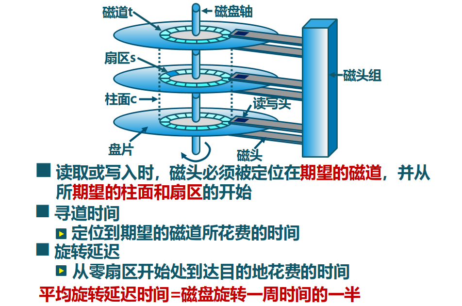
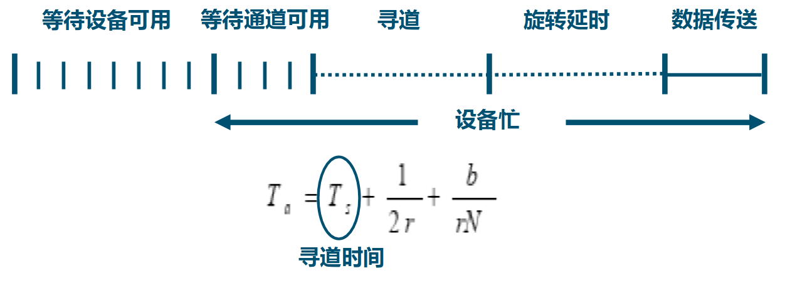
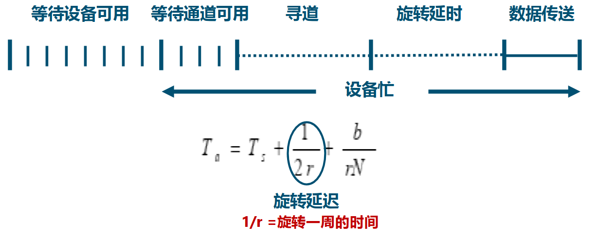
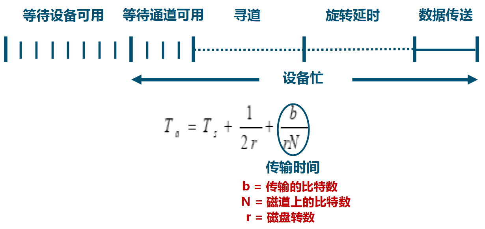
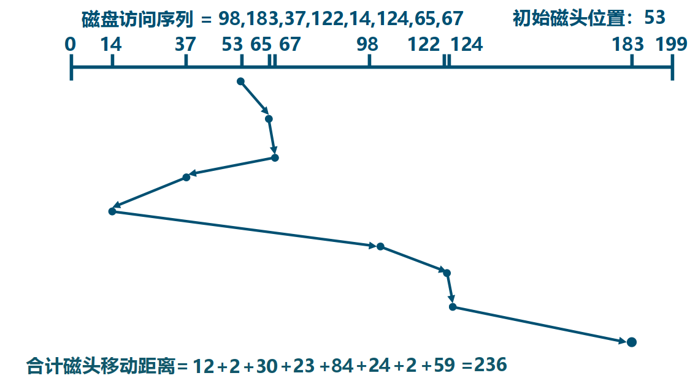
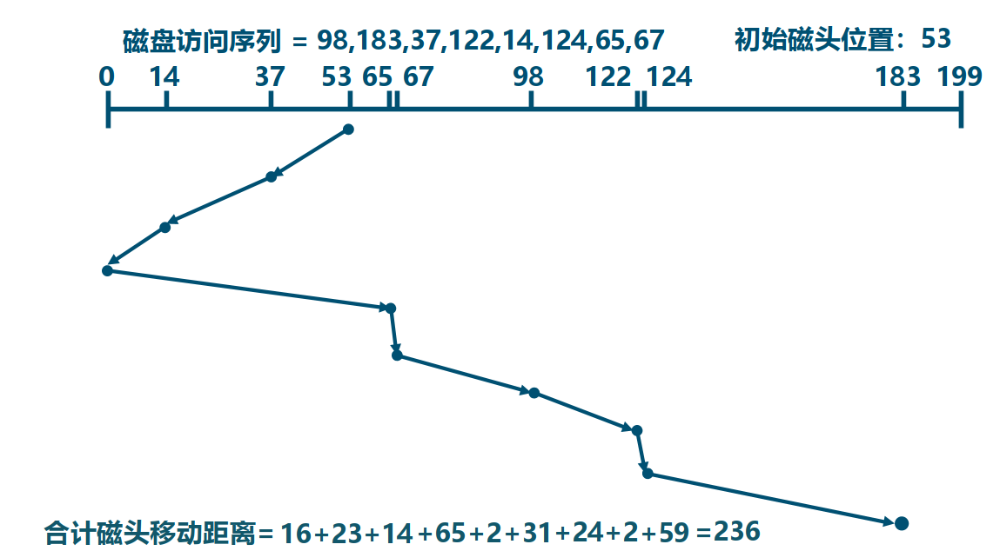

<!-- theme: gaia -->
<!-- _class: lead -->

# 第十三讲 设备管理
## 第二节 磁盘子系统

---
### 磁盘 -- 概述
磁盘工作机制和性能参数

---
### 磁盘 -- 概述
磁盘 I/O 传输时间

---
### 磁盘 -- 概述
磁盘 I/O 传输时间

---
### 磁盘 -- 概述
磁盘 I/O 传输时间

---
### 磁盘 -- 概述
磁盘 I/O 传输时间

---
### 磁盘 --磁盘调度算法
通过优化磁盘访问请求顺序来提高磁盘访问性能
- 寻道时间是磁盘访问最耗时的部分
- 同时会有多个在同一磁盘上的 I/O 请求
- 随机处理磁盘访问请求的性能表现很差

---
### 磁盘 --磁盘调度算法  -- FIFO

---
### 磁盘 --磁盘调度算法  -- FIFO
- 先进先出 (FIFO) 算法 
- 按顺序处理请求
- 公平对待所有进程
- 在有很多进程的情况下，接近随机调度的性能

---
### 磁盘 --磁盘调度算法  -- 最短服务时间优先 (SSTF)
- 选择从磁臂当前位置需要移动最少的 I/O 请求
- 总是选择最短寻道时间
 

 
---
### 磁盘 --磁盘调度算法  -- 扫描算法 (SCAN)
 

---
### 磁盘 --磁盘调度算法  -- 扫描算法 (SCAN)
- 磁臂在一个方向上移动，访问所有未完成的请求
- 直到磁臂到达该方向上最后的磁道，调换方向
- 也称为电梯算法 (elevator algorithm)

---
### 磁盘 --磁盘调度算法  -- 循环扫描算法 (C-SCAN)
- 限制了仅在一个方向上扫描
- 当最后一个磁道也被访问过了后，磁臂返回到磁盘的另外一端再次进行C-LOOK 算法
- 磁臂先到达该方向上最后一个请求处，然后立即反转，而不是先到最后点路径上的所有请求

----
### 磁盘 --磁盘调度算法  -- 循环扫描算法 (N-step-SCAN)
- 磁头粘着 (Arm Stickiness) 现象
   - SSTF、SCAN 及 CSCAN 等算法中，可能出现磁头停留在某处不动的情况
- N 步扫描算法
   - 将磁盘请求队列分成长度为 N 的子队列
   - 按 FIFO 算法依次处理所有子队列
   - 扫描算法处理每个队列

----
### 磁盘 --磁盘调度算法  -- 双队列扫描算法 (FSCAN)

FSCAN 算法
- 把磁盘 I/O 请求分成两个队列
- 交替使用扫描算法处理一个队列
- 新生成的磁盘 I/O 请求放入另一队列中
- 所有的新请求都将被推迟到下一次扫描时处理

FSCAN 算法是 N 步扫描算法的简化
FSCAN 只将磁盘请求队列分成两个子队列