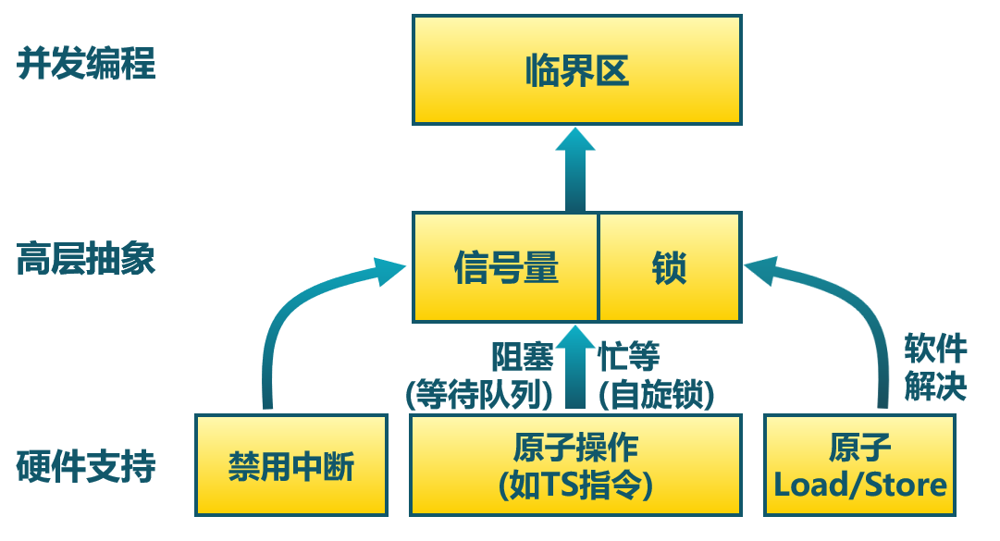
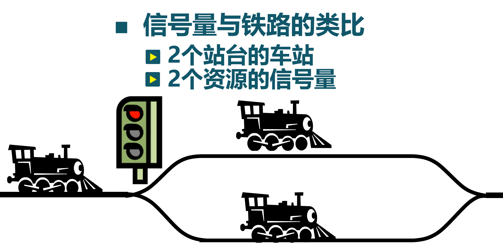

<!-- theme: gaia -->
<!-- _class: lead -->

# 第十二讲 同步与互斥

## 第二节 信号量

---
### 信号量(semaphore)
- 信号量是操作系统提供的一种协调共享资源访问的方法
- Dijkstra在20世纪60年代提出
- 早期的操作系统的主要同步机制

---
### 信号量(semaphore)
- 信号量是一种抽象数据类型，由一个整型 (sem)变量和两个原子操作组成
   - P()：Prolaag 荷兰语：尝试减少
      - $sem = sem - 1$
      - 如sem<0, 进入等待, 否则继续
   - V()：Verhoog 荷兰语：增加
      - $sem = sem + 1$
      - 如$sem \le 0$, 唤醒一个等待的

---
### 信号量(semaphore)
- 信号量是被保护的整数变量
   - 初始化完成后，只能通过P()和V()操作修改
   - 由**操作系统保证**，PV操作是原子操作
- P() 可能阻塞，V()不会阻塞
- 通常假定信号量是“公平的”
   - 线程不会被无限期阻塞在P()操作
   - 假定信号量等待按先进先出排队

自旋锁能否实现先进先出?

---
### 信号量(semaphore)
信号量在概念上的实现

---
### 信号量(semaphore)
可分为两类信号量
- 二进制信号量：资源数目为0或1
- 计数信号量:资源数目为任何非负值
- 两者等价：基于一个可以实现另一个

信号量的使用
- **互斥访问**  和 **条件同步**

---
### 信号量(semaphore)
互斥访问举例
- 每个临界区设置一个信号量，其初值为1
- 需成对使用P()操作和V()操作
   -  P()操作保证互斥访问资源
   -  V()操作在使用后释放资源
   -  PV操作次序不能错误、重复或遗漏

 

---
### 信号量(semaphore)
条件同步举例
- 每个条件同步设置一个信号量，其初值为0

---
### 信号量(semaphore)
生产者-消费者问题举例
- 有界缓冲区的生产者-消费者问题描述
   - 一个或多个生产者在生成数据后放在一个缓冲区里
   - 单个消费者从缓冲区取出数据处理
   - 任何时刻只能有一个生产者或消费者可访问缓冲区

---
### 信号量(semaphore)
生产者-消费者问题举例  
- 问题分析
   - 任何时刻只能有一个线程操作缓冲区（互斥访问）
   - 缓冲区空时，消费者必须等待生产者（条件同步）
   - 缓冲区满时，生产者必须等待消费者（条件同步）
- 用信号量描述每个约束
   - 二进制信号量mutex
   - 计数信号量fullBuffers
   - 计数信号量emptyBuffers

---
### 信号量(semaphore)
生产者-消费者问题举例： P、V操作的顺序有影响吗？

---
### 信号量(semaphore)
- 读/开发代码比较困难
- 容易出错
   - 使用已被占用的信号量
   - 忘记释放信号量
   - 不能够避免死锁问题
   - 对程序员要求较高
