<!-- theme: gaia -->
<!-- _class: lead -->

# 第十二讲 同步与互斥

## 第三节 管程与条件变量

 管程（Monitor）  条件变量（Condition Variable）
 
<!-- 
Gregory Kesden, Monitors and Condition Variables https://cseweb.ucsd.edu/classes/sp16/cse120-a/applications/ln/lecture9.html
Mark Spruiell, The C++ Monitor Class. Apr.2011 https://doc.zeroc.com/pages/viewpage.action?pageId=5048235
wikipedia, Monitor (synchronization) https://en.wikipedia.org/wiki/Monitor_(synchronization)
Mike Vine, Making a C++ class a Monitor (in the concurrent sense) https://stackoverflow.com/a/48408987
David Rodríguez - dribeas, How arrow-> operator overloading works internally in c++? https://stackoverflow.com/a/10678920
Fruit_初, Monitors, March, 2017. https://www.jianshu.com/p/8b3ed769bc9f
C++并发型模式#6: 管程 - monitor http://dengzuoheng.github.io/cpp-concurency-pattern-6-monitor 
-->
---
### 管程 
- 动机：为什么有管程？ 传统PV和锁机制有如下问题：
  - 程序易读性差：要了解对于一组共享变量及信号量的操作是否正确，则必须通读整个系统或者并发程序。
  - 程序不利于修改和维护：程序局部性很差，所以任一组变量或一段代码的修改都可能影响全局。
  - 正确性难以保证：操作系统或并发程序通常很大，很难保证一个复杂的系统没有逻辑错误。
  - 容易发生死锁：如果不使用好P、V操作时，逻辑上发生错误，很有可能会导致死锁。

---
### 管程
- 管程是一种用于多线程互斥访问共享资源的**程序结构**
- 采用**面向对象方法**，简化了线程间的同步控制
- 任一时刻最多只有一个线程执行管程代码
- 正在管程中的线程可临时放弃管程的互斥访问，等待事件出现时恢复
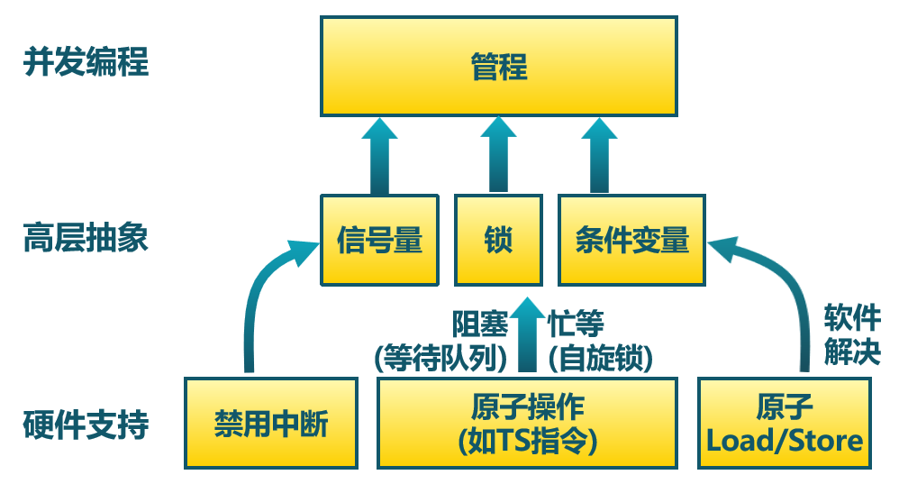


---
### 管程 
- 模块化，一个管程是一个基本程序单位，可以单独编译。

- 抽象数据类型，管程是一种特殊的数据类型，其中不仅有数据，而且有对数据进行操作的代码。

- 信息隐蔽，管程是半透明的，管程中的过程（函数）实现了某些功能，在其外部则是不可见的。

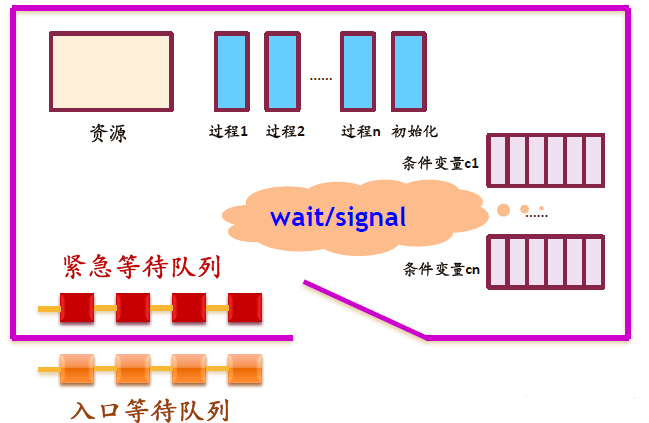

---
### 管程 -- 条件变量
- 管程中的共享变量在管程外部是不可见的，外部只能通过调用管程中所说明的外部过程 (函数）来间接地访问管程中的共享变量
  - 互斥：任一时刻管程中只能有一个活跃进程，通过锁竞争进入管程
  - 等待：进入管程的线程**因资源被占用**而进入等待状态
    - 每个条件变量表示一种等待原因，对应一个等待队列
    - 入口队列管理未进入管程的线程/进程
  - 唤醒：管程中等待的线程可以（其他线程释放资源）被唤醒
  - 同步：等待和唤醒操作
  - 管程操作：进入enter, 离开leave, 等待wait, 唤醒signal

<!--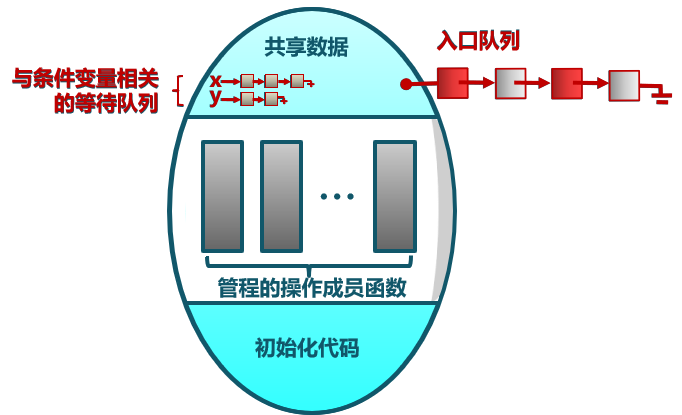


---
### 管程 -- 条件变量

-->


<!-- https://blog.csdn.net/Carson_Chu/article/details/104223122  【操作系统】同步互斥机制（二）：管程与进程间通信机制（IPC）

https://zhuanlan.zhihu.com/p/465751547 学习进程互斥和进程同步有这一篇文就够了！
https://www.cnblogs.com/uestcliming666/p/13224545.html  《现代操作系统》——第6章 同步互斥机制（二）、进程间通信机制

https://yangzhaoyunfei.github.io/monitors/ 管程(Monitors) -->


---
### 管程 -- 条件变量
- 管程的组成：一个由过程（函数）、变量及数据结构等组成的一个集合
   - 一个锁：控制管程代码的互斥访问
   - 0或者多个条件变量: 管理共享数据的并发访问，每个条件变量有个等待（紧急）队列
   - 入口等待队列
   - 紧急等待队列
   - 条件变量队列


---
### 管程 -- 条件变量
- 入口等待队列：管程入口处等待队列
- 条件等待队列：某个条件变量的等待队列（为资源占用而等待）
- 紧急等待队列：唤醒使用的紧急队列
   - 当T1线程执行唤醒操作而唤醒T2，如果T1把访问权限交给T2，T1被挂起；T1放入紧急等待队列
   - 紧急等待队列优先级高于条件变量等待队列
   - 为互斥而等待的队列


---
### 管程 -- 流程 （T可以是线程或者进程）
- T.enter过程：线程T在进入管程之前要获得互斥访问权(lock)
- T.leave过程：当线程T离开管程时，如果紧急队列**不为空**，唤醒紧急队列中的线程，并将T所持锁赋予唤醒的线程；如果**紧急队列为空**，释放lock，唤醒入口等待队列某个线程
- T.wait(c)：1)阻塞线程T自己，将t自己挂到条件变量c的等待队列；
  - 2)释放所持锁； 3)唤醒入口等待队列的一个或者多个线程；
<!--释放管程权力，进入c的条件等待队列；唤醒紧急等待队列的第一个线程// 为进入管程的进程分配某种类型的资源，如果此时这种资源可用，那么进程使用，否则进程被阻塞，进入条件等待队列-->
- T.signal(c)：1)把条件变量c的等待队列某个线程唤醒；
  - 2)把线程T所持lock给被唤醒的线程； 
  - 3)把线程T自己挂在紧急等待队列
<!--唤醒由于等待这种资源而进入条件等待队列的(c的条件等待队列)第一个线程进入管程的进程某种资源释放，此时进程会唤醒由于等待这种资源而进入条件等待队列的第一个进程-->

<!--
---
### 管程 -- 条件变量
- 同步：条件变量（Condition Variables)以及相关的两个操作：wait和signal，处理等待机制。
- Wait()操作
   - 将自己阻塞在等待队列中
   - 释放管程的互斥访问
   - 将一个等在管程之外的进程调入
- Signal()操作
   - 将等待队列中的一个线程唤醒
   - 如果等待队列为空，则等同空操作


-->


---
### 管程 -- 实现方式
<!-- https://blog.csdn.net/qq_34666857/article/details/103189107 Java并发编程模拟管程（霍尔Hoare管程、汉森Hansan管程、MESA管程) -->
管程中条件变量的释放处理方式

- 如果线程T1因条件A未满足处于阻塞状态，那么当线程T2让条件A满足并执行signal操作唤醒T1后，不允许线程T1和T2同时处于管程中，那么如何确定哪个执行/哪个等待？
- 可采用下面方式之一进行处理：

  - 1：(Hoare)：T1执行/T2等待，直至T1离开管程，然后T2继续执行
  - 2：(MESA/Hansen)：T2执行/T1等待，直至T2离开管程，然后T1可能继续执行


---
### 管程 -- 实现方式
<!-- https://blog.csdn.net/qq_34666857/article/details/103189107 Java并发编程模拟管程（霍尔Hoare管程、汉森Hansan管程、MESA管程) -->
管程中条件变量的释放处理方式
- 线程 T2 的signal，使线程 T1 等待的条件满足时
  - Hoare：T2 通知完 T1后，T2 阻塞，T1 马上执行；等 T1 执行完，再唤醒 T2 执行
  - Hansen： T2 通知完 T1 后，T2 还会接着执行，T2 执行结束后（规定：最后操作是signal），然后 T1 再执行（将锁直接给T1）
  - MESA：T2 通知完 T1 后，T2 还会接着执行，T1 并不会立即执行，而是重新竞争访问权限

---
### 管程 
管程中条件变量的释放处理方式
<!-- https://cseweb.ucsd.edu/classes/sp17/cse120-a/applications/ln/lecture8.html --> 
<!-- https://juejin.cn/post/6925331537365843981 synchronized原理剖析 -->
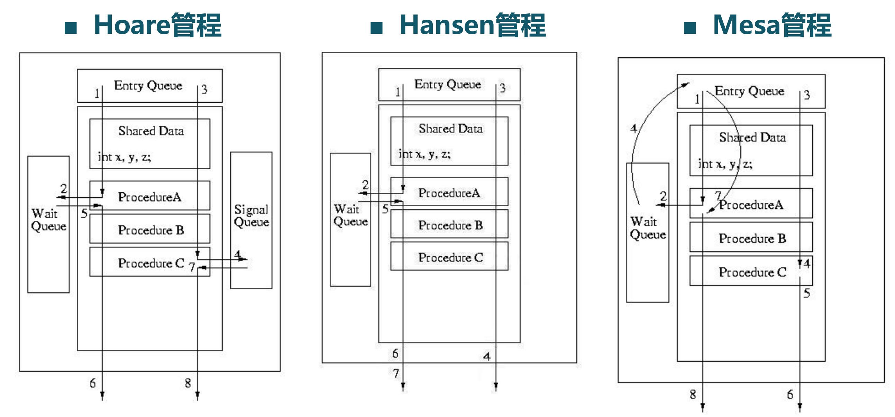


---
### 管程 
<!-- 管程中条件变量的释放处理方式 -->
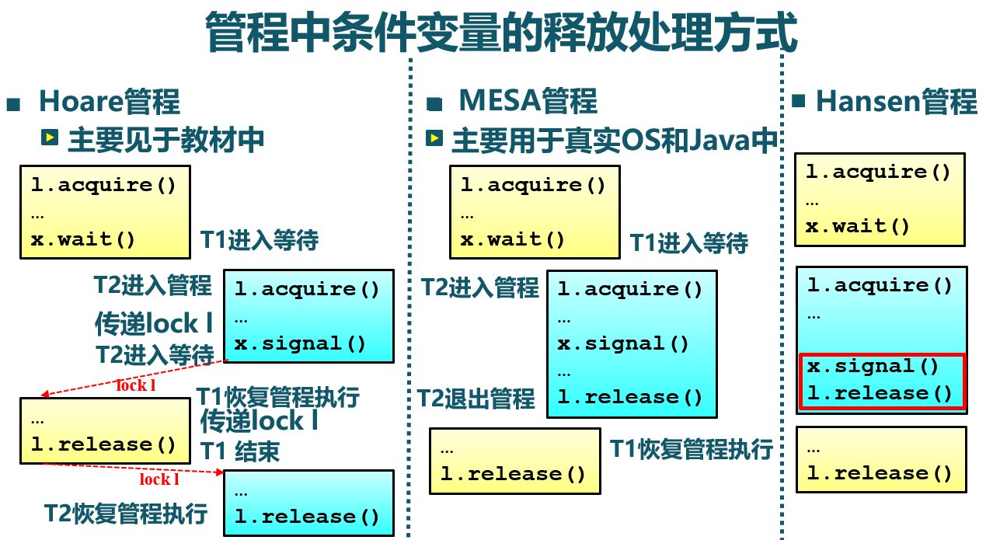


---
### 管程 
<!-- 管程中条件变量的释放处理方式 -->
唤醒一个线程的两种选择：**直接赋予锁** vs **重新公平竞争锁**

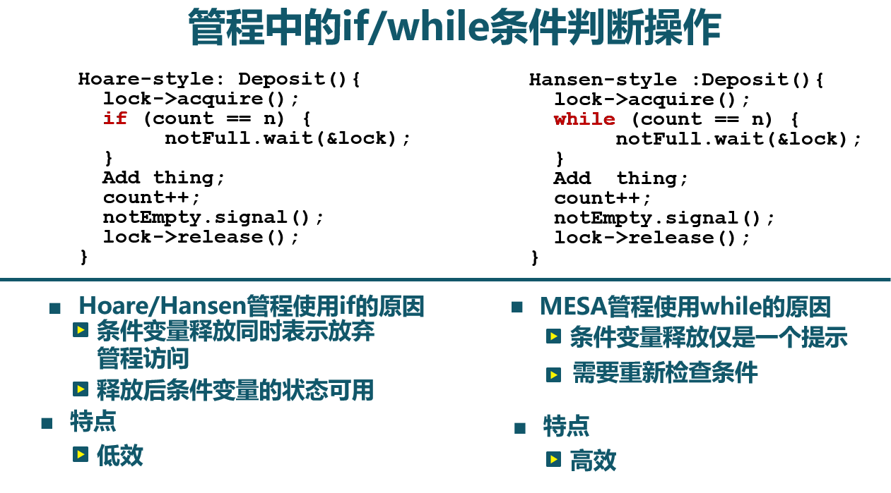


---
### 管程 - Hoare 
<!-- https://www.cnblogs.com/upnote/p/13030741.html   Java synchronized的理论基础-管程(Monitor) -->
```
- 1. T1 进入管程monitor
- 2. T1 等待资源 (进入等待队列wait queue)
- 3. T2 进入管程monitor
- 4. T2 资源可用 ，通知T1恢复执行，
     并把自己转移到紧急等待队列
- 5. T1 重新进入管程monitor并执行
- 6. T1 离开monitor
- 7. T2 重新进入管程monitor并执行
- 8. T2 离开管程monitor
- 9. 其他在entry queue中的线程通过竞争
     进入管程monitor
```
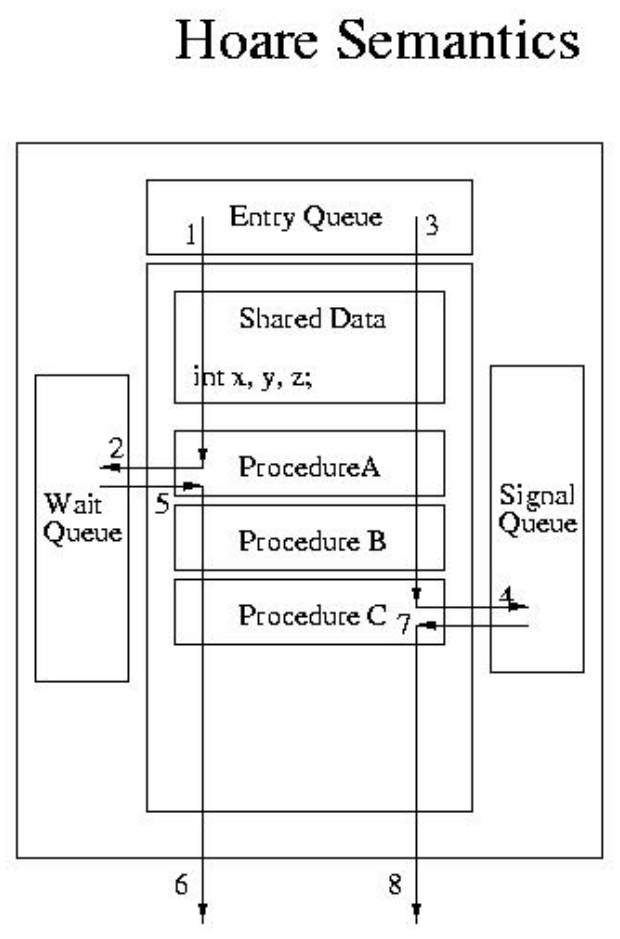

---
### 管程 - Mesa 
<!-- https://www.cnblogs.com/upnote/p/13030741.html   Java synchronized的理论基础-管程(Monitor) -->
```
- 1. T1 进入管程monitor
- 2. T1 等待资源 
    (进入wait queue，并释放monitor)
- 3. T2 进入monitor
- 4. T2 资源可用，通知T1
    (T1被转移到entey queue，重新平等竞争)
- 5. T2 继续执行
- 6. T2 离开monitor
- 7. T1 获得执行机会，从entry queue
     出队列，恢复执行
- 8. T1 离开monitor
- 9. 其他在entry queue中的线程通过竞争
     进入monitor
```
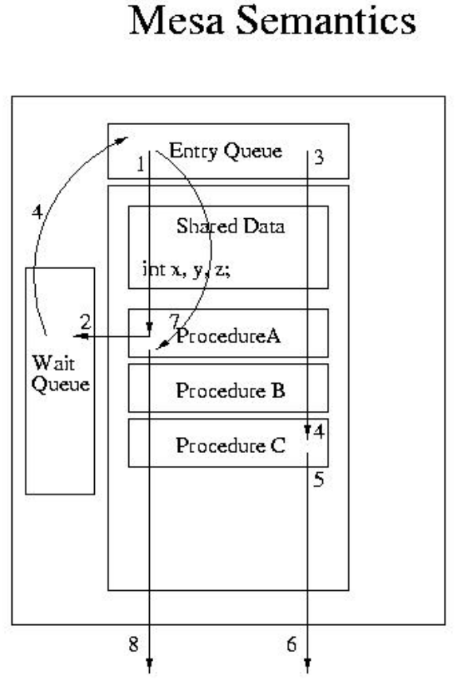

---
### 管程 - Hansen： 
<!-- https://www.cnblogs.com/upnote/p/13030741.html   Java synchronized的理论基础-管程(Monitor) -->
```
- 1. T1 进入管程monitor
- 2. T1 等待资源c
- 3. T2 进入monitor
- 4. T2 离开Monitor,并给通知等待
     资源c的线程，资源可用
- 5. T1 重新进入 monitor
- 6. T1 离开monitor
- 7. 其他线程从entry queue中通过竞争
     进入monitor
```
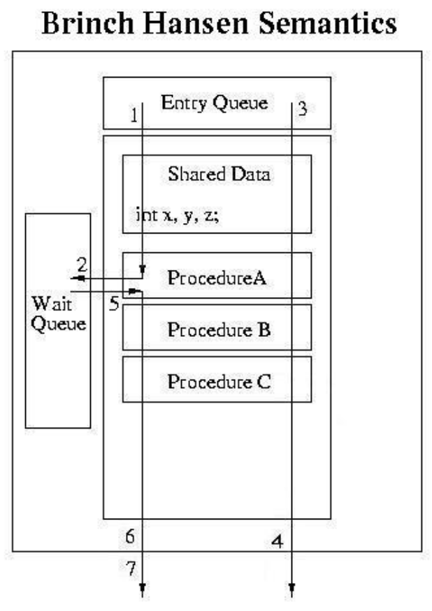

---
### 管程 -- 实现条件变量
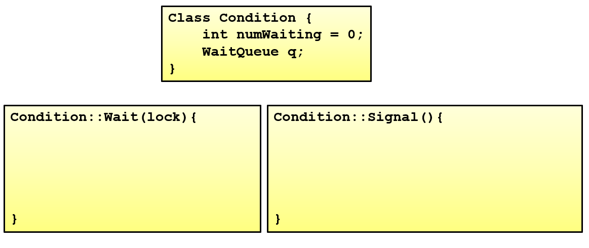

---
### 管程 -- 实现条件变量


---
### 管程 -- 实现条件变量
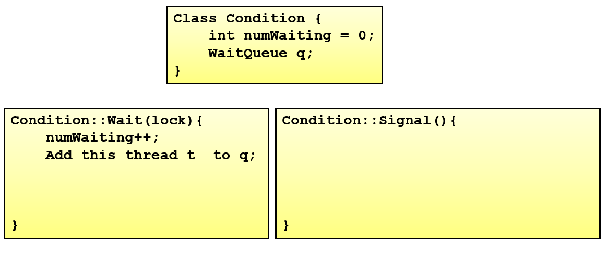

---
### 管程 -- 实现条件变量
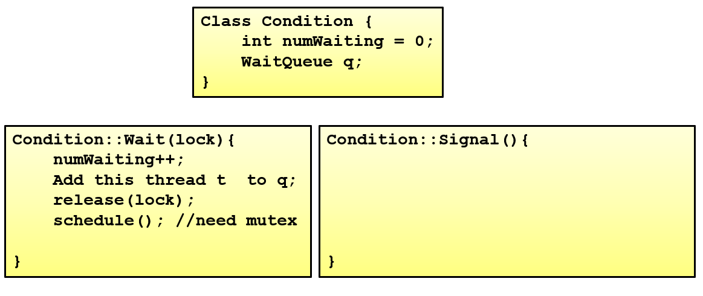

---
### 管程 -- 实现条件变量


---
### 管程 -- 实现条件变量


---
### 管程 -- 实现条件变量
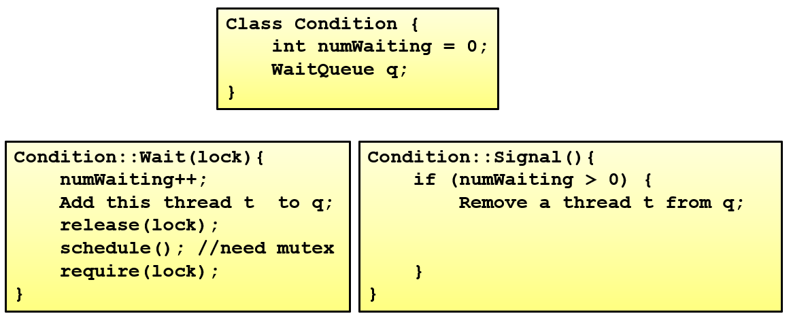

---
### 管程 -- 实现条件变量


---
### 管程 -- 实现条件变量
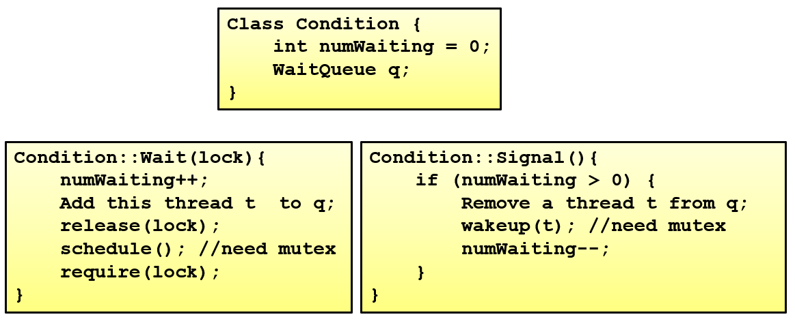


---
### 管程 -- 生产者-消费者问题


---
### 管程 -- 生产者-消费者问题


---
### 管程 -- 生产者-消费者问题
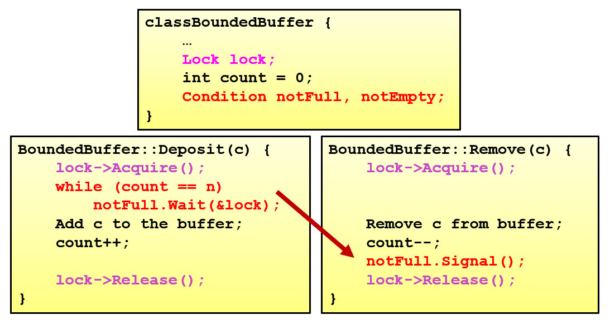


---
### 管程 -- 生产者-消费者问题
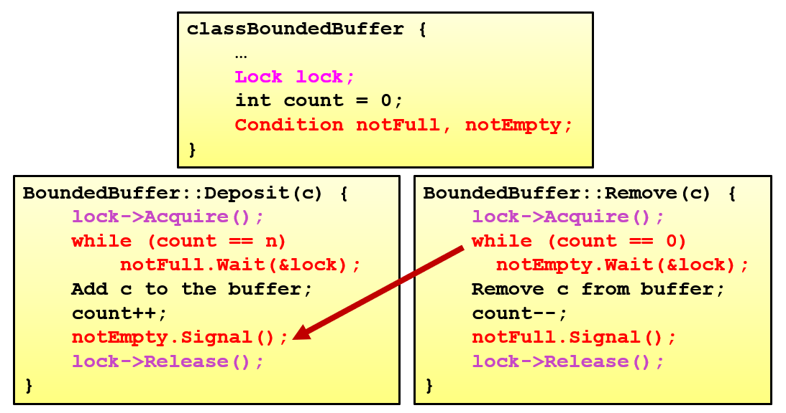

