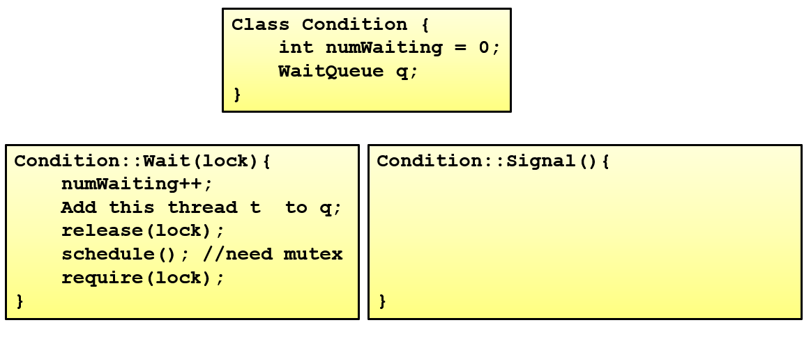
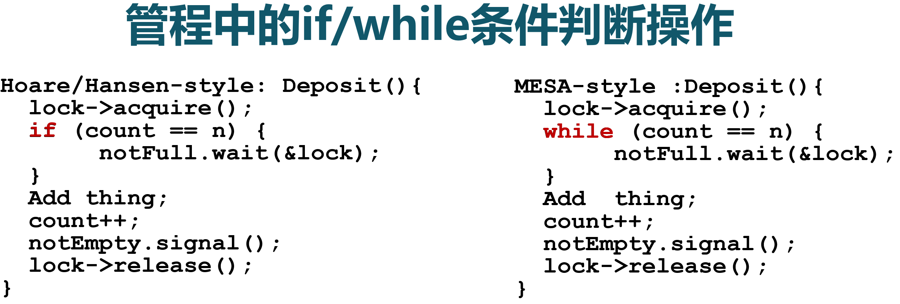
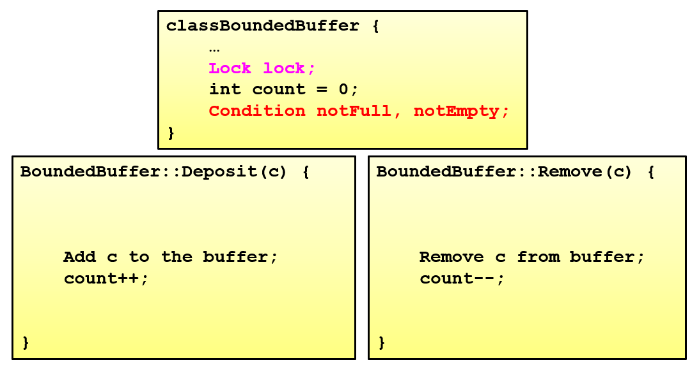

<!-- theme: gaia -->
<!-- _class: lead -->

# 第十二讲 同步与互斥

## 第三节 管程与条件变量

 管程（Moniter）  条件变量（CoCondVar）
 
---
### 管程
- 管程是一种用于多线程互斥访问共享资源的程序结构
- 采用面向对象方法，简化了线程间的同步控制
- 任一时刻最多只有一个线程执行管程代码
- 正在管程中的线程可临时放弃管程的互斥访问，等待事件出现时恢复

---
### 管程 -- 条件变量
- 管程的组成
   - 一个锁：控制管程代码的互斥访问
   - 0或者多个条件变量: 管理共享数据的并发访问
- 条件变量是管程内的等待机制
   - 进入管程的线程因资源被占用而进入等待状态
   - 每个条件变量表示一种等待原因，对应一个等待队列

---
### 管程 -- 条件变量
- 条件变量是管程内的等待机制
- Wait()操作
   - 将自己阻塞在等待队列中
   - 唤醒一个等待者或释放管程的互斥访问
- Signal()操作
   - 将等待队列中的一个线程唤醒
   - 如果等待队列为空，则等同空操作

---
### 管程 -- 实现条件变量

---
### 管程 -- 实现条件变量

---
### 管程 -- 实现条件变量

---
### 管程 -- 实现条件变量

---
### 管程 -- 实现条件变量

---
### 管程 -- 实现条件变量

---
### 管程 -- 实现条件变量

---
### 管程 -- 实现条件变量

---
### 管程 -- 实现条件变量

---
### 管程 
管程中条件变量的释放处理方式

---
### 管程 
管程中条件变量的释放处理方式

---
### 管程 
管程中条件变量的释放处理方式
- 线程 T2 的signal，使线程 T1 等待的条件满足时
  - Hoare：T2 通知完 T1后，T2 阻塞，T1 马上执行；等 T1 执行完，再唤醒 T2 执行
  - Hasen： T2 通知完 T1 后，T2 执行结束后（最后signal），然后 T1 再执行
  - MESA：T2 通知完 T1 后，T2 还会接着执行，T1 并不会立即执行，而是从条件变量的等待队列进到入口等待队列里面（重新竞争）

---
### 管程 - Hoare 
  - 1.ThreadA 进入 管程monitor
  - 2.ThreadA 等待资源 (进入wait queue)
  - 3.ThreadB 进入monitor
  - 4.ThreadB 资源可用 ，通知ThreadA恢复执行，并把自己转移到signal queue。
  - 5.ThreadA 重新进入 monitor
  - 6.ThreadA 离开monitor
  - 7.ThreadB 重新进入 monitor
  - 8.ThreadB 离开monitor
  - 9.其他在entry queue中的线程通过竞争进入monitor

---
### 管程 - Mesa 
  - 1.ThreadA 进入 monitor
  - 2.ThreadA 等待资源 (进入wait queue，并释放monitor)
  - 3.ThreadB 进入monitor
  - 4.ThreadB 资源可用，通知ThreadA。(ThreadA被转移到entey queue，重新竞争)
  - 5.ThreadB 继续执行
  - 6.ThreadB 离开monitor
  - 7.ThreadA 获得执行机会，从entry queue出队列，恢复执行
  - 8.ThreadA 离开monitor
  - 9.其他在entry queue中的线程通过**竞争**进入monitor

---
### 管程 - Hasen： 
  - 1.ThreadA 进入 monitor
  - 2.ThreadA 等待资源r
  - 3.ThreadB 进入monitor
  - 4.ThreadB 离开Monitor,并给通知等待资源r的线程，资源可用
  - 5.ThreadA 重新进入 monitor
  - 6.ThreadA 离开monitor
  - 7.其他线程从entry queue中竞争进入monitor

---
### 管程 
管程中条件变量的释放处理方式

---
### 管程 -- 生产者-消费者问题

---
### 管程 -- 生产者-消费者问题

---
### 管程 -- 生产者-消费者问题

---
### 管程 -- 生产者-消费者问题

