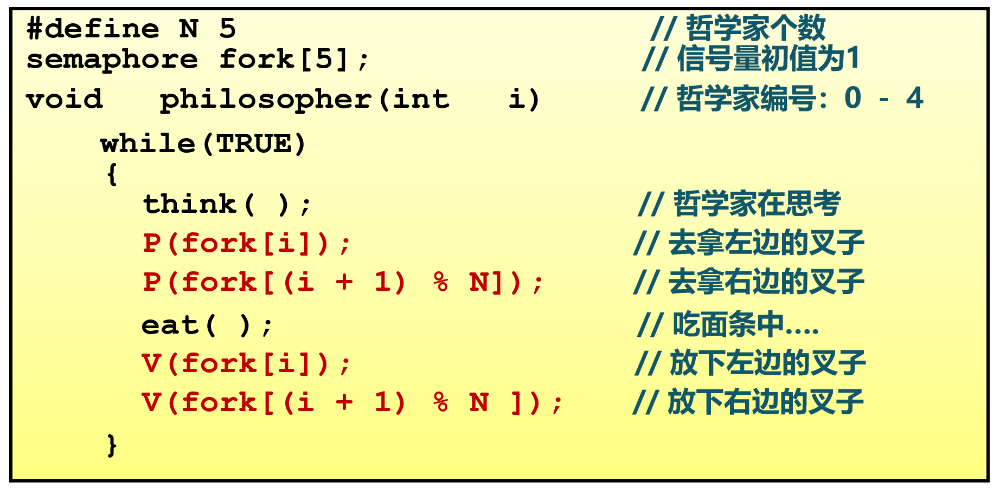
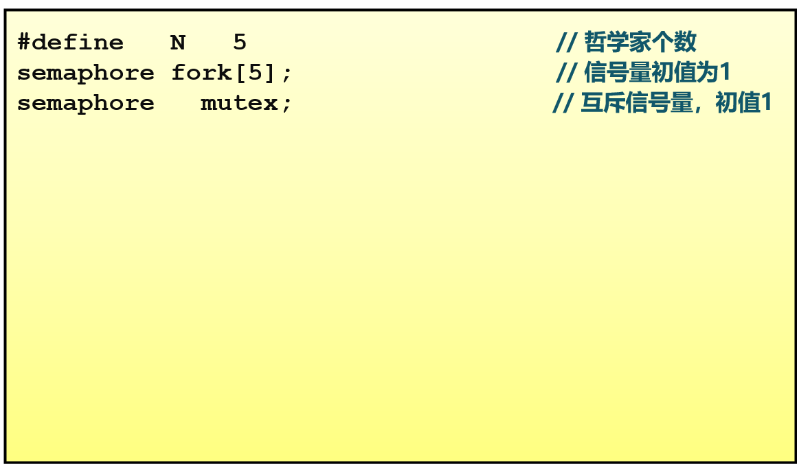
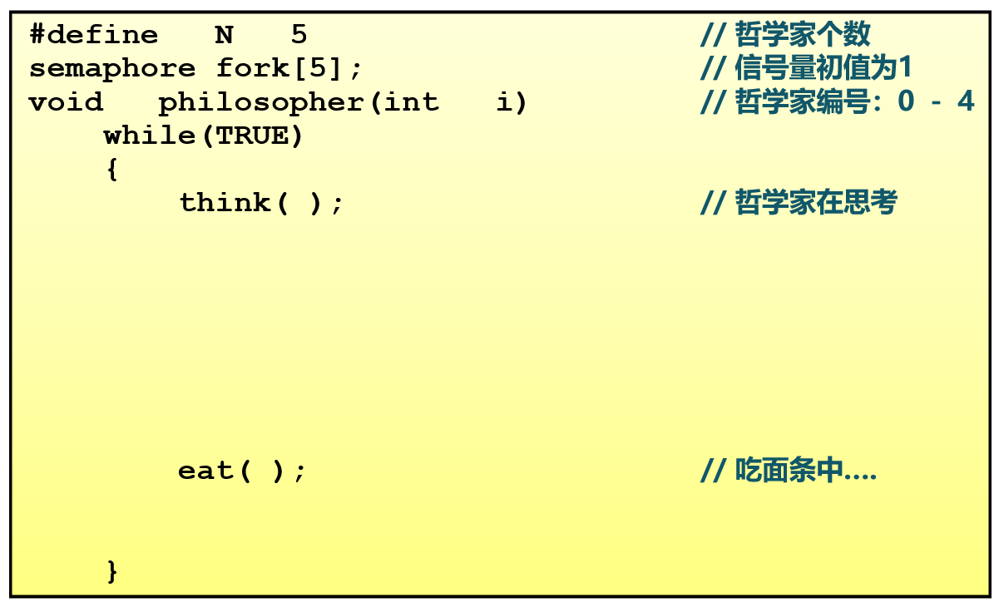
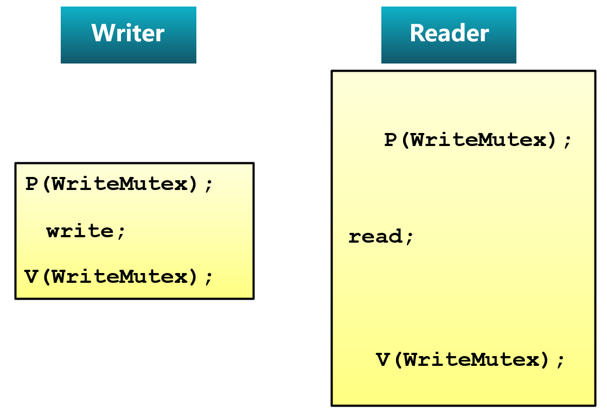

<!-- theme: gaia -->
<!-- _class: lead -->

# 第十二讲 同步与互斥

## 第四节 同步互斥实例问题

---
### 哲学家就餐问题
- 5个哲学家围绕一张圆桌而坐
- 桌子上放着5支叉子
- 每两个哲学家之间放一支叉子
- 哲学家的动作包括思考和进餐
- 进餐时需同时用左右两边的叉子
- 思考时将两支叉子放回原处

如何保证哲学家们的动作有序进行？
如：不出现有人永远拿不到叉子


---
### 哲学家就餐问题 -- 方案1


不正确，可能导致死锁

---
### 哲学家就餐问题 -- 方案2


---
### 哲学家就餐问题 -- 方案2


---
### 哲学家就餐问题 -- 方案2


---
### 哲学家就餐问题 -- 方案2


---
### 哲学家就餐问题 -- 方案2

互斥访问正确，但每次只允许一人进餐


---
### 哲学家就餐问题 -- 方案3


---
### 哲学家就餐问题 -- 方案3



---
### 哲学家就餐问题 -- 方案3


---
### 哲学家就餐问题 -- 方案3


---
### 哲学家就餐问题 -- 方案3


---
### 哲学家就餐问题 -- 方案3

没有死锁，可有多人同时就餐

---
### 哲学家就餐问题 -- 方案4


---
### 哲学家就餐问题 -- 方案4
<!-- https://blog.csdn.net/weixin_43237362/article/details/104712647 AND型信号量 -->

AND型信号量集是指同时需要多个资源且每种占用一个资源时的信号量操作。

当一段代码需要同时获取两个或多个临界资源时，就可能出现由于各线程分别获得部分临界资源并等待其余的临界资源的局面。各线程都会“各不相让”，从而出现死锁。

解决这个问题的一个基本思路是：在一个原语中申请整段代码需要的多个临界资源，要么全部分配给它，要么一个都不分配给它。这就是AND型信号量集的基本思想。

---
### 哲学家就餐问题 -- 方案4
<!-- https://blog.csdn.net/weixin_43237362/article/details/104712647 AND型信号量 -->
AND型信号量集
```
P(S1, S2, …, Sn)
{
    While(TRUE)
    {
        if (S1 >=1 and … and Sn>=1 ){
            for( i=1 ;i<=n; i++) Si--;
        break;
        }
        else{
             Place the thread in the waiting queue associated  with the first Si 
             found with Si < 1   
        }
    }
}
```

---
### 哲学家就餐问题 -- 方案4
<!-- https://blog.csdn.net/weixin_43237362/article/details/104712647 AND型信号量 -->
AND型信号量集
```
V(S1, S2, …, Sn){ 
    for (i=1; i<=n; i++) {
            Si++ ;
            Remove all the thread waiting in the queue associated with Si into 
            the ready queue                
     }
}
```
---
### 哲学家就餐问题 -- 方案5


---
### 哲学家就餐问题 -- 方案5


---
### 哲学家就餐问题 -- 方案5


---
### 哲学家就餐问题 -- 方案5
方案5不仅没有死锁，而且对于任意位哲学家的情况都能获得最大的并行度。算法中使用一个数组`state`跟踪每一个哲学家是在进餐、思考还是饥饿状态（正在试图拿叉子）。一个哲学家只有在两个邻居都没有进餐时才允许进入到进餐状态。

每个线程将函数`philosopher`作为主代码运行，而其他函数`take_forks`、`put_forks`和`test`只是普通的函数，而非单独的线程。


---
### 读者-写者问题
- 共享数据的两类使用者
  - 读者：只读不修改数据
  - 写者：读取和修改数据
- 对共享数据的读写
  - 多个：“读－读”-- 允许
  - 单个：“读－写”-- 互斥
  - 单个：“写－写”-- 互斥


---
### 读者-写者问题
- 读者优先策略
   - 只要有读者正在读状态，后来的读者都能直接进入
   - 如读者持续不断进入，则写者就处于饥饿
 - 写者优先策略
   - 只要有写者就绪，写者应尽快执行写操作
   - 如写者持续不断就绪，则读者就处于饥饿


---
### 读者-写者问题 -- 方案1
用信号量描述每个约束
- 信号量WriteMutex：控制读写操作的互斥，初始化为1
- 读者计数Rcount ：正在进行读操作的读者数目，初始化为0
- 信号量CountMutex：控制对读者计数的互斥修改，初始化为1


---
### 读者-写者问题 -- 方案1(信号量)


---
### 读者-写者问题 -- 方案1(信号量)


---
### 读者-写者问题 -- 方案1(信号量)


---
### 读者-写者问题 -- 方案1(信号量)


---
### 读者-写者问题 -- 方案1(信号量)


---
### 读者-写者问题 -- 方案1(信号量)

此实现中，读者优先


---
### 读者-写者问题 -- 方案2(管程)


---
### 读者-写者问题 -- 方案2(管程)


---
### 读者-写者问题 -- 方案2(管程) --读者


---
### 读者-写者问题 -- 方案2(管程) --读者


---
### 读者-写者问题 -- 方案2(管程) --读者


---
### 读者-写者问题 -- 方案2(管程) --读者


---
### 读者-写者问题 -- 方案2(管程) --读者


---
### 读者-写者问题 -- 方案2(管程) --读者


---
### 读者-写者问题 -- 方案2(管程) --读者


---
### 读者-写者问题 -- 方案2(管程) --读者


---
### 读者-写者问题 -- 方案2(管程) --写者


---
### 读者-写者问题 -- 方案2(管程) --写者


---
### 读者-写者问题 -- 方案2(管程) --写者


---
### 读者-写者问题 -- 方案2(管程) --写者


---
### 读者-写者问题 -- 方案2(管程) --写者


---
### 读者-写者问题 -- 方案2(管程) --写者
