<!-- theme: gaia -->
<!-- _class: lead -->

# 第十二讲 同步与互斥

## 第五节 死锁


---
### 死锁问题

- 桥梁只能单向通行
- 桥的每个部分可视为一个资源
- 可能出现死锁
  - 对向行驶车辆在桥上相遇
  - 解决方法：一个方向的车辆倒退(资源抢占和回退)


---
### 死锁问题

- 桥梁只能单向通行
- 桥的每个部分可视为一个资源
- 可能发生饥饿
  - 由于一个方向的持续车流，另一个方向的车辆无法通过桥梁


---
### 死锁问题
由于竞争资源或者通信关系，两个或更多进/线程在执行中出现，永远相互等待只能由其他进/线程引发的事件
```
Thread 1:    Thread 2:
lock(L1);    lock(L2);
lock(L2);    lock(L1);
```


---
###  死锁问题 -- 资源
- 资源类型$R_1, R_2, . . .,R_m$
   - CPU执行时间、内存空间、I/O设备等
- 每类资源$R_i$有$W_i$个实例
- 进/线程访问资源的流程
   - 请求：申请空闲资源
   - 使用：占用资源
   - 释放：资源状态由占用变成空闲


---
###  死锁问题 -- 资源
**资源分类**
- 可重用资源（Reusable Resource）
   - 任何时刻只能有一个进/线程使用资源
   - 资源被释放后，其他进/线程可重用
   - 可重用资源示例
      - 硬件：处理器、内存、设备等
      - 软件：文件、数据库和信号量等
   - 可能出现死锁：每个进/线程占用一部分资源并请求其它资源


---
###  死锁问题 -- 资源
**资源分类**
- 可消耗资源(Consumable resource)
   - 资源可被销毁
   - 可消耗资源示例
      - 在I/O缓冲区的中断、信号、消息等
   - 可能出现死锁：进/线程间相互等待接收对方的消息


---
###  死锁问题 -- 资源分配图
描述资源和进/线程间的分配和占用关系的有向图
- 顶点：系统中的进/线程
   - $P = \{ P_1, P_2, …, P_n \}$
- 顶点：系统中的资源
   - $R = \{R_1, R_2, …, P_m\}$
- 边：资源请求
   - 进/线程$P_i$请求资源$R_j: P_i \rightarrow R_j$
- 边：资源分配
   - 资源$R_j$已分配给进/线程$P_i：R_j \rightarrow  P_i$


---
###  死锁问题 -- 资源分配图
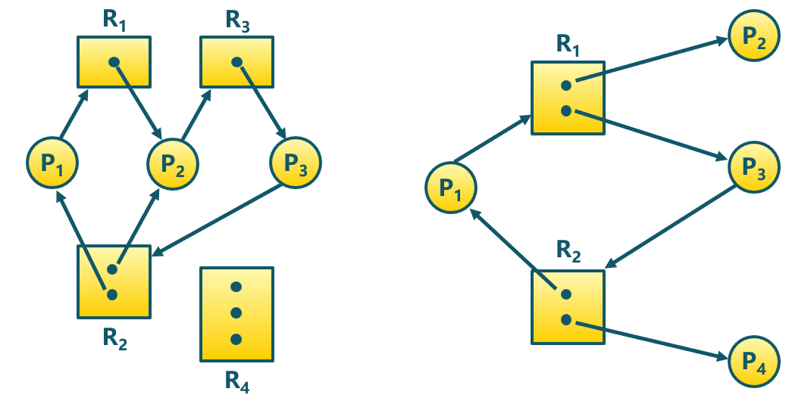
是否有死锁？


---
###  死锁问题 -- 必要条件
- 互斥：任何时刻只能有一个进/线程使用一个资源实例
- 持有并等待：进/线程保持至少一个资源，并正在等待获取其他进/线程持有的资源
- 非抢占：资源只能在进/线程使用后自愿释放
- 循环等待
   - 存在等待进/线程集合$\{P_0，P_1，...，P_N\}$ 
   - 进/线程间形成相互等待资源的环


---
###  死锁问题 -- 处理办法 
- 死锁预防(Deadlock Prevention)
   - 确保系统永远不会进入死锁状态
- 死锁避免(Deadlock Avoidance)
   - 在使用前进行判断，只允许不会出现死锁的进/线程请求资源
- 死锁检测和恢复(Deadlock Detection & Recovery)
   - 在检测到运行系统进入死锁状态后，进行恢复
   - 由应用进/线程处理死锁
   - 通常操作系统忽略死锁
      - 大多数操作系统（包括UNIX）的做法

---
###  死锁问题 - 处理办法 -- 预防
预防采用某种策略限制并发进/线程对资源的请求，或破坏死锁必要条件。
- 破坏“互斥”
   - 把互斥的共享资源封装成可同时访问，例如用SPOOLing技术将打印机改造为共享设备；
   - 缺点：但是很多时候都无法破坏互斥条件。
- 破坏“持有并等待“
   - 只在能够同时获得所有需要资源时，才执行分配操作
   <!-- 仅允许进/线程在开始执行时，一次请求所有需要的资源
      - 进/线程请求资源时，要求它不持有任何其他资源-->
   - 缺点：资源利用率低

<!-- 
现代操作系统
同时的外部设备联机操作（Simultaneous Peripheral Operation On Line，SPOOLing）

并非所有的用户层I/O软件都是由库过程组成的。另一个重要的类别是假脱机系统。假脱机（spooling）是多道程序设计系统中处理独占I/O设备的一种方法。考虑一种典型的假脱机设备：打印机。尽管在技术上可以十分容易地让任何用户进程打开表示该打印机的字符特殊文件，但是假如一个进程打开它，然后很长时间不使用，则其他进程都无法打印。

另一种方法是创建一个特殊进程，称为守护进程（daemon），以及一个特殊目录，称为假脱机目录（spooling directory）。一个进程要打印一个文件时，首先生成要打印的整个文件，并且将其放在假脱机目录下。由守护进程打印该目录下的文件，该进程是允许使用打印机特殊文件的惟一进程。通过保护特殊文件来防止用户直接使用，可以解决某些进程不必要地长期空占打印机的问题。 -->


---
###  死锁问题 - 处理办法 -- 预防
<!--预防是采用某种策略，限制并发进/线程对资源的请求，或使系统在任何时刻都不满足死锁的必要条件。-->
预防采用某策略限制并发进/线程对资源的请求，或破坏死锁必要条件。
- 破坏“非抢占”
   - 如进/线程请求不能立即分配的资源，则释放已占有资源
   - 申请的资源被其他进/线程占用时，由OS协助剥夺
   - 缺点：反复地申请和释放资源会增加系统开销，降低系统吞吐量
- 破坏“循环等待“
   - 对资源排序，要求进/线程按顺序请求资源
   - 缺点：必须按规定次序申请资源，用户编程麻烦
   - 缺点：难以支持资源变化（例如新资源）
 
 
<!---
###  死锁问题 - 处理办法 -- 预防
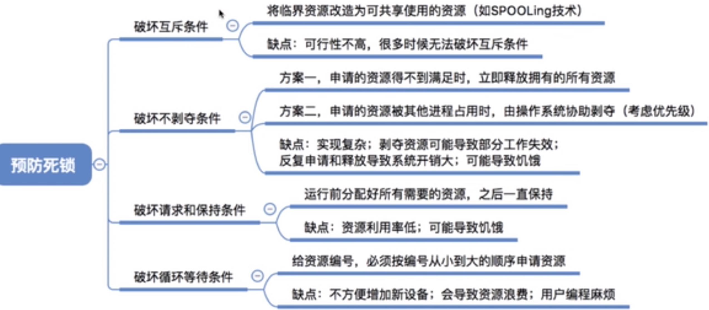
-->


---
###  死锁问题 - 处理办法 -- 避免
利用额外的先验信息，在分配资源时判断是否会出现死锁，只在不会死锁时分配资源
- 要求进/线程声明需要资源的最大数目
- 限定提供与分配的资源数量，确保满足进/线程的最大需求
- 动态检查的资源分配状态，确保不会出现环形等待

 
---
###  死锁问题 - 处理办法 -- 避免
资源分配中，系统处于安全状态
- 针对所有进/线程，存在安全执行序列$<P_1，P_2，...，P_N>$
- $P_i$要求的资源 $\le$ 当前可用资源 $+$ 所有$P_j$ 持有资源，其中$j<i$
- 如$P_i$的资源请求不能立即分配，则$P_i$等待所有$P_j, (j<i)$完成
- $P_i$完成后释放所分配的资源，$P_{i+1}$可得到所需资源并继续执行
- 最终整个序列的所有$P_{1..N}$都能获得所需资源


---
###  死锁问题 - 处理办法 -- 避免
安全状态与死锁的关系
- 系统处于安全状态，一定没有死锁
- 系统处于不安全状态，可能出现死锁
   - 避免死锁就是确保系统不会进入不安全状态


---
###  死锁问题 - 处理办法 -- 避免
银行家算法（Banker's Algorithm）-- 概述
- 银行家算法是一个避免死锁产生的算法。以银行借贷分配策略为基础，判断并保证系统处于安全状态
   - 客户在第一次申请贷款时，声明所需最大资金量，在满足所有贷款要求并完成项目时，及时归还
   - 在客户贷款数量不超过银行拥有的最大值时，银行家尽量满足客户需要

银行家 $\leftrightarrow$操作系统；资金 $\leftrightarrow$资源；客户 $\leftrightarrow$进/线程

---
###  死锁问题 - 处理办法 -- 避免
银行家算法（Banker's Algorithm）-- 数据结构


---
###  死锁问题 - 处理办法 -- 避免
银行家算法（Banker's Algorithm）-- 判断安全状态的例程
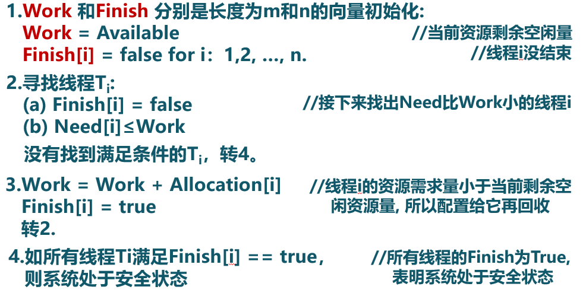


---
###  死锁问题 - 处理办法 -- 避免
银行家算法（Banker's Algorithm）-- 完整算法


---
###  死锁问题 - 处理办法 -- 避免
银行家算法（Banker's Algorithm）-- 示例1


---
###  死锁问题 - 处理办法 -- 避免
银行家算法（Banker's Algorithm）-- 示例1


---
###  死锁问题 - 处理办法 -- 避免
银行家算法（Banker's Algorithm）-- 示例1
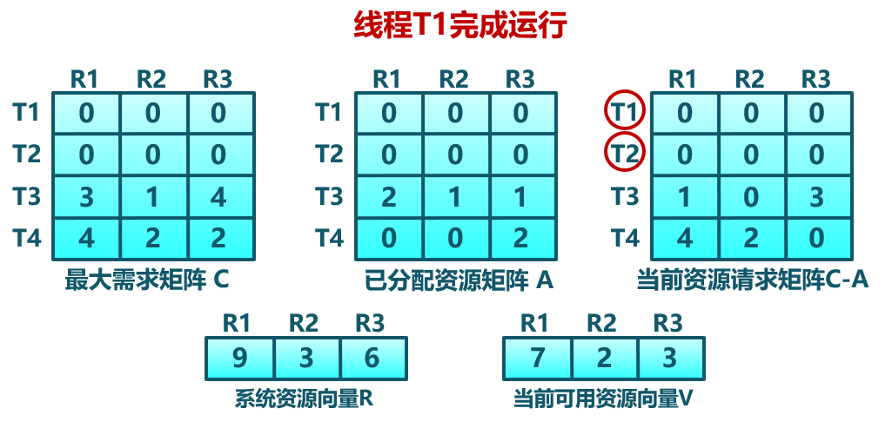


---
###  死锁问题 - 处理办法 -- 避免
银行家算法（Banker's Algorithm）-- 示例1
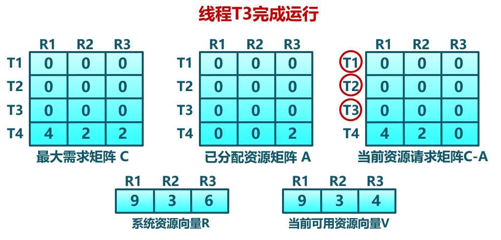

---
###  死锁问题 - 处理办法 -- 避免
银行家算法（Banker's Algorithm）-- 示例2
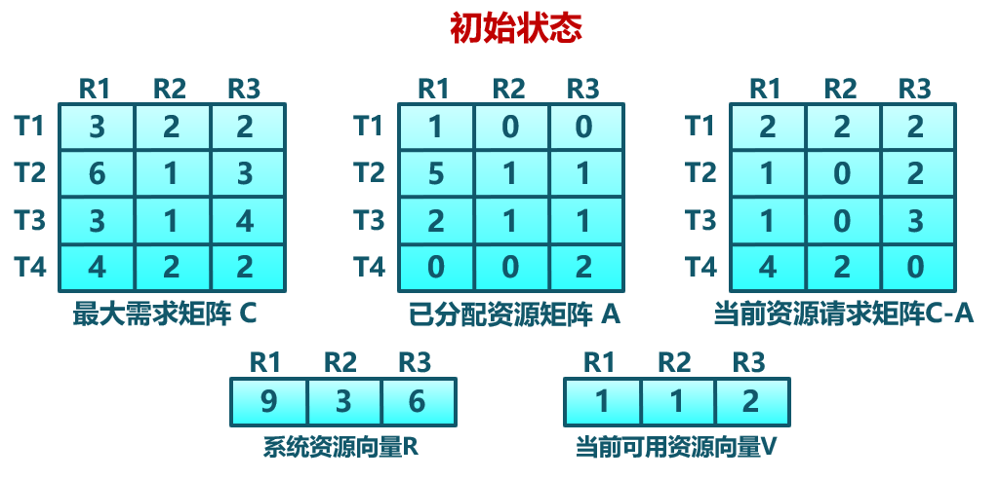

---
###  死锁问题 - 处理办法 -- 避免
银行家算法（Banker's Algorithm）-- 示例2
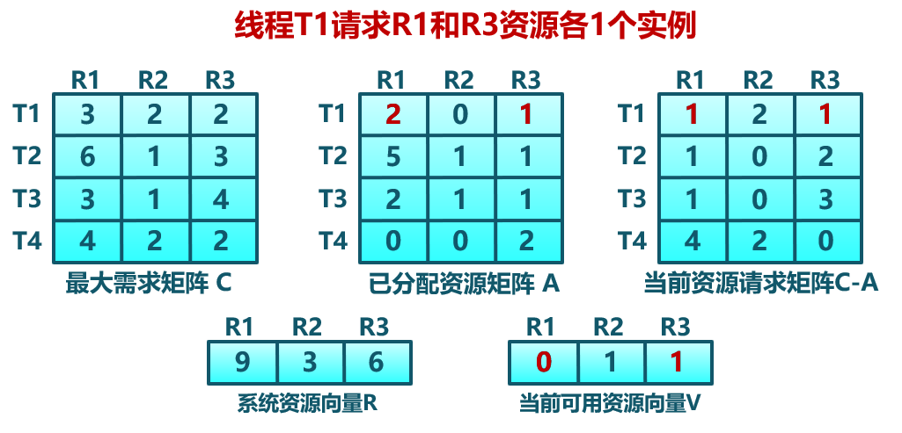


---
###  死锁问题 - 处理办法 -- 检测
- 允许系统进入死锁状态
- 维护系统的资源分配图
- 定期调用死锁检测算法来搜索图中是否存在死锁
- 出现死锁时，用死锁恢复机制进行恢复
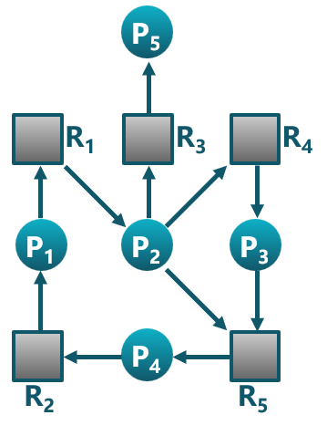


---
###  死锁问题 - 处理办法 -- 检测
死锁检测算法：数据结构
- Available:长度为m的向量：每种类型可用资源的数量
- Allocation:一个n×m矩阵：当前分配给各个进/线程每种类型资源的数量
   - 进/线程$P_i$ 拥有资源$R_j$的$Allocation[i, j]$个实例


---
###  死锁问题 - 处理办法 -- 检测
死锁检测算法：完整算法
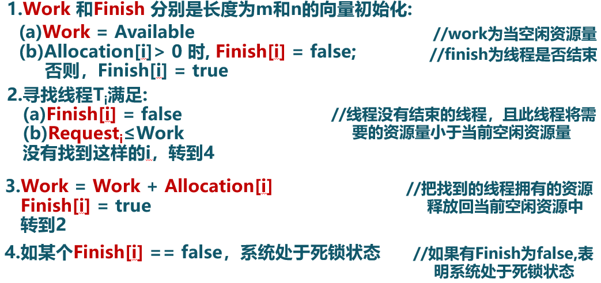


---
###  死锁问题 - 处理办法 -- 检测
死锁检测算法：-- 示例1
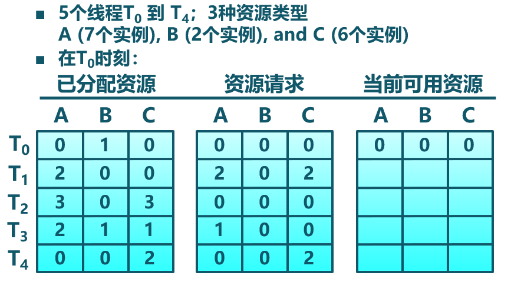


---
###  死锁问题 - 处理办法 -- 检测
死锁检测算法：-- 示例1
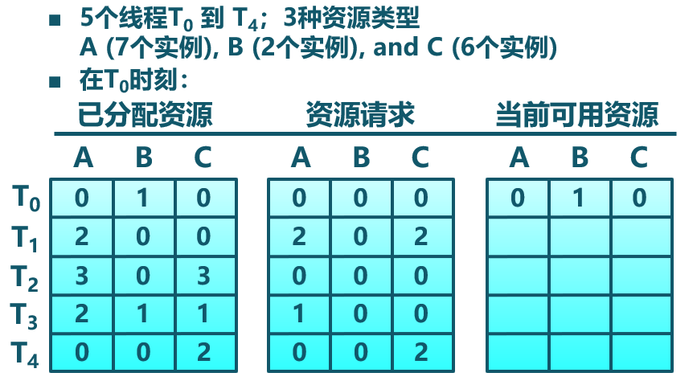


---
###  死锁问题 - 处理办法 -- 检测
死锁检测算法：-- 示例1
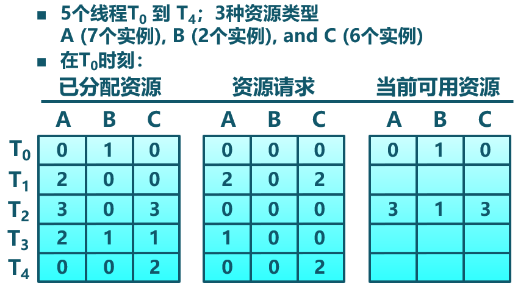


---
###  死锁问题 - 处理办法 -- 检测
死锁检测算法：-- 示例1


---
###  死锁问题 - 处理办法 -- 检测
死锁检测算法：-- 示例1
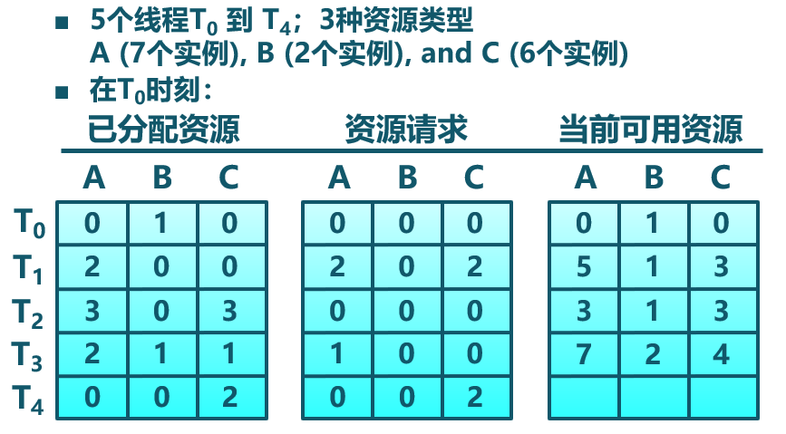


---
###  死锁问题 - 处理办法 -- 检测
死锁检测算法：-- 示例1
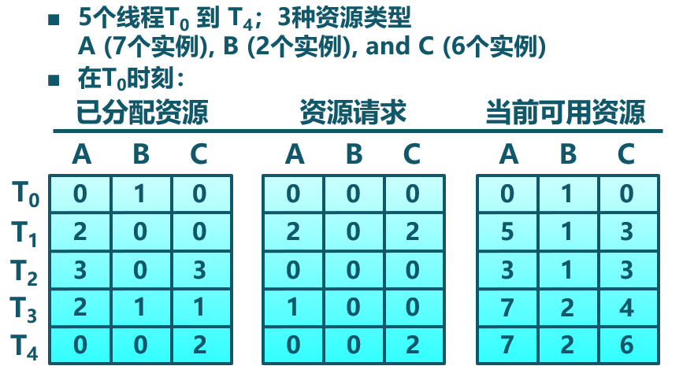
序列$<T_0, T_2, T_1, T_3, T_4>$ 对于所有的i，都可满足Finish[i] = true


---
###  死锁问题 - 处理办法 -- 检测
死锁检测算法：-- 示例2
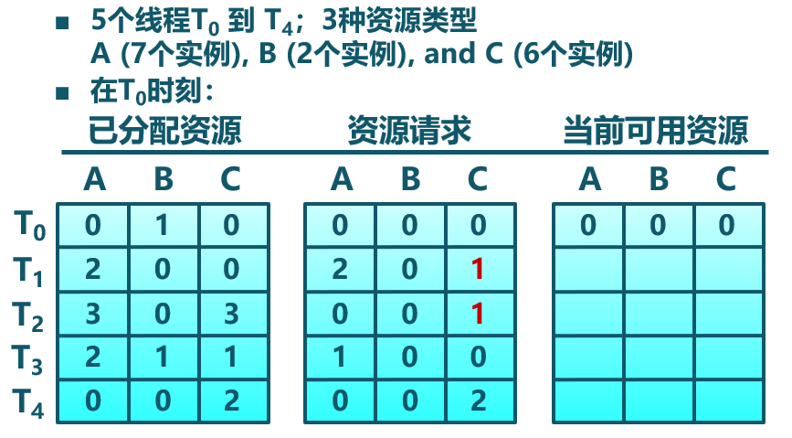
可通过回收线程$T_0$占用的资源，但资源不足以完成其他线程请求
线程$T_1, T_2, T_3, T_4$形成死锁


---
###  死锁问题 - 处理办法 -- 检测
使用死锁检测算法

- 死锁检测的时间和周期选择依据
   - 死锁多久可能会发生
   - 多少进/线程需要被回滚
- 资源图可能有多个循环
   - 难于分辨“造成”死锁的关键进/线程

检测到死锁后，应该如何处理？

---
###  死锁问题 - 处理办法 -- 恢复 -- 进/线程终止

- 终止所有的死锁进/线程
- 一次只终止一个进/线程直到死锁消除
- 终止进/线程的顺序的参考因素：
   - 进/线程的优先级
   - 进/线程已运行时间以及还需运行时间
   - 进/线程已占用资源
   - 进/线程完成需要的资源
   - 终止进/线程数目
   - 进/线程是交互还是批处理

---
###  死锁问题 - 处理办法 -- 恢复 -- 资源抢占
- 选择被抢占进/线程
   - 参考因素：最小成本目标
- 进/线程回退
   - 返回到一些安全状态, 重启进/线程到安全状态
-  可能出现饥饿
   - 同一进/线程可能一直被选作被抢占者


 

