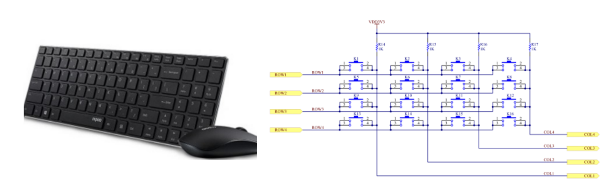
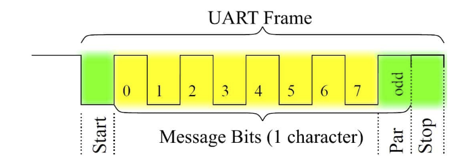
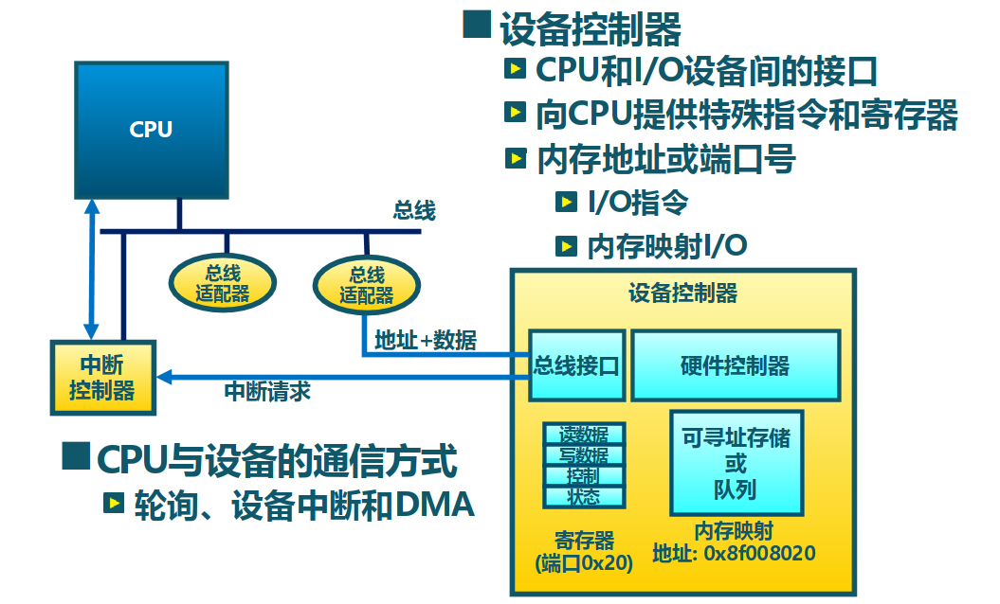
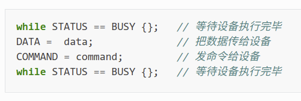
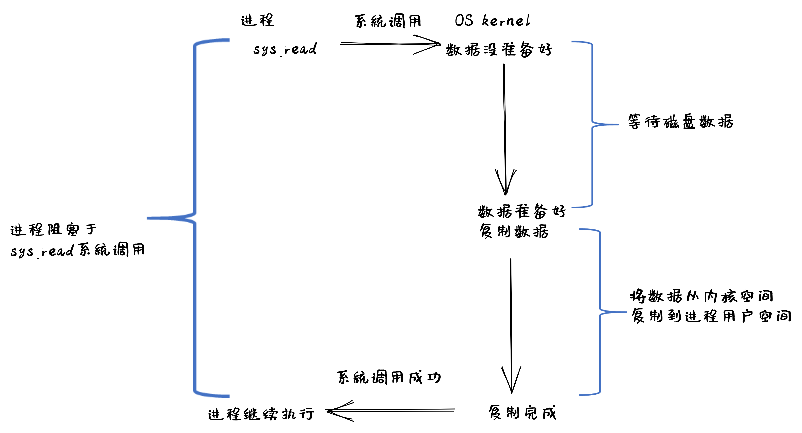

<!-- theme: gaia -->
<!-- _class: lead -->

# 第十三讲 设备管理
## 第一节 设备接口

 
 

向勇 陈渝 李国良 任炬

 
 

2023年春季

---
### 内容
- 要解决的问题
- 内核 I/O 结构
- 常见设备接口类型
- 设备访问特征
- 设备传输方式
- I/O执行模型

---
### I/O子系统 -- 要解决的问题
- 为何设备的差异性那么大？
- 为何要管理设备？
- 如何统一对设备的访问接口？
- 为何要对设备建立抽象？
- 如何感知设备的状态并管理设备？
- 如何提高 CPU 与设备的访问性能？
- 如果保证 I/O 操作的可靠性？

---
### I/O子系统 -- 内核 I/O 结构

---
### I/O子系统 -- 常见设备接口类型
- 设备的发展历史
   - 简单设备：CPU 可通过 I/O 接口直接控制 I/O 设备  
   - 多设备：CPU 与 I/O 设备之间增加了一层 I/O 控制器和总线 BUS
   - 支持中断的设备：提高 CPU 利用率
   - 高吞吐量设备：支持 DMA
   - 各种其他设备：GPU、声卡、智能网卡、RDMA
   - 连接方式：直连、（设备/中断）控制器、总线、分布式

---
### I/O子系统 -- 常见设备接口类型
- 常见设备：字符设备   块设备   网络设备

包含上述外设的嵌入式开发板

---
### I/O子系统 -- 常见设备接口类型
字符设备：如GPIO, 键盘/鼠标, 串口等

GPIO LED light

---
### I/O子系统 -- 常见设备接口类型
字符设备：如GPIO, 键盘/鼠标, 串口等

键盘

---
### I/O子系统 -- 常见设备接口类型
字符设备：如GPIO, 键盘/鼠标, 串口等

UART 串口通信

---
### I/O子系统 -- 常见设备接口类型
块设备：如: 磁盘驱动器、磁带驱动器、光驱等

 磁盘

 
---
### I/O子系统 -- 常见设备接口类型
网络设备：如ethernet、wifi、bluetooth 等

网卡

 
---
### I/O子系统 -- 设备访问特征
字符设备
- 以字节为单位顺序访问
- I/O 命令：get()、put() 等
- 通常使用文件访问接口和语义

 
---
### I/O子系统 -- 设备访问特征
块设备
- 均匀的数据块访问
- I/O 命令：原始 I/O 或文件系统接口、内存映射文件访问
- 通常使用文件访问接口和语义

 
---
### I/O子系统 -- 设备访问特征
网络设备
- 格式化报文交换
- I/O 命令：send/receive 网络报文，通过网络接口支持多种网络协议
- 通常使用 socket 访问接口和语义

 
---
### I/O子系统 -- 设备传输方式
- 程序控制 I/O(PIO, Programmed I/O)
- Interrupt based I/O
- 直接内存访问 (DMA)

 
 
---
### I/O子系统 -- 设备传输方式
**程序控制 I/O(PIO, Programmed I/O)**
- Port-mapped 的 PIO(PMIO)：通过 CPU 的 in/out 指令
- Memory-mapped 的 PIO(MMIO)：通过 load/store 传输所有数据
- 硬件简单，编程容易
- 消耗的 CPU 时间和数据量成正比
- 适用于简单的、小型的设备 I/O
- I/O 设备通知 CPU：PIO 方式的轮询

 
---
### I/O子系统 -- 设备传输方式
**中断传输方式**
- I/O 设备想通知 CPU ，便会发出中断请求信号
- 可中断的设备和中断类型逐步增加
- 除了需要设置 CPU，还需设置中断控制器
- 编程比较麻烦
- CPU 利用率高
- 适用于比较复杂的 I/O 设备
- I/O 设备通知 CPU：中断方式的提醒

 
---
### I/O子系统 -- 设备传输方式
**中断传输方式**

 
---
### I/O子系统 -- 设备传输方式
DMA 传输方式
- 设备控制器可直接访问系统总线
- 控制器直接与内存互相传输数据
- 除了需要设置 CPU，还需设置中断控制器
- 编程比较麻烦，需要 CPU 参与设置
- 设备传输数据不影响 CPU
- 适用于高吞吐量 I/O 设备
 
---
### I/O子系统 -- CPU 与设备的连接

---
### I/O子系统 -- 读取磁盘数据的例子

---
### I/O子系统 -- I/O 请求生存周期

---
### I/O子系统 -- I/O执行模型 -- I/O 接口的交互协议
基于轮询的抽象设备接口：状态 命令 数据

---
### I/O子系统 -- I/O执行模型 -- I/O 接口的交互协议
基于中断的抽象设备接口：状态 命令 数据 中断

---
### I/O子系统 -- I/O执行模型 --  设备抽象
**基于文件的 I/O 设备抽象**
- 访问接口：open/close/read/write
- 特别的系统调用：ioctl ：input/output control
- ioctl 系统调用很灵活，但太灵活了，请求码的定义无规律可循
- 文件的接口太面向用户应用，不足覆盖到OS对设备进行管理的过程

---
### I/O子系统 -- I/O执行模型 --  设备抽象
**基于流的 I/O 设备抽象**
- 流是用户进程和设备或伪设备之间的全双工连接
- 特别的系统调用：ioctl ：input/output control
- ioctl 系统调用很灵活，但太灵活了，请求码的定义无规律可循
- Dennis M. Ritchie 写出了“A Stream Input-Output System”，1984

---
### I/O子系统 -- I/O执行模型 --  设备抽象
**基于virtio的 I/O 设备抽象**
- Rusty Russell 在 2008 年提出通用 I/O 设备抽象–virtio 规范
- 虚拟机提供 virtio 设备的实现，virtio 设备有着统一的 virtio 接口
- OS 只要能够实现这些通用的接口，就可管理和控制各种 virtio 设备

---
### I/O子系统 -- I/O执行模型 -- 分类
当一个用户进程发出一个 read I/O 系统调用时，主要经历两个阶段：
1. 等待数据准备好；    
2. 把数据从内核拷贝到用户进程中

- 进程执行状态：阻塞/非阻塞：进程执行系统调用后会被阻塞/非阻塞
- 消息通信机制：
  -  同步：用户进程与操作系统之间的操作是经过双方协调的，步调一致的
  - 异步：用户进程与操作系统之间并不需要协调，都可以随意进行各自的操作

---
### I/O子系统 -- I/O执行模型 -- 分类
- blocking I/O
- nonblocking I/O
- I/O multiplexing
- signal driven I/O
- asynchronous I/O

---
### I/O子系统 -- I/O执行模型 --  阻塞 I/O

---
### I/O子系统 -- I/O执行模型 --  阻塞 I/O
基于阻塞 I/O（blocking I/O）模型的文件读系统调用–read 的执行过程是：
1. 用户进程发出 read 系统调用；
2. 内核发现所需数据没在 I/O 缓冲区中，需要向磁盘驱动程序发出 I/O 操作，并让用户进程处于阻塞状态；
3. 磁盘驱动程序把数据从磁盘传到 I/O 缓冲区后，通知内核（一般通过中断机制），内核会把数据从 I/O 缓冲区拷贝到用户进程的 buffer 中，并唤醒用户进程（即用户进程处于就绪态）；
4. 内核从内核态返回到用户态进程，此时 read 系统调用完成。

---
### I/O子系统 -- I/O执行模型 -- 非阻塞 I/O

---
### I/O子系统 -- I/O执行模型 -- 非阻塞 I/O
基于非阻塞 IO（non-blocking I/O）模型的文件读系统调用–read 的执行过程：
1. 用户进程发出 read 系统调用；
2. 内核发现所需数据没在 I/O 缓冲区中，需要向磁盘驱动程序发出 I/O 操作，并不会让用户进程处于阻塞状态，而是立刻返回一个 error；
3. 用户进程判断结果是一个 error 时，它就知道数据还没有准备好，于是它可以再次发送 read 操作（这一步操作可以重复多次）；

---
### I/O子系统 -- I/O执行模型 -- 非阻塞 I/O

4. 磁盘驱动程序把数据从磁盘传到 I/O 缓冲区后，通知内核（一般通过中断机制），内核在收到通知且再次收到了用户进程的 system call 后，会马上把数据
从 I/O 缓冲区拷贝到用户进程的 buffer 中；
5. 内核从内核态返回到用户态的用户态进程，此时 read 系统调用完成。

所以，在非阻塞式 I/O 的特点是用户进程不会被内核阻塞，而是需要不断的主动询问内核所需数据准备好了没有。

---
### I/O子系统 -- I/O执行模型 -- 多路复用 I/O

---
### I/O子系统 -- I/O执行模型 -- 多路复用 I/O
多路复用 I/O（I/O multiplexing）的文件读系统调用–read 的执行过程：
1. 对应的 I/O 系统调用是 select 和 epoll 等
2. 通过 select 或 epoll 系统调用来不断的轮询用户进程关注的所有文件句柄或socket，当某个文件句柄或 socket 有数据到达了，select 或 epoll 系统调用就会返回到用户进程，用户进程再调用 read 系统调用，让内核将数据从内核的I/O 缓冲区拷贝到用户进程的 buffer 中。

---
### I/O子系统 -- I/O执行模型 -- 信号驱动 I/O

---
### I/O子系统 -- I/O执行模型 -- 信号驱动 I/O

1. 当进程发出一个 read 系统调用时，会向内核注册一个信号处理函数，然后系统调用返回，进程不会被阻塞，而是继续执行。
2. 当内核中的 IO 数据就绪时，会发送一个信号给进程，进程便在信号处理函数中调用 IO 读取数据。

此模型的特点是，采用了回调机制，这样开发和调试应用的难度加大。

---
### I/O子系统 -- I/O执行模型 -- 异步 I/O

---
### I/O子系统 -- I/O执行模型 -- 异步 I/O
1. 用户进程发起 read 异步系统调用之后，立刻就可以开始去做其它的事。
2. 从内核的角度看，当它收到一个 read 异步系统调用之后，首先它会立刻返回，所以不会对用户进程产生任何阻塞情况。
3. kernel 会等待数据准备完成，然后将数据拷贝到用户内存。
4. 当这一切都完成之后，kernel 会通知用户进程，告诉它 read 操作完成了。

---
### I/O子系统 -- I/O执行模型 -- 比较

---
### I/O子系统 -- I/O执行模型 -- 比较

1. 阻塞 I/O：在用户进程发出 I/O 系统调用后，进程会等待该 IO 操作完成，而使得进程的其他操作无法执行。
2. 非阻塞 I/O：在用户进程发出 I/O 系统调用后，如果数据没准备好，该 I/O 操作会立即返回，之后进程可以进行其他操作；如果数据准备好了，用户进程会通过系统调用完成数据拷贝并接着进行数据处理。
3. 多路复用 I/O：将多个非阻塞 I/O 请求的轮询操作合并到一个 select 或 epoll系统调用中进行。
4. 信号驱动 I/O：利用信号机制完成从内核到应用进程的事件通知。
5. 异步 I/O：不会导致请求进程阻塞。