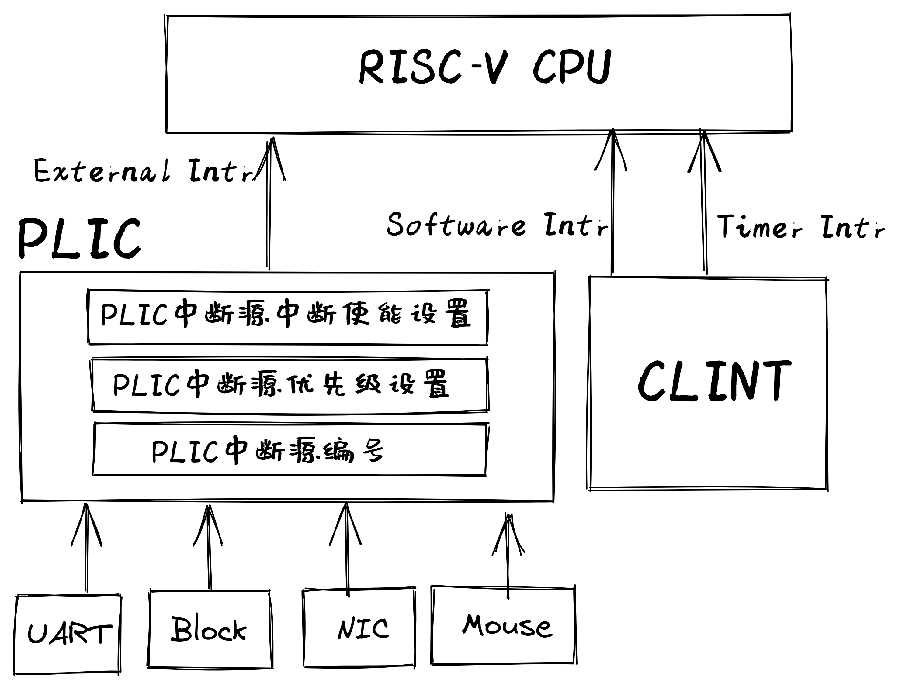

<!-- theme: gaia -->
<!-- _class: lead -->

# 第十三讲 设备管理
## 第三节 支持device的OS（DOS）

---
### 内容
- **进化目标**
- 历史背景
- 相关硬件
- 总体思路
- 实践步骤
- 软件架构
- 程序设计


---
### 进化目标 vs 以往目标
- SMOS：在多线程中支持对共享资源的同步互斥访
- TCOS：支持线程和协程 
- IPC OS：进程间交互
- Filesystem OS：支持数据持久保存
- Process OS: 增强进程管理和资源管理
- Address Space OS: 隔离APP访问的内存地址空间
- multiprog & time-sharing OS: 让APP共享CPU资源
- BatchOS： 让APP与OS隔离，加强系统安全，提高执行效率
- LibOS: 让APP与HW隔离，简化应用访问硬件的难度和复杂性

---
### 进化目标 vs 以往目标
DOS需要支持对多种外设的高效访问
- 在内核中响应外设中断
- 在内核中保证对全局变量的互斥访问
- 基于中断机制的串口驱动
- 基于中断机制的Virtio-Block驱动
- 其它外设驱动


---
### 实践：DOS 
### 同学的进化目标
- 了解设备与CPU的交互关系
- 理解如何在内核中响应中断
- 理解驱动的基本管理过程
- 理解驱动的基本设计思路
- 理解驱动与内核其它部分的交互
- 会写支持多种外设的OS

<!-- 侏罗猎龙的属名（Juravenator）来自拉丁语中的“Jura”（意为“侏罗纪”）及“Venator”（意为“猎人”），意思是“侏罗纪的猎人”。 -->

---
### 实践：DOS
- 进化目标
- **历史背景**
- 相关硬件
- 总体思路
- 实践步骤
- 软件架构
- 程序设计


---
### 历史背景
UNIX诞生是从磁盘驱动程序开始的

贝尔实验室的Ken Tompson先在一台闲置的PDP-7计算机的磁盘驱动器写了一个包含磁盘调度算法的磁盘驱动程序，希望提高磁盘I/O读写速度。为了测试磁盘访问性能，他花了三周时间写了一个操作系统，这就是Unix的诞生。

<!-- 这从某种角度说明了磁盘驱动程序促使了UNIX的诞生。 -->


---
### 历史背景
写磁盘驱动程序包括如下一些操作：

1. 数据结构：包括设备信息、状态、操作标识等
2. 初始化：即配置设备，分配I/O所需内存，完成设备初始化
3. 中断响应：如果设备产生中断，响应中断并完成I/O操作后续工作
4. 设备操作：根据内核模块（如文件系统）的要求（如读/写磁盘数据），给I/O设备发出命令
5. 内部交互：与操作系统上层模块或应用进行交互，完成上层模块或应用的要求（如接受文件系统下达的I/O请求，上传读出的磁盘数据）

---
### 实践：DOS
- 进化目标
- 历史背景
- **相关硬件**
- 总体思路
- 实践步骤
- 软件架构
- 程序设计

---
### 相关硬件
- PLIC(Platform-Level Interrupt Controller)
   - 处理各种外设中断 
- CLINT(Core Local Interruptor)
   - Software Intr
   - Timer Intr



---
### 相关硬件 -- 系统中的外设
```
$ qemu-system-riscv64 -machine virt -machine dumpdtb=riscv64-virt.dtb -bios default
   qemu-system-riscv64: info: dtb dumped to riscv64-virt.dtb. Exiting.
$ dtc -I dtb -O dts -o riscv64-virt.dts riscv64-virt.dtb
$ less riscv64-virt.dts
```
PLIC设备
```
                plic@c000000 {
                        phandle = <0x03>;
                        riscv,ndev = <0x35>;
                        reg = <0x00 0xc000000 0x00 0x600000>;
                        interrupts-extended = <0x02 0x0b 0x02 0x09>;
                        interrupt-controller;
                        ...
                };
```
---
### 相关硬件 -- 系统中的外设
virtio-blk磁盘块设备
```
                virtio_mmio@10008000 {
                        interrupts = <0x08>;
                        interrupt-parent = <0x03>;
                        reg = <0x00 0x10008000 0x00 0x1000>;
                        compatible = "virtio,mmio";
                };
```

---
### 相关硬件 -- 系统中的外设
UART串口设备
```
                uart@10000000 {
                        interrupts = <0x0a>;
                        interrupt-parent = <0x03>;
                        clock-frequency = <0x384000>;
                        reg = <0x00 0x10000000 0x00 0x100>;
                        compatible = "ns16550a";
                };
```

---
### 相关硬件 -- 系统中的外设
virtio-input 键盘设备
```
                virtio_mmio@10005000 {
                        interrupts = <0x05>;
                        interrupt-parent = <0x03>;
                        reg = <0x00 0x10005000 0x00 0x1000>;
                        compatible = "virtio,mmio";
                };
```


---
### 相关硬件 -- 系统中的外设
virtio-input 鼠标设备
```
                virtio_mmio@10006000 {
                        interrupts = <0x06>;
                        interrupt-parent = <0x03>;
                        reg = <0x00 0x10006000 0x00 0x1000>;
                        compatible = "virtio,mmio";
                };
```
---
### 相关硬件 -- 系统中的外设
virtio-gpu 显示设备
```
                virtio_mmio@10007000 {
                        interrupts = <0x07>;
                        interrupt-parent = <0x03>;
                        reg = <0x00 0x10007000 0x00 0x1000>;
                        compatible = "virtio,mmio";
                };
```                
---
### 相关硬件 -- PLIC
<!-- https://blog.csdn.net/weixin_40604731/article/details/109279426 2020.10.25 RISC-V --PLIC平台级中断控制器 -->
<!-- https://blog.csdn.net/qq_42866646/article/details/120845750 PLIC简介&&cva6之PLIC模块阅读笔记 -->
**PLIC中断源**
PLIC支持多个中断源，每个中断源可以是不同触发类型，电平触发或者边沿触发、PLIC为每个中断源分配


<!-- https://github.com/riscv/riscv-plic-spec/blob/master/images/PLICArch.jpg -->

---
### 相关硬件 -- PLIC
PLIC中断处理流程


<!-- https://github.com/riscv/riscv-plic-spec/blob/master/images/PLICInterruptFlow.jpg -->

---
### 相关硬件 -- PLIC
- 闸口（Gateway）和IP寄存器（中断源的等待标志寄存器）
- 编号（ID）
- 优先级（priority）
- 使能（Enable）


<!-- https://github.com/riscv/riscv-plic-spec/blob/master/images/PLICArch.jpg -->
---
### 相关硬件 -- PLIC
<!-- https://blog.csdn.net/weixin_40604731/article/details/109279426 2020.10.25 RISC-V --PLIC平台级中断控制器 -->
**PLIC中断源**
- 闸口（Gateway）将不同类型的外部中断传换成统一的内部中断请求
- 闸口保证只发送一个中断请求，中断请求经过闸口发送后，硬件自动将对应的IP寄存器置高
- 闸口发送一个中断请求后则启动屏蔽，如果此中断没有被处理完成，则后续的中断将会被闸口屏蔽

---
### 相关硬件 -- PLIC
<!-- https://blog.csdn.net/weixin_40604731/article/details/109279426 2020.10.25 RISC-V --PLIC平台级中断控制器 -->
**PLIC中断源**
- PLIC为每个中断源分配编号（ID）。ID编号0被预留，作为表示“不存在的中断”，因此有效的中断ID从1开始
- 每个中断源的优先级寄存器应该是存储器地址映射的可读可写寄存器，从而使得软件可以对其编程配置不同的优先级
- PLIC支持多个优先级，优先级的数字越大，表示优先级越高
- 优先级0意味着“不可能中断”，相当于中断源屏蔽

---
### 相关硬件 -- PLIC
<!-- https://blog.csdn.net/weixin_40604731/article/details/109279426 2020.10.25 RISC-V --PLIC平台级中断控制器 -->
**PLIC中断源**
每个中断目标的中断源均分配了一个中断使能（IE）寄存器，IE寄存器是可读写寄存器，从而使得软件对其编程
- 如果IE寄存器被配置为0，则意味着此中断源对应中断目标被屏蔽
- 如果IE寄存器被配置为1，则意味着此中断源对应中断目标被打开
---
### 实践：DOS
- 进化目标
- 历史背景
- 相关硬件
- **总体思路**
    - **外设中断**
- 实践步骤
- 软件架构
- 程序设计

---
### 实践：DOS  -- **总体思路**
  
- 为何支持外设中断
   -  提高系统的整体执行效率
- 为何在内核态响应外设中断
   - 提高OS对外设IO请求的响应速度 
- 潜在的问题
  - 内核态能响应中断后，不能保证对全局变量的互斥访问
  - 原因：中断会打断当前执行，并切换到另一控制流访问全局变量
- 解决方案
  - 在访问全局变量起始前屏蔽中断，结束后使能中断 

---
### 实践：DOS
- 进化目标
- 历史背景
- 相关硬件
- **实践步骤**
- 软件架构
- 程序设计


---
### 实践：DOS  -- **实践步骤**
```
git clone https://github.com/rcore-os/rCore-Tutorial-v3.git
cd rCore-Tutorial-v3
git checkout ch9
```
应用程序没有改变，但在串口输入输出、块设备读写的IO操作上是基于中断方式实现的。

---
### 实践：DOS
- 进化目标
- 历史背景
- 相关硬件
- 实践步骤
- **软件架构**
- 程序设计

---
### 实践：DOS  -- **软件架构**
内核的主要修改 （ ``os/src`` ）
```
├── boards
│   └── qemu.rs  // UART、VIRTIO、PLIC的MMIO地址
├── console.rs  //基于UART的STDIO
├── drivers
│   ├── block
│   │   └── virtio_blk.rs //基于中断/DMA方式的VIRTIO-BLK驱动
│   ├── chardev
│   │   └── ns16550a.rs //基于中断方式的串口驱动
│   └── plic.rs //PLIC驱动
├── main.rs  //外设中断相关初始化
└── trap
    ├── mod.rs //支持处理外设中断
    └── trap.S //支持内核态响应外设中断
```

---
### 实践：DOS
- 进化目标
- 历史背景
- 相关硬件
- 实践步骤
- 软件架构
- **程序设计**


---
###  程序设计
设备直接相关（提供）

1. 外设初始化操作
2. 外设中断处理操作
3. 外设I/O读写（或配置）操作

OS交互相关（需求）

1. 内存分配/映射服务
2. 中断/调度/同步互斥/文件系统等服务

---
### 系统设备管理
- 了解各个设备的基本信息
  - 控制寄存器地址范围
  - 设备中断号
- 对PLIC进行配置
  - 使能中断
  - 设置中断优先级


---
### 系统设备管理
- 了解各个设备的基本信息(控制寄存器基址，中断号)
```
const VIRT_PLIC: usize = 0xC00_0000;   // PLIC 
const VIRT_UART: usize = 0x1000_0000;  // UART
const VIRTIO0: usize = 0x10008000;     // VIRTIO_BLOCK
const VIRTIO5: usize = 0x10005000;     // VIRTIO_KEYBOARD
const VIRTIO6: usize = 0x10006000;     // VIRTIO_MOUSE
const VIRTIO7: usize = 0x10007000;     // VIRTIO_GPU
// 在总中断处理例程中对不同外设的中断进行响应
match intr_src_id {
   5 => KEYBOARD_DEVICE.handle_irq(),
   6 => MOUSE_DEVICE.handle_irq(),
   8 => BLOCK_DEVICE.handle_irq(),
   10 => UART.handle_irq(),
```

---
### 系统设备管理
系统设备管理初始化
- 配置PLIC:
   - 设置接收中断优先级的下限
   - 使能S-Mode下的响应外设中断号：5/6/8/10
   - 设置外设中断号的优先级
- 配置CPU
   - 设置 ``sie`` CSR寄存器，使能响应外部中断

``os/src/drivers/plic.rs`` 和 ``os/src/boards/qemu.rs::devices_init()``

---
### UART设备驱动
UART设备驱动的核心数据结构
```
pub struct NS16550a<const BASE_ADDR: usize> {
    inner: UPIntrFreeCell<NS16550aInner>,
    condvar: Condvar, //用于挂起/唤醒读字符的经常
}
struct NS16550aInner {
    ns16550a: NS16550aRaw,
    read_buffer: VecDeque<u8>, //用于缓存读取的字符
}
pub struct NS16550aRaw {
    base_addr: usize, //控制寄存器基址
}
```
---
### UART设备驱动
1. UART初始化操作
2. UART中断处理操作
3. UART I/O读写（或配置）操作

字符类设备需要实现的接口
```
pub trait CharDevice {
    fn init(&self);
    fn read(&self) -> u8;
    fn write(&self, ch: u8);
    fn handle_irq(&self);
}
```

---
### UART设备驱动
1. UART初始化操作
```
impl<const BASE_ADDR: usize> CharDevice for NS16550a<BASE_ADDR> {
    fn init(&self) {
        let mut inner = self.inner.exclusive_access(); //独占访问
        inner.ns16550a.init(); //调用ns16550a的UART初始化函数
        drop(inner);
    }
```

---
### UART设备驱动
2. UART中断处理操作
```
fn handle_irq(&self) {
   let mut count = 0;
   self.inner.exclusive_session(|inner| {
      //调用ns16550a中读字符函数
      while let Some(ch) = inner.ns16550a.read() { 
            count += 1;
            inner.read_buffer.push_back(ch);
   ...
   if count > 0 {
      // 唤醒等待读取字符的进程
      self.condvar.signal();
   ...
```

---
### UART设备驱动
3. UART I/O读写（或配置）操作
```
fn read(&self) -> u8 {
   loop {
      let mut inner = self.inner.exclusive_access();
      if let Some(ch) = inner.read_buffer.pop_front() {
            return ch;
      } else {
            let task_cx_ptr = self.condvar.wait_no_sched();
            drop(inner);
            schedule(task_cx_ptr);
    ...
```

---
### UART设备驱动
3. UART I/O读写（或配置）操作
```
    fn write(&self, ch: u8) {
        let mut inner = self.inner.exclusive_access();
        inner.ns16550a.write(ch);
    }
```

---
### virtio_blk块设备驱动
virtio_blk设备驱动的核心数据结构
```
pub struct VirtIOBlock {
    virtio_blk: UPIntrFreeCell<VirtIOBlk<'static, VirtioHal>>,
    condvars: BTreeMap<u16, Condvar>, //<虚拟队列号，条件变量>映射
}
```

---
### virtio_blk块设备驱动
1. virtio_blk初始化操作
2. virtio_blk中断处理操作
3. virtio_blk I/O读写（或配置）操作

存储类设备要实现的接口
```
pub trait BlockDevice: Send + Sync + Any {
    fn read_block(&self, block_id: usize, buf: &mut [u8]);
    fn write_block(&self, block_id: usize, buf: &[u8]);
    fn handle_irq(&self);
}
```

---
### virtio_blk块设备驱动
1. virtio_blk初始化操作
```
pub fn new() -> Self {
   let virtio_blk = unsafe {
      UPIntrFreeCell::new(
            // 初始化vritio_drivers中的VirtIOBlk块设备 
            VirtIOBlk::<VirtioHal>::new(&mut *(VIRTIO0 as *mut VirtIOHeader)).unwrap(),)
   let mut condvars = BTreeMap::new();
   let channels = virtio_blk.exclusive_access().virt_queue_size();
   // 建立虚拟队列号与条件变量的映射
   for i in 0..channels {  
      let condvar = Condvar::new();
      condvars.insert(i, condvar);
   }
   ...
```

---
### virtio_blk块设备驱动
2. virtio_blk中断处理操作
```
fn handle_irq(&self) {
   self.virtio_blk.exclusive_session(|blk| {
      //获得块访问完成的虚拟队列号
      while let Ok(token) = blk.pop_used() {
            // 根据队列号对应的信号量，唤醒等待块访问结束的挂起进程
            self.condvars.get(&token).unwrap().signal();
      }
   ...
```

---
### virtio_blk块设备驱动
3. virtio_blk I/O读写（或配置）操作
```
fn read_block(&self, block_id: usize, buf: &mut [u8]) {
   ...
      let mut resp = BlkResp::default();// 生成一个块访问命令
      let task_cx_ptr = self.virtio_blk.exclusive_session(|blk| {
            // 调用virtio_drivers库中VirtIOBlk的read_block_nb函数，发出读块命令
            let token = unsafe { blk.read_block_nb(block_id, buf, &mut resp).unwrap() };
            // 通过条件变量挂起当前进程，等待块访问结束
            self.condvars.get(&token).unwrap().wait_no_sched()
      });
      // 唤醒等待块访问结束的进程
      schedule(task_cx_ptr);
   ...
}
```

---
### virtio_blk块设备驱动
3. virtio_blk I/O读写（或配置）操作
```
fn write_block(&self, block_id: usize, buf: &[u8]) {
   ...
      let mut resp = BlkResp::default(); // 生成一个块访问命令
      let task_cx_ptr = self.virtio_blk.exclusive_session(|blk| {
            // 调用virtio_drivers库中VirtIOBlk的read_block_nb函数，发出写块命令
            let token = unsafe { blk.write_block_nb(block_id, buf, &mut resp).unwrap() };
            // 通过条件变量挂起当前进程，等待块访问结束
            self.condvars.get(&token).unwrap().wait_no_sched()
      });
      // 唤醒等待块访问结束的进程
      schedule(task_cx_ptr);
   ...
```