# 第一章：rCore-Tutorial ch1 内核架构分析

## 目录
- [总体概述](#总体概述)
- [解决的需求](#解决的需求)
- [系统架构](#系统架构)
- [实现原理](#实现原理)
- [编译与运行](#编译与运行)
- [执行流程](#执行流程)
- [核心组件详解](#核心组件详解)
- [学习要点](#学习要点)

---

## 总体概述

### 什么是ch1内核？

ch1内核是rCore-Tutorial系列的第一个操作系统内核实现，它的核心目标是：**从零开始构建一个能够在裸机上运行的、能够打印"Hello, world!"的最小操作系统内核**。

这个内核虽然功能简单，但它完整展示了：
- 如何脱离标准库独立运行
- 如何在裸机环境下初始化硬件
- 如何与底层固件（RustSBI）交互
- 如何实现最基本的输入输出功能

### 核心特征

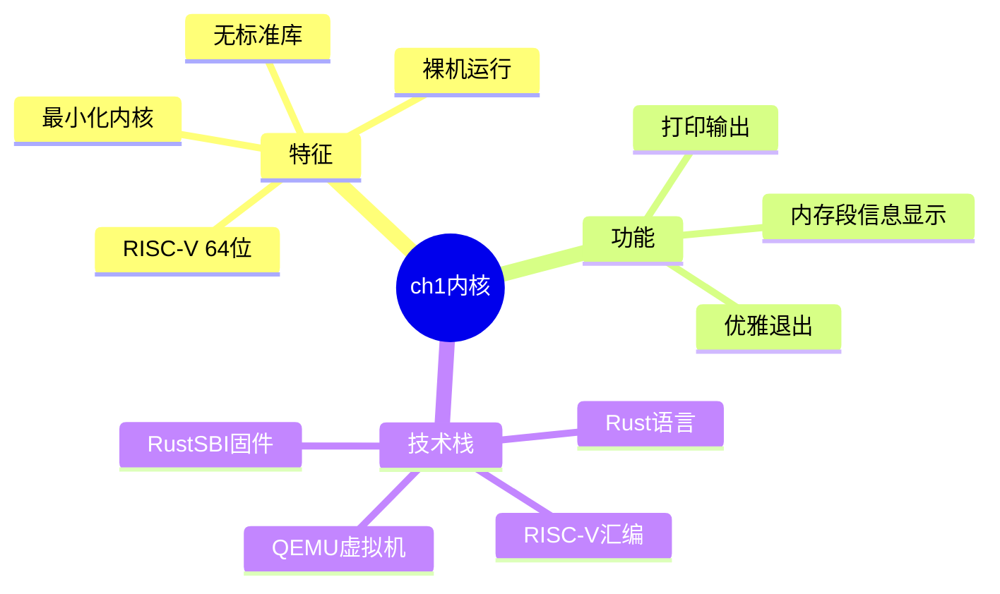

---

## 解决的需求

### 1. 学习需求

帮助学生理解：
- 应用程序与执行环境的关系
- 操作系统内核的启动过程
- 从用户态到内核态的转变
- 裸机编程的基本概念

### 2. 技术需求

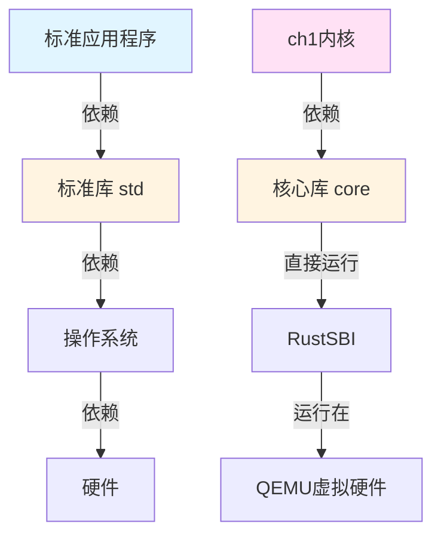

**主要解决的问题：**

1. **脱离标准库依赖**：标准库`std`需要操作系统支持，内核本身不能依赖它
2. **裸机执行环境**：在没有操作系统的情况下运行程序
3. **内存布局控制**：精确控制程序在内存中的位置和布局
4. **底层硬件交互**：直接与硬件和固件通信

### 3. 功能需求对比

| 特性 | 普通Rust程序 | ch1内核 |
|------|-------------|---------|
| 标准库支持 | ✅ std | ❌ 仅core |
| 运行环境 | 操作系统上 | 裸机直接运行 |
| 入口函数 | main() | rust_main() |
| 内存管理 | 自动 | 手动配置 |
| 输出方式 | println!宏 | SBI调用 |
| 退出方式 | 正常返回 | SBI关机 |

---

## 系统架构

### 整体架构图

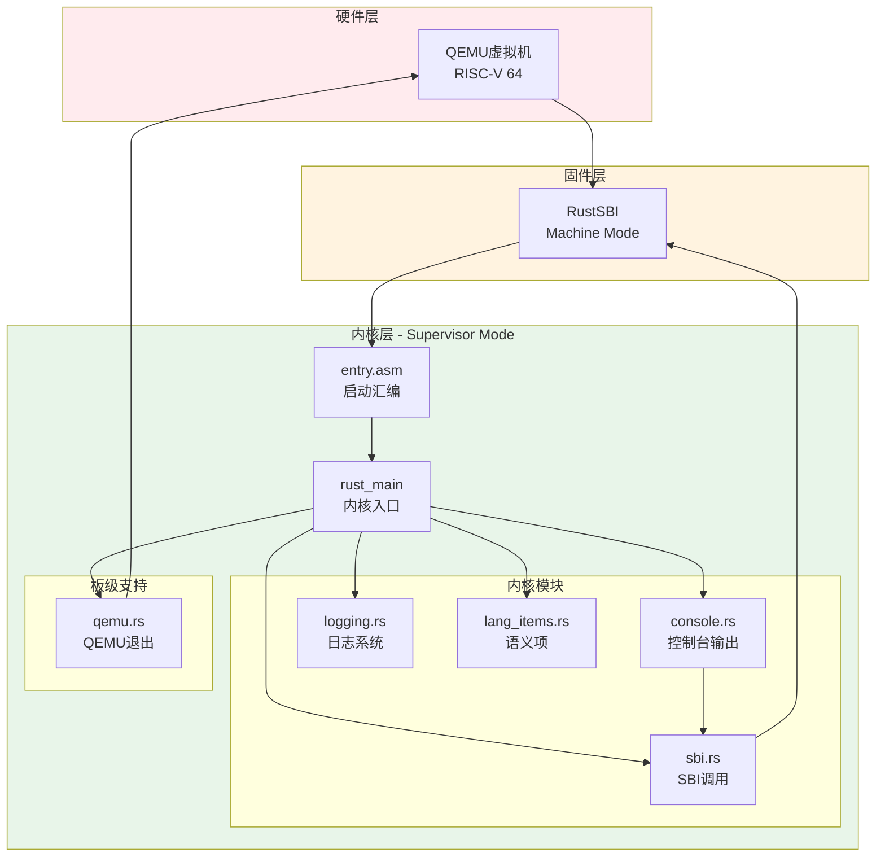

### 目录结构

```
rCore-Tutorial-Code/
├── bootloader/              # 固件目录
│   └── rustsbi-qemu.bin    # RustSBI二进制文件
├── os/                      # 内核源代码
│   ├── .cargo/             # Cargo配置
│   │   └── config          # 编译目标配置
│   ├── src/                # 源代码
│   │   ├── main.rs         # 内核主函数
│   │   ├── entry.asm       # 启动汇编代码
│   │   ├── linker.ld       # 链接脚本
│   │   ├── console.rs      # 控制台输出
│   │   ├── sbi.rs          # SBI调用封装
│   │   ├── logging.rs      # 日志功能
│   │   ├── lang_items.rs   # Rust语义项
│   │   └── boards/         # 板级支持包
│   │       └── qemu.rs     # QEMU退出实现
│   ├── Cargo.toml          # Rust项目配置
│   └── Makefile            # 构建脚本
└── rust-toolchain.toml     # Rust工具链版本
```

### 内存布局

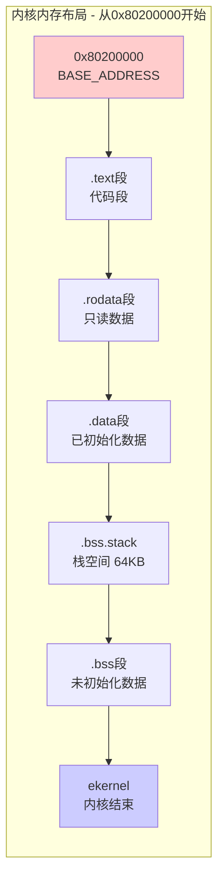

**各段说明：**
- **.text**: 存放可执行代码，从入口点`_start`开始
- **.rodata**: 存放只读常量数据
- **.data**: 存放已初始化的全局变量
- **.bss.stack**: 64KB的栈空间
- **.bss**: 存放未初始化的全局变量，需要在启动时清零

---

## 实现原理

### 1. 移除标准库依赖

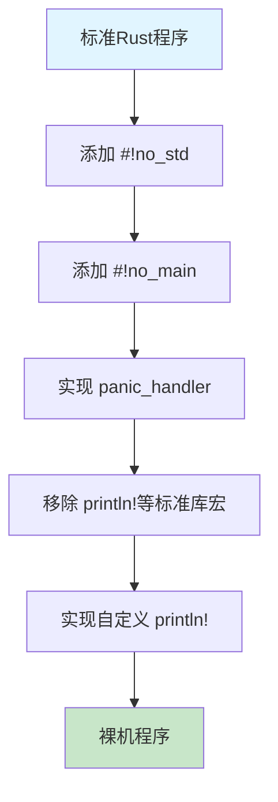

**关键步骤：**

1. **禁用标准库**: 使用`#![no_std]`告诉编译器不链接标准库
2. **禁用主函数**: 使用`#![no_main]`因为裸机程序没有标准入口
3. **实现panic处理**: 必须提供`#[panic_handler]`处理程序崩溃
4. **自定义入口**: 通过链接脚本指定`_start`为程序入口

### 2. 构建最小运行时

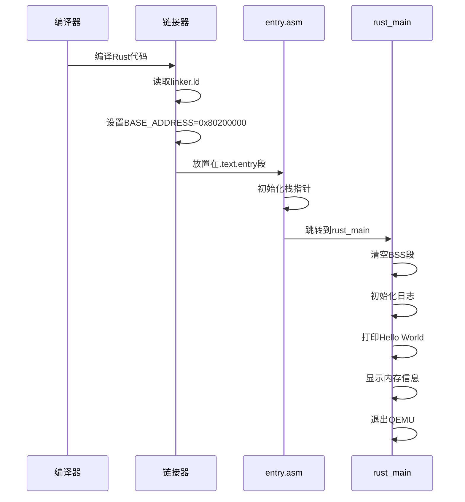

### 3. SBI调用机制

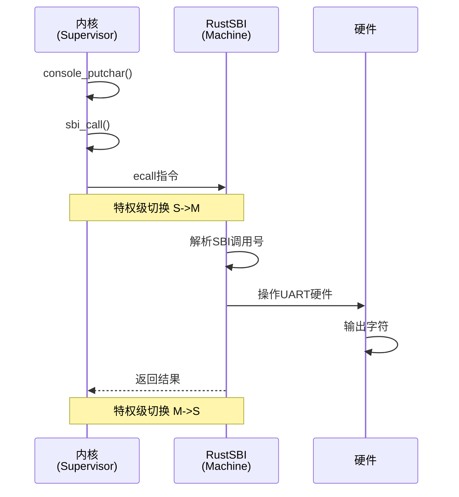

**SBI调用流程：**
1. 内核准备好参数（a0-a2）和调用号（a17）
2. 执行`ecall`指令触发特权级异常
3. RustSBI捕获异常并处理
4. RustSBI操作硬件完成功能
5. 返回结果给内核

---

## 编译与运行

### 编译流程

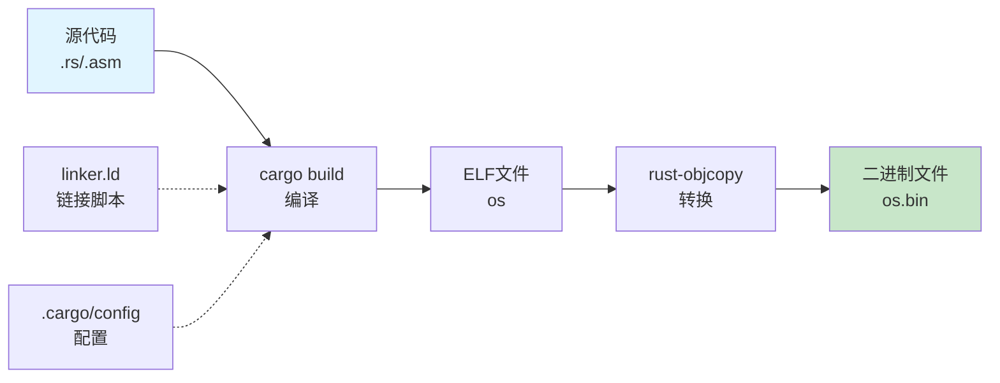

### 详细编译步骤

#### 1. 环境准备

```bash
# 安装Rust工具链
rustup target add riscv64gc-unknown-none-elf

# 安装二进制工具
cargo install cargo-binutils
rustup component add rust-src
rustup component add llvm-tools-preview
```

#### 2. 编译过程

```bash
cd os

# 方式1: 使用Makefile
make build          # 编译内核
make run           # 编译并运行

# 方式2: 手动编译
cargo build --release                                    # 编译为ELF
rust-objcopy --strip-all -O binary target/riscv64gc-unknown-none-elf/release/os target/riscv64gc-unknown-none-elf/release/os.bin  # 转换为二进制
```

#### 3. 运行内核

```bash
# 基本运行
make run

# 带日志级别运行
make run LOG=TRACE

# QEMU命令展开
qemu-system-riscv64 \
    -machine virt \                           # 使用virt虚拟机
    -nographic \                              # 无图形界面
    -bios ../bootloader/rustsbi-qemu.bin \   # 加载RustSBI
    -device loader,file=os.bin,addr=0x80200000  # 加载内核到指定地址
```

### Makefile关键目标

| 目标 | 功能 | 命令 |
|------|------|------|
| `build` | 编译内核 | `cargo build --release` |
| `run` | 编译并运行 | 编译+QEMU启动 |
| `debug` | 启动调试 | QEMU+GDB调试环境 |
| `disasm` | 反汇编 | `rust-objdump -d` |
| `clean` | 清理 | `cargo clean` |

---

## 执行流程

### 完整启动流程

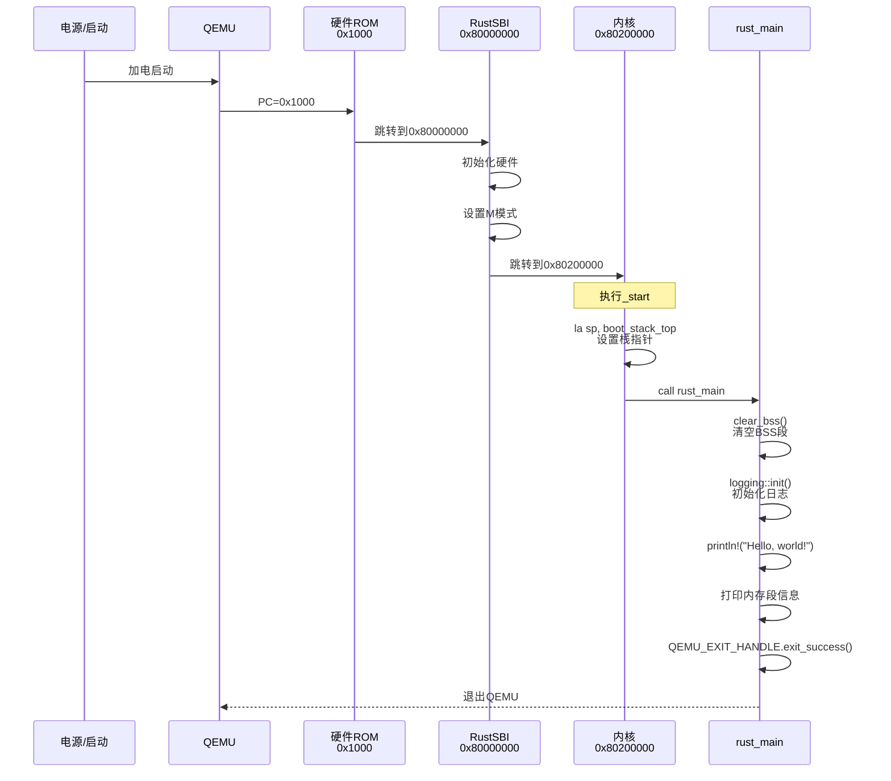

### 详细执行阶段

#### 阶段1: 硬件初始化（QEMU + RustSBI）

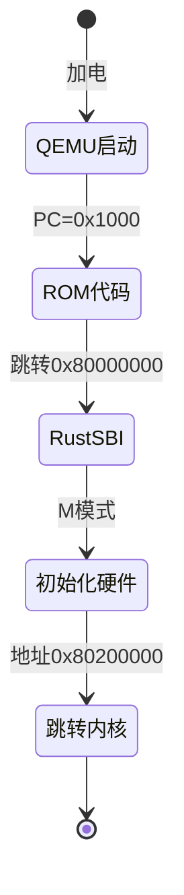

**关键地址：**
- `0x1000`: QEMU固化ROM代码起始地址
- `0x80000000`: RustSBI加载地址
- `0x80200000`: 内核加载地址（BASE_ADDRESS）

#### 阶段2: 内核启动（entry.asm）

```assembly
# os/src/entry.asm
.section .text.entry
.globl _start
_start:
    la sp, boot_stack_top      # 加载栈顶地址到sp寄存器
    call rust_main              # 调用Rust主函数

.section .bss.stack
.globl boot_stack_lower_bound
boot_stack_lower_bound:
    .space 4096 * 16           # 分配64KB栈空间
.globl boot_stack_top
boot_stack_top:                 # 栈顶标识
```

**作用：**
1. 设置栈指针，为后续Rust代码执行提供栈空间
2. 跳转到Rust编写的内核主函数

#### 阶段3: 内核初始化（rust_main）

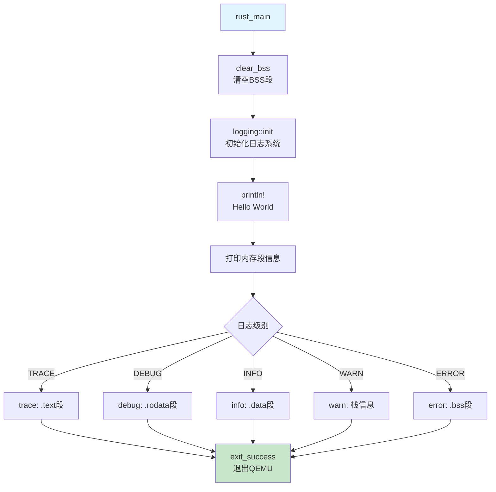

**代码流程：**

```rust
// os/src/main.rs
#[no_mangle]
pub fn rust_main() -> ! {
    // 1. 清空BSS段（未初始化数据段）
    clear_bss();
    
    // 2. 初始化日志系统
    logging::init();
    
    // 3. 打印欢迎信息
    println!("[kernel] Hello, world!");
    
    // 4. 打印各内存段信息（根据日志级别）
    trace!("[kernel] .text [{:#x}, {:#x})", stext, etext);
    debug!("[kernel] .rodata [{:#x}, {:#x})", srodata, erodata);
    info!("[kernel] .data [{:#x}, {:#x})", sdata, edata);
    warn!("[kernel] boot_stack top={:#x}, lower_bound={:#x}", ...);
    error!("[kernel] .bss [{:#x}, {:#x})", sbss, ebss);
    
    // 5. 退出QEMU
    crate::board::QEMU_EXIT_HANDLE.exit_success();
}
```

### 特权级转换

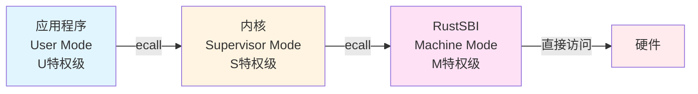

**特权级说明：**
- **User Mode (U)**: 最低特权级，运行应用程序
- **Supervisor Mode (S)**: 内核特权级，运行操作系统
- **Machine Mode (M)**: 最高特权级，运行RustSBI固件

---

## 核心组件详解

### 1. 链接脚本 (linker.ld)

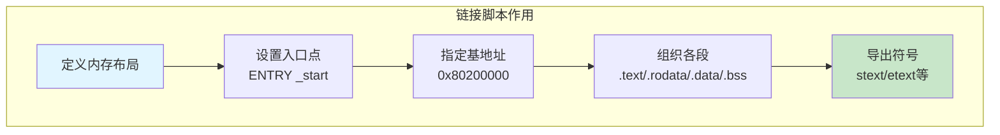

**关键内容解析：**

```ld
# os/src/linker.ld
OUTPUT_ARCH(riscv)              # 目标架构：RISC-V
ENTRY(_start)                   # 程序入口点
BASE_ADDRESS = 0x80200000;      # 内核起始物理地址

SECTIONS {
    . = BASE_ADDRESS;           # 当前位置设为基地址
    skernel = .;                # 内核起始标记
    
    # 代码段
    stext = .;
    .text : {
        *(.text.entry)          # 入口代码优先
        *(.text .text.*)
    }
    
    # 只读数据段
    . = ALIGN(4K);              # 4KB对齐
    etext = .;
    srodata = .;
    .rodata : { *(.rodata .rodata.*) }
    
    # 数据段
    . = ALIGN(4K);
    erodata = .;
    sdata = .;
    .data : { *(.data .data.*) }
    
    # BSS段（包括栈）
    . = ALIGN(4K);
    edata = .;
    .bss : {
        *(.bss.stack)           # 栈空间
        sbss = .;
        *(.bss .bss.*)
    }
    
    ebss = .;
    ekernel = .;                # 内核结束标记
}
```

### 2. SBI调用模块 (sbi.rs)


**核心实现：**

```rust
// os/src/sbi.rs
const SBI_CONSOLE_PUTCHAR: usize = 1;  // 控制台输出字符

#[inline(always)]
fn sbi_call(which: usize, arg0: usize, arg1: usize, arg2: usize) -> usize {
    let mut ret;
    unsafe {
        asm!(
            "li x16, 0",                    // 扩展ID设为0
            "ecall",                        // 执行SBI调用
            inlateout("x10") arg0 => ret,   // a0: 参数0/返回值
            in("x11") arg1,                 // a1: 参数1
            in("x12") arg2,                 // a2: 参数2
            in("x17") which,                // a17: SBI调用号
        );
    }
    ret
}

pub fn console_putchar(c: usize) {
    sbi_call(SBI_CONSOLE_PUTCHAR, c, 0, 0);
}
```

**SBI调用规范：**
- `a0-a2` (x10-x12): 传递参数
- `a17` (x17): SBI调用号
- `a0` (x10): 返回值

### 3. 控制台输出 (console.rs)

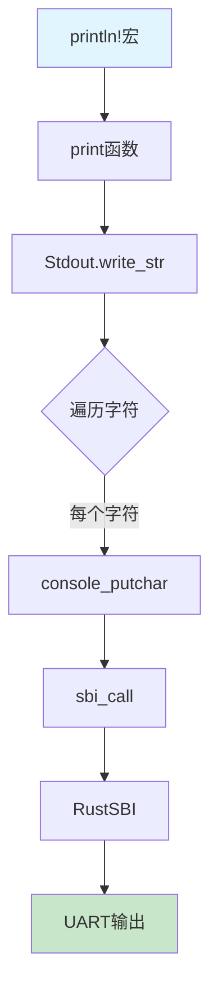

**实现原理：**

```rust
// os/src/console.rs
use core::fmt::{self, Write};

struct Stdout;

impl Write for Stdout {
    fn write_str(&mut self, s: &str) -> fmt::Result {
        for c in s.chars() {
            console_putchar(c as usize);  // 逐字符输出
        }
        Ok(())
    }
}

// println!宏定义
#[macro_export]
macro_rules! println {
    ($fmt: literal $(, $($arg: tt)+)?) => {
        $crate::console::print(format_args!(concat!($fmt, "\n") $(, $($arg)+)?))
    }
}
```

### 4. 日志系统 (logging.rs)

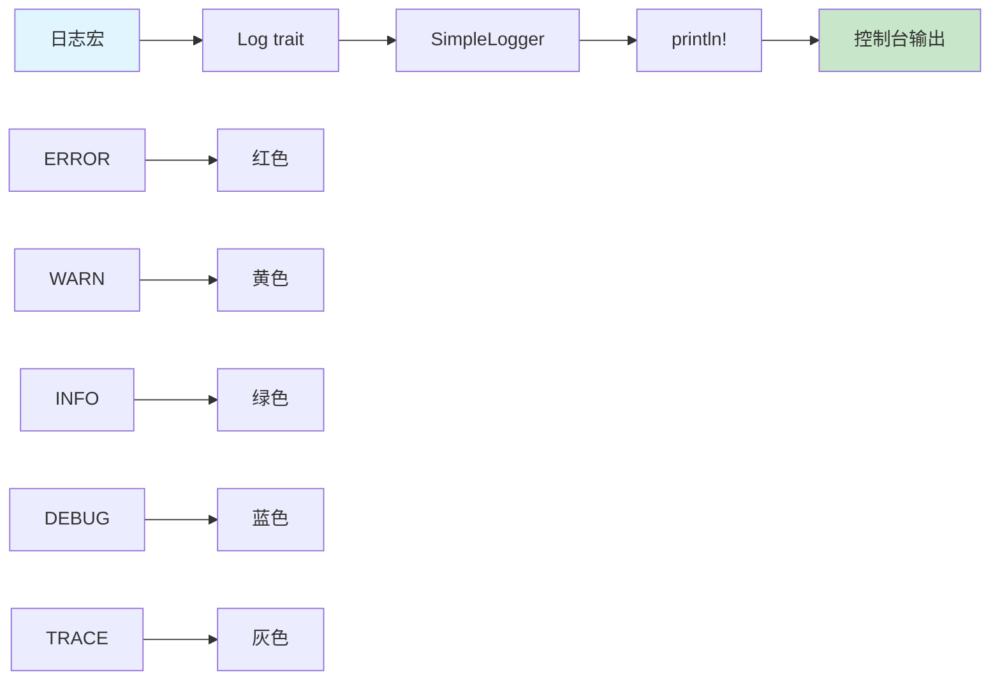

**日志级别：**
- **ERROR**: 严重错误（红色）
- **WARN**: 警告信息（黄色）
- **INFO**: 一般信息（绿色）
- **DEBUG**: 调试信息（蓝色）
- **TRACE**: 详细跟踪（灰色）

### 5. 语义项 (lang_items.rs)

```rust
// os/src/lang_items.rs
use core::panic::PanicInfo;

#[panic_handler]
fn panic(info: &PanicInfo) -> ! {
    if let Some(location) = info.location() {
        println!(
            "[kernel] Panicked at {}:{} {}",
            location.file(),
            location.line(),
            info.message().unwrap()
        );
    } else {
        println!("[kernel] Panicked: {}", info.message().unwrap());
    }
    shutdown()
}
```

**作用：** 为Rust编译器提供必要的语言特性实现，处理程序崩溃情况。

### 6. QEMU退出机制 (qemu.rs)

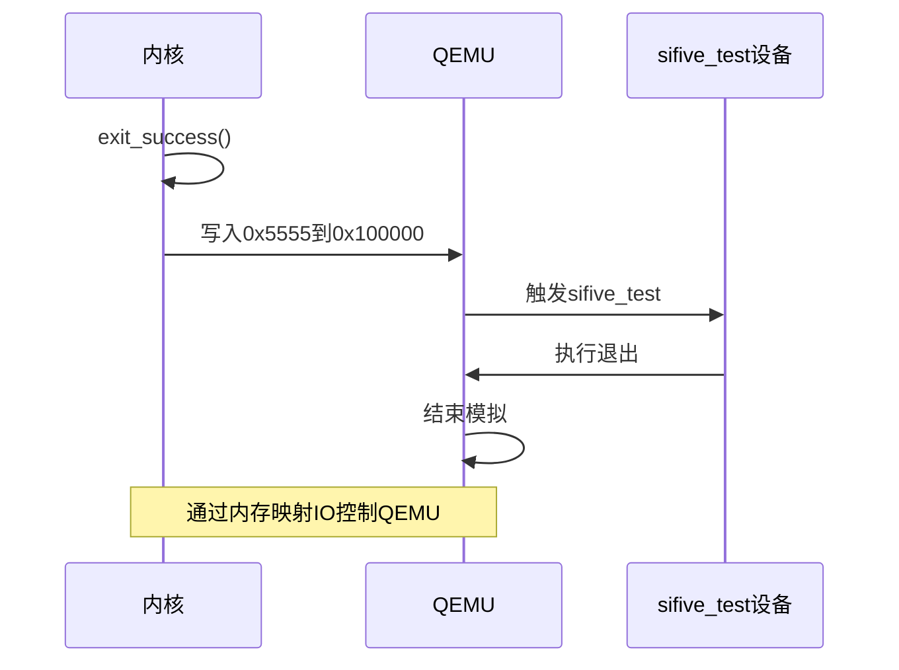

**实现细节：**

```rust
// os/src/boards/qemu.rs
const EXIT_SUCCESS: u32 = 0x5555;        // 成功退出码
const VIRT_TEST: u64 = 0x100000;         // sifive_test设备地址

impl QEMUExit for RISCV64 {
    fn exit(&self, code: u32) -> ! {
        unsafe {
            asm!(
                "sw {0}, 0({1})",        # 写入退出码
                in(reg)code, in(reg)self.addr
            );
            loop {
                asm!("wfi", options(nomem, nostack));  # 等待中断
            }
        }
    }
    
    fn exit_success(&self) -> ! {
        self.exit(EXIT_SUCCESS);
    }
}
```

---

## 学习要点

### 核心概念理解


### 关键知识点

#### 1. 目标三元组 (Target Triplet)

```
riscv64gc-unknown-none-elf
  │     │    │    │   └─ 可执行文件格式
  │     │    │    └────── 无标准运行时库
  │     │    └─────────── 操作系统类型（none表示裸机）
  │     └──────────────── 厂商（unknown）
  └────────────────────── CPU架构（RISC-V 64位）
```

#### 2. 裸机 vs 有OS环境

| 特性 | 有OS环境 | 裸机环境 |
|------|---------|---------|
| 入口点 | main() | 自定义(_start) |
| 标准库 | 可用std | 仅core |
| 输出 | 系统调用 | 直接硬件/SBI |
| 内存管理 | OS提供 | 手动管理 |
| 退出 | return | 特殊机制 |

#### 3. 内存段作用

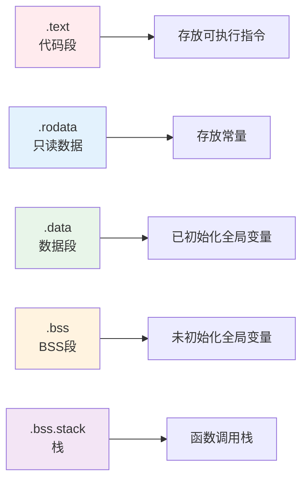

### 实验目标达成

通过ch1内核的学习，你应该能够：

✅ **理解**应用程序执行环境的层次结构  
✅ **掌握**脱离标准库编写裸机程序的方法  
✅ **熟悉**RISC-V特权级架构和SBI调用机制  
✅ **学会**使用链接脚本控制内存布局  
✅ **了解**内核启动的基本流程  
✅ **掌握**交叉编译和QEMU调试方法  

### 扩展思考

1. **为什么内核入口地址是0x80200000？**
   - RustSBI约定
   - 避免与固件冲突
   - 留出足够空间给SBI

2. **为什么需要清空BSS段？**
   - BSS段存放未初始化的全局变量
   - C/Rust标准要求未初始化变量为0
   - 硬件不保证内存初始状态

3. **SBI与系统调用的区别？**
   - SBI: 内核→固件（S→M特权级）
   - 系统调用: 应用→内核（U→S特权级）
   - 都使用ecall指令，但目标不同

### 调试技巧

```bash
# 1. 反汇编查看
make disasm

# 2. 查看ELF文件信息
rust-readobj -h target/riscv64gc-unknown-none-elf/release/os

# 3. GDB调试
make debug  # 启动调试环境

# 4. 不同日志级别
make run LOG=ERROR   # 只显示错误
make run LOG=INFO    # 显示信息及以上
make run LOG=TRACE   # 显示所有日志
```

---

## 总结

ch1内核虽然简单，但它完整展示了操作系统内核开发的基础知识体系：

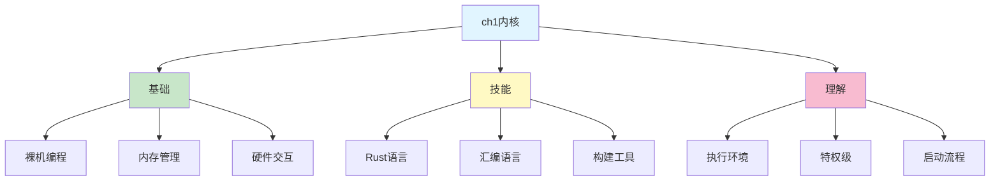

这为后续章节学习更复杂的内核功能（如内存管理、任务调度、文件系统等）打下了坚实的基础。

---

## 参考资料

- rCore-Tutorial Book: https://rcore-os.cn/rCore-Tutorial-Book-v3/
- RISC-V特权架构规范
- Rust嵌入式开发手册
- RustSBI文档

---

**文档版本**: v1.0  
**适用代码**: rCore-Tutorial-Code ch1分支  
**最后更新**: 2024年
