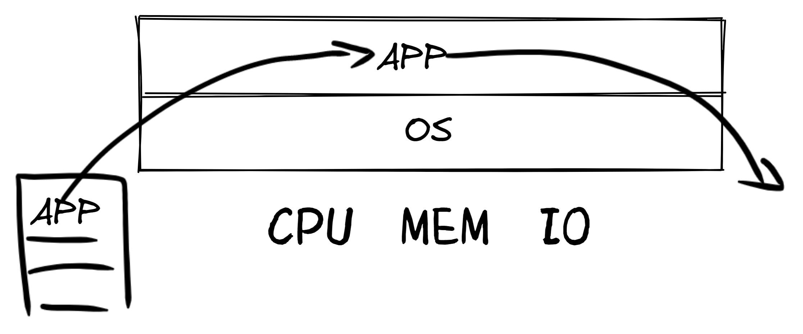
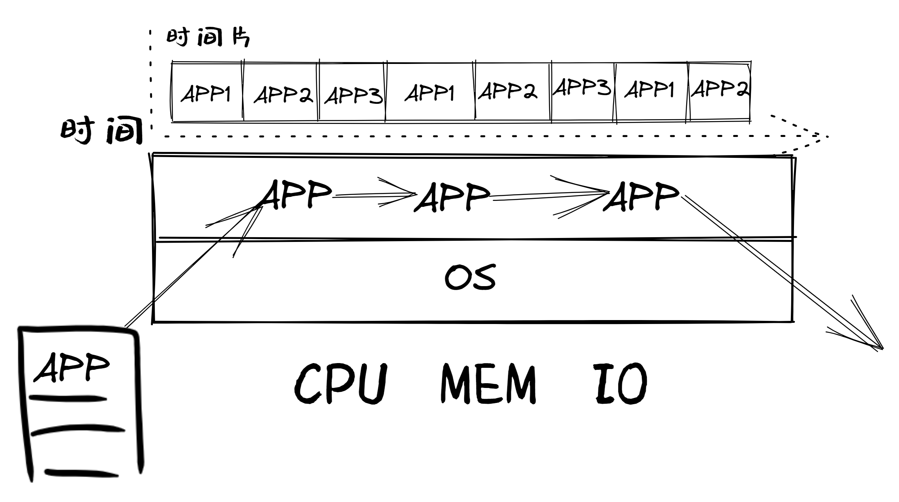
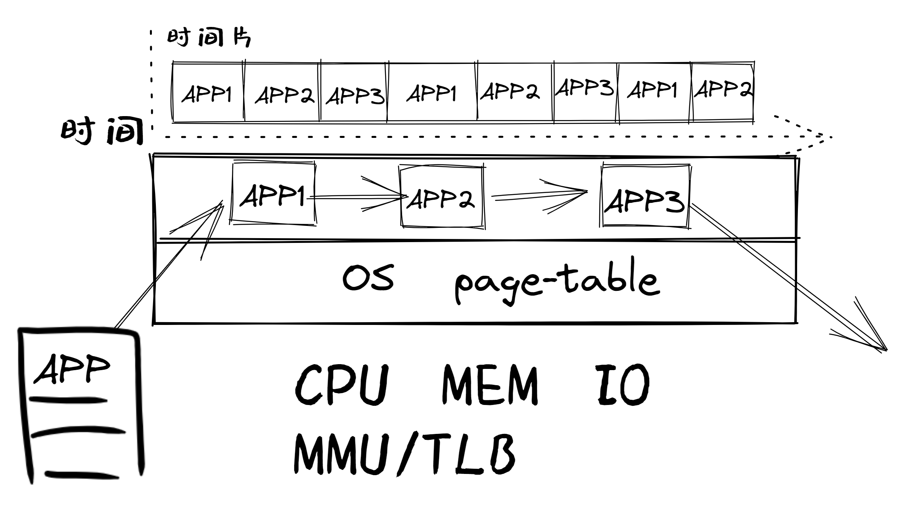
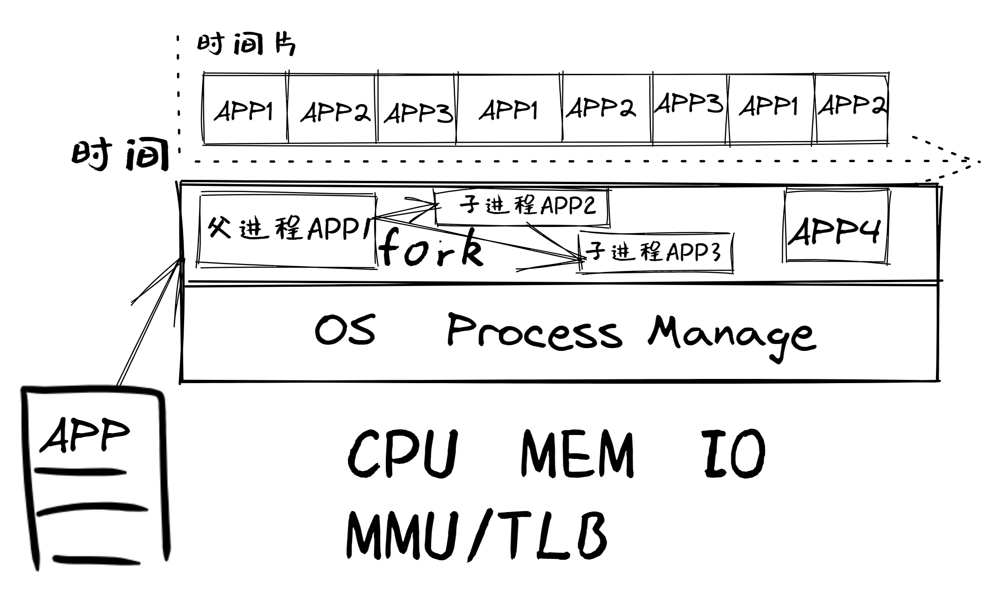
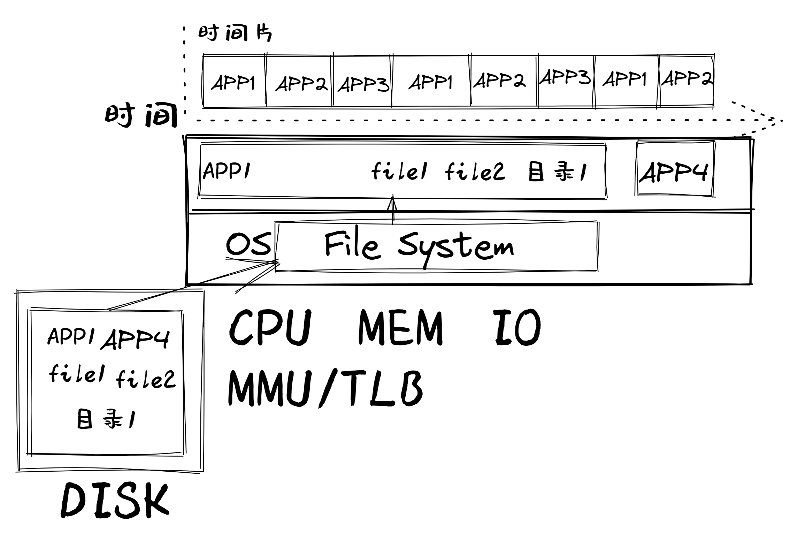
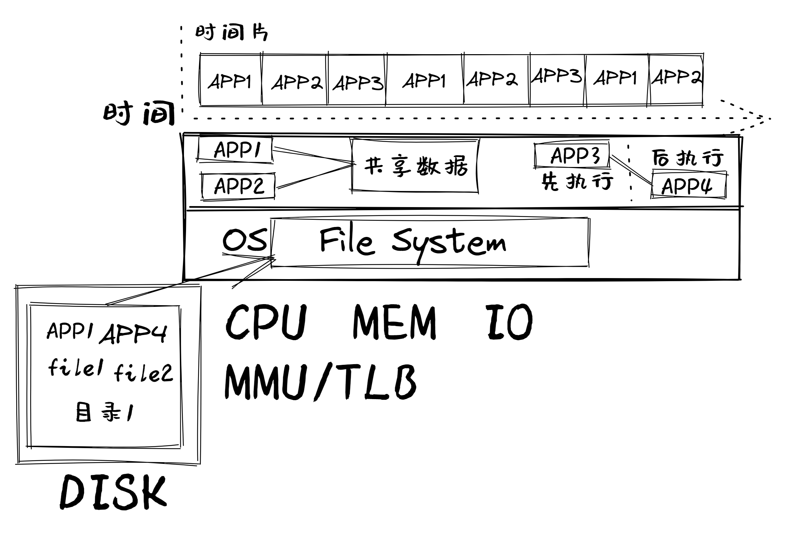
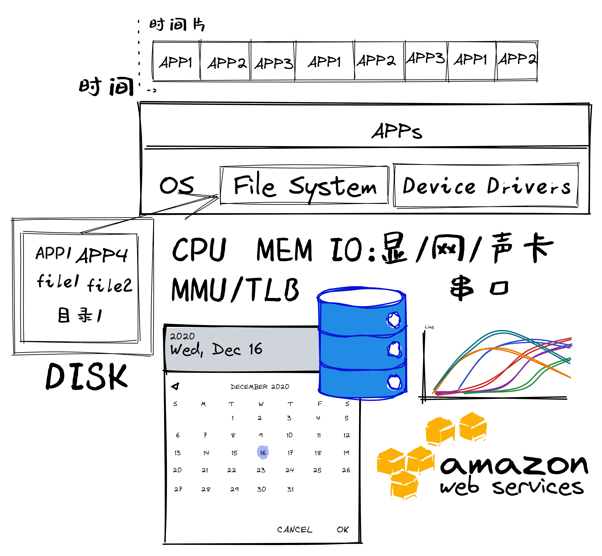

<!-- theme: gaia -->
<!-- _class: lead -->

## 第二讲 实践与实验介绍
### 第一节 实践与实验简要分析

 
 

向勇 陈渝 李国良 

 
 

2022年春季

---

## 原理、实践与实验介绍
### 满足应用逐渐增加的需求
### 逐步体现操作系统的关键点
* LibOS
* 批处理OS
* 多道程序与分时多任务OS

---

## 原理、实践与实验介绍
### 满足应用逐渐增加的需求
### 逐步体现操作系统的关键点

* 地址空间抽象的OS
* 进程抽象的OS
* 文件抽象的OS
---
## 原理、实践与实验介绍
### 满足应用逐渐增加的需求
### 逐步体现操作系统的关键点
* 可进程间通信的OS
* 可并发的OS
* 管理I/O设备的OS
---

## LibOS

- 远古操作系统雏形
- 现代简单嵌入式操作系统

### 相关知识点
- 函数调用: 编译器与操作系统的配合
- 硬件启动和软件启动
- 编写/调试裸机程序

裸机程序（Bare Metal Program ）：与操作系统无关的OS类型的程序

--- 

## 批处理OS
- 支持程序执行切换

### 相关知识点

- 特权级/特权操作
- RISC-V特权级/特权操作
- 系统调用/异常
- 加载&执行&切换应用程序
- 特权级切换

--- 
## 多道程序OS
- 支持多个程序驻留内存并依次执行
### 相关知识点
- 协作式调度
- 内存空间划分与管理

--- 
## 分时多任务OS
- 支持多个程序轮流执行

### 相关知识点
- 抢占式调度
- 中断处理
- 上下文切换

--- 
## 地址空间抽象的OS
- 支持程序间内存空间隔离

### 相关知识点
- 地址空间抽象
- 静态内存分配
- 动态内存分配
- 页式存储管理

--- 
## 地址空间抽象的OS
- 超越物理内存的虚拟存储
### 相关知识点
- 局部性原理
- 缺页异常
- 虚拟页式存储
- 置换算法

--- 
## 进程抽象的OS
- 支持动态创建程序执行
### 相关知识点
- 进程抽象
- 进程管理
- 调度机制
  

--- 
## 进程抽象的OS
- 支持多处理器/多核计算
### 相关知识点
- 多处理器/多核架构
- 多处理器调度
- 实际OS调度
  

--- 
## 文件抽象的OS
- 处理数据的便捷长期存储
### 相关知识点
- 文件抽象
- 文件组织结构
- 文件系统设计与实现

--- 
## 可进程间通信的OS
- 进程间可显式/隐式交互信息
### 相关知识点
- 信号 管道
- 消息队列 共享内存
- I/O重定向

--- 
## 可并发的OS
- 更方便共享资源
### 相关知识点
- 线程：用户/内核线程
- 协程的机制
- 协程、线程、进程的关系

--- 
## 可并发的OS
- 合理共享资源
- 同步与互斥
### 相关知识点
- 同步互斥的机制
- 同步互斥解决并发问题
- 死锁等问题

--- 
## 管理I/O设备的OS
- 支持各种外设
### 相关知识点
- 设备抽象
- 设备执行模型
- 同步/异步 I/O
- I/Os设备管理

---

## 实验一：操作系统的基本支持
### 覆盖内容
* LibOS、 批处理OS、 多道程序与分时多任务OS
### 知识点
- 计算机/OS启动、特权级切换、系统调用、应用程序/库/内核的关系、特权级相关异常、任务切换

---

## 实验二：地址空间
### 覆盖内容
* 地址空间抽象的OS
### 知识点
- 地址空间、应用与内核之间在不同地址空间的数据交互/控制交互、内存/地址相关异常（如缺页异常）

---

## 实验三：进程管理与调度
### 覆盖内容
* 进程抽象的OS
### 知识点
- 进程管理、调度算法

---

## 实验四：文件系统与进程间通信
### 覆盖内容
* 文件抽象的OS、可进程间通信的OS
### 知识点
- 文件系统实现、进程间通信机制

---
## 实验五：同步互斥
### 覆盖内容
* 可并发的OS
### 知识点
- 线程，同步互斥的机制，解决同步互斥问题，死锁问题，优先级反转问题

---
## 扩展实验（即大实验，课程设计）

7周内完成基础实验1~5后，与老师协商：选择完成扩展实验来代替考试

**早完成基础实验，可早开展扩展实验**

实现新feature（多核、新外设、新处理器、新功能）的支持

如支持游戏、树莓派/SiFive、网络、USB、AI等

参加全国大学生OS比赛