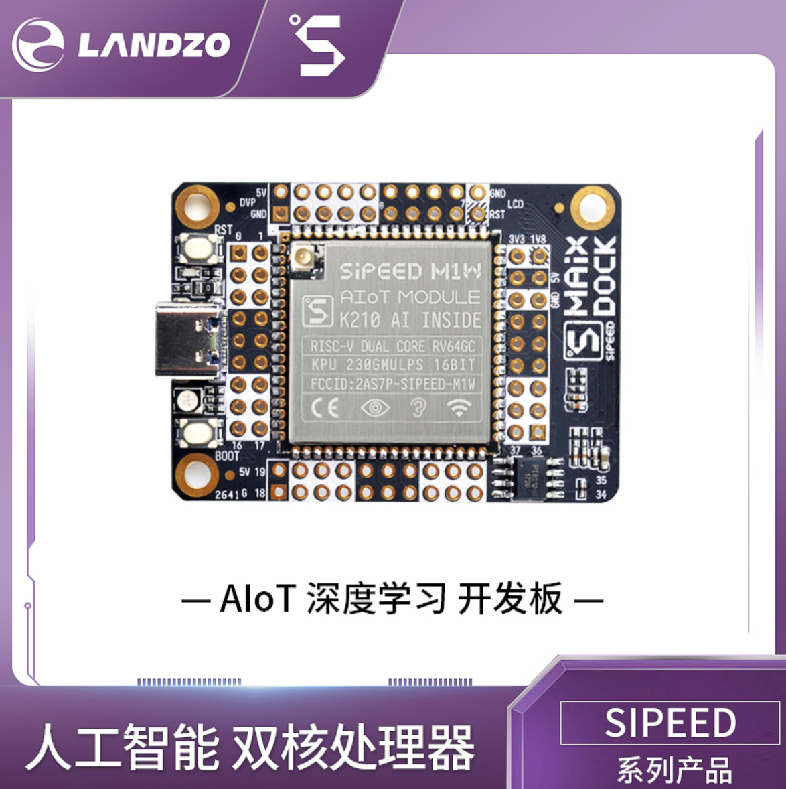
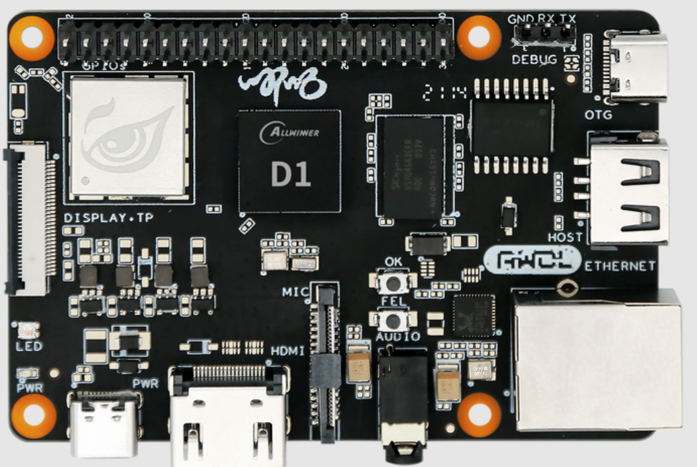
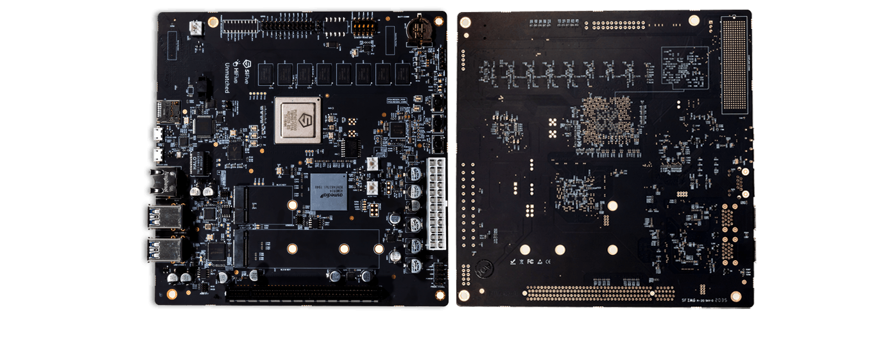

<!-- theme: gaia -->
<!-- _class: lead -->

# 第二讲 实践与实验介绍
## 第三节 硬件启动与软件启动

<br>
<br>

向勇 陈渝 李国良 

<br>
<br>

2022年秋季

---
提纲

### 1. RISC-V开发板
2. QEMU启动参数和流程
3. x86启动流程

---
#### K210开发板
- 基于RISC-V 64 多核处理器


---
#### 哪吒D1开发板
- 基于RISC-V 64 单核处理器


---
#### HiFive Unmatched 开发板（U740）
- 基于RISC-V 64 多核处理器


---
提纲

1. RISC-V开发板
### 2. QEMU启动参数和流程
3. x86启动流程

---

#### QEMU模拟器

使用软件 qemu-system-riscv64 来模拟一台 64 位 RISC-V 架构的计算机，它包含:
- 一个 CPU（可调整为多核）
- 一块物理内存
- 若干 I/O 外设

---
#### QEMU启动参数
```
qemu-system-riscv64 \
    -machine virt \
    -nographic \
    -bios ../bootloader/rustsbi-qemu.bin \
    -device loader,file=target/riscv64gc-unknown-none-elf/release/os.bin,addr=0x80200000
``` 
- machine virt 表示将模拟的 64 位 RISC-V 计算机设置为名为 virt 的虚拟计算机
- 物理内存的默认大小为 128MiB 

---
#### QEMU启动参数
```
qemu-system-riscv64 \
    -machine virt \
    -nographic \
    -bios ../bootloader/rustsbi-qemu.bin \
    -device loader,file=target/riscv64gc-unknown-none-elf/release/os.bin,addr=0x80200000
``` 
- nographic 表示模拟器不需要提供图形界面，而只需要对外输出字符流


---
#### QEMU启动参数
```
qemu-system-riscv64 \
    -machine virt \
    -nographic \
    -bios ../bootloader/rustsbi-qemu.bin \
    -device loader,file=target/riscv64gc-unknown-none-elf/release/os.bin,addr=0x80200000
``` 
- bios 可以设置 QEMU 模拟器开机时用来初始化的引导加载程序（bootloader）
- 这里使用预编译好的 rustsbi-qemu.bin

---
#### QEMU启动参数
```
qemu-system-riscv64 \
    -machine virt \
    -nographic \
    -bios ../bootloader/rustsbi-qemu.bin \
    -device loader,file=target/riscv64gc-unknown-none-elf/release/os.bin,addr=0x80200000
``` 
- device的loader 参数可以在 QEMU 模拟器开机之前将一个宿主机上的文件载入到 QEMU 的物理内存的指定位置中
- file 和 addr 参数分别可以设置待载入文件的路径以及将文件载入到的 QEMU 物理内存上的物理地址

---
#### QEMU启动流程

```
qemu-system-riscv64 \
    -machine virt \
    -nographic \
    -bios ../bootloader/rustsbi-qemu.bin \
    -device loader,file=target/riscv64gc-unknown-none-elf/release/os.bin,addr=0x80200000
``` 
一般来说，计算机加电之后的启动流程可以分成若干个阶段，每个阶段均由一层软件负责，每一层软件的功能是进行它应当承担的初始化工作，并在此之后跳转到下一层软件的入口地址，也就是将计算机的控制权移交给了下一层软件。

---
#### QEMU启动流程

```
qemu-system-riscv64 \
    -machine virt \
    -nographic \
    -bios ../bootloader/rustsbi-qemu.bin \
    -device loader,file=target/riscv64gc-unknown-none-elf/release/os.bin,addr=0x80200000
``` 
QEMU 模拟的启动流程则可以分为三个阶段：
1. 由固化在 [QEMU模拟的计算机内存](https://github.com/LearningOS/qemu/blob/386b2a5767f7642521cd07930c681ec8a6057e60/hw/riscv/virt.c#L59)中的[一小段汇编程序](https://github.com/LearningOS/qemu/blob/386b2a5767f7642521cd07930c681ec8a6057e60/hw/riscv/virt.c#L536)初始化并跳转执行bootloader；
2. 由 bootloader 负责，初始化并加载OS，跳转OS执行；
3. 由内核执行初始化工作。

---
提纲

1. RISC-V开发板
2. QEMU启动参数和流程
### 3. x86启动流程

---
#### 真实计算机(x86)的启动流程
实际上基于x86的PC的启动固件的引导流程从IBM PC机诞生第一天起，本质上就没有改变过。

1. Rom Stage：在这个阶段直接在ROM上运行BIOS代码；
2. Ram Stage：在这个阶段在RAM上运行代码，检测并初始化芯片组、主板等；
3. Bootloader Stage：在存储设备上找到Bootloader，加载执行Bootloader；
4. OS Stage：Bootloader初始化外设，在存储设备上找到OS，加载执行OS。