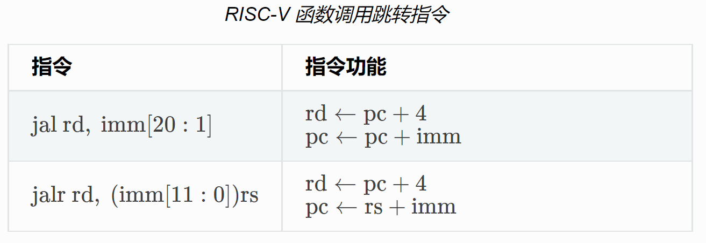
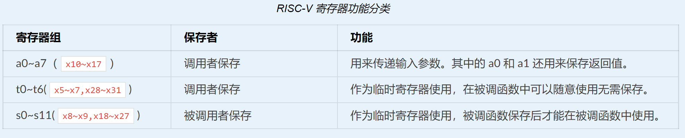

<!-- theme: gaia -->
<!-- _class: lead -->

# 第二讲 实践与实验介绍
## 第四节 实践：裸机程序 -- LibOS

<br>
<br>

向勇 陈渝 李国良 

<br>
<br>

2022年秋季

---
提纲

### 1. 实验目标和思路
2. 实验要求
3. 实践步骤
4. 代码结构
5. 内存布局
6. 基于 GDB 验证启动流程
7. 函数调用
8. LibOS初始化
9. SBI调用

---

#### LibOS的实验目标

裸机程序（Bare Metal Program ）：与操作系统无关的OS类型的程序

- 建立应用程序的执行环境
  - 让应用与硬件隔离
  - 简化应用访问硬件的难度和复杂性
- **执行环境(Execution Environment)**：负责给在其上执行的软件提供相应的功能与资源的多层次**软硬件系统** 
 


---
#### LibOS历史背景
1949-1951 年，英国 J. Lyons and Co. 公司（连锁餐厅和食品制造集团公司）开创性地引入并使用剑桥大学的 EDSAC 计算机，联合设计实现了 LEO I ‘Lyons Electronic Office’ 软硬件系统


---
#### LibOS历史背景 -- 子程序

- 参与 EDSAC 项目的 David Wheeler 发明了**子程序**的概念 – Wheeler Jump 
- 在有了便捷有效的子程序概念和子程序调用机制后，软件开发人员在EDSAC和后续的LEO计算机上开发了大量的系统**子程序库**，形成了最早的操作系统原型。


---

#### LibOS总体思路
- 编译：通过设置编译器支持编译裸机程序
- 构造：建立裸机程序的栈和SBI服务请求接口
- 运行：OS的起始地址和执行环境初始化


---
提纲

1. 实验目标和思路
### 2. 实验要求
3. 实践步骤
4. 代码结构
5. 内存布局
6. 基于 GDB 验证启动流程
7. 函数调用
8. LibOS初始化
9. SBI调用

---
#### 理解LibOS的执行过程
- 会编写/编译/运行裸机程序
- 懂基于裸机程序的函数调用
- 能看懂汇编代码伪代码
- 能看懂内嵌汇编代码
- 初步理解SBI调用

---
#### 掌握基本概念
- **会写三叶虫操作系统了！**
  - ABI是啥？
  - SBI是啥？ 
  - Supervisor Binary Interface？ 


注：三叶虫Trilobita是寒武纪最有代表性的远古动物

---
#### 分析执行细节

- **在机器级层面理解函数**
  - 寄存器（registers）
  - 函数调用/返回(call/return)
  - 函数进入/离开(enter/exit)
  - 函数序言/收尾(prologue/epilogue)


---

#### OS不总是软件的最底层
  - 天外有天
  - Why？


---
提纲

1. 实验目标和思路
2. 实验要求
### 3. 实践步骤
4. 代码结构
5. 内存布局
6. 基于 GDB 验证启动流程
7. 函数调用
8. LibOS初始化
9. SBI调用

---

#### 实践步骤
- 建好开发与实验环境
- 移出标准库依赖
- 支持函数调用
- 基于SBI服务完成输出与关机

**理解运行程序的内存空间和栈**


---

#### 操作步骤
```
git clone https://github.com/rcore-os/rCore-Tutorial-v3.git
cd rCore-Tutorial-v3
git checkout ch1

cd os
make run
```

---

#### 执行结果
```
[RustSBI output]
Hello, world!
.text [0x80200000, 0x80202000)
.rodata [0x80202000, 0x80203000)
.data [0x80203000, 0x80203000)
boot_stack [0x80203000, 0x80213000)
.bss [0x80213000, 0x80213000)
Panicked at src/main.rs:46 Shutdown machine!
```

除了显示 Hello, world! 之外还有一些额外的信息，最后关机。

---
提纲

1. 实验目标和思路
2. 实验要求
3. 实践步骤
### 4. 代码结构
5. 内存布局
6. 基于 GDB 验证启动流程
7. 函数调用
8. LibOS初始化
9. SBI调用


---
#### LibOS代码结构
```
./os/src
Rust        4 Files   119 Lines
Assembly    1 Files    11 Lines

├── bootloader(内核依赖的运行在 M 特权级的 SBI 实现，本项目中我们使用 RustSBI)
│   ├── rustsbi-k210.bin(可运行在 k210 真实硬件平台上的预编译二进制版本)
│   └── rustsbi-qemu.bin(可运行在 qemu 虚拟机上的预编译二进制版本)
```

---
#### LibOS代码结构
```
├── os(我们的内核实现放在 os 目录下)
│   ├── Cargo.toml(内核实现的一些配置文件)
│   ├── Makefile
│   └── src(所有内核的源代码放在 os/src 目录下)
│       ├── console.rs(将打印字符的 SBI 接口进一步封装实现更加强大的格式化输出)
│       ├── entry.asm(设置内核执行环境的的一段汇编代码)
│       ├── lang_items.rs(需要我们提供给 Rust 编译器的一些语义项，目前包含内核 panic 时的处理逻辑)
│       ├── linker-qemu.ld(控制内核内存布局的链接脚本以使内核运行在 qemu 虚拟机上)
│       ├── main.rs(内核主函数)
│       └── sbi.rs(调用底层 SBI 实现提供的 SBI 接口)
```


<!-- https://blog.51cto.com/onebig/2551726
(深入理解计算机系统) bss段，data段、text段、堆(heap)和栈(stack) -->


---
提纲

1. 实验目标和思路
2. 实验要求
3. 实践步骤
4. 代码结构
### 5. 内存布局
6. 基于 GDB 验证启动流程
7. 函数调用
8. LibOS初始化
9. SBI调用

---
#### App/OS内存布局


---
#### bss段

- bss段（bss segment）通常是指用来存放程序中**未初始化的全局变量**的一块内存区域
- bss是英文Block Started by Symbol的简称
- bss段属于**静态内存分配**


---
#### data段

- 数据段（data segment）通常是指用来存放程序中**已初始化的全局变量**的一块内存区域
- 数据段属于**静态内存分配**


---
#### text段

- 代码段（code segment/text segment）是指存放**执行代码**的内存区域
- 这部分区域的大小确定，通常属于**只读**
- 在代码段中，也有可能包含一些**只读的常数变量**


---
#### 堆（heap）

- 堆是用于**动态分配**的内存段，可动态扩张或缩减
- 程序调用**malloc**等函数新分配的内存被动态添加到堆上
- 调用**free**等函数释放的内存从堆中被剔除


---
#### 栈(stack)

- 栈又称堆栈，是用户存放程序临时创建的**局部变量**
- 函数被调用时，其**参数**和函数的**返回值**也会放到栈中
- 由于栈的**先进后出**特点，所以栈特别方便用来保存/恢复当前执行状态


---
#### 栈(stack)

可以把堆栈看成一个**寄存和交换临时数据**的内存区

OS编程与应用编程的一个显著区别是，OS编程需要理解**栈上的物理内存结构**和**机器级内容**。


---

#### 链接时的内存布局定制
```
# os/src/linker-qemu.ld
OUTPUT_ARCH(riscv)
ENTRY(_start)
BASE_ADDRESS = 0x80200000;

SECTIONS
{
    . = BASE_ADDRESS;
    skernel = .;

    stext = .;
    .text : {
      *(.text.entry)
```


---
#### 链接时的内存布局定制
```
    .bss : {
        *(.bss.stack)
        sbss = .;
        *(.bss .bss.*)
        *(.sbss .sbss.*)
```

BSS：Block Started by Symbol
SBSS：small bss，近数据


---

#### 生成内核二进制镜像


---

#### 生成内核二进制镜像

```
rust-objcopy --strip-all \
target/riscv64gc-unknown-none-elf/release/os \
-O binary target/riscv64gc-unknown-none-elf/release/os.bin
```

---
提纲

1. 实验目标和思路
2. 实验要求
3. 实践步骤
4. 代码结构
5. 内存布局
### 6. 基于 GDB 验证启动流程
7. 函数调用
8. LibOS初始化
9. SBI调用

---

#### 基于 GDB 验证启动流程
```
qemu-system-riscv64 \
    -machine virt \
    -nographic \
    -bios ../bootloader/rustsbi-qemu.bin \
    -device loader,file=target/riscv64gc-unknown-none-elf/release/os.bin,addr=0x80200000 \
    -s -S
```

```
riscv64-unknown-elf-gdb \
    -ex 'file target/riscv64gc-unknown-none-elf/release/os' \
    -ex 'set arch riscv:rv64' \
    -ex 'target remote localhost:1234'
[GDB output]
0x0000000000001000 in ?? ()
```


---
提纲

1. 实验目标和思路
2. 实验要求
3. 实践步骤
4. 代码结构
5. 内存布局
6. 基于 GDB 验证启动流程
### 7. 函数调用
8. LibOS初始化
9. SBI调用

---
#### 编译原理对函数调用的支持

* 编译原理课 -- [实现函数调用编译支持](https://decaf-lang.github.io/minidecaf-tutorial/docs/step9/example.html)
* [快速入门RISC-V汇编的文档](https://github.com/riscv-non-isa/riscv-asm-manual/blob/master/riscv-asm.md)


---
#### call/return伪指令

伪指令            | 基本指令    | 含义   | 
:----------------|:-----------|:----------|
ret      | jalr x0, x1, 0       | 函数返回
call offset   | auipc x6, offset[31:12]; jalr x1, x6, offset[11:0]     | 函数调用

auipc(add upper immediate to pc)被用来构建 PC 相对的地址，使用的是 U 型立即数。 auipc 以低 12 位补 0，高 20 位是 U 型立即数的方式形成 32 位偏移量，然后和 PC 相加，最后把结果保存在寄存器 x1。

---

#### 函数调用跳转指令


伪指令 ret 翻译为 jalr x0, 0(x1)，含义为跳转到寄存器 ra(即x1)保存的地址。
*[快速入门RISC-V汇编的文档](https://github.com/riscv-non-isa/riscv-asm-manual/blob/master/riscv-asm.md)*


---
#### call/return伪指令
伪指令            | 基本指令    | 含义   | 
:----------------|:-----------|:----------|
ret      | jalr x0, x1, 0       | 函数返回
call offset   | auipc x6, offset[31:12]; jalr x1, x6, offset[11:0]     | 函数调用

函数调用核心机制
- 在函数调用时，通过 call 伪指令保存返回地址并实现跳转；
- 在函数返回时，通过 ret 伪指令回到跳转之前的下一条指令继续执行


---
#### 函数调用约定

函数调用约定 (Calling Convention) 约定在某个指令集架构上，某种编程语言的函数调用如何实现。它包括了以下内容：

- 函数的输入参数和返回值如何传递；
- 函数调用上下文中调用者/被调用者保存寄存器的划分；
- 其他的在函数调用流程中对于寄存器的使用方法。

---

#### RISC-V函数调用约定：调用参数和返回值传递

- RISC-V32:如果返回值64bit，则用a0~a1来放置
- RISC-V64:如果返回值64bit，则用a0来放置


---

#### RISC-V函数调用约定：栈帧


---
#### RISC-V函数调用约定：栈帧

**栈帧（Stack Frames）**
```
return address *
previous fp
saved registers
local variables
…
return address fp register
previous fp (pointed to *)
saved registers
local variables
… sp register
```


---

#### RISC-V函数调用约定：栈帧
- 堆栈帧可能有不同的大小和内容,但总体结构是类似的
- 每个堆栈帧始于这个函数的**返回值**和**前一个函数的fp值**
- sp 寄存器总是指向当前堆栈框架的**底部**
- fp 寄存器总是指向当前堆栈框架的**顶部** 


---

#### RISC-V函数调用约定：ret指令
- 当 ret 指令执行,下面的伪代码实现调整堆栈指针和PC:
```
pc = return address
sp = fp + ENTRY_SIZE
fp = previous fp
```


---

#### RISC-V函数调用约定：函数结构
函数结构组成：``prologue``,``body part`` 和``epilogue``
```
.global sum_then_double
sum_then_double:
	addi sp, sp, -16		# prologue
	sd ra, 0(sp)			
	
	call sum_to                     # body part 
	li t0, 2
	mul a0, a0, t0
	
	ld ra, 0(sp)			# epilogue
	addi sp, sp, 16
	ret
```

---
#### RISC-V函数调用约定：函数结构

函数结构组成：``prologue``,``body part`` 和``epilogue``
```
.global sum_then_double
sum_then_double:		
	
	call sum_to                     # body part 
	li t0, 2
	mul a0, a0, t0
	
	ret
```
Q:上述代码的执行与前一页的代码执行相比有何不同？

<!-- https://blog.csdn.net/zoomdy/article/details/79354502 RISC-V Assembly Programmer's Manual 
https://shakti.org.in/docs/risc-v-asm-manual.pdf 
https://github.com/riscv-non-isa/riscv-asm-manual/blob/master/riscv-asm.md
-->


---
提纲

1. 实验目标和思路
2. 实验要求
3. 实践步骤
4. 代码结构
5. 内存布局
6. 基于 GDB 验证启动流程
7. 函数调用
### 8. LibOS初始化
9. SBI调用

---

#### 分配并使用启动栈

分配并使用启动栈  *[快速入门RISC-V汇编的文档](https://github.com/riscv-non-isa/riscv-asm-manual/blob/master/riscv-asm.md)*
```
# os/src/entry.asm
    .section .text.entry
    .globl _start
_start:
    la sp, boot_stack_top
    call rust_main

    .section .bss.stack
    .globl boot_stack
boot_stack:
    .space 4096 * 16
    .globl boot_stack_top
boot_stack_top:
```

---
#### 分配并使用启动栈
```
# os/src/linker-qemu.ld
.bss : {
    *(.bss.stack)
    sbss = .;
    *(.bss .bss.*)
    *(.sbss .sbss.*)
}
ebss = .;
```
在链接脚本 linker.ld 中 .bss.stack 段最终会被汇集到 .bss 段中
.bss 段一般放置需要被初始化为零的数据


---
#### 控制权转交：ASM --> Rust/C

将控制权转交给 Rust 代码，该入口点在 main.rs 中的``rust_main``函数
```rust
// os/src/main.rs  
pub fn rust_main() -> ! {
    loop {}
}
```
- ``fn`` 关键字：函数； ``pub`` 关键字：对外可见，公共的
- ``loop`` 关键字：循环  


---
#### 清空bss段

清空bss段(未初始化数据段)
```Rust
pub fn rust_main() -> ! {
    clear_bss(); //调用清空bss的函数clear_bss()
}
fn clear_bss() {
    extern "C" {
        fn sbss(); //bss段的起始地址
        fn ebss(); //bss段的结束地址
    }
    //对[sbss..ebss]这段内存空间清零
    (sbss as usize..ebss as usize).for_each(|a| {
        unsafe { (a as *mut u8).write_volatile(0) }
    });
}
```


---
提纲

1. 实验目标和思路
2. 实验要求
3. 实践步骤
4. 代码结构
5. 内存布局
6. 基于 GDB 验证启动流程
7. 函数调用
8. LibOS初始化
### 9. SBI调用

---

#### SBI服务接口
在屏幕上打印 Hello world! 
* SBI服务接口
    - Supervisor Binary Interface
    - 更底层的软件给操作系统提供的服务
* RustSBI
    - 实现基本的SBI服务
    - 遵循SBI调用约定

---

#### SBI服务编号
```rust
// os/src/sbi.rs
const SBI_SET_TIMER: usize = 0;
const SBI_CONSOLE_PUTCHAR: usize = 1;
const SBI_CONSOLE_GETCHAR: usize = 2;
const SBI_CLEAR_IPI: usize = 3;
const SBI_SEND_IPI: usize = 4;
const SBI_REMOTE_FENCE_I: usize = 5;
const SBI_REMOTE_SFENCE_VMA: usize = 6;
const SBI_REMOTE_SFENCE_VMA_ASID: usize = 7;
const SBI_SHUTDOWN: usize = 8;
```
- ``usize`` 机器字大小的无符号整型
---
#### 汇编级SBI调用

```rust
// os/src/sbi.rs
#[inline(always)] //总是把函数展开
fn sbi_call(which: usize, arg0: usize, arg1: usize, arg2: usize) -> usize {
    let mut ret; //可修改的变量ret
    unsafe {
        asm!(//内嵌汇编
            "ecall", //切换到更高特权级的机器指令
            inlateout("x10") arg0 => ret, //SBI参数0&返回值
            in("x11") arg1,  //SBI参数1
            in("x12") arg2,  //SBI参数2
            in("x17") which, //SBI编号
        );
    }
    ret //返回ret值
}
```
---
#### SBI调用：输出字符

在屏幕上输出一个字符
```rust
// os/src/sbi.rs
pub fn console_putchar(c: usize) {
    sbi_call(SBI_CONSOLE_PUTCHAR, c, 0, 0);
}
```
实现格式化输出
- 编写基于 console_putchar 的 println! 宏

---
#### SBI调用：关机
```rust
// os/src/sbi.rs
pub fn shutdown() -> ! {
    sbi_call(SBI_SHUTDOWN, 0, 0, 0);
    panic!("It should shutdown!");
}
```
- ``panic!``和``println!``是一个宏（类似C的宏），``!``是宏的标志
---
#### 优雅地处理错误panic
```rust
#[panic_handler]
fn panic(info: &PanicInfo) -> ! { //PnaicInfo是结构类型
    if let Some(location) = info.location() { //出错位置存在否？
        println!(
            "Panicked at {}:{} {}",
            location.file(), //出错的文件名
            location.line(), //出错的文件中的行数
            info.message().unwrap() //出错信息
        );
    } else {
        println!("Panicked: {}", info.message().unwrap());
    }
    shutdown() //关机
}
```

---
#### LibOS完整功能
优雅地处理错误panic
```rust
pub fn rust_main() -> ! {
    clear_bss();
    println!("Hello, world!");
    panic!("Shutdown machine!");
}
```
运行结果
```
[RustSBI output]
Hello, world!
Panicked at src/main.rs:26 Shutdown machine!
```

---
### 小结
- 构造各种OS的实践中需要掌握的知识点（原理&实现）
- 理解Compiler/OS/Machine的相互关联关系
- 知道从机器启动到应用程序打印出字符串的过程
- 能写Trilobita OS