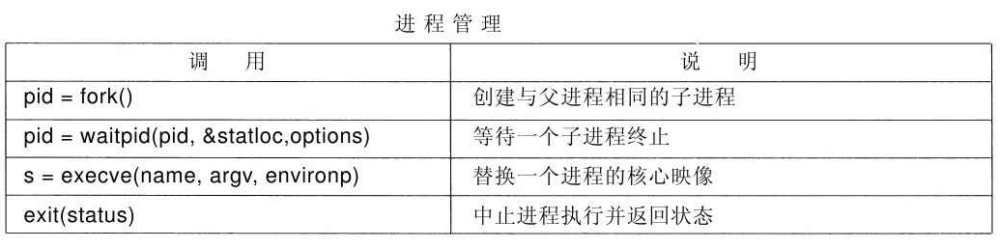
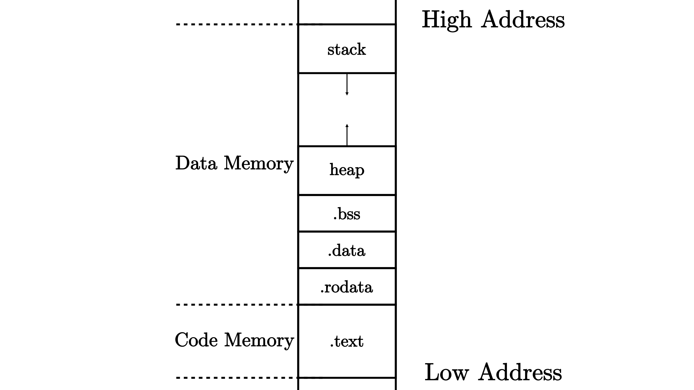
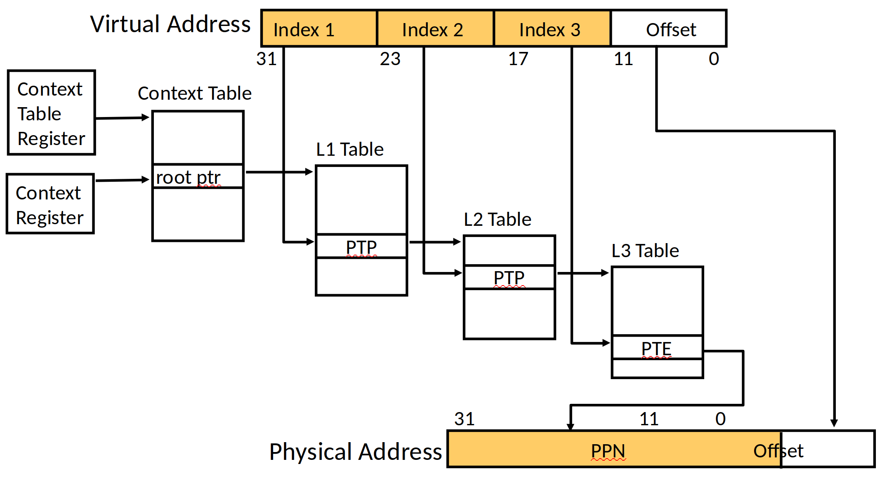

<!-- theme: gaia -->
<!-- _class: lead -->

## 第三讲 基于特权级的隔离与批处理
### 第一节 从 OS 角度看计算机系统
 
 

向勇 陈渝 李国良 

 
 

2022年春季

---
## 第一节 从 OS 角度看计算机系统
操作系统位于硬件（HW）和应用（APP）之间
只有理解OS与HW/APP的关系，才能更好掌握OS
- OS与硬件的关系
- OS与应用程序的关系
- 隔离（isolation）机制
  - 为什么隔离
  - 什么是隔离
  - 隔离的方法 

---
## OS与硬件的关系
- 计算机系统
- 计算机系统抽象层次
- 软硬件接口
- 虚拟与抽象
- u/rCore与RISC-V
---
## OS与硬件的关系
**硬件** 支持 **OS** 支持 **应用**
#### 计算机系统

 广义的定义, 计算机系统（computer architecture）是一种抽象层次的设计，用于实现可有效使用现有制造技术的信息处理应用。
 -- cs-152 berkeley

---
## OS与硬件的关系
**硬件** 支持 **OS** 支持 **应用**
#### 计算机系统抽象层次

 广义的定义, 计算机系统（computer architecture）是一种抽象层次的设计，用于实现可有效使用现有制造技术的信息处理应用。
 -- cs-152 berkeley 

---
## OS与硬件的关系 -- 软硬件接口
**硬件** 与 **OS** 的 **边界** ：指令集+寄存器

---
## OS与硬件的关系 -- 虚拟与抽象
 **OS** 对 **硬件** 的**虚拟**与**抽象**

---
## OS与硬件的关系 -- u/rCore与RISC-V
 

---
## OS与硬件的关系 -- u/rCore与RISC-V

---
## OS与应用程序的关系
- 提供服务
- 系统调用
- memory layout
---
## OS与应用程序的关系 -- 提供服务
通过**系统调用**来提供服务 
 OS/APP的接口（边界之一）：**系统调用**

---
## OS与应用程序的关系 -- 系统调用
- 程序调用 ssize_t read(int fd, void *buf, size_t count); 会发生什么？
- 我们可以在应用程序中直接调用内核的函数吗？
- 我们可以在内核中使用应用程序普通的函数调用吗？

---
## OS与应用程序的关系 -- 系统调用

- 程序调用 ssize_t read(int fd, void *buf, size_t count); 会发生什么？
- 我们可以在应用程序中直接调用内核的函数吗？
- 我们可以在内核中使用应用程序普通的函数调用吗？
- 函数调用的特征
  - 好处：执行很快；
  - 好处：灵活-易于传递和返回复杂数据类型；
  - 好处：程序员熟悉的机制,...
  - 坏处：应用程序不可靠，可能有恶意，有崩溃的风险

<!--
---
 ## OS与应用程序的关系 -- syscall

---
## OS与应用程序的关系 -- syscall

 -->

---
## OS与应用程序的关系 -- memory layout 
 OS/APP的边界之二：**memory layout**
 

---
## OS与应用程序的关系 -- memory layout
OS/APP的边界之二：**memory layout** 

---
## 隔离机制

  - 为什么隔离
  - 什么是隔离
  - 隔离的方法 

---
## 隔离机制 -- 为什么隔离？

隔离要解决哪些问题？
- 防止程序 X 破坏或监视程序 Y
  - 读/写内存，使用 100％的 CPU，更改文件描述符
- 防止进程干扰操作系统
- 防止恶意程序、病毒、木马和 bug
  - 错误的过程可能会试图欺骗硬件或内核
    - 
---
## 隔离机制 -- 什么是隔离？
- 隔离的定义
  - 操作系统中的应用程序不会影响（或破坏）其他应用或操作系统的正常执行或信息泄露
- 隔离的本质是在需要交换信息或共享资源的情况下才出现
- 隔离并不意味着不要共享

---
## 隔离机制 -- 什么是隔离？
隔离需要建立边界（boundary）
- 边界决定了各自的势力范围，跨界即共享资源有**风险**
- 强制隔离以避免有问题的单元对整个系统的安全影响
- 运行的程序通常是隔离的单元

<!-- https://blog.csdn.net/ceshi986745/article/details/51787424
猿学~程序员必知的六种隔离技术 -->

---
## 隔离机制 -- 主要的隔离方法

- 隔离的方法分类
  - 基于软件的隔离
  - 基于硬件的隔离
  - 基于网络的隔离  
---
## 隔离机制 -- 主要的隔离方法
**OS隔离APP的分类**
* 对控制的隔离：特权级机制
  * 用户态 vs 内核态 
* 对数据的隔离：地址空间
  * 用户地址空间 vs 内核地址空间
* 对时间的隔离：中断处理
  * 随时打断正在执行的用户态App 
* 对破坏隔离的处理：异常处理
  * OS在内核态及时处理用户态App的异常行为

---
## 隔离机制 -- 主要的隔离方法 -- 虚拟内存

- 虚拟内存
  - 读写内存的安全性问题
  - 进程间的安全问题
  - 内存空间利用率的问题
  - 内存读写的效率问题
- 地址空间 address spaces
  - 一个程序仅寻址其自己的内存
  - 每个程序若无许可，则无法访问不属于自己的内存

---
## 隔离机制 -- 主要的隔离方法 -- 虚拟内存
 

<!-- ---
---
## 隔离机制 -- 主要的隔离方法 -- 虚拟内存
 

## 隔离机制 -- 主要的隔离方法 -- 虚拟内存
 

---
## 隔离机制 -- 主要的隔离方法 -- 虚拟内存
 

---
##  隔离机制 -- 主要的隔离方法 -- 虚拟内存
  -->

---
##  隔离机制 -- 主要的隔离方法 -- 特权模式
- CPU 硬件中的特权模式
  - 防止应用程序访问设备和敏感的 CPU 寄存器
    - 地址空间配置寄存器
    - 关机相关的指令或寄存器
    - ......

---
##  隔离机制 -- 主要的隔离方法 -- 特权模式

- CPU 硬件支持不同的特权模式
  - Kernel Mode（内核态） vs User Mode（用户态）
  - Kernel Mode 可以执行 User Mode 无法执行的特权操作
    - 访问外设
    - 配置地址空间（虚拟内存）
    - 读/写特殊系统级寄存器
- OS kernel 运行在 Kernel Mode
- 应用程序运行在 User Mode
- 每个重要的微处理器都有类似的用户/内核模式标志

---
## 隔离机制 -- 主要的隔离方法 -- 中断/异常机制
- CPU 硬件支持中断/异常的处理
- 及时响应和处理应用的异常行为
- 打断一直占用 CPU 的应用程序
- 中断是异步发生，是来自处理器外部的 I/O 设备的信号的结果。
  - 硬件中断不是由任何一条专门的 CPU 指令造成，从这个意义上它是异步的。

---
##  隔离机制 -- 主要的隔离方法 -- 中断/异常机制

- 硬件中断/异常的处理程序通常称为中断处理程序（interrupt handle）
  - I/O 设备通过向处理器芯片的一个引脚发信号，并将异常号放到系统总线上，以触发中断；
  - 在当前指令执行完后，处理器从系统总线读取异常号，保存现场，切换到 Kernel Mode；
  - 调用中断处理程序，当中断处理程序完成后，它将控制返回给下一条本来要执行的指令。

---
##  隔离机制 -- 主要的隔离方法 -- 中断/异常机制
- Timer 可以稳定定时地产生中断
  - 防止应用程序死占着 CPU 不放
  - 让 OS kernel 能周期性地进行资源管理

---
## 小结

- 了解计算机硬件与操作系统的关系：接口/边界
- 了解操作系统与应用程序的关系：接口/边界
- 了解操作系统如何隔离与限制应用程序