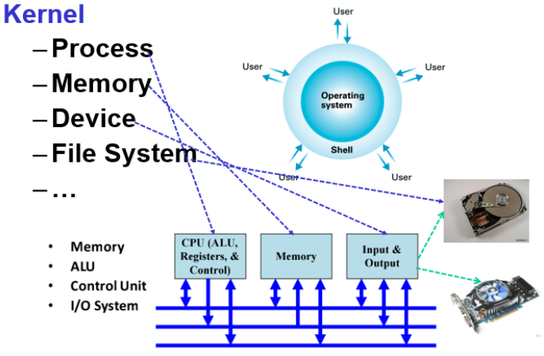
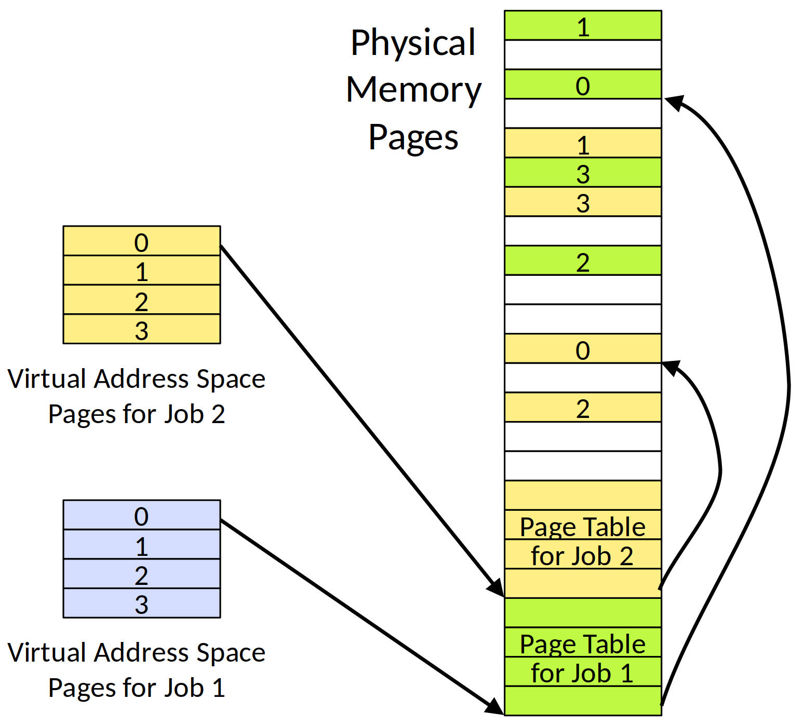
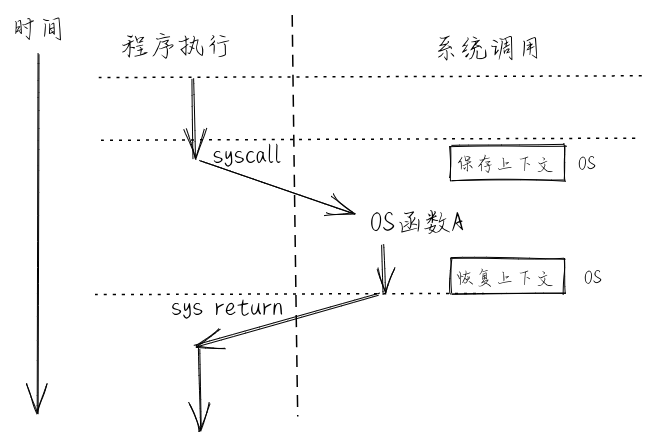

<!-- theme: gaia -->
<!-- _class: lead -->

# 第三讲 基于特权级的隔离与批处理
## 第一节 从OS角度看计算机系统

 
 

向勇 陈渝 李国良 任炬 

 
 

2025年秋季

[课程幻灯片列表](https://www.yuque.com/xyong-9fuoz/qczol5/glemuu?)

---
**提纲**

### 1. OS与硬件的关系
2. OS与应用程序的关系
3. 隔离机制

---

#### 计算机系统

计算机系统（computer architecture）是一种**抽象层次**的**设计**，用于实现可有效使用**现有制造技术**的**信息处理**应用。
-- cs-152 berkeley 
 
---
#### 计算机系统抽象层次

**硬件** 支持 **OS** 支持 **应用**

* 操作系统位于硬件（HW）和应用（APP）之间
* 只有理解OS与HW/APP的关系，才能更好掌握OS

---
#### 指令集：软硬件接口
**硬件** 与 **OS** 的 **边界** ：指令集+寄存器

<!--
Great Ideas in Computer Architecture (Machine Structures)
[CS61C](https://cs61c.org/fa24/) at UC Berkeley with Dan Garcia, Peyrin Kao - Fall 2024
-->
---
#### OS是对硬件的虚拟与抽象

---
#### RISC-V处理器架构
 

---
u/rCore的框架结构

---
**提纲**

1. OS与硬件的关系
### 2. OS与应用程序的关系
3. 隔离机制

---
#### OS对应用程序执行的支持
- 提供服务
  - 系统调用
  - 地址空间布局
---
#### OS为应用程序提供服务
* 通过**系统调用**来提供服务 
* **系统调用**：OS/APP的接口（边界之一）

---
#### 系统调用如何实现？
- 调用`ssize_t read(int fd, void *buf, size_t count);`会发生什么？
- 可以在应用程序中直接调用内核的函数吗？
- 可以在内核中使用应用程序普通的函数调用吗？

---
#### 引入系统调用的目的是增强安全性和可靠性

- 函数调用的特征
  - 好处：执行很快；
  - 好处：灵活-易于传递和返回复杂数据类型；
  - 好处：程序员熟悉的机制,...
  - 坏处：应用程序不可靠，可能有恶意，有崩溃的风险

<!--
---
 ## OS与应用程序的关系 -- syscall

---
## OS与应用程序的关系 -- syscall

 -->

---
#### 进程的地址空间
进程的地址空间（memory layout）是界定了OS/APP的**边界**。
 

---
#### OS内核与应用进程的地址空间划分

进程的地址空间（memory layout）是界定了OS/APP的**边界**。

#### 内核页表隔离(KPTI, kernel page-table isolation)

---
**提纲**

1. OS与硬件的关系
2. OS与应用程序的关系
### 3. 隔离机制
* 隔离要解决的问题
* 隔离的概念
* 隔离的方法 

---
#### 隔离要解决的问题
- 防止程序 X 破坏或监视程序 Y
  - 读/写内存，使用 100％的 CPU，更改文件描述符
- 防止进程干扰操作系统
- 防止恶意程序、病毒、木马和 bug
  - 错误的过程可能会试图欺骗硬件或内核

---
#### 什么是隔离？
- 隔离（Isolation） 的**定义**
  - 指操作系统通过软硬件机制确保不同的进程、用户或虚拟机相互独立运行，避免彼此之间在执行、数据或资源使用上的干扰或未经授权的访问。
- 隔离的**本质**
  - 不同实体间具备交换或共享信息、资源的情况下，如何确保彼此之间的安全和独立运行。
- 隔离并不意味着不要共享

---
#### 隔离边界
隔离需要建立边界（boundary）
- 边界决定了各自的势力范围
  - 跨界即有**风险**的共享资源
- 强制隔离
  - 避免有问题的单元对整个系统的安全影响
- 隔离的单位
  - 通常是运行的程序

<!-- https://blog.csdn.net/ceshi986745/article/details/51787424
猿学~程序员必知的六种隔离技术 -->

---
#### 隔离方法

- 隔离的方法分类
  - 基于**软件**的隔离
  - 基于**硬件**的隔离
  - 基于**网络**的隔离  

---

| **属性** | **描述** |
| --- | --- |
| 地址空间隔离（Address Space Isolation） | 进程只能访问自己的内存空间，不能直接访问其他进程的地址空间。如使用虚拟内存实现隔离。 |
| 文件系统隔离（File System Isolation） | 进程或容器只能访问自己的文件系统，不能访问其他进程的文件。例如，Linux 的 chroot 机制或容器的 OverlayFS。 |
| 用户身份隔离(User Isolation)| 通过用户权限控制（如 UNIX 的 UID/GID）确保不同用户之间的资源访问受到限制。 |
| 进程隔离（Process Isolation）| 进程之间通过进程表和内存管理保持独立，防止数据泄露和未授权访问。 |

---

| **属性** | **描述** |
| --- | --- |
| 网络隔离（Network Isolation）| 通过防火墙、虚拟局域网（VLAN）或网络命名空间（Linux Namespace）限制不同进程、容器或 VM 之间的网络访问。 |
| 计算资源隔离（Compute Resource Isolation） | 通过 CPU 亲和性（CPU Affinity）、cgroups（Control Groups）等技术限制进程或容器的 CPU、内存、磁盘 I/O 使用。 |
| 时间隔离（Temporal Isolation） | 在实时系统或云计算环境中，确保任务获得预期的 CPU 时间片，避免一个任务长期占用 CPU 而影响其他任务。 |

---

#### OS隔离APP的分类
* 对**数据**的隔离：**地址空间**
  * 用户地址空间 vs 内核地址空间
* 对**控制**的隔离：**特权级机制**
  * 用户态 vs 内核态 
* 对**时间**的隔离：**中断处理**
  * 随时打断正在执行的用户态App 
* 对破坏隔离的处理：**异常处理**
  * OS在内核态及时处理用户态App的异常行为

---

#### 数据隔离：**地址空间** 

- 地址空间 address spaces
  - 一个程序仅寻址其自己的内存
  - 若无许可，则**每个程序无法访问不属于自己的内存**
- 虚拟内存
  - 读写内存的安全性问题
  - 进程间的安全问题
  - 内存空间利用率的问题
  - 内存读写的效率问题

---
#### 虚拟内存的工作原理
 

<!-- ---
---
## 隔离机制 -- 主要的隔离方法 -- 虚拟内存
 

## 隔离机制 -- 主要的隔离方法 -- 虚拟内存
 

---
## 隔离机制 -- 主要的隔离方法 -- 虚拟内存
 

---
##  隔离机制 -- 主要的隔离方法 -- 虚拟内存
  -->

---
#### 控制隔离：特权模式
特权模式是 CPU 提供的一种机制，它将 CPU 的执行权限划分为不同的级别，防止低权限代码访问或修改高权限的系统资源。
- CPU 硬件中的特权模式
  - 保护操作系统内核，防止应用直接访问关键数据或执行特权指令
  - 防止应用恶意或错误访问硬件状态：控制寄存器、内存管理单元
  - 提供受控的系统调用接口：应用可受限制地请求操作系统服务

---
#### 特权模式

- CPU 硬件支持不同的特权模式
  - Kernel Mode（内核态） vs User Mode（用户态）
  - 内核态可以执行用户态无法执行的特权操作
    - 访问**外设**
    - **配置**地址空间（虚拟内存）
    - 读/写特殊**系统级寄存器**
- OS内核运行在内核态
- 应用程序运行在用户态
- 每个微处理器都有类似的用户/内核模式标志

---
#### 时间隔离：中断  --v.s.--  控制隔离：异常机制、陷入机制
- CPU **硬件支持**中断/异常的处理
  - 异常(Exception）：  CPU 执行指令时检测到错误（如除零错误、缺页异常），立即触发异常处理例程。
  - 中断(Interrupt）： 是一种用于处理外部或内部事件的机制。当中断发生时，CPU 暂停当前执行的指令流，转而执行相应的中断处理例程。
  - 陷入(Trap）： 也称系统调用(Syscall)，进程主动请求操作系统服务，需要从用户模式切换到内核模式。

---
#### 时间隔离：中断  --v.s.--  控制隔离：异常机制、陷入机制
- 中断是**异步**发生，由外部设备或异步事件触发，而非程序主动调用，这使得它们与当前指令流无直接关系。。
- 陷入是**同步**触发的，因为它是程序主动发起的。
- 异常是**同步**发生，是由由程序指令直接触发的错误或异常情况。
#### 时钟中断
- Timer 可以稳定定时地产生中断
  - 防止应用程序死占着 CPU 不放
  - 让OS内核能周期性地进行资源管理

---
#### 中断处理例程

- 中断处理例程（interrupt handle）：硬件中断/异常的处理程序
  1. I/O 设备通过向处理器芯片的一个引脚发信号，并将异常号放到系统总线上，以触发中断；
  2. 在当前指令执行完后，处理器从系统总线读取异常号，保存现场，切换到**内核态**；
  3. 调用中断处理例程，当中断处理程序完成后，它将控制返回给下一条本来要执行的指令。

---
#### 中断处理例程
- 触发中断
- 保存现场，切换到内核态运行
- 返回，恢复中断前下一条指令

<!---
#### 异常处理例程
-->

---
#### 异常处理例程
- 根据异常编号去查询处理程序
- 保存现场
- 异常处理：杀死产生异常的程序；或者 重新执行异常指令
- 恢复现场

<!---
#### 系统调用处理例程
-->

---
#### 陷入/系统调用处理例程
- 查找系统调用程序
- 用户态切换到内核态
- 栈切换，上下文保存
- 执行内核态
- 返回用户态

---
#### 中断 vs 异常 vs 陷入/系统调用

||中断|异常|陷入/系统调用|
|----|----|---|---|
|发起者|外设、定时器|应用程序|应用程序
|响应方式|异步|同步|同步
|触发机制|被动触发|内部异常、故障|自愿请求|
|处理机制|持续，用户透明|杀死或重新执行|等待和持续|

---
#### 进程切换 vs 函数切换
 

---
### 小结

- 了解计算机硬件与操作系统的关系：接口/边界
- 了解操作系统与应用程序的关系：接口/边界
- 了解操作系统如何隔离与限制应用程序