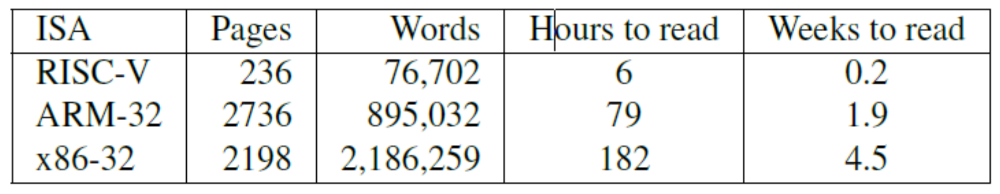
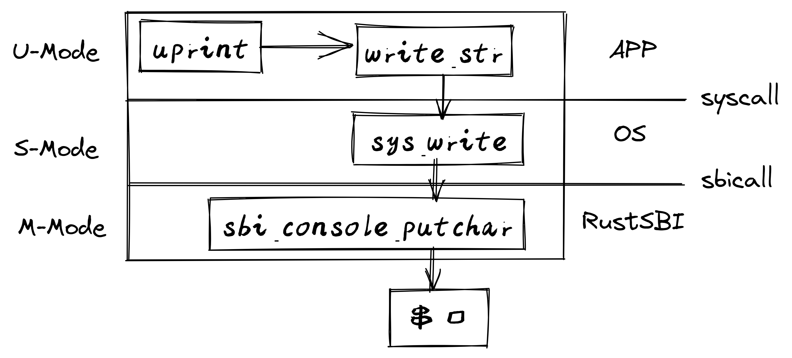
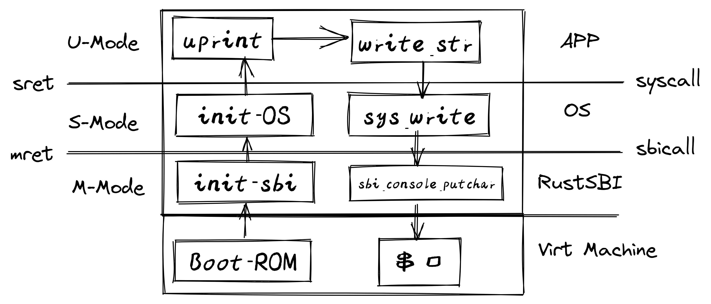
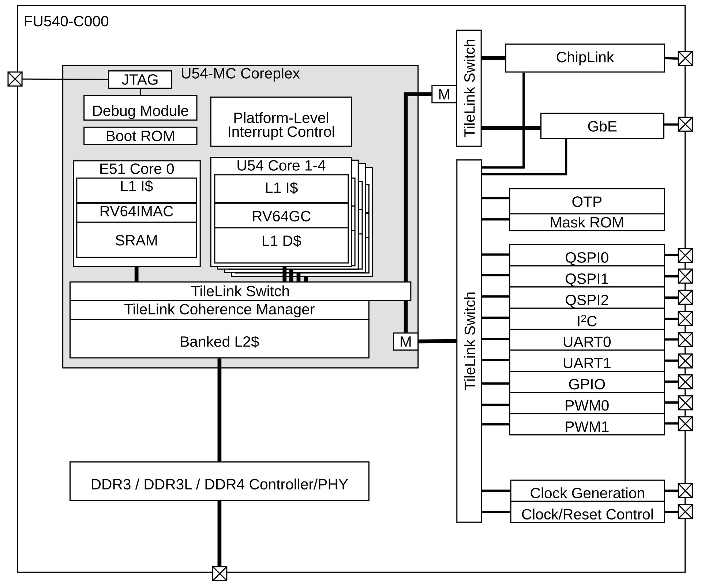
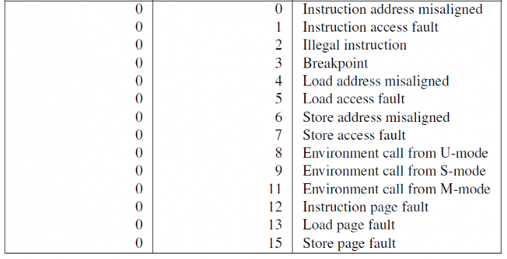
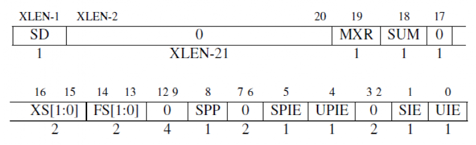
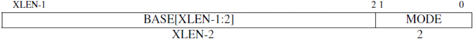
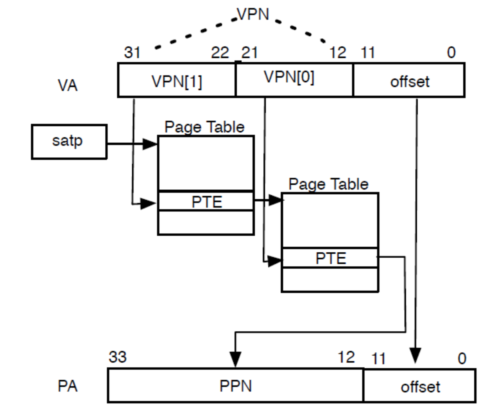

<!-- theme: gaia -->
<!-- _class: lead -->

# 第三讲 基于特权级的隔离与批处理
## 第二节 从OS角度看RISC-V

<br>
<br>

向勇 陈渝 李国良 

<br>
<br>

2022年秋季

---
**提纲**

### 1. 主流CPU比较
2. RISC-V系统模式
3. RISC-V系统编程：用户态编程
4. RISC-V系统编程：M-Mode编程
5. RISC-V系统编程：内核编程

---
#### 本节主要目标

- 了解 RISC-V 特权级和硬件隔离方式
- 了解 RISC-V 的 M-Mode 和 S-Mode 的基本特征
- 了解OS在 M-Mode 和 S-Mode 下如何**访问和控制**计算机系统
- 了解不同软件如何在 M-Mode<–>S-Mode<–>U-Mode 之间进行**切换**
---
#### 主流CPU比较
<!-- 主要说明x86, arm由于兼容性，历史原因，导致设计实现复杂，riscv简洁/灵活/可扩展，便于学习掌握并用于写OS -->


---
#### 主流CPU比较
* 由于兼容性和历史原因，导致x86和ARM的设计实现复杂
*  RISC-V简洁/灵活/可扩展




---
**提纲**

1. 主流CPU比较
### 2. RISC-V系统模式
  - 概述
  - 特权级
  - CSR寄存器
3. RISC-V系统编程：用户态编程
4. RISC-V系统编程：M-Mode编程
5. RISC-V系统编程：内核编程

---

#### RISC-V相关术语
- 应用执行环境（Application Execution Environment, AEE)
- 应用程序二进制接口（Application Binary Interface,ABI)
- 管理员二进制接口（Supervisor Binary Interface, SBI)
- 管理员执行环境（Supervisor Execution Environment, SEE)
- Hypervisor：虚拟机监视器
- Hypervisor二进制接口（Hypervisor Binary interface，HBI）
- Hypervisor执行环境（Hypervisor Execution Environment, HEE)


---
#### RISC-V 系统模式

- ABI/SBI/HBI:Application/Supervisor/Hypervisor Bianry Interface
- AEE/SEE/HEE:Application/Superv/Hyperv Execution Environment
- HAL：Hardware Abstraction Layer
- Hypervisor，虚拟机监视器（virtual machine monitor，VMM）
- RISC-V 系统模式 即 与系统编程相关的RISC-V模式 


---
#### RISC-V 系统模式：单应用场景

- 不同软件层有清晰的特权级硬件隔离支持
- 左侧的**单个应用程序**被编码在ABI上运行
- ABI是用户级ISA(Instruction Set Architecture)和AEE交互的接口
- ABI对应用程序隐藏了AEE的细节，使得AEE具有更大的灵活性

---
#### RISC-V 系统模式：操作系统场景

- 中间加了一个**传统的操作系统**，可支持多个应用程序的多道运行
- 每个应用程序通过**ABI**和OS进行通信
- RISC-V操作系统通过**SBI**和SEE进行通信
- SBI是OS内核与SEE交互的接口，支持OS的ISA

---
#### RISC-V 系统模式：虚拟机场景

- 右侧是虚拟机场景，可支持**多个操作系统**


---
#### RISC-V 系统模式：应用场景

- M Mode：小型设备（蓝牙耳机等）
- U+M Mode:嵌入式设备（电视遥控器、刷卡机等）
- U+S+M Mode：手机
- U+S+H+M Mode：数据中心服务器

---
#### RISC-V 系统模式：硬件线程

- 特权级是为不同的软件栈部件提供的一种保护机制
- **硬件线程**（hart，即CPU core）是运行在某个特权级上（CSR配置）
- 当处理器执行当前特权模式不允许的操作时将产生一个**异常**，这些异常通常会产生自陷（trap）导致**下层执行环境接管控制权**

---
**提纲**

1. 主流CPU比较
2. RISC-V系统模式
  - 概述
### 特权级
  - CSR寄存器
3. RISC-V系统编程：用户态编程
4. RISC-V系统编程：M-Mode编程
5. RISC-V系统编程：内核编程

---

#### RISC-V 系统模式：多个特权级

- 现代处理器一般具有多个特权级的模式（Mode）
- **U**：User | **S**: Supervisor | **H**: Hypervisor | **M**: Machine

为何有这**4种模式**? 它们的**区别和联系**是啥？


---
#### RISC-V 系统模式：执行环境
| 执行环境  |  编码 | 含义  |  跨越特权级 |
| --- | --- | --------------------- | --- |
|  APP |  00 | User/Application  | ``ecall`` |
| OS | 01 | Supervisor | ``ecall`` ``sret`` | 
| VMM | 10 | Hypervisor | --- |
| BIOS | 11 | Machine | ``ecall`` ``mret`` |

- M, S, U 组合在一起的硬件系统适合运行类似UNIX的操作系统


---
#### RISC-V 系统模式：特权级的灵活组合

- 随着应用的**需求变化**，需要**灵活**和**可组合**的硬件构造
- 所以就出现了上述4种模式，且模式间可以组合的灵活硬件设计

---
#### RISC-V 系统模式：用户态

- U-Mode （User Mode，用户模式、用户态）
  - **非特权**级模式（Unprivileged Mode）：基本计算 
  - 是**应用程序运行**的用户态CPU执行模式
  - 不能执行特权指令，不能直接影响其他应用程序执行


---
#### RISC-V 系统模式：内核态

- S-Mode（Supervisor Mode, Kernel Mode，内核态，内核模式）
  - 在内核态的操作系统具有足够强大的**硬件控制能力**
  - 特权级模式（Privileged Mode）：**限制APP**的执行与内存访问 
  - 是**操作系统运行**的内核态CPU执行模式
  - 能执行内核态特权指令，能直接**影响应用程序执行**

---
#### RISC-V 系统模式：H-Mode

- H-Mode(Hypervisor Mode, Virtual Machine Mode，虚拟机监控器)
  - 特权级模式：**限制OS**访问的内存空间 
  - 是**虚拟机监控器运行**的Hypervisor Mode CPU执行模式，能执行H-Mode特权指令，能直接**影响OS执行**


---
#### RISC-V 系统模式：M-Mode

- M-Mode（Machine Mode, Physical Machine Mode）
  - 特权级模式：**控制物理内存**，直接关机 
  - 是**Bootloader/BIOS运行**的Machine Mode CPU执行模式
  - 能执行M-Mode特权指令，能直接影响上述其他软件的执行

---
**提纲**

1. 主流CPU比较
2. RISC-V系统模式
  - 概述
  - 特权级
### CSR寄存器
3. RISC-V系统编程：用户态编程
4. RISC-V系统编程：M-Mode编程
5. RISC-V系统编程：内核编程

---

#### RISC-V CSR寄存器分类

- **通用寄存器** x0-x31
  - 一般指令访问
  - 非特权指令可以使用的速度最快的存储单元
- **控制状态寄存器**(CSR：Control and Status Registers)
  - 通过**控制状态寄存器指令**访问，可以有4096个CSR 
  - 运行在**用户态的应用程序**不能访问大部分的CSR寄存器
  - 运行在**内核态的操作系统**通过访问CSR寄存器控制计算机

<!---
## RISC-V 系统模式：控制状态寄存器CSR
强制隔离以避免对整个系统的可用性/可靠性/安全影响-->
---
#### 通过CSR寄存器实现的隔离
OS通过硬件隔离手段（三防）来保障计算机的安全可靠
- 设置 CSR(控制状态寄存器) 实现隔离
  - 权力：防止应用访问系统管控相关寄存器
    - **地址空间配置**寄存器：mstatus/sstatus CSR
  - 时间：防止应用长期使用 100％的 CPU
    - **中断配置**寄存器：sstatus/stvec CSR
  - 数据：防止应用破坏窃取数据
    - **地址空间相关**寄存器：sstatus/satp/stvec CSR 

<!---
## RISC-V 系统模式：控制状态寄存器CSR

- mtvec(MachineTrapVector)保存发生异常时需要跳转到的地址。
- mepc(Machine Exception PC)指向发生异常的指令。
- mcause(Machine Exception Cause)指示发生异常的种类。
- mie(Machine Interrupt Enable)指出处理器目前能处理的中断。
- mip(Machine Interrupt Pending)列出目前正准备处理的中断。
- mtval(Machine Trap Value)保存陷入(trap)附加信息:地址例外中出错的地址、发生非法指令例外的指令本身；对于其他异常，值为0。
- mscratch(Machine Scratch)它暂时存放一个字大小的数据。
- mstatus(Machine Status)保存全局中断以及其他的状态
-->

<!-- 
---
## RISC-V 系统模式：控制状态寄存器CSR

- mcause(Machine Exception Cause)它指示发生异常的种类。
  - SIE控制S-Mode下全局中断，MIE控制M-Mode下全局中断。
  - SPIE、MPIE记录发生中断之前MIE和SIE的值。
---
## RISC-V 系统模式：控制状态寄存器CSR

- sstatus(supervisor status)保存发生异常时需要跳转到的地址。
- stvec(supervisor trap vector)保存s模式的trap向量基址。stvec总是4字节对齐
- satp(supervisor Address Translation and Protection) S-Mode控制状态寄存器控制了分页系统。
- sscratch (supervisor Scratch Register) 保存指向hart-local supervisor上下文的指针. 在trap处理程序的开头，sscratch与用户寄存器交换，以提供初始工作寄存器。
- sepc(supervisor Exception PC)它指向发生异常的指令。
-->


---
**提纲**

1. 主流CPU比较
2. RISC-V系统模式
### 3. RISC-V系统编程：用户态编程
  - 简述
  - U-Mode编程：系统调用
  - 特权操作
4. RISC-V系统编程：M-Mode编程
5. RISC-V系统编程：内核编程

---

#### 系统编程简述
- 系统编程需要了解处理器的**特权级架构**，熟悉各个特权级能够访问的寄存器资源、内存资源和外设资源
- **编写内核级代码**，构造操作系统，支持应用程序执行
  - 内存管理 进程调度
  - 异常处理 中断处理
  - 系统调用 外设控制
- 系统编程通常**没有**广泛用户**编程库**和方便的动态**调试手段**的支持
- 本课程的系统编程主要集中在 RISC-V 的 S-Mode 和 U-Mode，涉及部分对M-Mode的理解

---
#### RISC-V U-Mode编程：使用系统调用
- U-Mode 下的应用程序不能够直接使用计算机的物理资源
- 环境调用异常：在执行 ``ecall`` 的时候发生，相当于系统调用
- 操作系统可以直接访问物理资源
- 如果应用程序需要使用硬件资源怎么办？
  - 在屏幕上打印”hello world”
  - 从文件中读入数据
- 通过系统调用从操作系统中获得服务

---
#### U-Mode编程：第一个例子”hello world”
[在用户态打印”hello world”的小例子](https://github.com/chyyuu/os_kernel_lab/tree/v4-kernel-sret-app-ecall-kernel/os/src) 大致执行流




---
#### 第一个例子的启动执行
[在用户态打印”hello world”的小例子](https://github.com/chyyuu/os_kernel_lab/blob/v4-kernel-sret-app-ecall-kernel/os/src/main.rs#L302) 启动执行流




---
#### 第二个例子：在用户态执行特权指令
[在用户态执行特权指令的小例子](https://github.com/chyyuu/os_kernel_lab/blob/v4-illegal-priv-code-csr-in-u-mode-app-v2/os/src/main.rs#L306) 启动与执行流程


<!-- Zifencei扩展 https://www.cnblogs.com/mikewolf2002/p/11191254.html -->
---
#### 特权操作
- 特权操作：特权指令和CSR读写操作
- 指令非常少：
  - ``mret`` 机器模式返回 
  - ``sret`` 监管者模式返回
  - ``wfi`` 等待中断 (wait for interupt)
  - ``sfence.vma`` 虚拟地址屏障(barrier)指令
  
- 很多其他的系统管理功能通过读写控制状态寄存器来实现

注:``fence.i``是i-cache屏障(barrier)指令，非特权指令，属于 “Zifencei”扩展规范

<!-- 在执行 fence.i 指令之前，对于同一个硬件线程(hart)， RISC-V 不保证用存储指令写到内存指令区的数据可以被取指令取到。使用fence.i指令后，对同一hart，可以确保指令读取是最近写到内存指令区域的数据。但是，fence.i将不保证别的riscv hart的指令读取也能够满足读写一致性。如果要使写指令内存空间对所有的hart都满足一致性要求，需要执行fence指令。 -->


---
**提纲**

1. 主流CPU比较
2. RISC-V系统模式
3. RISC-V系统编程：用户态编程
### 4. RISC-V系统编程：M-Mode编程
  - 中断机制和异常机制
  - 中断/异常的硬件响应
  - 中断/异常处理的控制权移交
5. RISC-V系统编程：内核编程

---

#### M-Mode编程
- M-Mode是 RISC-V 中 hart（hardware thread）的**最高权限模式**
- M-Mode下，hart 对计算机系统的底层功能有**完全的使用权**
- M-Mode最重要的特性是**拦截和处理中断/异常**
  - **同步的异常**：执行期间产生，访问无效的寄存器地址，或执行无效操作码的指令
  - **异步的中断**：指令流异步的外部事件，中断，如时钟中断
- RISC-V 要求实现**精确异常**：保证异常之前的所有指令都完整执行，后续指令都没有开始执行

---
#### M-Mode的中断控制和状态寄存器

- mtvec(MachineTrapVector)保存发生中断/异常时要跳转到的**中断处理例程入口地址**
- mepc(Machine Exception PC)指向**发生中断/异常时的指令**
- mcause(Machine Exception Cause)指示发生**中断/异常的种类**
- mie(Machine Interrupt Enable)中断**使能**寄存器
- mip(Machine Interrupt Pending)中断**请求**寄存器
- mtval(Machine Trap Value)保存陷入(trap)**附加信息**
- mscratch(Machine Scratch)它暂时存放一个字大小的**数据**
- mstatus(Machine Status)保存全局中断以及其他的**状态**

<!-- mtval(Machine Trap Value)保存陷入(trap)附加信息:地址例外中出错的地址、发生非法指令例外的指令本身；对于其他异常，值为0。 -->
---
#### mstatus CSR寄存器

- mstatus(Machine Status)保存全局中断以及其他的**状态**
  - SIE控制S-Mode下全局中断，MIE控制M-Mode下全局中断。
  - SPIE、MPIE记录发生中断之前MIE和SIE的值。
  - SPP表示变化之前的特权级别是S-Mode还是U-Mode
  - MPP表示变化之前是S-Mode还是U-Mode还是M-Mode
  PP：Previous Privilege


---
#### mcause CSR寄存器

当发生异常时，mcause CSR中被写入一个指示**导致异常的事件**的代码，如果事件由中断引起，则置上``Interrupt``位，``Exception Code``字段包含指示最后一个异常的编码。


---
#### M-Mode时钟中断Timer
- 中断是异步发生的
  - 来自处理器外部的 I/O 设备的信号
- Timer 可以稳定定时地产生中断
  - 防止应用程序死占着 CPU 不放, 让 OS Kernel 能得到执行权...
  - 由**高特权模式下的软件**获得 CPU 控制权
  - 高特权模式下的软件可**授权**低特权模式软件处理中断

---
#### RISC-V处理器FU540模块图


---
**提纲**

1. 主流CPU比较
2. RISC-V系统模式
3. RISC-V系统编程：用户态编程
4. RISC-V系统编程：M-Mode编程
  - 中断机制和异常机制
### 中断/异常的硬件响应
  - 中断/异常处理的控制权移交
5. RISC-V系统编程：内核编程

---

#### M-Mode中断的硬件响应过程
- **异常指令的PC**被保存在mepc中，PC设置为mtvec。
  - 对于同步异常，mepc指向导致异常的指令；
  - 对于中断，指向中断处理后应该恢复执行的位置。
- 根据**异常来源**设置 mcause，并将 mtval 设置为出错的地址或者其它适用于**特定异常的信息字**
- 把mstatus[MIE位]置零以**禁用中断**，并**保留先前MIE值**到MPIE中
    - SIE控制S模式下全局中断，MIE控制M模式下全局中断；
    - SPIE记录的是SIE中断之前的值，MPIE记录的是MIE中断之前的值
- **保留发生异常之前的权限模式**到mstatus 的 MPP 域中，再**更改权限模式**为M。（MPP表示变化之前的特权级别是S、M or U模式）

---
#### M-Mode中断处理例程 
```
    let scause = scause::read();
    let stval = stval::read();

    match scause.cause() {
        Trap::Exception(Exception::UserEnvCall) => {
            cx.sepc += 4;
            cx.x[10] = do_syscall(cx.x[17], [cx.x[10], cx.x[11], cx.x[12]]) as usize;
        }
        _ => {
            panic!(
                "Unsupported trap {:?}, stval = {:#x}!",
                scause.cause(),
                stval
            );
        }
    }

```
---
#### M-Mode中断分类
通过 mcause 寄存器的不同位（mie）来获取中断的类型。
- **软件**中断：通过向内存映射寄存器写入数据来触发，一个 hart 中断另外一个hart（处理器间中断）
- **时钟**中断：hart 的时间计数器寄存器 mtime 大于时间比较寄存器 mtimecmp
- **外部**中断：由中断控制器触发，大部分情况下的外设都会连到这个中断控制器

---
#### RISC-V 的中断/异常
通过 mcause 寄存器的不同位来获取中断源的信息。
第一列1代表中断，第2列代表中断ID，第3列中断含义


---
#### M-Mode RISC-V异常机制
通过 mcause 寄存器的不同位来来获取导致异常的信息。
第一列0代表异常，第2列代表异常ID，第3列异常含义


---
#### M-Mode中断/异常的硬件响应
- **中断/异常的指令的 PC** 被保存在 mepc 中， PC 被设置为 mtvec。
   - 对于异常，mepc指向导致异常的指令
   - 对于中断，mepc指向中断处理后应该恢复执行的位置
- 根据**中断/异常来源**设置 mcause，并将 mtval 设置为出错的地址或者其它适用于特定异常的信息字。

---
#### M-Mode中断/异常的硬件响应

- 把控制状态寄存器 mstatus[MIE位]置零以**禁用中断**，并**保留先前的 MIE 值**到 MPIE 中。
  - SIE控制S-Mode下全局中断，MIE控制M-Mode下全局中断；
  - SPIE记录的是SIE中断之前的值，MPIE记录的是MIE中断之前的值）
- **发生异常之前的权限模式**保留在 mstatus 的 MPP 域中，再把权限模式更改为M
  - MPP表示变化之前的特权级别是S、M or U-Mode
- **跳转**到mtvec CSR设置的地址继续执行

---
**提纲**

1. 主流CPU比较
2. RISC-V系统模式
3. RISC-V系统编程：用户态编程
4. RISC-V系统编程：M-Mode编程
  - 中断机制和异常机制
  - 中断/异常的硬件响应
### 中断/异常处理的控制权移交
5. RISC-V系统编程：内核编程

---
#### M-Mode中断/异常处理的控制权移交
- 默认情况下，所有的中断/异常都使得控制权移交到 M-Mode的中断/异常处理例程
- M-Mode的**中断/异常处理例程**可以将中断/异常重新**导向 S-Mode**，但是这些额外的操作会减慢中断/异常的处理速度
- RISC-V 提供一种**中断/异常委托机制**，通过该机制可以选择性地将中断/异常交给 S-Mode处理，而**完全绕过 M-Mode**

---
#### M-Mode中断/异常处理的控制权移交
- **mideleg/medeleg** (Machine Interrupt/Exception Delegation）CSR 控制将哪些中断/异常委托给 S-Mode处理
- mideleg/medeleg 中的每个为对应一个中断/异常
  - 如 mideleg[5] 对应于 S-Mode的时钟中断，如果把它置位，S-Mode的时钟中断将会移交 S-Mode的中断/异常处理程序，而不是 M-Mode的中断/异常处理程序
  - 委托给 S-Mode的任何中断都可以被 S-Mode的软件屏蔽。sie(Supervisor Interrupt Enable) 和 sip（Supervisor Interrupt Pending）CSR 是 S-Mode的控制状态寄存器

---

#### 中断委托寄存器mideleg
- mideleg (Machine Interrupt Delegation）控制将哪些中断委托给 S 模式处理
- mideleg 中的每个为对应一个中断/异常
  - mideleg[1]用于控制是否将**核间中断**交给s模式处理
  - mideleg[5]用于控制是否将**定时中断**交给s模式处理
  - mideleg[9]用于控制是否将**外部中断**交给s模式处理


---

#### 异常委托寄存器medeleg
- medeleg (Machine Exception Delegation）控制将哪些异常委托给 S 模式处理
- medeleg 中的每个为对应一个中断/异常
  - medeleg[1]用于控制是否将**指令获取错误异常**交给s模式处理
  - medeleg[12]用于控制是否将**指令页异常**交给s模式处理
  - medeleg[9]用于控制是否将**数据页异常**交给s模式处理

<!-- ，是 mie 和 mip 的子集。这两个寄存器和 M-Mode下有相同的布局。sie 和 sip 中只有与由 mideleg 委托的中断对应的位才能读写，没有委派的中断对应位总是 0 -->

---
#### 中断/异常处理的控制权移交


- 发生中断/异常时,处理器控制权**通常**不会移交给权限更低的模式
  - 例如 medeleg[15] 会把 store page fault 委托给 S-Mode
  - M-Mode下发生的异常总是在 M-Mode下处理
  - S-Mode下发生的异常总是在 M-Mode，或者在 S-Mode下处理
  - 上述两种模式发生的异常不会由 U-Mode处理 

**Why？**


---
#### 思考题

- 如何通过断点异常来实现调试器的断点调试功能？
- 如何实现单步跟踪？ 
---
**提纲**

1. 主流CPU比较
2. RISC-V系统模式
3. RISC-V系统编程：用户态编程
4. RISC-V系统编程：M-Mode编程
### 5. RISC-V系统编程：内核编程
  - 中断/异常机制
  - 中断/异常的处理
  - 虚存机制
---

#### S-Mode的中断控制和状态寄存器

- stvec(SupervisorTrapVector)保存发生中断/异常时**要跳转到的地址**
- sepc(Supervisor Exception PC)指向**发生中断/异常时的指令**
- scause(Supervisor Exception Cause)指示发生中断/异常的**种类**
- sie(Supervisor Interrupt Enable)中断**使能**寄存器
- sip(Supervisor Interrupt Pending)中断**请求**寄存器
- stval(Supervisor Trap Value)保存陷入(trap)**附加信息**
- sscratch(Supervisor Scratch)不同mode交换**数据中转站**
- sstatus(Supervisor Status)保存全局中断以及其他的**状态**

---
#### sstatus寄存器
- sstatus的SIE 和 SPIE 位分别保存了当前的和中断/异常发生之前的中断使能**状态**



---
#### S-Mode中断/异常机制

**sie & sip 寄存器**是用于保存**待处理中断**和**中断使能**情况的CSR

- sie （supervisor interrupt-enabled register）
- sip（supervisor interrupt pending）


---
#### scause寄存器
当发生异常时，CSR中被写入一个指示**导致中断/异常的事件**编号，记录在``Exception Code``字段中；如果事件由中断引起，则置``Interrupt``位。
scause 寄存器


---
#### mtvec & stvec 寄存器
中断/异常向量（trap-vector）基地址寄存器stvec CSR用于配置**trap_handler地址**
 - 包括向量基址（BASE）和向量模式（MODE）：BASE 域中的值按 4 字节对齐
    - MODE = 0 表示一个trap_handler处理所有的中断/异常
    - MODE = 1 表示每个中断/异常有一个对应的trap_handler

mtvec & stvec 寄存器



---
**提纲**

1. 主流CPU比较
2. RISC-V系统模式
3. RISC-V系统编程：用户态编程
4. RISC-V系统编程：M-Mode编程
5. RISC-V系统编程：内核编程
  - 中断/异常机制
### 中断/异常的处理
  - 虚存机制
---

#### S-Mode中断/异常的硬件响应

**硬件执行内容**

hart 接受了中断/异常，并需要委派给 S-Mode，那么硬件会原子性的经历下面的状态转换

1. **发生中断/异常的指令PC**被存入 sepc, 且 PC 被设置为 stvec
2. scause 设置中断/异常**类型**，stval被设置为出错的地址/异常**相关信息**
3. 把 sstatus中的 SIE 位置零，**屏蔽中断**， **SIE位之前的值**被保存在 SPIE 位中


---
#### S-Mode中断/异常的硬件响应

4. **发生例外前的特权模式**被保存在 sstatus 的 SPP（previous privilege） 域，然后设置当前特权模式为S-Mode
5. **跳转**到stvec CSR设置的地址继续执行


---
#### S-Mode中断/异常的软件处理


- **初始化**
  - 编写中断/异常的处理例程（如trap_handler）
  - 设置trap_handler地址给stvec
- 软件执行 
  1. 处理器跳转到**trap_handler**
  2. trap_handler**处理**中断/异常/系统调用等
  3. **返回**到之前的指令和之前的特权级继续执行


---
**提纲**

1. 主流CPU比较
2. RISC-V系统模式
3. RISC-V系统编程：用户态编程
4. RISC-V系统编程：M-Mode编程
5. RISC-V系统编程：内核编程
  - 中断/异常机制
  - 中断/异常的处理
### 虚存机制
---

#### S-Mode虚拟内存系统

- 虚拟地址将内存划分为**固定大小的页**来进行**地址转换**和**内容保护**。
- satp（Supervisor Address Translation and Protection，监管者地址转换和保护）S模式控制状态寄存器**控制分页**。satp 有三个域：
  - MODE 域可以**开启分页**并选择页表级数
  - ASID（Address Space Identifier，地址空间标识符）域是可选的，它可以用来降低上下文切换的开销
  - PPN 字段保存了**根页表的物理页号**


---
#### S-Mode虚存机制

- 通过stap CSR建立**页表基址**
- 建立OS和APP的**页表**
- 处理内存访问**异常**


---
#### S-Mode虚存的地址转换
S、U-Mode中虚拟地址会以从根部遍历页表的方式转换为物理地址：

- satp.PPN 给出了**一级页表基址**， VA [31:22] 给出了一级页号，CPU会读取位于地址(satp. PPN × 4096 + VA[31: 22] × 4)页表项。
- PTE 包含**二级页表基址**，VA[21:12]给出了二级页号，CPU读取位于地址(PTE. PPN × 4096 + VA[21: 12] × 4)叶节点页表项。
- **叶节点页表项的PPN字段**和页内偏移（原始虚址的最低 12 个有效位）组成了最终结果：物理地址(LeafPTE.PPN×4096+VA[11: 0])


---
#### S-Mode虚存的地址转换




<!-- ---
## RISC-V 系统编程：S-Mode下的隔离
- S-Mode比 U-Mode权限更高，但是比 M-Mode权限低
- S-Mode下运行的软件不能使用 M-Mode的 CSR 和指令，并受到 PMP 的限制
- 支持基于页面的虚拟内存 -->


---
### 小结

- 了解 RISC-V 特权级和硬件隔离方式
- 了解 RISC-V 的 M-Mode 和 S-Mode 的基本特征
- 了解OS在 M-Mode 和 S-Mode 下如何访问控制计算机系统
- 了解不同软件如何在 M-Mode<–>S-Mode<–>U-Mode 之间进行切换

