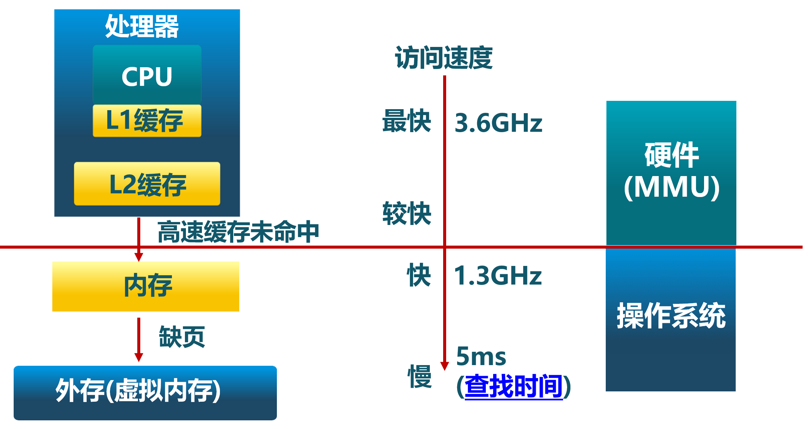
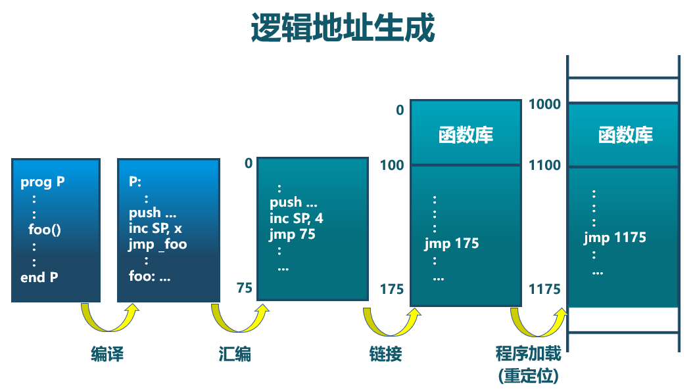

<!-- theme: gaia -->
<!-- _class: lead -->

# 第四讲 物理内存管理
## 第一节 地址空间
 
 

向勇 陈渝 李国良 任炬 

 
 

2023年春季

---
**提纲**

### 1. 计算机的存储层次
2. 地址和地址空间
3. 虚拟存储的作用

---

#### 物理地址和逻辑地址

- 物理地址(PA, Physical Address) ：用于内存芯片级的单元寻址，与处理器和CPU连接的**地址总线**相对应。 
- 逻辑地址(LA, Logical Address) ：**CPU执行机器指令**时，用来指定一个操作数或者是一条指令的地址。也是用户编程时使用的地址。
- 线性地址(linear address)或也叫虚拟地址(virtual address) ：跟逻辑地址类似，它也是一个不真实的地址。
  - 逻辑地址指CPU在段式内存管理转换前的地址；
  - 线性地址指CPU在页式内存管理转换前的地址。

---
#### 逻辑地址与物理地址的关系

- 逻辑地址到物理地址的转换
  - 逻辑地址 -> 线性地址(虚拟地址) -> 物理地址

- 在没有段式内存管理的情况下，逻辑地址与虚拟地址相同
- 在没有页式内存管理的情况下，逻辑地址、虚拟地址和物理地址都相同

---
#### 计算机的存储层次结构

---

#### 计算机的存储多层结构

---
#### 操作系统对内存资源的抽象

---

#### 内存管理

- 操作系统中的**内存管理方式**
  - 重定位(relocation)
  - 分段(segmentation)
  - 分页(paging)
  - 虚拟存储(virtual memory/storage)
- **操作系统的内存管理高度依赖硬件**
  - 与计算机存储架构紧耦合
  - MMU (内存管理单元): 处理CPU存储访问请求的硬件

---
**提纲**

1. 计算机的存储层次
### 2. 地址和地址空间
3. 虚拟存储的作用

---

#### 地址空间的定义

- 物理地址空间：物理内存的地址空间
  - 起始地址$0$，直到 $MAX_{phy}$
- 虚拟地址空间：虚拟内存的地址空间
  - 起始地址$0$，直到 $MAX_{virt}$
- 逻辑地址空间：程序执行的地址空间
  - 起始地址$0$， 直到 $MAX_{prog}$

三种地址空间的**视角不同**

---

#### 逻辑地址生成

---

#### 地址生成时机

- 编译时
  - 假设起始地址**已知**
  - 如果起始地址改变，必须重新编译
- 加载时
  - 如编译时起始地址**未知**，编译器需生成可重定位的代码 (relocatable code) 
  - 加载时，位置可不固定，生成绝对（虚拟）地址
- 执行时
  - 执行时代码不可修改
  - 需**地址转换(映射)硬件**支持

---

#### 地址生成过程
- CPU
  - ALU：需要**逻辑地址**的内存内容
  - MMU：进行逻辑地址和物理地址的**转换**
  - CPU控制逻辑：给总线发送**物理地址**请求
- 内存
  - 发送**物理地址**的内容给CPU
  - 接收CPU数据到物理地址
- 操作系统
  - 建立逻辑地址LA和物理地址PA的映射

---

#### 地址检查

---
**提纲**

1. 计算机的存储层次
2. 地址和地址空间
### 3. 虚拟存储的作用

---

#### 外存的缓存

虚拟内存可作为外存的缓存

- **常用数据**放在物理内存中
- **不常用数据**放在外存 
- 运行的程序**直接用虚存地址**，不用关注具体放在物理内存还是外存

---

#### 简化应用编译和加载运行

每个运行程序具有**独立的地址空间**，而不管代码和数据在物理内存的实际存放，从而简化：
- 编译的执行程序链接过程
- 操作系统的执行程序加载过程
- 共享：动态链接库、共享内存 
- 内存分配：物理不连续，虚拟连续

---

#### 保护数据

虚拟内存可保护数据
- **独立的地址空间**使得区分不同进程各自内存变得容易
- 地址转换机制可以进行可读/可写/可执行的检查
- 地址转换机制可以进行特权级检查
