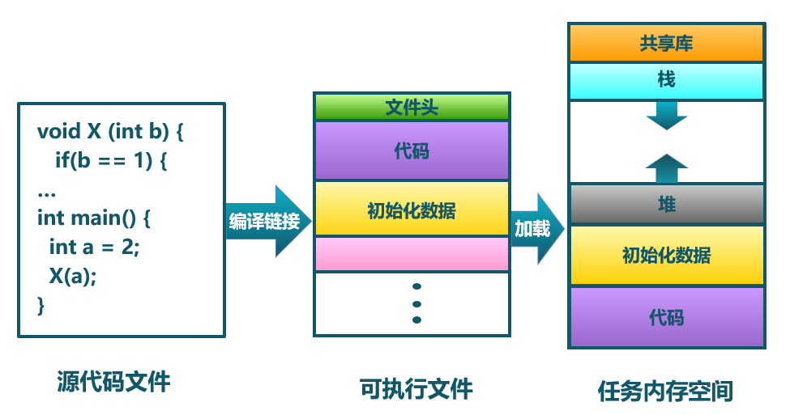
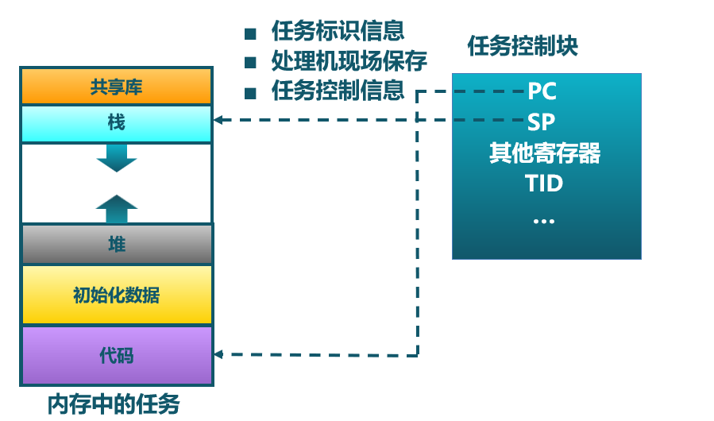
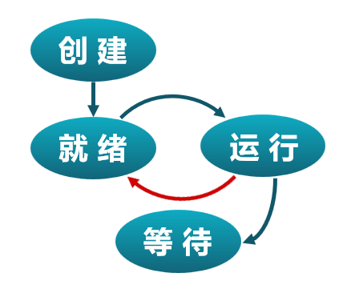

<!-- theme: gaia -->
<!-- _class: lead -->

## 第四讲 多道程序与分时多任务
### 第一节 相关背景与基本概念
 
 

向勇 陈渝 李国良 

 
 

2022年春季

---

## 多道程序与协作式调度 -- 历史

操作系统的被广泛使用是从大型机向小型机（minicomputer）过度的时期开始的。

- OS/360是大型机（System/360）时代的多道批处理操作系统
- 数字设备公司（DEC）的PDP系列小型计算机
- 一个工作单位内的一群人可能拥有自己的计算机
- 多道程序（multiprogramming）变得很普遍

---

## 多道程序与协作式调度 -- 多道程序

多道程序（Multiprogramming）

- 在内存中存在多个可执行程序
- 各个可执行程序共享处理器

工作(Job)
- 应用的一次执行过程

历史上出现过的术语：Job、Multiprogramming 
- Job和Multiprogramming是IBM用于多道程序设计的概念。

---

## 多道程序与协作式调度 -- 协作式调度

协作式调度（Cooperative scheduling）

- 可执行程序主动放弃处理器使用 
- 操作系统不会打断正在执行的程序
- 操作系统选择下一个执行程序使用处理器

---
## 分时多任务与抢占式调度 -- 历史

小型机（minicomputer）的普及和广泛使用推动了分时多任务的需求，形成了支持多用户的分时操作系统。

- DEC公司的PDP、VAX小型机逐渐侵蚀大型机市场
- DEC公司的VMX操作系统
- MIT的CTSS操作系统
- AT&T的UNIX操作系统

---
## 分时多任务与抢占式调度 -- 分时多任务

分时多任务（Time sharing multitask）：从用户的视角看

- 在内存中存在多个可执行程序
- 各个可执行程序分时共享处理器
- 操作系统按时间片来给各个可执行程序分配CPU使用时间
- **任务(Task)** ：应用的一次执行过程

---
## 分时多任务与抢占式调度 -- 分时多任务

分时多任务（Time sharing multitask）：从OS的视角看

- **任务(Task)** ：一个具有一定独立功能的程序在一个数据集合上的一次动态执行过程，是**进程(Process)** 的前身
- 应用执行过程中的一个时间片段上的执行片段或空闲片段称为 “ 计算任务片 ” 或“ 空闲任务片 ”
- 从一个应用的任务切换到另外一个应用的任务称为**任务切换** 

历史上出现过的术语：Job、Programming、Task、Process
- Task、Process是Multics和UNIX等用于分时多任务提出的概念

---
## 分时多任务与抢占式调度 -- 分时多任务

分时多任务（Time sharing multitask）：从OS的视角看

历史上出现过的术语：Job、Programming、Task、Process
- Task、Process是Multics和UNIX等用于分时多任务提出的概念

---
## 分时多任务与抢占式调度 -- 抢占式调度

抢占式调度（Preemptive scheduling）

- 可执行程序被动地放弃处理器使用
- 可执行程序按时间片轮流使用处理器，是一种“暂停-继续”组合的执行过程
- 基于时钟硬件中断机制，操作系统可随时打断正在执行的程序
- 操作系统选择下一个执行程序使用处理器

---
## 分时多任务与抢占式调度 -- 分时多任务

### 实际操作系统中运行的任务
- Windows
- Linux

**Demo一下**

---
## 任务的特点

---
## 任务的特点
- 动态性
  - 开始执行-->暂停-->继续-->结束执行的过程
- 并发性
  - 一段时间内多个任务在执行
- 有限度的独立性
  - 任务之间不用感知对方的存在

目前还没具备更强大的特点
- 隔离更彻底、任务间协同工作、任务创建任务...... 

---
## 任务与程序的关系

---
## 任务与程序的关系

---
## 任务与程序的关系

- 任务是操作系统处于执行状态程序的抽象
  - 程序 = 文件 (静态的可执行文件)
  - 任务 = 执行中的程序 = 程序 + 执行状态
 
- 同一个程序的多次执行过程对应为不同任务
  - 如命令“ls”的多次执行对应多个任务
 
- 任务执行需要的资源
  - 内存：保存代码和数据
  - CPU：执行指令

---
## 任务与程序的关系

- 任务是动态的，程序是静态的
  - 程序是有序代码的集合
  - 任务是程序的执行
- 任务是暂时的，程序是永久的
  - 任务是一个状态变化的过程
  - 任务可长久保存
- 任务与程序的组成不同
  - 任务的组成包括程序、数据和进程控制块

---
## 任务的组成
任务包含了运行程序的所有状态信息
- 任务执行的控制流
  - 代码内容与代码的执行位置（代码段）
- 任务访问的数据
  - 被任务读写的内存（堆、栈、数据段）
  - 被任务读写的寄存器
    - 通用寄存器

---
## 任务的组成
任务包含了运行程序的所有状态信息
- 操作系统管理任务的相关数据（任务的上下文）
    - 任务切换所需的通用寄存器
    - 任务切换所需的状态寄存器(PC等)
    - 其他信息：任务的栈地址等
    - 其他资源：...... 

---
## 操作系统管理任务
核心数据结构：任务控制块（TCB，Task Control Block）
- 操作系统管理控制进程运行所用的信息集合
- 操作系统用TCB来描述进程的基本情况以及运行变化的过程
- TCB是进程存在的唯一标志
- 每个任务都在操作系统中有一个对应的TCB

---
## 操作系统管理任务

---
## 任务生命周期
- 创建 --> 就绪 
  - 何时创建？
  - 如何创建？

---
## 任务生命周期
- 创建-->就绪-->执行
  - 内核选择一个就绪的任务
  - 如何执行？

---
## 任务生命周期
- 创建-->就绪-->执行-->等待
  - 任务进入等待的原因?
    - 自身
    - 外界  

---
## 任务生命周期
- 创建-->就绪-->执行--> 等待 -->唤醒
  - 唤醒任务的原因？
    - 自身：自然醒？
    - 外界：被叫醒？
       

---
## 任务生命周期
- 创建-->就绪-->执行--> 抢占
  - 任务被抢占的原因？
  

---
## 任务生命周期
- 创建--> 就绪 --> 执行 --> ...... -->结束
  - 任务退出的原因？
    - 自愿？
    - 被迫？

---
## 三状态任务模型

---
## 任务生命周期  -- 与系统调用的关系

- 创建--> 就绪 --> 执行 --> ...... -->结束
- 抢占 等待  唤醒

涉及哪些系统调用？

---
## 任务生命周期  -- 与系统调用的关系

- 创建--> 就绪 --> 执行 --> ...... -->结束
- 抢占 等待  唤醒

涉及哪些系统调用？
- exit
- sleep
- ......

---
## 任务生命周期  -- 与任务切换的关系

- 创建--> 就绪 --> 执行 --> ...... -->结束
- 抢占 等待  唤醒

在任务的生命周期中，何时会进行任务切换？

---
## 任务切换

