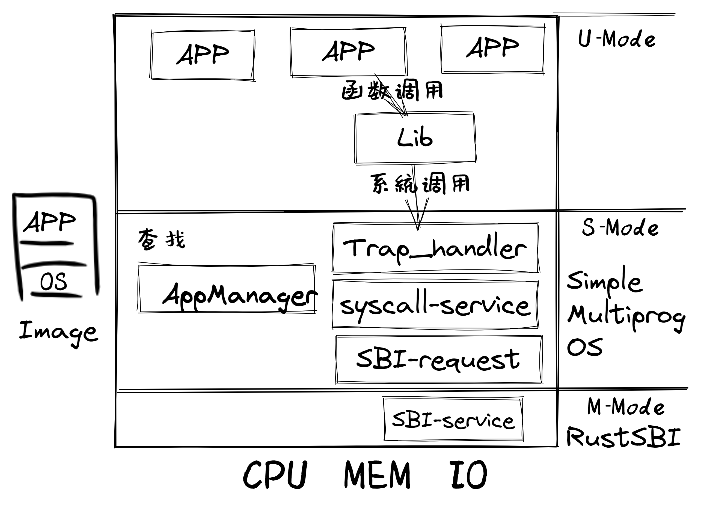
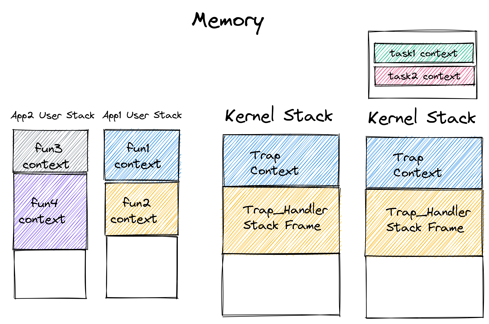

<!-- theme: gaia -->
<!-- _class: lead -->

## 第四讲 多道程序与分时多任务
### 第二节 实践：多道程序与分时多任务操作系统


---
## 实践：multiprog & time-sharing OS
- **进化目标**
- 总体思路
- 历史背景
- 实践步骤
- 软件架构
- 相关硬件
- 程序设计


---
## 实践：multiprog & time-sharing OS
### 进化目标
- 进一步提高系统中多个应用的总体性能和效率
### BatchOS目标
- 让APP与OS隔离，提高系统的安全性和效率
### LibOS目标
- 让应用与硬件隔离，简化应用访问硬件的难度和复杂性


---
## 实践：multiprog & time-sharing OS
### 同学的进化目标
- 理解协作式调度
- 理解抢占式调度
- 理解任务抽象
- 理解任务切换
- 会写多道程序操作系统
- 会写分时多任务操作系统


---
## 实践：multiprog OS
- 进化目标
- **总体思路**
- 历史背景
- 实践步骤
- 软件架构
- 相关硬件
- 程序设计


---
## 实践：multiprog OS
### 总体思路
- 编译：(OLD)应用程序和内核独立编译，合并为一个镜像
- 编译：应用程序需要各自的起始地址
- 构造：(OLD)系统调用服务请求接口，任务的管理与初始化
- 构造：任务控制块，任务的上下文/状态管理
- 运行：(OLD)特权级切换，任务与OS相互切换
- 运行：任务通过系统调用实现主动切换


---
## 实践：multiprog OS
- 进化目标
- 总体思路
- **历史背景**
- 实践步骤
- 软件架构
- 相关硬件
- 程序设计


---
## 实践：multiprog OS
### 历史
* 1961 年的英国 Leo III 计算机
* 支持在计算机内存中加载几个不同的程序，并从第一个开始依次运行
* J. Lyons & Co.用于商业事务处理

<!-- J. Lyons & Co.是一家成立于1884年的英国连锁餐厅，食品制造业和酒店集团。 -->

<!-- https://baike.baidu.com/item/EDSAC/7639053
电子延迟存储自动计算器（英文：Electronic Delay Storage Automatic Calculator、EDSAC）是英国的早期计算机。1946年,英国剑桥大学数学实验室的莫里斯·威尔克斯教授和他的团队受冯·诺伊曼的First Draft of a Report on the EDVAC的启发，以EDVAC为蓝本，设计和建造EDSAC，1949年5月6日正式运行，是世界上第一台实际运行的存储程序式电子计算机。
是EDSAC在工程实施中同样遇到了困难：不是技术，而是资金缺乏。在关键时刻，威尔克斯成功地说服了伦敦一家面包公司J．Lyons&Co。．的老板投资该项目，终于使计划绝处逢生。1949年5月6日，EDSAC首次试运行成功，它从带上读人一个生成平方表的程序并执行，正确地打印出结果。作为对投资的回报，LyOHS公司取得了批量生产EDSAC的权利，这就是于1951年正式投入市场的LEO计算机(Lyons Electronic Office)，这通常被认为是世界上第一个商品化的计算机型号，因此这也成了计算机发展史上的一件趣事：第一家生产出商品化计算机的厂商原先竟是面包房。Lyons公司后来成为英国著名的“国际计算机有限公司”即ICL的一部分。
-->


---
## 实践：multiprog OS
- 进化目标
- 总体思路
- 历史背景
- **实践步骤**
- 软件架构
- 相关硬件
- 程序设计


---
## 实践：multiprog OS
### 步骤（基于BatchOS）
- 修改APP的链接脚本(定制起始地址)
- 加载&执行应用
- 切换任务


---
## 实践：multiprog OS
### 具体步骤
```
git clone https://github.com/rcore-os/rCore-Tutorial-v3.git
cd rCore-Tutorial-v3
git checkout ch3-coop
```
包含三个应用程序，大家谦让着交替执行
```
user/src/bin/
├── 00write_a.rs # 5次显示 AAAAAAAAAA 字符串
├── 01write_b.rs # 2次显示 BBBBBBBBBB 字符串
└── 02write_c.rs # 3次显示 CCCCCCCCCC 字符串
```

---
## 实践：multiprog OS
### 具体步骤
```
[RustSBI output]
[kernel] Hello, world!
AAAAAAAAAA [1/5]
BBBBBBBBBB [1/2]
....
CCCCCCCCCC [2/3]
AAAAAAAAAA [3/5]
Test write_b OK!
[kernel] Application exited with code 0
CCCCCCCCCC [3/3]
...
[kernel] Application exited with code 0
[kernel] Panicked at src/task/mod.rs:106 All applications completed!
```


---
## 实践：multiprog OS
- 进化目标
- 总体思路
- 历史背景
- 实践步骤
- **软件架构**
- 相关硬件
- 程序设计


---
## 实践：multiprog OS -- 软件架构
### 代码结构
构建应用
```
└── user
    ├── build.py(新增：使用 build.py 构建应用使得它们占用的物理地址区间不相交)
    ├── Makefile(修改：使用 build.py 构建应用)
    └── src (各种应用程序)    
```


---
## 实践：multiprog OS -- 软件架构
### 代码结构
改进OS：``Loader``模块加载和执行程序
```
├── os
│   └── src
│       ├── batch.rs(移除：功能分别拆分到 loader 和 task 两个子模块)
│       ├── config.rs(新增：保存内核的一些配置)
│       ├── loader.rs(新增：将应用加载到内存并进行管理)
│       ├── main.rs(修改：主函数进行了修改)
│       ├── syscall(修改：新增若干 syscall)
```

---
## 实践：multiprog OS -- 软件架构
### 代码结构
改进OS：``TaskManager``模块管理/切换程序的执行
```
├── os
│   └── src
│       ├── task(新增：task 子模块，主要负责任务管理)
│       │   ├── context.rs(引入 Task 上下文 TaskContext)
│       │   ├── mod.rs(全局任务管理器和提供给其他模块的接口)
│       │   ├── switch.rs(将任务切换的汇编代码解释为 Rust 接口 __switch)
│       │   ├── switch.S(任务切换的汇编代码)
│       │   └── task.rs(任务控制块 TaskControlBlock 和任务状态 TaskStatus 的定义)
```

---
## 实践：multiprog OS
- 进化目标
- 总体思路
- 历史背景
- 实践步骤
- 软件架构
- **相关硬件**  不用增加
- **程序设计**  需要建立**任务抽象**


---
## 实践：multiprog OS -- 程序设计
### 应用程序设计
- **项目结构**  没有更新 应用名称有数字编号
- **内存布局**
- 系统调用  
```
user/src/bin/
├── 00write_a.rs # 5次显示 AAAAAAAAAA 字符串
├── 01write_b.rs # 2次显示 BBBBBBBBBB 字符串
└── 02write_c.rs # 3次显示 CCCCCCCCCC 字符串
```
---
## 实践：multiprog OS -- 程序设计
### 应用程序设计 -- 内存布局

* 由于每个应用被加载到的位置都不同，也就导致它们的链接脚本 linker.ld 中的 **``BASE_ADDRESS``** 都是不同的。
* 写一个脚本定制工具 build.py ，为每个应用定制了各自的链接脚本
   * **``应用起始地址 = 基址 + 数字编号 * 0x20000``**  

---
## 实践：multiprog OS -- 程序设计
### 应用程序设计 -- 系统调用  

```rust
//00write_a.rs
fn main() -> i32 {
    for i in 0..HEIGHT {
        for _ in 0..WIDTH {
            print!("A");
        }
        println!(" [{}/{}]", i + 1, HEIGHT);
        yield_(); //放弃处理器 
    }
    println!("Test write_a OK!");
    0
}
```

---
## 实践：multiprog OS -- 程序设计
### 应用程序设计 -- 系统调用  

* 应用之间是相互不知道的
* 应用需要主动让出处理器
* 需要通过新的系统调用实现  
  * **``const SYSCALL_YIELD: usize = 124;``**


---
## 实践：multiprog OS -- 程序设计
### 应用程序设计 -- 系统调用  

``` Rust
const SYSCALL_YIELD: usize = 124;
pub fn sys_yield() -> isize {
    syscall(SYSCALL_YIELD, [0, 0, 0])
}
pub fn yield_() -> isize {
    sys_yield()
}
```


---
## 实践：multiprog OS -- 程序设计
### 内核程序设计
- **内核与应用形成单一镜像**
- **多道程序加载**
- 执行程序
- 任务切换


---
## 实践：multiprog OS -- 程序设计
###  实现multiprog OS -- 多道程序加载
* 应用的加载方式有不同
* 所有的应用在内核初始化的时候就一并被加载到内存中
* 为了避免覆盖，它们自然需要被加载到不同的物理地址


---
## 实践：multiprog OS -- 程序设计
###  实现multiprog OS -- 多道程序加载

```Rust
fn get_base_i(app_id: usize) -> usize {
    APP_BASE_ADDRESS + app_id * APP_SIZE_LIMIT
}

let base_i = get_base_i(i);
// load app from data section to memory
let src = (app_start[i]..app_start[i + 1]);
let dst = (base_i.. base_i+src.len());
dst.copy_from_slice(src);
```


---
## 实践：multiprog OS -- 程序设计
### 内核程序设计
- 内核与应用形成单一镜像 
- 多道程序加载
- **执行程序**
- 任务切换


---
## 实践：multiprog OS -- 程序设计
###  实现multiprog OS --执行程序

- 执行时机
  - 当多道程序的初始化放置工作完成
  - 某个应用程序运行结束或出错的时

- 执行方式
  - 调用 run_next_app 函数**切换**到第一个/下一个应用程序
  

---
## 实践：multiprog OS -- 程序设计
###  实现multiprog OS --执行程序

- 切换下一个程序
  - 内核态到用户态
  - 用户态到内核态


---
## 实践：multiprog OS -- 程序设计
###  实现multiprog OS --执行程序

- 切换下一个程序
  - 跳转到编号i的应用程序编号i的入口点 entry(i)
  - 将使用的栈切换到用户栈stack(i) 


---
## 实践：multiprog OS -- 程序设计
### 内核程序设计
- 内核与应用形成单一镜像 
- 多道程序加载
- **执行程序**

这就完成了锯齿螈操作系统


---
## 实践：multiprog OS -- 程序设计
- 内核程序设计
    - 内核与应用形成单一镜像
    - 多道程序加载
    - 执行应用程序
    - 协作/抢占调度
       - **任务切换**


---
## 实践：multiprog OS -- 程序设计
###  实现multiprog OS -- 任务切换 -- 任务上下文

- 回顾：不同类型上下文
  - 函数调用上下文 
  - Trap上下文 
  - 任务（Task）上下文 



---
## 实践：multiprog OS -- 程序设计
###  实现multiprog OS -- 任务切换 -- 任务上下文
任务（Task）上下文 vs 系统调用（Trap）上下文
- 与 Trap 切换不同，它不涉及特权级切换；

- 与 Trap 切换不同，它的一部分是由编译器帮忙完成的；

- 与 Trap 切换相同，它对应用是透明的

**任务切换是来自两个不同应用在内核中的 Trap 控制流之间的切换**


---
## 实践：multiprog OS -- 程序设计
###  任务上下文

```
1// os/src/task/context.rs
2
3pub struct TaskContext {
4    ra: usize,
5    sp: usize,
6    s: [usize; 12],
7}
```

---
## 实践：multiprog OS -- 程序设计
###  任务运行状态
- running
- ready

###  Trap 控制流之间的切换
- 一个特殊的函数`` __switch ``


---
## 实践：multiprog OS -- Trap 控制流切换


---
## 实践：multiprog OS -- Trap 控制流切换
阶段 [1]：在 Trap 控制流 A 调用 __switch 之前，A 的内核栈上只有 Trap 上下文和 Trap 处理函数的调用栈信息，而 B 是之前被切换出去的；


---
## 实践：multiprog OS -- Trap 控制流切换
阶段 [2]：A 在 A 任务上下文空间在里面保存 CPU 当前的寄存器快照；


---
## 实践：multiprog OS -- Trap 控制流切换
阶段 [3]：这一步极为关键，读取 next_task_cx_ptr 指向的 B 任务上下文，根据 B 任务上下文保存的内容来恢复 ra 寄存器、s0~s11 寄存器以及 sp 寄存器。只有这一步做完后， __switch 才能做到一个函数跨两条控制流执行，即 通过换栈也就实现了控制流的切换 。


---
## 实践：multiprog OS -- Trap 控制流切换
阶段 [4]：上一步寄存器恢复后，可以看到通过恢复 sp 寄存器换到了任务 B 的内核栈上，进而实现了控制流的切换。这就是为什么 __switch 能做到一个函数跨两条控制流执行。此后，当 CPU 执行 ret 汇编伪指令完成 __switch 函数返回后，任务 B 可以从调用 __switch 的位置继续向下执行。


---
## 实践：multiprog OS -- ``__switch`` 的实现
```
 1// os/src/task/switch.rs
 2
 3global_asm!(include_str!("switch.S"));
 4
 5use super::TaskContext;
 6
 7extern "C" {
 8    pub fn __switch(
 9        current_task_cx_ptr: *mut TaskContext,
10        next_task_cx_ptr: *const TaskContext
11    );
12}
```


---
## 实践：multiprog OS -- ``__switch`` 的实现

```
12 __switch:
13    # 阶段 [1]
14    # __switch(
15    #     current_task_cx_ptr: *mut TaskContext,
16    #     next_task_cx_ptr: *const TaskContext
17    # )
18    # 阶段 [2]
19    # save kernel stack of current task
20    sd sp, 8(a0)
21    # save ra & s0~s11 of current execution
22    sd ra, 0(a0)
23    .set n, 0
24    .rept 12
25        SAVE_SN %n
26        .set n, n + 1
27    .endr

```


---
## 实践：multiprog OS -- ``__switch`` 的实现
```
28    # 阶段 [3]
29    # restore ra & s0~s11 of next execution
30    ld ra, 0(a1)
31    .set n, 0
32    .rept 12
33        LOAD_SN %n
34        .set n, n + 1
35    .endr
36    # restore kernel stack of next task
37    ld sp, 8(a1)
38    # 阶段 [4]
39    ret
```


---
## 实践：multiprog OS -- 程序设计
- 内核程序设计
    - 内核与应用形成单一镜像
    - 多道程序加载
    - 执行应用程序
    - 协作/抢占调度
       - **任务调度**


---
## 实践：multiprog OS -- 程序设计
- 内核程序设计 -- 任务调度

任务控制块


---
## 实践：multiprog OS -- 程序设计
- 内核程序设计 -- 任务调度

任务运行状态

---
## 实践：multiprog OS -- 程序设计
- 内核程序设计 -- 任务调度 -- ``sys_yield``系统调用


---
## 实践：multiprog OS -- 程序设计
- 内核程序设计 -- 任务调度 -- 第一次进入用户态


---
## 实践：time-sharing OS -- 程序设计
- 内核程序设计 

基本思路


---
## 实践：time-sharing OS -- 程序设计
- 内核程序设计 
  
时钟中断与计时器


---
## 实践：time-sharing OS -- 程序设计
- 内核程序设计 

抢占式调度
