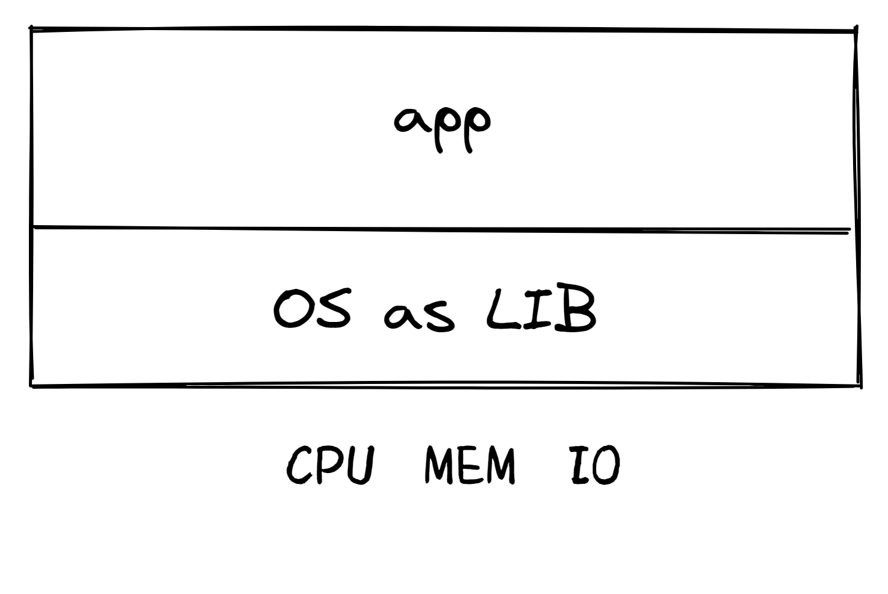
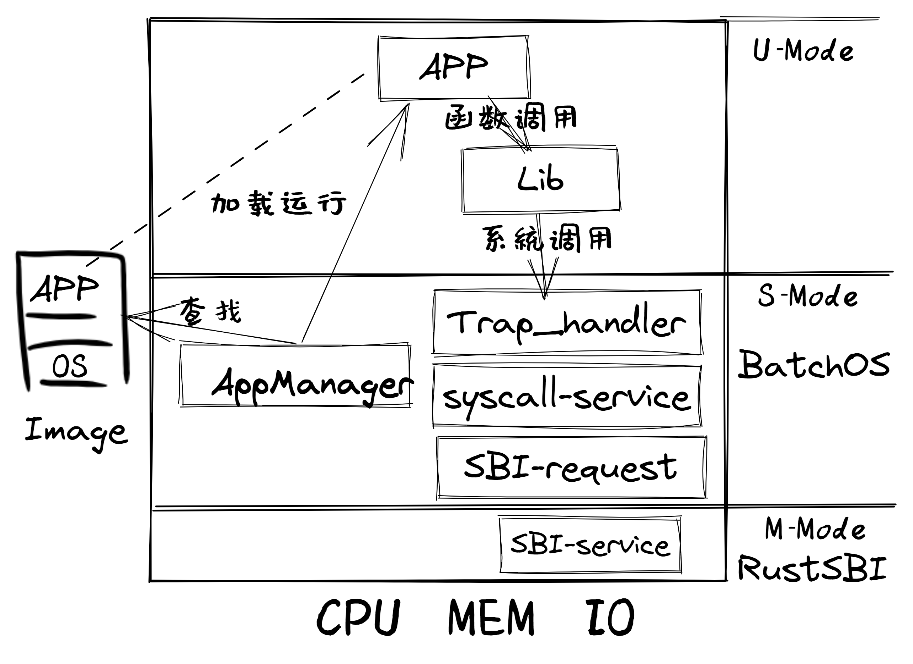
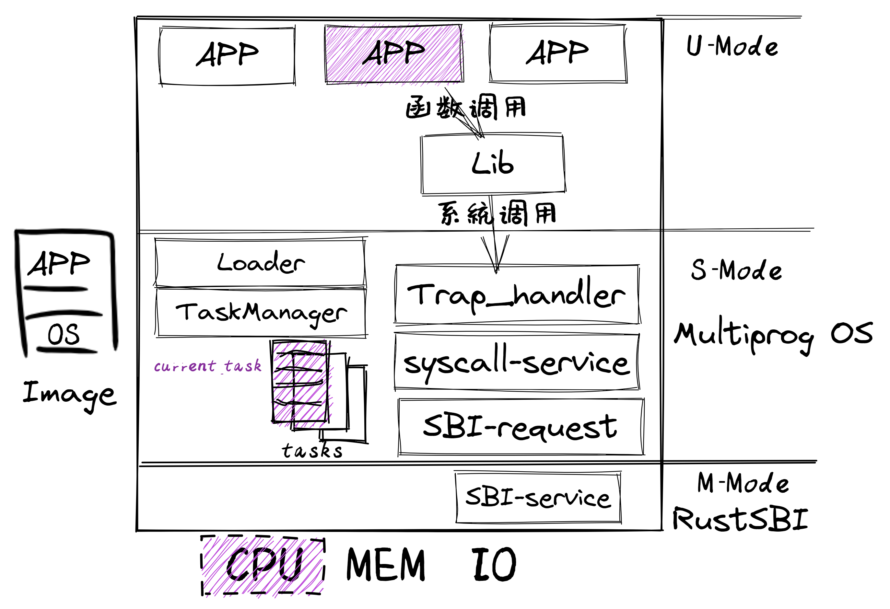

<!-- theme: gaia -->
<!-- _class: lead -->

## 第五讲 地址空间-物理内存管理

### 第0节 回顾
- 给应用提供"好"的服务
   - 提高性能、简化开发、加强安全
   - 应用的执行环境持续进化
   - 操作系统功能持续增强
---
### 回顾
- lec1: 试试UNIX/Linux 

  - "系统调用"
  - 例子，用C语言，来自UNIX（例如Linux、macOS、FreeBSD）。

            fd = open("out", 1);
            write(fd, "hello\n", 6);
            pid = fork()

---
### 回顾
- lec2: 写裸机程序：LibOS             
  - 软硬件启动，函数调用，SBI调用

---
### 回顾
- lec3: 写 Batch OS  
  - 特权级: U-Mode, S-Mode
  - 特权级切换，陷入上下文
  - 编译多应用+OS的镜像
  - 加载并执行应用

---
### 回顾
- lec4-1: 写 MultiProg OS  
   - 任务的概念与设计实现
   - 理解协作/抢占式调度
   -  陷入上下文+任务上下文 
 