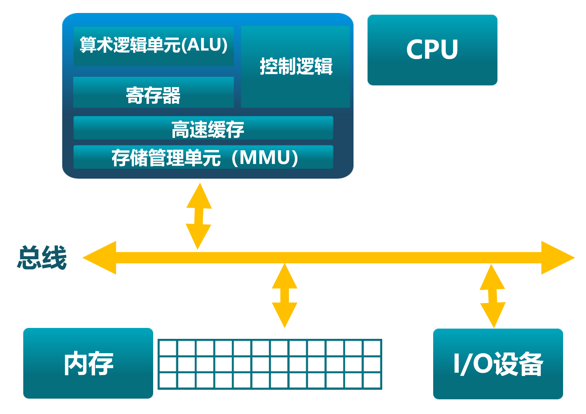
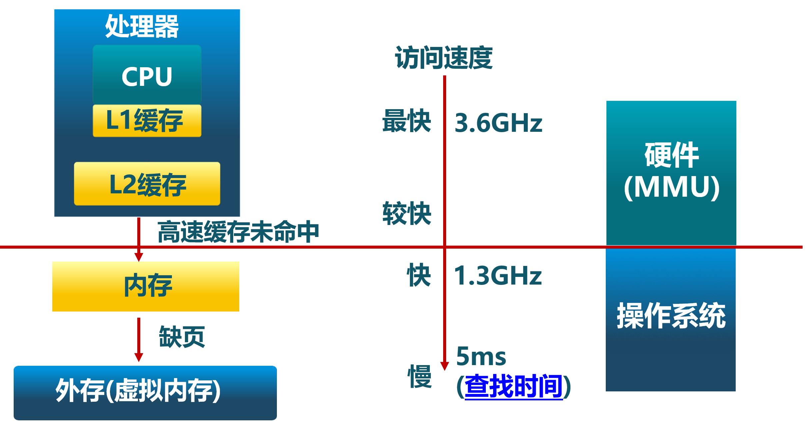
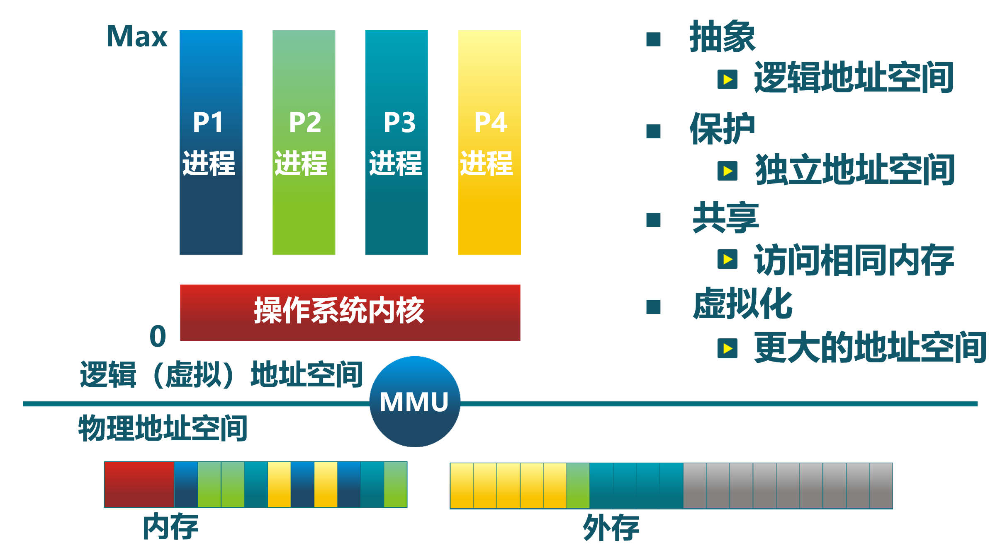
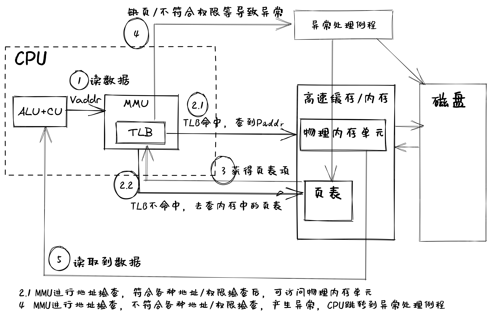

<!-- theme: gaia -->
<!-- _class: lead -->

## 第五讲 地址空间-物理内存管理

### 第一节 地址空间

 
 

向勇 陈渝 李国良 

 
 

2022年春季

---
### 第一节 地址空间
- 计算机的存储层次
- 地址空间

---
### 第一节 地址空间
**相关术语**
- 物理地址(physical address) ：用于内存芯片级的单元寻址，与处理器和CPU连接的地址总线相对应。 
- 逻辑地址(logical address) ：Intel为了兼容，将远古时代的段式内存管理方式保留了下来。逻辑地址指的是机器语言指令中，用来指定一个操作数或者是一条指令的地址。也是用户编程时使用的地址。
- 线性地址(linear address)或也叫虚拟地址(virtual address) ：跟逻辑地址类似，它也是一个不真实的地址，如果逻辑地址是对应的硬件平台段式管理转换前地址的话，那么线性地址则对应了硬件页式内存的转换前地址。

---
### 第一节 地址空间
**相关术语**
- 逻辑地址怎样转换为物理地址？
  - 逻辑地址-->线性地址(虚拟地址)-->物理地址

- 在没有段式内存管理的情况下，逻辑地址即虚拟地址

---
### 第一节 地址空间 -- 计算机的存储层次 -- 总体结构

---
### 第一节 地址空间 -- 计算机的存储层次 -- 多层结构

---
### 第一节 地址空间 -- 计算机的存储层次 -- OS内存管理

---
### 第一节 地址空间 -- 计算机的存储层次 -- OS内存管理
操作系统中采用的内存管理方式
- 重定位(relocation)
- 分段(segmentation)
- 分页(paging)
- 虚拟存储(virtual memory/storage)

操作系统的内存管理高度依赖硬件
- 与计算机存储架构紧耦合
- MMU (内存管理单元): 处理CPU存储访问请求的硬件

---
### 第一节 地址空间 -- 定义

- 物理地址空间 — 物理内存的地址空间
  - 起始地址$0$，直到 $MAX_{phy}$
- 虚拟地址空间 — 虚拟内存的地址空间
  - 起始地址$0$，直到 $MAX_{virt}$
- 逻辑地址空间 — 程序执行的地址空间
  - 起始地址$0$， 直到 $MAX_{prog}$

视角不同

---
### 第一节 地址空间 -- 逻辑地址生成

---
### 第一节 地址空间 -- 地址生成时机
- 编译时
  - 假设起始地址已知
  - 如果起始地址改变，必须重新编译
- 加载时
  - 如编译时起始位置未知，编译器需生成可重定位的代码 (relocatable code) 
  - 加载时，位置可不固定，生成绝对（虚拟）地址
- 执行时
  - 执行时代码不可修改
  - 需地址转换(映射)硬件支持

---
### 第一节 地址空间 -- 地址生成过程
- CPU
  - ALU：需要逻辑地址的内存内容
  - MMU：进行逻辑地址和物理地址的转换
  - CPU控制逻辑：给总线发送物理地址请求
- 内存
  - 发送物理地址的内容给CPU
  - 或接收CPU数据到物理地址
- 操作系统
  - 建立逻辑地址LA和物理地址PA的映射

---
### 第一节 地址空间 -- 地址检查

---
### 第一节 地址空间 -- 虚拟存储的作用
- 虚拟内存可作为外存的缓存
   - 常用的数据放在物理内存中
   - 不常用的数据放在外存 
   - 对运行的程序而言，直接用虚存地址，不用关注具体放在物理内存还是外存

---
### 第一节 地址空间 -- 虚拟存储的作用

- 虚拟内存可简化应用编译和加载运行
   - 每个运行程序具有独立的地址空间，而不管代码和数据实际存放在物理内存的何处
   - 简化编译的执行程序链接过程
   - 简化操作系统的执行程序加载过程
   - 简化共享：动态链接库、共享内存 
   - 简化内存分配：物理不连续，虚拟连续

---
### 第一节 地址空间 -- 虚拟存储的作用

- 虚拟内存可保护数据
   - 独立的地址空间使得区分不同进程各自内存变得容易
   - 地址翻译机制可以进行可读/可写/可执行的检查
   - 地址翻译机制可以进行特权级检查
