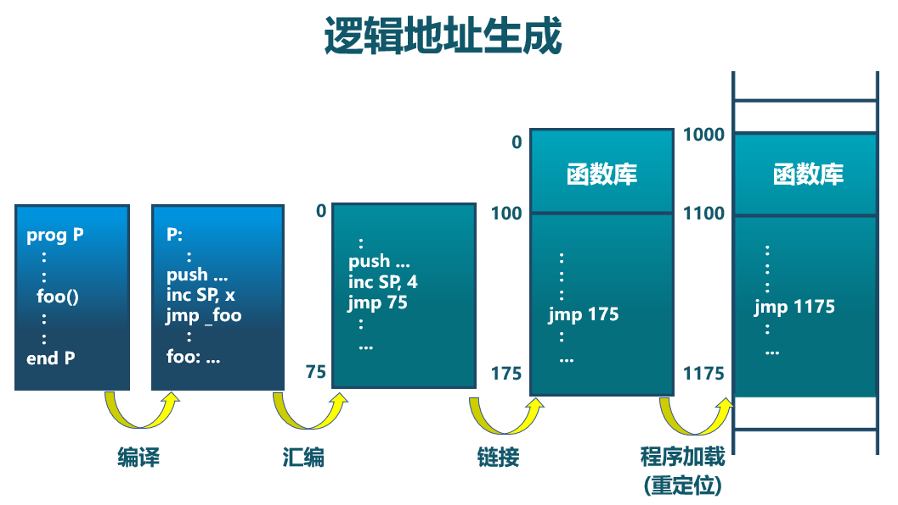

<!-- theme: gaia -->
<!-- _class: lead -->

## 第五讲 地址空间-物理内存管理

### 第一节 地址空间

 
 

向勇 陈渝 李国良 

 
 

2022年春季

---
### 第一节 地址空间
- 计算机的存储层次
- 地址空间

---
### 第一节 地址空间 -- 计算机的存储层次

---
### 第一节 地址空间
- 计算机的存储层次
- 地址空间
- 静态内存分配
- 动态内存分配
- 非连续内存分配

---
### 第一节 地址空间 -- 计算机的存储层次 -- 总体结构

---
### 第一节 地址空间 -- 计算机的存储层次 -- 多层结构

---
### 第一节 地址空间 -- 计算机的存储层次 -- OS内存管理

---
### 第一节 地址空间 -- 计算机的存储层次 -- OS内存管理
操作系统中采用的内存管理方式
- 重定位(relocation)
- 分段(segmentation)
- 分页(paging)
- 虚拟存储(virtual memory/storage)

操作系统的内存管理高度依赖硬件
- 与计算机存储架构紧耦合
- MMU (内存管理单元): 处理CPU存储访问请求的硬件

---
### 第一节 地址空间 -- 定义

定义
...

- 物理地址空间 — 物理内存的地址空间
  - 起始地址0，直到 MAXsys

- 逻辑地址空间 — 在CPU指令访问的地址空间
  - 起始地址0， 直到 MAXprog

---
### 第一节 地址空间 -- 逻辑地址生成

---
### 第一节 地址空间 -- 地址生成时机
- 编译时
  - 假设起始地址已知
  - 如果起始地址改变，必须重新编译
- 加载时
  - 如编译时起始位置未知，编译器需生成可重定位的代码 (relocatable code) 
  - 加载时，位置可不固定，生成绝对地址
- 执行时
  - 执行时代码不可修改
  - 需地址转换(映射)硬件支持

---
### 第一节 地址空间 -- 地址生成过程
- CPU
  - ALU：需要逻辑地址的内存内容
  - MMU：进行逻辑地址和物理地址的转换
  - CPU控制逻辑：给总线发送物理地址请求
- 内存
  - 发送物理地址的内容给CPU
  - 或接收CPU数据到物理地址
- 操作系统
  - 建立逻辑地址LA和物理地址PA的映射

---
### 第一节 地址空间 -- 地址检查

