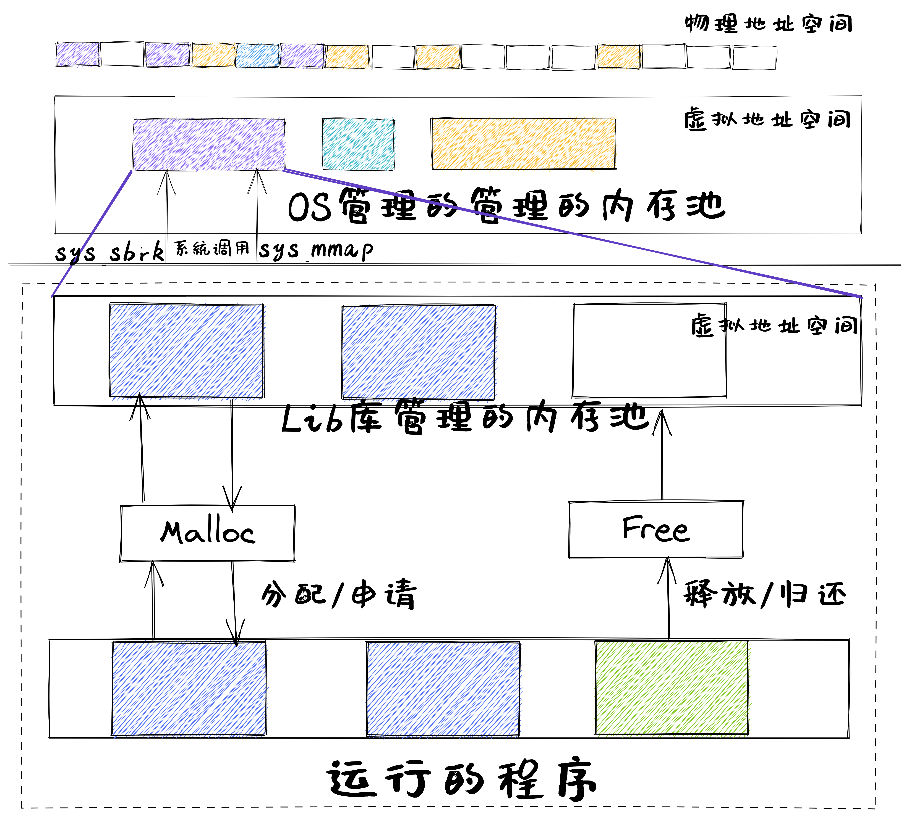

<!-- theme: gaia -->
<!-- _class: lead -->

## 第五讲 地址空间-物理内存管理

### 第二节 内存分配


---

### 第二节 内存分配
运行应用所占内存主要有五个段，分别为栈、堆、全局/静态数据段、常量数据段、代码段
- 静态内存分配
- 动态内存分配
- 连续内存分配
- 非连续内存分配

Why：让应用方便/灵活/高效地使用有限的内存


---

### 第二节 内存分配
运行应用所占内存主要有五个段，分别为栈、堆、全局/静态数据段、常量数据段、代码段
- 静态内存分配
- 动态内存分配
- 连续内存分配
- 非连续内存分配

Why：让应用方便/灵活/高效地使用有限的内存


---
### 第二节 内存分配 -- 静态内存分配
静态内存分配是指编译时的内存分配
 - 包括全局、静态变量和代码
 - 即位于全局/静态数据段、常量数据段、代码段


---
### 第二节  内存分配 -- 动态内存分配
动态内存分配是指运行时的内存分配
**动态内存**
- 栈(stack): 局部变量
- 堆(heap): malloc或free函数分配或释放的内存


---
### 第二节  内存分配 -- 动态内存分配
为什么要使用动态内存分配？
- 程序使用动态内存分配的最重要的原因是经常直到程序实际运行时，才知道某些数据结构的大小
- 代码中硬编码数据大小，对于大型软件而言，会是一种噩梦


---
### 第二节  内存分配 -- 动态内存分配
动态内存分配主要有两类
- 显式分配（explicit allocation）: 要求应用显式地释放任何已分配的块
- 隐式分配（implicit allocation）: 编译器/运行时库自动释放未使用的已分配的块


---
### 第二节  内存分配 -- 动态内存分配 -- app开发视角
**动态内存**
申请方式
- 栈由编译器管理
- 堆的分配和释放由程序员管理

申请大小
- 栈是向低地址生长的数据结构，是一块连续的内存，能从栈中获得的内存较小，编译期间确定大小；
- 堆是向高地址生长的数据结构，是一个不连续的储存空间，内存获取比较灵活，也较大。


---
### 第二节  内存分配 -- 动态内存分配 -- app开发视角
**动态内存分配函数**
- malloc函数: ``void * malloc (size_ t size);``
  - 申请一块size大小的连续堆内存
  - 函数返回值是一个指针，指向刚分配的内存首地址
  - 如果申请内存失败， 返回一个空指针，即返回值为NULL

注：
- 如果malloc比 free 多， 会造成内存泄漏
- 如果malloc 比 free 少，会造成二次删除， 破坏内存，导致程序崩溃
---
### 第二节  内存分配 -- 动态内存分配 -- app开发视角
**动态内存分配函数**  
- free函数：``void free (void *ptr)``
  - 释放指针变量在堆区上的内存空间
  - 不能释放栈上的内存空间
  - free要与malloc成对使用
---
### 第二节  内存分配 -- 连续内存分配 -- 内存管理者视角
**连续内存分配**
- 给应用分配一块不小于指定大小的连续的内存区域

**内存碎片**：不能被利用的空闲内存
 - 外部碎片：分配单元间未被使用内存
 - 内部碎片：分配单元内部未被使用内存 


---
### 第二节  内存分配 -- 连续内存分配 -- 动态分区分配
- 动态分区分配
  - 当程序被加载执行时，分配一个进程指定大小可变的分区(内存块)
  -  分区的地址是连续的
- 用户支撑库/操作系统要维护的数据结构
  - 已分配给应用的分区
  - 空闲分区(Empty-blocks)


---
### 第二节  内存分配 -- 连续内存分配 -- 动态分区分配
设计思路
-  空闲块组织：如何记录空闲块？
-  放置：如何选择合适的空闲块来分配？
-  分割：如何处理没分配完的空闲块中的剩余部分？
-  合并：如何处理一个刚刚被释放的块？


---
### 第二节  内存分配 -- 连续内存分配 -- 动态分区分配
- 动态分区分配策略
  - 最先匹配(First-fit)
  - 最佳匹配(Best-fit)
  - 最差匹配(Worst-fit)


---
### 第二节  内存分配 -- 连续内存分配-动态分区分配
最先匹配(First Fit)分配策略
- 优点：简单,在高地址空间有大块的空闲分区
- 缺点：外部碎片，分配大块时较慢

- 示例：分配400字节， 使用第1个空闲块


---
### 第二节  内存分配 -- 连续内存分配-动态分区分配
最佳匹配(Best Fit)分配策略
- 思路：分配n字节，分配n字节分区时， 查找并使用不小于n的最小空闲分区。释放分区时，检查是否可与临近的空闲分区合并

- 示例：分配400字节， 使用第3个空闲块(最小)


---
### 第二节  内存分配 -- 连续内存分配-动态分区分配
最佳匹配(Best Fit)分配策略
- 优点：大部分分配的尺寸较小时，效果很好
- 缺点：外部碎片，释放分区较慢，容易产生很多无用的小碎片


---
### 第二节  内存分配 -- 连续内存分配-动态分区分配
最差匹配(Worst Fit)分配策略
- 思路：分配n字节，使用尺寸不小于n的最大空闲分区
。释放分区时，检查是否可与临近的空闲分区合并

- 示例：分配400字节，使用第2个空闲块（最大）


---
### 第二节  内存分配 -- 连续内存分配-动态分区分配
最差匹配(Worst Fit)分配策略
- 优点：中等大小的分配较多时，效果最好
- 缺点：外部碎片，释放分区较慢，容易破坏大的空闲分区


---
### 第二节  内存分配 -- 连续内存分配 --伙伴系统
伙伴系统(Buddy System)的缘起
- 观察&分析
  - 上述策略很简单和通用，但对一些典型内存分配场景支持不够：
     - 性能差，内外碎片多 
  - 内核和一些应用的内存需求特征
    - 内核经常以$2^U$个4KB大小来申请/归还连续地址的内存块
    - 需要能快速地申请和释放，且不会产生内外碎片

- 我们需要新的连续内存分配策略

---
### 第二节  内存分配 -- 连续内存分配 --伙伴系统
伙伴系统(Buddy System)


---
### 第二节  内存分配 -- 连续内存分配 --伙伴系统(Buddy System)
- 整个可分配的分区大小 $2^U$
- 需要的分区大小为$2^{(U-1)} < s ≤ 2^U$ 时，把整个块分配出去；
  - 如$s ≤2^{(i－1)}$，将大小为$2^i$ 的当前空闲分区划分成两个大小为$2^{(i－1)}$空闲分区
  - 重复划分过程，直到$2^{(i－1)} < s ≤ 2^i$,把一个空闲分区分配出去


---
### 第二节  内存分配 -- 连续内存分配 --伙伴系统(Buddy System)
- 数据结构
  - 空闲块按大小和起始地址组织成二维数组
  - 初始状态：只有一个大小为$2^U$的空闲块
- 分配过程
  - 由小到大在空闲块中找最小可用块
  - 如空闲块过大，对可用空闲块进行二等分，直到得到合适可用空闲块


---
### 第二节  内存分配 -- 连续内存分配 --伙伴系统


---
### 第二节  内存分配 -- 连续内存分配 --伙伴系统


---
### 第二节  内存分配 -- 连续内存分配 --伙伴系统


---
### 第二节  内存分配 -- 连续内存分配 --伙伴系统


---
### 第二节  内存分配 -- 连续内存分配 --伙伴系统


---
### 第二节  内存分配 -- 连续内存分配 --伙伴系统
- 释放过程
  - 把块放入空闲块数组
  - 合并满足条件的空闲块
- 合并条件
  - 大小相同$2^i$
  - 地址相邻
  - 低地址空闲块起始地址为$2^{(i＋1)}$的位数


<!-- http://en.wikipedia.org/wiki/Buddy_memory_allocation -->


---
### 第二节  内存分配 -- 非连续内存分配
非连续内存分配的缘起
- 内核通过页表能够把多个地址不连续的物理页转换为地址连续的多个虚拟页
- 提供给应用程序和内核自身使用地址连续的虚拟内存块，这样可以比较轻松地解决内存分配的碎片问题


---
### 第二节  内存分配 -- 非连续内存分配
非连续内存分配的缘起
- 创建运行的程序时需要分配让其正常运行所需的比较大的内存空间
- 程序运行时会需要动态申请和释放比较大的内存空间
   - 通常用用户库发出请求
   - 减少系统调用次数
   - 一次申请$2^U$MB大小(如:64MB)的内存 


---
### 第二节  内存分配 -- 非连续内存分配

设计目标: 提高内存利用效率和管理灵活性
 - 允许一个程序使用非连续的物理地址空间
 - 允许共享代码与数据
 - 支持动态加载和动态链接




---
### 第二节  内存分配 -- 非连续内存分配
- 非连续分配需要解决的问题
  - 如何实现虚拟地址和物理地址转换
    - 软件实现 （灵活，开销大）
    - 硬件实现 （够用，开销小）

- 非连续分配的硬件辅助机制
  - 如何选择非连续分配中内存块大小
    - 段式管理 （segmentation）
    - 页式管理 （paging）


---
### 第二节  内存分配 -- 非连续内存分配 -- 段式存储管理
程序运行的段地址空间由多个段组成
- 主代码段  子模块代码段  公共库代码段  栈段(stack)  堆数据(heap)  ...


---
### 第二节  内存分配 -- 非连续内存分配 -- 段式存储管理
段表：位于内存中，被内核管理，段表与任务/进程对应


---
### 第二节  内存分配 -- 非连续内存分配 -- 页式存储管理
- 页帧（帧、物理页面, Frame, Page Frame）
  - 把物理地址空间划分为大小相同(2^n)的基本分配单位
- 页面（页、逻辑页面, Page) 
  - 把逻辑地址空间也划分为相同大小的基本分配单位
  - 帧和页的基本单位大小是相同的

- 页面到页帧
  - 逻辑地址到物理地址的转换
  - 硬件机制：页表/MMU/TLB


---
### 第二节  内存分配 -- 非连续内存分配 -- 页式存储管理
页表：位于内存中，被内核管理，页表与任务/进程对应


---
### 第二节  内存分配 -- 非连续内存分配 -- 页式存储管理
- 内存访问性能问题
  - 访问一个内存单元需要2次内存访问
    - 第一次访问：获取页表项
    - 第二次访问：访问数据
- 页表大小的容量问题
  - 页表可能非常大
  - 64位机器如果每页1024字节，那么一个页表的大小会是多少？


---
### 第二节  内存分配 -- 非连续内存分配 -- 页式存储管理
性能相关的解决办法
  - 缓存（Caching）
  - 间接（Indirection）访问


---
### 第二节  内存分配 -- 非连续内存分配 -- 页式存储管理
容量相关的解决办法 -- 多级页表


---
### 第二节  内存分配 -- 非连续内存分配 -- 页式存储管理


---
### 第二节  内存分配 -- 非连续内存分配 -- 页式存储管理
容量相关的解决办法 -- 反置页表
  - 基于Hash映射值查找对应页表项中的帧号
    - 任务/进程id与页号的Hash值可能有冲突
    - 页表项中包括保护位、修改位、访问位和存在位等标识

---
### 第二节  内存分配 -- 非连续内存分配 -- 页式存储管理
- 反置页表


---
### 第二节  内存分配 -- 非连续内存分配 -- 页式存储管理
- 反置页表的hash冲突


---
### 第二节  内存分配 -- 非连续内存分配 -- 页式存储管理
- 反置页表的hash冲突


---
### 第二节  内存分配 -- 非连续内存分配 -- 页式存储管理
- 反置页表的hash冲突


---
### 第二节  内存分配 -- 非连续内存分配 -- 段页式存储管理
- 段式存储在内存保护方面有优势，页式存储在内存利用和优化转移到后备存储方面有优势。
- 段式存储、页式存储能否结合？


---
### 第二节  内存分配 -- 非连续内存分配 -- 段页式存储管理


<!-- 2017ppt -->


---
### 第二节  一个app调用malloc的例子
```C
#include <stdlib.h>
int main(){
int *ptr;
ptr = malloc(15 * sizeof(*ptr)); /* a block of 15 integers */
    if (ptr != NULL) {
      *(ptr + 5) = 480; /* assign 480 to sixth integer */
      printf("Value of the 6th integer is %d",*(ptr + 5));
    }
}
```


---
### 第二节  一个app调用malloc的例子
第一步：OS加载程序运行


---
### 第二节  一个app调用malloc的例子
第一步：OS加载程序运行


---
### 第二节  一个app调用malloc的例子
第二步：程序发出malloc函数调用，且Lib库有空闲空间


---
### 第二节  一个app调用malloc的例子
第二步：程序发出malloc函数调用，且Lib库无空闲空间
