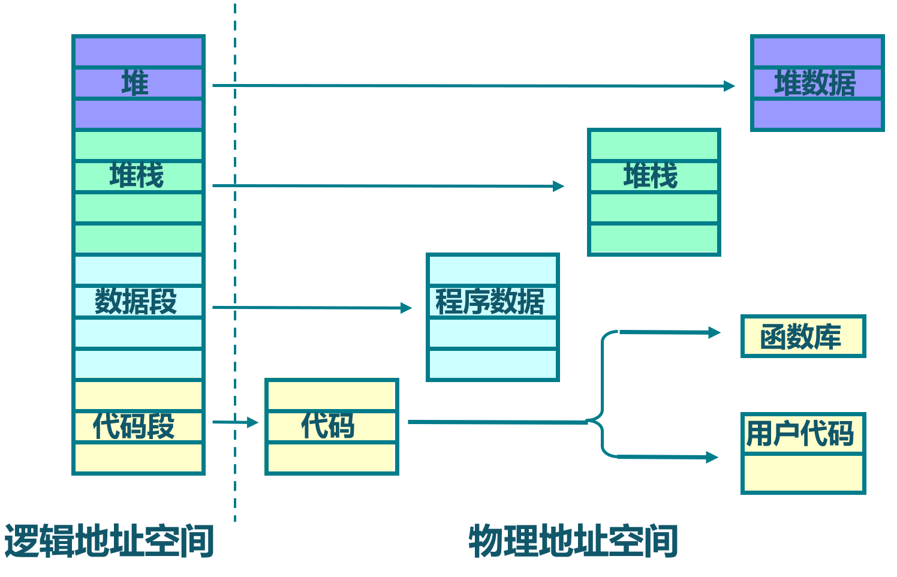

<!-- theme: gaia -->
<!-- _class: lead -->

## 第五讲 地址空间-物理内存管理
### 第三节 实践：建立地址空间的OS
<br>
<br>

Address Space OS(ASOS)


---
## 实践：ASOS
- **进化目标**
- 总体思路
- 历史背景
- 实践步骤
- 软件架构
- 相关硬件
- 程序设计


---
## 实践：ASOS
### 以往目标
提高性能、简化开发、加强安全
- multiprog & time-sharing OS目标
  - 让APP有效共享CPU，提高系统总体性能和效率
- BatchOS目标
  - 让APP与OS隔离，加强系统安全，提高执行效率
- LibOS目标
  - 让APP与硬件隔离，简化应用访问硬件的难度和复杂性
---
## 实践：地址空间抽象的OS
### 进化目标
~~提高性能~~、简化开发、加强安全、
- 简化编程，APP不用考虑其运行时的起始执行地址
  - 与编译器达成共识，给每个APP设定一个固定起始执行地址
- **隔离APP访问的内存地址空间**
  -  给APP的内存地址空间划界，不能越界访问OS和其他APP

---
## 实践：地址空间抽象的OS
### 同学的进化目标
- 理解地址空间
- 掌握页机制
- 会处理页访问异常
- 会写支持页机制的操作系统

<!-- 头甲龙 ankylosauridae 白垩纪晚期-->


---
## 实践：ASOS
- 进化目标
- **总体思路**
- 历史背景
- 实践步骤
- 软件架构
- 相关硬件
- 程序设计


---
### 总体思路
- 编译：应用程序和内核独立编译，合并为一个镜像
- 编译：不同应用程序可采用统一的起始地址
- 构造：系统调用服务，任务的管理与初始化
- 构造：建立基于页表机制的虚存空间
- 运行：特权级切换，任务与OS相互切换
- 运行：切换地址空间，跨地址空间访问数据


---
## 实践：ASOS
- 进化目标
- 总体思路
- **历史背景**
- 实践步骤
- 软件架构
- 相关硬件
- 程序设计


---
### 历史
- 两级存储系统在 1940 年就已经存在
  - 主存：磁芯；辅助：磁鼓
- 提出虚拟内存（Virtual memory）技术概念
  - 德国的柏林工业大学博士生 Fritz-Rudolf Güntsch
- 1959 年的Atlas Supervisor 操作系统
  - 英国曼彻斯特大学的 Tom Kilburn 教授团队展示了 Atlas 计算机和 Atlas Supervisor 操作系统
  - 创造出分页（paging）技术和虚拟内存技术（virtual memory，当时称为 one-level storage system）
---
## 实践：ASOS
- 进化目标
- 总体思路
- 历史背景
- **实践步骤**
- 软件架构
- 相关硬件
- 程序设计


---
### 实践步骤 
- 修改APP的链接脚本(定制起始地址)
- 加载&执行应用
- 切换任务和**任务的地址空间**


---
### 实践步骤 
```
git clone https://github.com/rcore-os/rCore-Tutorial-v3.git
cd rCore-Tutorial-v3
git checkout ch4
cd os
make run
```

---
### 实践步骤 
```
Into Test load_fault, we will insert an invalid load operation...
Kernel should kill this application!
[kernel] PageFault in application, bad addr = 0x0, bad instruction = 0x1009c, kernel killed it.

store_fault APP running...

Into Test store_fault, we will insert an invalid store operation...
Kernel should kill this application!
[kernel] PageFault in application, bad addr = 0x0, bad instruction = 0x1009c, kernel killed it.
power_3 [130000/300000]
```

---
### 实践步骤 

其中包含两个应用程序``04load_fault``, ``05store_fault``
```
// usr/src/bin/04load_fault.rs
......
    unsafe {
        let _i=read_volatile(null_mut::<u8>());
    }

// usr/src/bin/05store_fault.rs
......
    unsafe {
       null_mut::<u8>().write_volatile(1);
    }
```

---
## 实践：ASOS
- 进化目标
- 总体思路
- 历史背景
- 实践步骤
- **软件架构**
- 相关硬件
- 程序设计


---
**软件架构**
- 简化应用
- 建立Paging
- 内核页表
- 应用页表
- 信息传递
- 跳板机制
- 扩展TCB
- 扩展异常
  


---
### 代码结构
构建应用
```
└── user
    ├── build.py(移除：给应用设定唯一起始地址的脚本)
    └── src（用户态库和应用程序）
        ├── bin（各个应用程序）
        ├── ...
        └── linker.ld(修改：将所有应用放在各自地址空间中固定的位置)
```


---
### 代码结构
改进OS
```
├── os
    └── src
         ├── config.rs(修改：新增一些内存管理的相关配置)
         ├── linker-k210.ld(修改：将跳板页引入内存布局)
         ├── linker-qemu.ld(修改：将跳板页引入内存布局)
         ├── loader.rs(修改：仅保留获取应用数量和数据的功能)
         ├── main.rs(修改)
```

---
### 代码结构
改进OS
```
├── os
    └── src
         ├── mm(新增：内存管理的 mm 子模块)
             ├──address.rs(物理/虚拟 地址/页号的 Rust 抽象)
             ├──frame_allocator.rs(物理页帧分配器)
             ├──heap_allocator.rs(内核动态内存分配器)
             ├──memory_set.rs(引入地址空间 MemorySet 及逻辑段 MemoryArea 等)
             ├──mod.rs(定义了 mm 模块初始化方法 init)
             └──page_table.rs(多级页表抽象 PageTable 以及其他内容)
```

---
### 代码结构
改进OS
```
├── os
    └── src
         ├── syscall
             ├──fs.rs(修改：基于地址空间的 sys_write 实现)
         ├── task
             ├──context.rs(修改：构造一个跳转到不同位置的初始任务上下文)
             ├──mod.rs(修改)
             └──task.rs(修改)
         └── trap
             ├── context.rs(修改：在 Trap 上下文中加入了更多内容)
             ├── mod.rs(修改：基于地址空间修改了 Trap 机制)
             └── trap.S(修改：基于地址空间修改了 Trap 上下文保存与恢复汇编代码) 
```


---
## 实践：ASOS
- 进化目标
- 总体思路
- 历史背景
- 实践步骤
- 软件架构
- **相关硬件**
- 程序设计


---
## RISC-V 基于SATP的虚拟内存系统

- 虚拟地址将内存划分为固定大小的页来进行地址转换和内容保护。
- satp（Supervisor Address Translation and Protection，监管者地址转换和保护）S模式控制状态寄存器控制了分页。satp 有三个域：

  - MODE 域可以开启分页并选择页表级数
  - ASID（Address Space Identifier，地址空间标识符）域是可选的，它可以用来降低上下文切换的开销
  - PPN 字段保存了根页表的物理地址


<!--
---
## S-Mode编程 -- 虚存机制

- 通过stap CSR建立页表基址
- 建立OS和APP的页表
- 处理内存访问异常


---
##  S-Mode编程 -- 虚存机制
- S、U-Mode中虚拟地址会以从根部遍历页表的方式转换为物理地址：

  - satp.PPN 给出了一级页表的基址， VA [31:22] 给出了一级页号，CPU会读取位于地址(satp. PPN × 4096 + VA[31: 22] × 4)页表项。
  - PTE 包含二级页表的基址，VA[21:12]给出了二级页号，CPU读取位于地址(PTE. PPN × 4096 + VA[21: 12] × 4)叶节点页表项。
  - 叶节点页表项的PPN字段和页内偏移（原始虚址的最低 12 个有效位）组成了最终结果：物理地址(LeafPTE.PPN×4096+VA[11: 0])


---
##  S-Mode编程 -- 虚存机制
- S、U-Mode中虚拟地址会以从根部遍历页表的方式转换为物理地址：

-->

---
RISC-V SV39页机制
- satp CSR:(S-Mode) 
  Supervisor Address Translation and Protection，监管者地址转换和保护）

- 控制硬件分页机制

satp:页表基址寄存器


---
RISC-V SV39页机制
初始化&使能页机制
- M模式的RustSBI在第一次进入S-Mode之前会把0写入satp，以禁用分页
- 然后S-Mode的OS在初始化页表后会再次写satp
  - 使能页表:``MODE``=8
  - 设定页表起始物理地址页号 ``PPN``

satp:页表基址寄存器


---
RISC-V SV39页机制
页表项属性含义
- V：有效位
- R,W,X：读/写/执行位
- U：U-Mode能否访问
- G：是否对所有地址有效
- A：Access，是否访问过
- D：Dirty，是否被改过
- RSW：被硬件忽略
- PPN：物理页号


---
## 实践：ASOS
- 进化目标
- 总体思路
- 历史背景
- 实践步骤
- 软件架构
- 相关硬件
- **程序设计** 
  <!-- 主要的事情就是**实现地址空间** -->


---
## 实践：ASOS - 程序设计
<!-- **程序设计**  -->
- **理解地址空间**
- 应用程序设计
- 内核程序设计
    - 内核理解地址空间
    - 页表机制
    - 地址空间
    - 实现ASOS


---
### 实践：ASOS  -- 程序设计
**应用角度：理解地址空间**
- **地址空间** 是一系列有关联的不一定连续的逻辑段
- 这种关联一般是指这些逻辑段组成的虚拟/物理内存空间与一个运行的程序（目前把一个运行的程序称为任务，后续会称为进程）绑定
- 运行的程序对代码和数据的直接访问范围限制在它关联的地址空间之内


---
## 实践：ASOS  -- 程序设计
**OS角度：理解地址空间**
- **理解地址空间**
- **理解陷入上下文页**
- **回顾没有使能页机制的OS**
- **对比使能页机制的OS**


---
## 实践：ASOS 
- **理解地址空间**
   - 应用地址空间
       - 编译器给应用生成的地址空间，内核通过页表来约束应用地址空间，应用不能访问它之外的地址空间
   - 内核地址空间
       - 编译器给内核生成的地址空间，内核通过页表调整应用/内核地址空间，并管理整个物理内存


---
**理解跳板**
跳板页
- 应用与内核的跳板Trampoline页的虚拟地址是相同的，且映射到同一物理页
- 放置的是``trap.S``中的执行代码
<!-- - 但用户态无法访问此内存区域
- 产生异常/中断时，会跳到跳板页的``_all_traps``入口
- 并在切换页表后，平滑地继续执行 -->


---
**理解跳板**
基于跳板页的**平滑过渡**
- **特权级过渡**：产生异常/中断时，CPU会跳到跳板页的``_all_traps``入口
- **地址空间过渡**：并在切换页表后，可平滑地继续执行内核代码


---
**理解陷入上下文页**
- 跳板页的``_all_traps``汇编函数会保存相关寄存器到陷入上下文
- 跳板页的``_restore``汇编函数会从陷入上下文中恢复相关寄存器


---

**回顾之前没有页机制的OS**
陷入上下文保存在内核栈顶
``sscratch``保存应用的内核栈
- 只通过``sscratch``寄存器中转**用户/内核的栈指针**
- 当一个应用 Trap 到内核时，sscratch 已指向该应用的内核栈栈顶，我们用一条指令即可从用户栈切换到内核栈，然后直接将 Trap 上下文压入内核栈栈顶。


---
**对比使能页机制的OS**
如何只通过``sscratch``寄存器中转**栈指针**和**页表基址**？
- 能用之前的方法吗？
- 方案1：通过``sscratch``寄存器中转**用户/内核的栈指针**
- 方案2：通过``sscratch``寄存器中转**用户栈指针/页表基址**


---
**对比使能页机制的OS**
如何只通过``sscratch``寄存器中转**栈指针**和**页表基址**？
- 通过``sscratch``寄存器中转**用户/内核的栈指针**
   - 当前sp指针指向的是内核地址空间
   - 而此时页表还是用的用户态页表
- 导致在内核态产生异常，**系统崩溃** 


---
**对比使能页机制的OS**
如何只通过``sscratch``寄存器中转**栈指针**和**页表基址**？
- 通过``sscratch``寄存器中转**用户栈指针/页表基址**
- 当前用的是内核态页表，访问内核地址空间
- 接下来需要取得应用的内核栈指针来把用户态当前的通用寄存器保存到陷入上下文中
- 获取内核栈指针需要修改（**破坏**）通用寄存器才能完成，无法**正确保存**


---
**对比使能页机制的OS**
如何只通过``sscratch``寄存器中转**栈指针**和**页表基址**？
**方案3**：``sscratch``：应用的陷入上下文地址
- 通过``sscratch``进行应用的用户态栈指针<->陷入上下文地址切换;
- 保存用户态寄存器到陷入上下文;
- 读出陷入上下文中的页表基址/应用的内核栈指针/**trap_handler**地址；
- 切换页表，跳转**trap_handler**


---
## 实践：ASOS - 程序设计
<!-- **程序设计**  -->
- 理解地址空间
- **应用程序设计**
- 内核程序设计
    - 内核理解地址空间
    - 页表机制
    - 地址空间
    - 实现ASOS


---
## 实践：ASOS
- **应用程序设计** 
       - 应用地址空间
- 应用程序
  - 内存布局有调整
- 没有更新
  - 项目结构  
  - 应用代码 
  - 函数调用
  - 系统调用


---
### 应用程序设计 -- 内存布局
* 由于每个应用被加载到的位置都相同，所以它们共用一个链接脚本 linker.ld    
  * **``BASE_ADDRESS``** =  0x10000


---
## 实践：ASOS - 程序设计
<!-- **程序设计**  -->
- 理解地址空间
- 应用程序设计
- **内核程序设计**
    - 内核理解地址空间
    - 页表机制
    - 地址空间
    - 实现ASOS


---
### 内核程序设计
- **内核理解地址空间**
- 页表机制
- 地址空间
- 实现ASOS


---
### 内核程序设计

- **内核理解地址空间**
  - 建立&感知虚拟/物理地址
  - 在内核/应用虚拟地址空间之间穿越
- 应用的页表仅代表了内核管理下的现实情况下的应用地址空间
- 应用的页表体现的仅仅是CPU"能看"到的应用地址空间


---
### 内核程序设计
- 内核理解地址空间
- **页表机制**
- 地址空间
- 实现ASOS


---
### 内核程序设计 -- 页表机制
- **页表机制**
  - **管理物理内存**
  - 建立内核/应用页表
  - 使能页机制


---
### 内核程序设计 -- 页表机制

- 物理内存(RAM 设定位8MB)
  - 物理内存起始地址：：``0x80000000``
  - 可用物理内存起始地址： ``os/src/linker.ld`` 中``ekernel``地址
  - 物理内存结束地址：``0x80800000``
- 物理内存中有啥？


---
### 内核程序设计 -- 页表机制

- 物理内存(RAM 设定位8MB)，包括：
  -  应用/内核的数据/代码/栈/堆
  -  空闲的空间
-  特别是各种管理类数据
     - 任务控制块
         - MemorySet
              -  应用/内核的多级页表等
        - 应用核心栈
        - 应用的TrapContext页 ....
---
### 内核程序设计 -- 页表机制
- **管理物理内存**
  - 物理内存上已经有一部分用于放置内核的代码和数据
  - 需要将剩下的空闲内存以单个物理页帧为单位管理起来
    - 当需要存应用数据或扩展应用的多级页表时分配空闲的物理页帧
    - 在应用出错或退出的时候回收应用占的所有物理页帧 


---
### 内核程序设计 -- 页表机制
- **管理物理内存**
  - 采用连续内存的动态分配策略
  - 分配/回收物理页帧的接口
    - 提供``alloc``和``dealloc``函数接口 


---
### 内核程序设计 -- 页表机制
- **页表机制**
  - 管理物理内存
  - **建立内核/应用页表**
  - 使能页机制


---
### 内核程序设计 -- 页表机制
- **建立内核/应用页表**
SV39 多级页表是以页大小的节点为单位进行管理。每个节点恰好存储在一个物理页帧中，它的位置可以用一个物理页号来表示
satp:(Supervisor Address Translation and Protection)CSR


---
### 内核程序设计 -- 页表机制
- **建立内核/应用页表**
  - 页表起始物理地址
  - 页表内容:虚地址<->物理地址映射
    - 恒等映射 Identical Mapping
    - 随机映射 Framed Mapping

VPN: Virtual Page Number
PPN: Physical Page Number
satp: 包含页表起始处PPN的CSR


---
### 内核程序设计 -- 页表机制
- **建立内核/应用页表**
  - 建立和拆除虚实地址映射关系

在多级页表中找到一个虚拟地址对应的页表项。
找到后，只要修改页表项的内容即可完成键值对的插入和删除。


---
### 内核程序设计 
- **页表机制**
  - 管理物理内存
  - 建立内核/应用页表
  - **使能页机制**
    - 设置``satp= root_ppn`` 

核心数据结构的包含关系
```
TCB-->MemorySet-->PageTable-->root_ppn
任务控制块  --------------->任务的页表基址
```


---
### 内核程序设计
- 地址空间
- _内核与应用形成单一镜像_
- 页表机制
- **地址空间**
- 实现ASOS


---
### 地址空间 -- 应用的地址空间


---
### 地址空间 -- 应用的逻辑段
应用的页表代表现实情况下的应用地址空间
应用的逻辑段代表了理想情况下的应用地址空间
**理想: 丰满  v.s.  现实: 骨感**    
- 逻辑段：内核/应用会用到的一段连续地址的虚拟内存
- 内核/应用运行的虚拟地址空间由多个逻辑段组成


---
### 地址空间 -- 逻辑段的数据结构``MapArea``
- 逻辑段：一段连续地址的虚拟内存
```rust
// os/src/mm/memory_set.rs

pub struct MapArea {
    vpn_range: VPNRange, //一段虚拟页号的连续区间
    data_frames: BTreeMap<VirtPageNum, FrameTracker>,//VPN<-->PPN映射关系
    map_type: MapType,  //映射类型
    map_perm: MapPermission, //可读/可写/可执行属性
}
```
``data_frames`` 是一个保存了该逻辑段内的每个虚拟页面和它被映射到的物理页帧 FrameTracker 的一个键值对容器


---
### 地址空间 -- 地址空间的数据结构 ``MemorySet``
- **地址空间** 是一系列有关联的不一定连续的逻辑段
```rust
// os/src/mm/memory_set.rs

pub struct MemorySet {
    page_table: PageTable, //页表
    areas: Vec<MapArea>, //一系列有关联的不一定连续的逻辑段
}
```
**地址空间** 包含
- 一个多级页表： 基于数据结构``PageTable``的变量``page_table`` 
- 一个逻辑段集合： 基于数据结构``MapArea`` 的向量 ``areas``

---
### 内核程序设计 -- 地址空间
- 操作系统何时会管理**地址空间** ``MemorySet``=``PageTable``+``MapAreas``
   - 创建任务：创建任务的 ``MemorySet``
   - 清除任务：回收任务的 ``MemorySet``所占内存
   - 调整应用的内存空间大小： 修改任务的``MemorySet``
   - 用户态切换到内核态：切换任务的``MemorySet``为内核的``MemorySet``
   - 内核态切换到用户态：切换内核的``MemorySet``为任务的``MemorySet``

---
### 内核程序设计 -- 地址空间
- **地址空间** ``MemorySet``的相关操作
  - 新建一个地址空间
    - 创建页表
    - 创建逻辑段向量 


---
### 内核程序设计 -- 地址空间
- **地址空间** ``MemorySet``的相关操作
  - 在地址空间插入/删除一个逻辑段
    - 需要更新页表中的相应页表项
    - 更新逻辑段对应的物理页帧内容 


---
### 内核程序设计 -- 实现ASOS
0. 扩展工作概述
1. 启动分页模式
2. 实现跳板机制
3. 加载和执行应用程序
4. 改进 Trap 处理的实现
5. 改进 sys_write 的实现


---
### 内核程序设计 -- 实现ASOS -- 0. 扩展工作概述
对分时共享多任务操作系统的扩展
1. 创建内核页表，使能分页机制，建立内核的虚拟地址空间；
2. 扩展Trap上下文，在保存与恢复Trap上下文的过程中切换页表（即切换虚拟地址空间）；
3. 建立用于内核地址空间与应用地址空间相互切换所需的跳板空间；
4. 扩展任务控制块包括虚拟内存相关信息，并在加载执行创建基于某应用的任务时，建立应用的虚拟地址空间；
5. 改进Trap处理过程和sys_write等系统调用的实现以支持分离的应用地址空间和内核地址空间。

---
### 实现ASOS -- 1. 启动分页模式
1. 创建内核地址空间
2. 内存管理子系统的初始化


---
### 实现ASOS -- 1. 启动分页模式
1. 创建内核地址空间
- 创建内核地址空间的全局实例 -- 内核地址空间``KERNEL_SPACE``
```rust
pub static ref KERNEL_SPACE: MemorySet = MemorySet::new_kernel()
```


---
### 实现ASOS -- 1. 启动分页模式
2. 内存管理子系统的初始化
   1. 把空闲物理内存按照堆(heap)进行动态连续内存管理初始化
   2. 基于堆实现物理页帧分配管理初始化
   3. 设置satp，启动分页机制，激活内核地址空间``KERNEL_SPACE``，
```rust
// os/src/mm/mod.rs
pub fn init() {
    heap_allocator::init_heap();
    frame_allocator::init_frame_allocator();
    KERNEL_SPACE.exclusive_access().activate();
}
```
---
### 实现ASOS -- 2. 实现跳板机制
实现跳板机制的动机
- 在启动分页机制后，让处于不同地址空间的应用和内核能够进行正常的特权级切换操作和数据交互。


---
### 实现ASOS -- 2. 实现跳板机制
实现跳板机制的大致思路
- 内核和应用的虚拟地址空间中最高的虚拟页面是一个跳板(trampoline)页
- Q: Why？
  


---

实现跳板机制的大致思路
- 内核和应用的虚拟地址空间中最高的虚拟页面是一个跳板(trampoline)页
- Q: Why？
  在特权级切换后，要迅速完成地址空间的切换，内核栈切换，并平滑地继续执行内核代码


---
### 实现ASOS -- 2. 实现跳板机制
实现跳板机制的大致思路

- 应用地址空间的次高虚拟页面被设置为存放应用的 Trap 上下文


---
### 实现ASOS -- 2. 实现跳板机制
实现跳板机制的大致思路

- Q:为何不直接把 Trap 上下文仍放到应用的内核栈中呢？


---
### 实现ASOS -- 2. 实现跳板机制
实现跳板机制的大致思路

- Q:为何不直接把 Trap 上下文仍放到应用的内核栈中呢？
- A: 如果要访问内核栈中的Trap 上下文地址，需要先切换页表，而页表信息放在 Trap 上下文中。这形成了相互依赖。


---
### 实现ASOS -- 2. 实现跳板机制
建立跳板页面
将 trap.S 中的整段汇编代码放置在 .text.trampoline 段，并在调整内存布局的时候将它对齐到代码段的一个页面中
```
# os/src/linker.ld
    stext = .;
        .text : {
        *(.text.entry)
        . = ALIGN(4K);
        strampoline = .;
        *(.text.trampoline);
        . = ALIGN(4K);
        *(.text .text.*)
    }
```
<!-- ---
RISC-V只提供一个 sscratch 寄存器可用来进行临时周转

1. 必须先切换到内核地址空间，这就需要将内核地址空间的 token 写入 satp 寄存器;
2. 之后还需要保存应用的内核栈栈顶的位置，这样才能以它为基址保存 Trap 上下文。
3. 这两步需要用通用寄存器作为临时周转，然而我们无法在不破坏任何一个通用寄存器的情况下做到这一点。
4. 所以，我们不得不将 Trap 上下文保存在应用地址空间的一个虚拟页面中，而不是切换到内核地址空间去保存。 -->


---
### 实现ASOS -- 2. 实现跳板机制 -- 切换Traps上下文
扩展Trap 上下文数据结构
```rust
 // os/src/trap/context.rs
 pub struct TrapContext {
     pub x: [usize; 32],
     pub sstatus: Sstatus,
     pub sepc: usize,
     pub kernel_satp: usize, //内核页表的起始物理地址
     pub kernel_sp: usize,   //当前应用内核栈栈顶的虚拟地址
     pub trap_handler: usize,//内核中 trap handler 入口点的虚拟地址
}
```
---
### 实现ASOS -- 2. 实现跳板机制 -- 切换Traps上下文
**保存Trap上下文**
- 把用户栈指针切换到 用户地址空间中的TrapContext
- 在TrapContext保存通用寄存器,sstatus,sepc
- 在TrapContext读出kernel_satp、kernel_sp、trap_handler
- 切换内核地址空间，切换到内核栈
- 跳转到trap_handler继续执行

**恢复Trap上下文**
- 上述过程的逆过程

---
### 实现ASOS -- 2. 实现跳板机制 -- 切换Traps上下文
**保存Trap上下文**
Q:为何用``jr t1`` 而不是 ``call trap_handler``完成跳转？

---
### 实现ASOS -- 2. 实现跳板机制 -- 切换Traps上下文
**保存Trap上下文**
Q:为何用``jr t1`` 而不是 ``call trap_handler``完成跳转？


因为在内存布局中，这条 .text.trampoline 段中的跳转指令和 trap_handler 都在代码段之内，汇编器（Assembler）和链接器（Linker）会根据 linker-qemu.ld 的地址布局描述，设定跳转指令的地址，并计算二者地址偏移量，让跳转指令的实际效果为当前 pc 自增这个偏移量。

但实际上由于我们设计的缘故，这条跳转指令在被执行的时候，它的虚拟地址被操作系统内核设置在地址空间中的最高页面之内，所以加上这个偏移量并不能正确的得到 trap_handler 的入口地址。


---
### 实现ASOS -- 3. 加载和执行应用程序
1. 扩展任务控制块
2. 更新任务管理


---
### 实现ASOS -- 3. 加载和执行应用程序 
1. 扩展任务控制块
- 应用的地址空间 memory_set
- Trap 上下文所在物理页帧的物理页号trap_cx_ppn
- 应用数据的大小base_size
```
// os/src/task/task.rs
pub struct TaskControlBlock {
    pub task_cx: TaskContext,
    pub task_status: TaskStatus,
    pub memory_set: MemorySet,
    pub trap_cx_ppn: PhysPageNum,
    pub base_size: usize,
}
```


---
### 实现ASOS -- 3. 加载和执行应用程序
2. 更新任务管理
- 创建任务控制块TCB
  1. 根据应用的ELF执行文件内容形成应用的虚拟地址空间
  2. 建立应用转换到内核态后用的内核栈
  3. 在内核地址空间建立应用的TCB
  4. 在用户地址空间构造出一个陷入上下文TrapContext
---
### 实现ASOS -- 4. 改进 Trap 处理的实现
由于应用的 Trap 上下文不在内核地址空间，因此我们调用 current_trap_cx 来获取当前应用的 Trap 上下文的可变引用而不是像之前那样作为参数传入 trap_handler 。至于 Trap 处理的过程则没有发生什么变化。

为了简单起见，弱化了 S态 –> S态的 Trap 处理过程：直接 panic 。
注：ch9会支持 S态 –> S态的 Trap 处理过程

---
### 实现ASOS -- 4. 改进 Trap 处理的实现


```rust
let restore_va = __restore as usize - __alltraps as usize + TRAMPOLINE;
unsafe {
  asm!(
     "fence.i",
     "jr {restore_va}",
  )
}
```

---
### 实现ASOS -- 5. 改进 sys_write 的实现

类似Trap处理的改进，由于内核和应用地址空间的隔离， sys_write 不再能够直接访问位于应用空间中的数据，而需要手动查页表才能知道那些数据被放置在哪些物理页帧上并进行访问。


---
### 实现ASOS -- 5. 改进 sys_write 的实现

为此，页表模块 page_table 提供了将应用地址空间中一个缓冲区转化为在内核空间中能够直接访问的形式的辅助函数：
```rust
// os/src/mm/page_table.rs
pub fn translated_byte_buffer(
```
1. 查找应用的页表，根据应用虚地址找到物理地址
2. 查找内核的页表，根据物理地址找到内核虚地址
3. 基于内核虚地址完成对应用数据的读写

---
## 小结
- 地址空间
- 连续内存分配
- 段机制
- 页表机制
- 页访问异常
- 能写头甲龙OS
