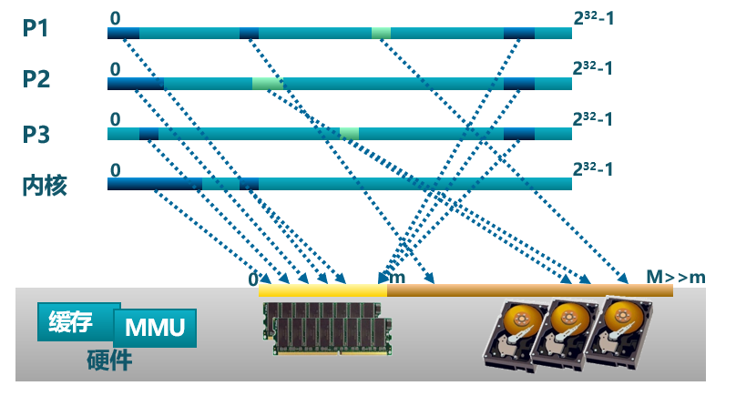
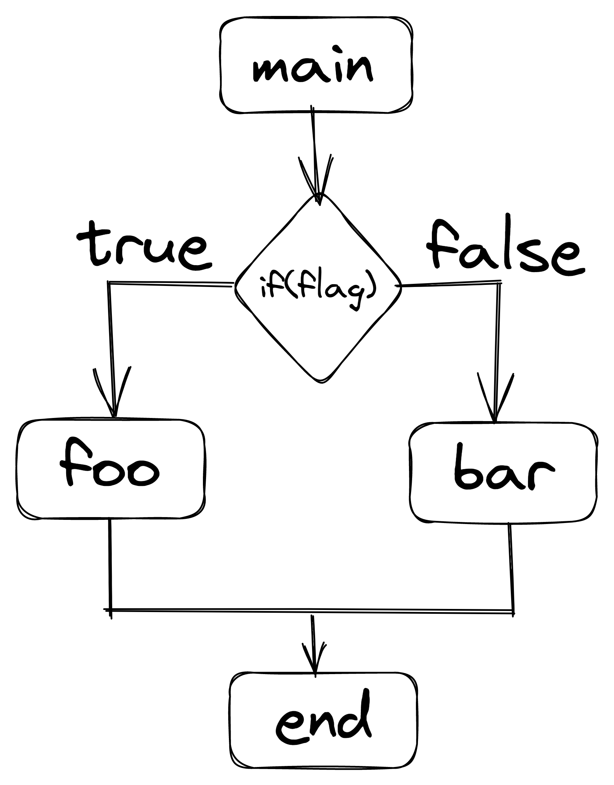
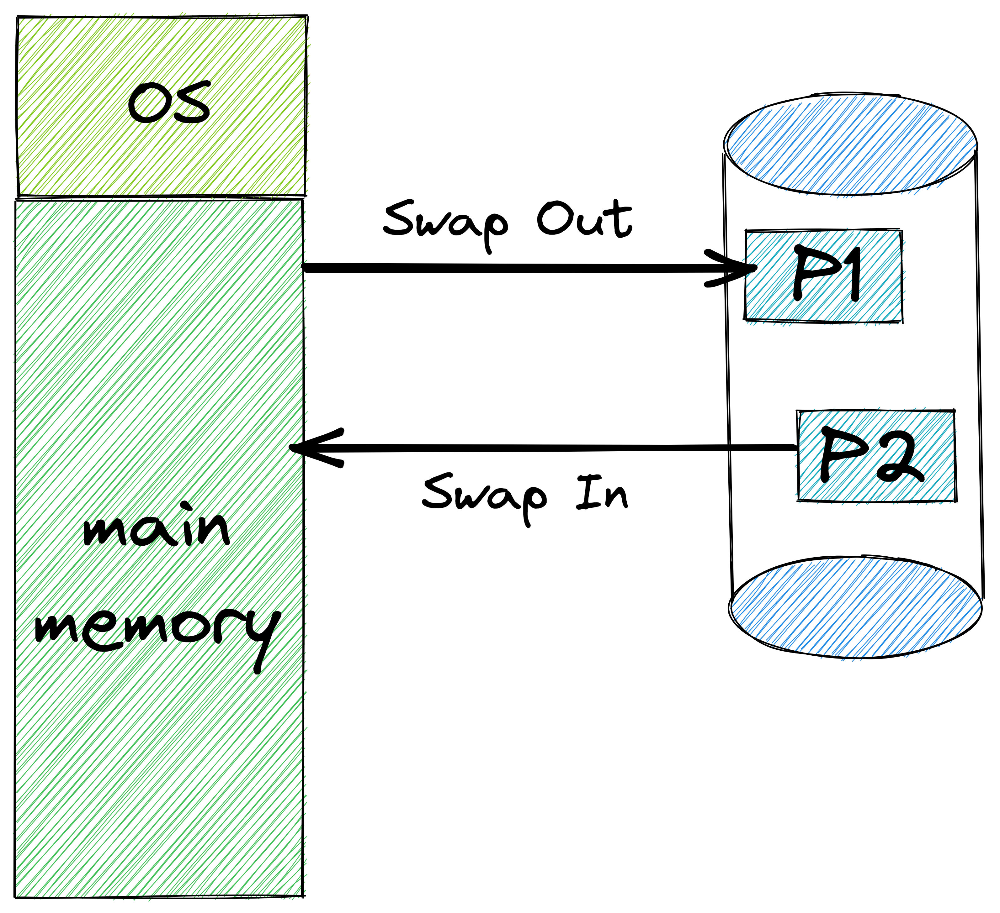
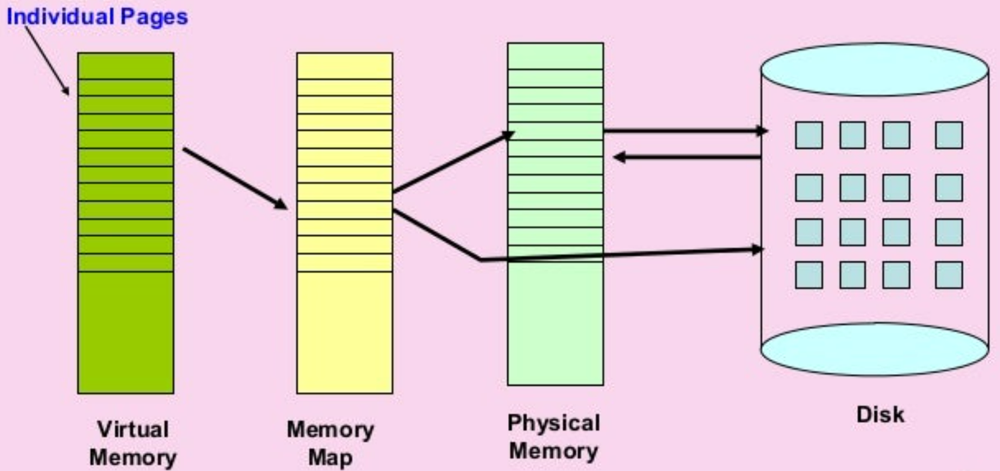
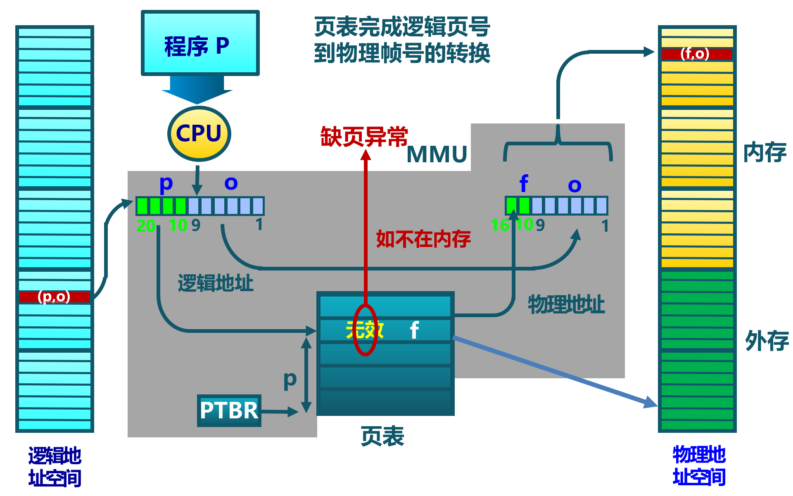
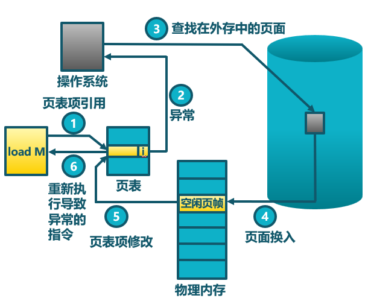

<!-- theme: gaia -->
<!-- _class: lead -->

# 第六讲 虚拟存储管理
## 第一节 虚拟存储概念

 
 
 
 

向勇 陈渝 李国良 

2022年秋季

---

**提纲**

### 1. 虚拟存储技术的需求
2. 覆盖技术
3. 交换技术
4. 虚拟存储的基本概念
5. 缺页异常

---

#### 虚拟存储技术的需求背景

程序规模的增长速度**远大于**存储器容量的增长速度

理想中的存储器: **容量**更大、**速度**更快、**价格**更便宜的**非易失性**存储器  

---
#### 虚拟存储的基本思路
**挑战**：计算机系统时常出现**内存不够用**
**思路**：内存不够，外存来补
- 函数覆盖（overlay）
  - 应用程序以**函数/模块**为单位**手动**换入换出内存
- 程序交换（swapping）
  - 操作系统以**程序**为单位**自动**换入换出内存
- 虚拟存储(virtual storage)
  - 操作系统以**页**为单位**自动**换入换出内存

虚拟存储=内存+外存

---
#### 地址空间
<!--计算机系统时常出现内存空间不够用
- 模块覆盖（overlay）
  - 应用程序**手动**把需要的指令和数据保存在内存中
- 任务交换（swapping）
  - 操作系统**自动**把暂时不能执行的程序保存到外存中
- 虚拟存储
  - 在有限容量的内存中，以**页为单位自动**装入更多更大的程序
--->
地址空间是操作系统对虚拟存储的**抽象**。

---

**提纲**

1. 虚拟存储技术的需求
### 2. 覆盖技术
3. 交换技术
4. 虚拟存储的基本概念
5. 缺页异常

---

#### 覆盖技术
- 目标
  - 程序员**手动**控制在**较小的可用内存**中运行**较大的程序**
- 基本思路
  - **不同时间段**内执行的**函数或模块**共享一块有限的空间

---

#### 覆盖的基本原理
  覆盖是指把一个程序**划分**为一系列功能相对独立的程序段，让执行时**不要求同时装入**内存的程序段组成一组（称为覆盖段），**共享**主存的同一个区域。
  - **必要**部分（常用）的代码和数据常驻内存
  - **可选**部分（不常用）放在其他程序模块中,只在**需要时装入**内存
  - **不存在调用关系**的模块可相互覆盖，共用同一块内存区域

---

#### 覆盖技术示例

 

---

#### 覆盖技术的不足

- 增加**编程困难**
  - 需程序员划分功能模块，并确定模块间的覆盖关系
  - 增加了编程的复杂度；
- 增加**执行时间**
  - 从外存装入覆盖模块
  - 时间换空间

 Turbo Pascal的Overlay系统单元支持程序员控制的覆盖技术

---

**提纲**

1. 虚拟存储技术的需求
2. 覆盖技术
### 3. 交换技术
4. 虚拟存储的基本概念
5. 缺页异常

---

#### 交换技术 
- 基本思路
  - 操作系统以**程序**为单位**自动**换入换出内存
- 方法
  - **换出(swap out)**：把一个执行程序的整个地址空间内容保存到外存
  - **换入(swap in)**：将外存中某执行程序的地址空间内容读入到内存

---

#### 交换技术面临的问题

- 交换**时机**：何时需要发生交换？
  - 只当内存空间不够或有不够的可能时换出
- 交换区**大小**：存放所有用户进程的所有内存映像的拷贝
- 程序换入时的**重定位**：换出后再换入时要放在原处吗？
  - 不一定在原处，需要某种机制保证程序正确寻址&执行 

---

#### 覆盖与交换的比较
- 程序覆盖
  - 发生在某时间段不在一个控制流上的**模块/函数间**
  - 以模块/函数为单位
  - 程序员须给出模块/函数间的**逻辑覆盖结构**
- 交换
  - 发生在运行的**程序间**
  - 以运行的程序为单位
  - 不需要模块间的逻辑覆盖结构

运行的程序：``任务``或``进程``
 
---

**提纲**

1. 虚拟存储技术的需求
2. 覆盖技术
3. 交换技术
### 4. 虚拟存储的基本概念
5. 缺页异常

---

#### 虚拟存储的定义
- 定义
  - 虚拟存储 = **内存** + **外存**
- 思路
  - 操作系统将**不常用**的部分内存**暂存**到外存，将要处理器访问的数据从外存**装入**内存
- **前提**
  - 程序具有**局部性**

 ---

#### 局部性原理

局部性（locality）：程序在执行过程中的一个**较短时期**，所执行的**指令**地址和指令的**操作数**地址，分别局限于一定区域
- **时间**局部性：**一条指令**的一次执行和下次执行，**一个数据**的一次访问和下次访问都集中在一个较短时期内
- **空间**局部性：当前指令和**邻近时间**的几条指令，当前访问的数据和邻近时间访问的几个数据都集中在一个较小区域内
- **分支**局部性：一条**跳转指令**的两次执行，很可能跳到相同的内存位置

局部性的意义：如果大部分程序运行具有局部性特征，则虚拟存储技术是能够实现的，而且可取得满意的效果
 

---
#### 虚拟存储的思路与规则
- 思路：将**不常用**的部分内存块暂存到外存
- 规则：
  - **装载**程序时：只将**当前指令执行需要的**部分页面或段装入内存
  - 指令执行中需要的指令或数据**不在内存**（称为缺页或缺段）时：处理器通知操作系统将相应的页面或段调入内存
  - 操作系统将内存中**暂时不用**的页面或段保存到外存
- 实现方式：
  - 虚拟页式存储
  - 虚拟段式存储

---
#### 虚拟存储的基本特征
- 不连续性
  - 物理内存分配非连续
  - 虚拟地址空间使用非连续
- 大用户空间
  - 提供给用户的虚拟内存可大于实际的物理内存
- 部分交换
  - 虚拟存储只对部分虚拟地址空间进行调入和调出
 

---
#### 虚拟存储的底层支撑
- 硬件(MMU/TLB/PageTable)
  - 页式或段式存储中的硬件**地址转换**机制、硬件**异常**
- 软件(OS)
  - 内存中建立**页表或段表**
  - 管理内存和外存间页面或段的**换入和换出**
 

---

#### 虚拟页式存储管理
在页式存储管理的基础上，增加请求调页和页面置换

- **基本思路**
  - 当用户程序要装载到内存时，只**装入部分**页面，就启动程序运行
  - 用户程序在运行中发现有需要的代码或数据不在内存时，则向系统发出**缺页异常**请求
  - 操作系统在处理缺页异常时，将外存中相应的页面**调入**内存，使得用户程序能继续运行
  - 当内存快用完时，操作系统把部分页从内存**调出**到外存

---
#### 虚拟页式存储管理
在页式存储管理的基础上，增加请求调页和页面置换
- 请求调页：也称按需分页，在处理器需要访问某数据时，才把数据从外存调入内存
- 页面置换：把不常用页换出，要使用的页换入
- 缺页异常处理：**软硬件协同支持**
 

---

**提纲**

1. 虚拟存储技术的需求
2. 覆盖技术
3. 交换技术
4. 虚拟存储的基本概念
### 5. 缺页异常

---

#### 缺页异常的处理流程
1. CPU读内存单元，在TLB中根据其虚拟地址匹配物理地址，未命中，**读页表**；
1. 由于页表项的存在位为0，CPU产生**缺页异常**；
1. OS**查找**到保存在外存中对应的应用的页面内容；

---

#### 缺页异常的处理流程

4-1. 如有空闲物理页帧，把外存中的页面内容**换入到某空闲物理页帧**中；
4-2. 如无空闲物理页帧，通过置换算法**释放/换出**某物理页帧到外存，再把外存中的页面内容换入到某空闲物理页帧中；

---

#### 缺页异常的处理流程

5. **修改页表项**，建立虚拟页到物理页帧的映射，存在位置1；
6. OS返回到应用程序，让处理器**重新执行**产生缺页异常的读内存单元指令。

*在何处保存未被映射的页？如何找到这个页？*

---
#### 在何处保存未被映射的页？
  - 交换空间（磁盘/文件形态）
    - 采用特殊格式存储未被映射的页面
  - 磁盘上的文件(代码或数据)
  
---

#### 虚拟存储的外存交换空间

在何处保存放在外存中的页的地址？

- 交换空间
    - 磁盘分区：一般是扇区地址
    - 在存在位为0的页表项中保存外存的页地址
     

---

#### 虚拟存储的外存磁盘文件

在何处保存放在外存中的页的地址？

- 磁盘上的文件(代码或数据)
  - 地址空间中的逻辑段表示中有对应的文件位置
    - 如：`MemorySet::MapArea`
  - 代码段：可执行二进制文件
  - 动态加载的共享库程序段：动态调用的库文件

---
#### 虚拟存储的性能

有效存储访问时间（EAT, Effective memory Access Time）
- EAT = 内存访问时间 $*$ (1-p)  + 缺页异常处理时间 
- 缺页异常处理时间 = 磁盘访问时间*p(1+q)
  - p: 缺页率；
  - q: 写回概率
* 例子
  - 内存访问时间: 10 ns ；磁盘访问时间: 5 ms
  - EAT = 10(1–p) + 5,000,000p(1+q) 

---

### 小结

1. 虚拟存储技术的需求
2. 覆盖技术
3. 交换技术
4. 虚拟存储的基本概念
5. 缺页异常
